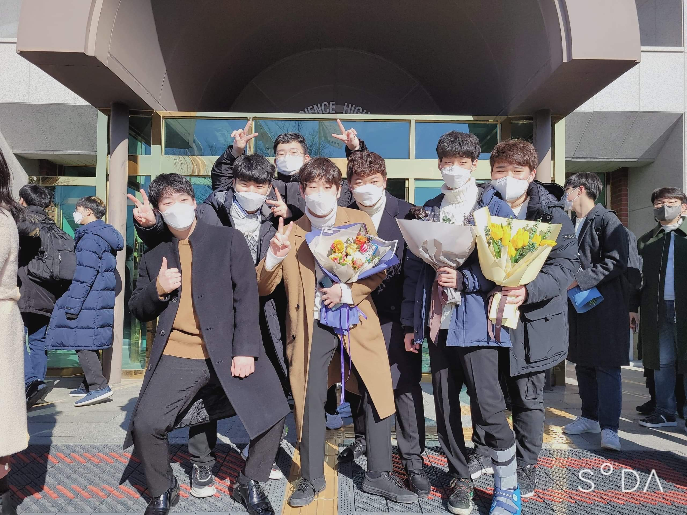
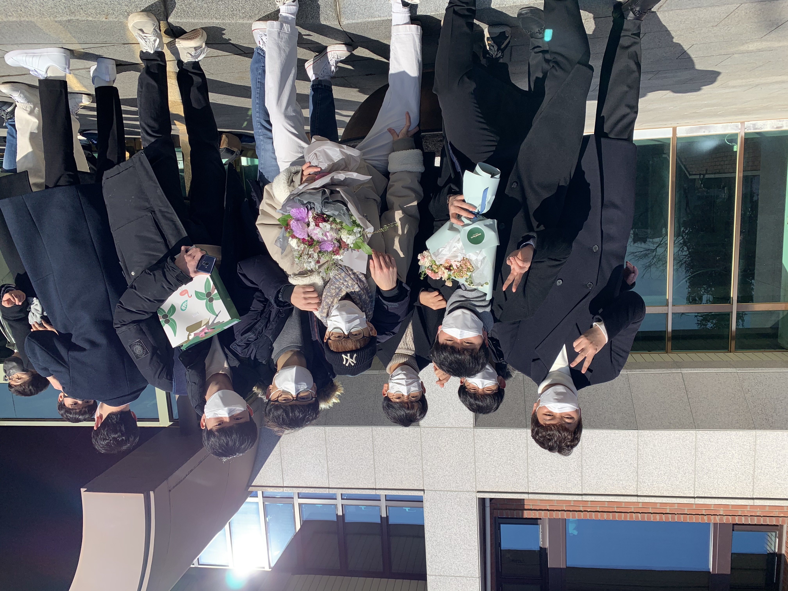
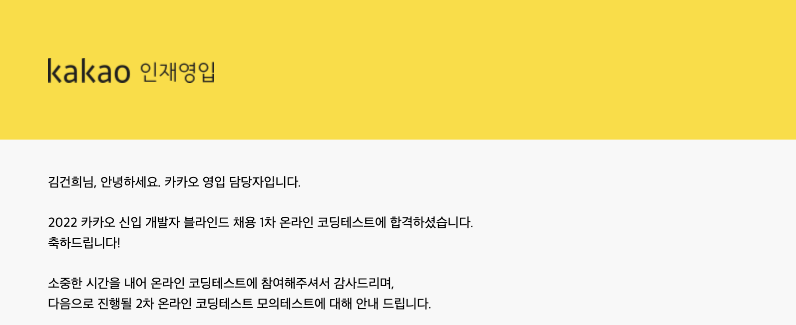
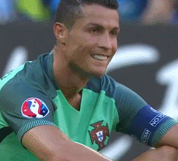
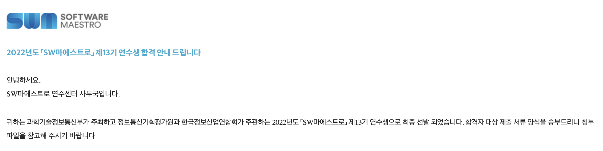

예전부터 써야겠다 생각했던 2021년 리뷰, 2022년 프리뷰를 이제서야 쓰게 되었다. 2021년 리뷰와 2022년 신년계획을 4월이 되서 쓴다는 것도 웃기긴 하지만, 2022년에 대한 불확실성이 이제서야 정리가 되서 어쩔 수 없었다. 결론적으로는 2022년의 계획이 완전 뒤바뀌었고, 이제서야 목표가 잡혔다.

## 1. Goodbye 2021!

아무래도 가장 큰 이야기는 학교생활 이야기가 될 것 같다.

### 졸업

> 서울과학고를 졸업했다.

가장 큰 변화다. 학교가 바뀌고, 성인이 되었고, 새내기가 되었다.

서울과학고 생활부터 되짚어보자. 솔직하게 말하자면 많이 힘들었다. 객관적으로 말하면 성적이 좋지 못했고, 거기서 받은 스트레스가 너무 컸다. 노력을 열심히 안한건 아니라고 생각한다. 공부 열심히 했고, 학교에는 잘하는 애들이 너무 많고, 내 재능은 거기에 비하면 딸린다. 어쩔 수 없는 부분. 다행히 Output 자체는 나쁘지 않았다. 가장 원했던 과는 못갔지만 차순위로는 진학할 수 있었다.

아쉬운 점은 뭐, 성적이 안좋은데 그렇다고 하고 싶은 공부를 한건 아니라는 것이다. 그냥 남들 듣는 과목 들었고, 남들 다니는 학원 다녔고, 남들 하는 공부 했다. 지금 다시 돌아간다면 Output은 어느정도 보장되는데 그냥 컴퓨터 공부하지 않았을까 싶다.

그래도 지금 와서 중학교로 돌아가면 그냥 일반고 갈래? 라고 묻는다면 가겠다고 확실하게 말하지는 못할 것 같다. 분명 많이 힘들었지만, 지금도 꾸준히 연락하는 좋은 친구들을 많이 만들었고, 다른 곳에서는 할 수 없는 경험들도 많이 쌓았다. 신기한 것도 많이 배웠고, 평생 가볼까말까한 구글 본사도 찍고 왔다.

그리고 그 생활은 이제 끝이 났다. 그래도 졸업하고 한달에 한번 이상은 설곽 친구들을 본 것 같다. 특히 우리 과에 설곽에서 7명이나 진학해서 작은 설곽같은 느낌도 난다.

### 대학생활

> 고려대학교 사이버국방학과에 입학했다.

3월이 되서 개강했지만 코로나로 인해 비대면수업이 계속되었다. 학교에 갈일은 시험볼때 말고는 거의 없었던 것 같다. 그래도 나름 학교에 가려고 노력했다. 도서관에 가서 수업 듣고, 그렇게라도 학교에 가다 보니 과 사람들을 만나볼 수 있었다. 이렇게라도 해서 과 동기들 만나고 친구들을 만들 수 있었던 것 같다.

고등학교 선배이자 대학 선배의 권유 (강요?) 로 21학번 대표를 맡게 되었다. 생각보다 할일은 없었다. 전달할거 전달하고, 어쩌다 한 번 단체 돕바 맞춘다고 생전 만져본적도없는 AI 작업하고 발주 넣은 거 말고는 힘든 거 없었던 것 같다.

올해는 그래도 대면수업이 많아지니까, 더 많은 동기들이랑 친해지지 않을까 싶긴 한데 사실 지금 나도 친한 애들이랑만 계속 만나는 거 같고, 다른 동기들도 친한 애들끼리 몰려 다니는 것 같다. 뭐 어떻게 해야될지 잘 모르겠다...

과 특성상 다른 과 사람들을 만날 일은 잘 없었던 것 같다. 동아리 같은 경우 지금은 나오긴 했지만 야구부를 했다. 동기들 중에 친해진 친구들도 생겼고 같이 야구를 보러 가기도 했다. 그것 외로 다른 과 사람들을 만날 일은 자정진 뿐이었는데 1학기는 비대면이라 한 번도 보지 못했고 다행히 2학기 자정진 친구들이랑은 많이 친해진 것 같다. 나름 대면 수업도 자주 했고, 특히 조별과제로 한학기를 구르면서 (조장님 잘만나서 버스 탄 것 같긴 하지만) 친해질 수 있었던 것 같다. 지난주에도 한번 만났고 다음달에도 보기로 해서, 친해진 것 같아 다행이다.

그런데 가면 갈수록 학교 나가는 게 귀찮아졌던 것 같다. 갈수록 술자리에도 잘 참석 안하게 되고, 수업도 그냥 비대면 했으면 좋겠다고 생각했다. 학교 가는게 피곤하다....

### 학업

학업에 대한 고민은 크게 안 했던 것 같다. 그냥 열심히 했고 원하는대로 나왔다. 물론 2학기는 조금 아쉽긴하지만, 만족할만하다고 생각한다.

유리벽돌 Winner

사실 앞으로 더 받을 수 있을지는 모르겠다. 열심히 해야지.

### 자기개발

없는 것에 대한 욕심이 많아서 그런지, 학점을 챙기고 나니까 이제 자기개발에 대한 욕심이 생긴 것 같다. 물론 가장 큰 문제는, 학교 공부만 잘해서, 학점만 잘받아서는 안된다는 것을 학교 다니면서 느낀 것 같다. 학교에서는 이론적인 부분과 원리는 배울 수 있지만, 앱이나 웹을 개발하고, 서비스하는 과정을 가르쳐주지 않는다. 이러한 부분은 스스로 공부하고 실행해야 한다는 것을 느꼈다.

일단 가장 먼저 교내 동아리 CyKor 활동에 도전했다가 데였다. 한달만에 보안은 길이 아니라고 깨닫고 포기했다. 너무어렵다.

그 다음으로는 여름방학을 알고리즘 공부에 쏟은 것 같다. 백준 계정을 파고, C++ 을 배우고, 방학을 거기에 쏟았다. 9월 중 ACM-ICPC 라는 목표를 보고, 달렸던 것 같다.

ICPC는 1솔로 마감했다. 팀으로 나간 코딩 대회가 처음이라 손발이 안맞았던 부분도 있고, 실력이 부족한 점도 크고, 다와서 못푼 문제도 있었고, 여러모로 아쉬운 결과였다.

알고리즘 쪽에서 성과가 나오기도 했다. 백준에서 광고를 보고 재미로 신청해 보았던 카카오 공채 1차 코딩테스트에서 합격했다. 비록 2차 실전문제해결 테스트에서 떨어지기는 했지만, 나름 알고리즘 공부한 것에 대한 성과를 볼 수 있는 좋은 기회였던 것 같다.여기에 대한 후기는 따로 작성하려 했는데 아직 코테문제가 안올라와서 못쓰고 있다. 문제가 나오면 다시 글을 한번 적도록 하겠다.

ICPC 가 끝나고 나서는 알고리즘은 그만하고 다른게 하고 싶었던 것 같다. 항상 깔끔한 디자인과 UI에 관심이 많아 Front-End 에 도전해 HTML/CSS/JS/React 를 공부해보기도 했고, 예전부터 공부하고 싶었던 데이터과학과 ML/DL쪽을 더 파보기도 했다. 근데 둘 다 찍먹만 한 것 같은 느낌이고, 어느 한 쪽에 내가 특별히 자신 있다는 생각은 들지 않는다. 올해 둘 다 더 열심히 해서 어느 정도 실력에 대한 자신감도 붙이고 결과물을 내보고 싶다.

## Hello 2022!

### 4월까지 뭐했죠?

일단 방학은 그동안 부족했던 공부도 하고, 쉬기도 하면서 후딱 지나갔다. 그리고, 개강했다.

미친 척하고 24학점을 넣었다. 과제대체 과목들이 있어 시험공부에 대한 부담은 덜하지 않을까 싶기도 했고, 학점을 최대한 빨리 이수하고 고학년 때 다른걸 해보고 싶다는 계산이 있기도 했다. 걱정이 되기도 했지만 할 수 있을 거라 생각했다.

(난 못해...)

공부량 자체는 따라갈 만 했던 것 같다. 사소한 문제는 수업들이 다 저녁에 몰려 있어 저녁에 약속을 잡거나 다른 일을 할 시간이 잘 안 난다....

또 다른 문제는 교내 소프트웨어 개발 학회 DevKor 활동을 하기 시작했다는 것이다. 심지어 활동 중 알고리즘 스터디의 강사를 맡게 되었다. 주 1회기는 하지만 스터디 자료를 준비하는 데 생각보다 많은 시간이 들었고, 개인적인 욕심으로 웹스터디까지 수강하다 보니 남는 시간이 정말 부족하게 되었다.

하지만 더 큰 상황이 기다리고 있었으니.....

### 소마 13기 연수생이 되다

전혀 예상하지 못했던 부분이었다. SW 마에스트로 과정에 합격했고, 11월까지 연수생으로 활동하게 되었다!

사실 올해 소마는 내년에 꼭 해야겠다 생각하고 있던 활동이었다. 올해는 아직 실력과 프로젝트 경험이 부족하다 생각했었고, 일단 올해 코딩테스트와 운이 좋다면 면접 경험까지 쌓아 내년에 합격하기 위한 모의고사로 삼고 싶었다. 그런데 올해 연수생을 320명으로 늘린 여파인지 예상 외로 한 단계씩 진출하더니, 덜컥 최종 합격까지 해버렸다. 이 과정도 따로 글로 남기도록 하겠다.

기분이 좋기도 하지만, 걱정되는 부분도 많다. 아직 실력이 부족한데 프로젝트에서 역할을 잘 수행할 수 있을까 걱정되기도 하고, 팀 구성도 어떻게 해야될지 고민이 많다. 그래도 주어진 기회 잘 활용하고 많은 경험을 쌓고 배우고 수료하고 싶다. 뭐 성과가 나와서 인증도 받고 미국까지 가게 되면 좋고....ㅎ

### 2022년의 계획?

아무튼 그래서 일단 이번학기가 고비인 것 같다. 24학점과 DevKor 세미나, 그리고 소마 예비연수과정까지 폭발해버린 워크로드를 어떻게 헤쳐나갈지가 고민인데.... 뭐 충분히 잘 해결해나갈 수 있지 않을까 싶다.

그리고 소마로 인해 방학과 하반기 계획이 완전히 바뀐것 같다. 스포츠로 비유하면 올해 나의 계획은 리빌딩 시즌이었는데, 윈 나우를 도전해야 되는 상황이 온 것이다. 올해 Front-End에 더 집중해 프로젝트 경험을 쌓아볼 계획이었지만, 소마를 통해 직접 프로젝트에 투입되고 결과물을 만들어 내야 하는 한해가 되었다. 오히려 좋다. 빡세게 구르면서 Quantum Jump 할 수 있는 한해로 만들어 봐야겠다.

일단 올해는 무조건 소마에 ALL-IN 이다. 방학때 해외여행 가려던 계획은 날아갔다. 팀원들과 같이 쉬러가는거면 몰라도, 해가 되지 않게 프로젝트에 모든 시간을 쏟고 싶다. 2학기 같은 경우는 행정실이랑 조금 더 면담을 해봐야되지만, 최대한 적게 학점 신청해서 소마에 시간다 쏟고 싶다. 뭔가 소마에 몰두하고 싶은데 학교 신경을 안쓸수가 없다는게 아쉽네요....

뭔가에 미쳐서 거기에만 몰두하는 경험이 해보고 싶다. 연수센터가 집에서 가까운 이점을 최대한 활용해서, 그냥 매일 출근해서 거기서 살고 싶다. 우리 팀원이 아니더라도 어깨 너머로 다른 팀원들 하는 거 보면서 성장할 수 있는 부분이 분명히 있지 않을까?
