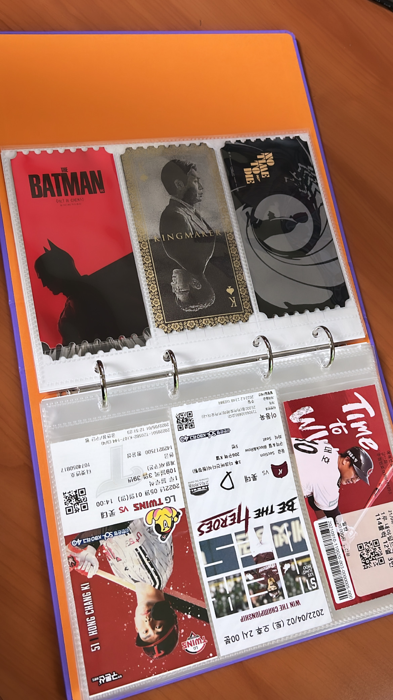

짬을 내서 생각을 정리하는 4월 Review, 그리고 다음달을 똑바로 살기 위한 5월 Preview.

## 4월 Review

크게 정리하면 3분야 : 학교생활, 소마, 개인생활로 정리될 것 같다.

## 학교생활

4월 학교생활은 중간고사 기간이었다. 24학점에 8과목을 듣는거 치곤 편했던 중간고사 기간이었던 것 같다. 시험이 없는 과목도 있고, 대체과제들도 있어서 정작 시험을 본 과목은 3과목이었다. 심지어 하나는 공부를 안 해도 되는 과목이라 실질적으로 공부해야 하는 건 2과목이었다. 나름 여유로운 시험기간이었는데 열심히 공부한 거 같진 않다.

학교 생활에 대한 고민이 요즘 정말 많다. 보안 손절하고 개발이나 AI를 파야겠다고 생각하고 나서부터, 임관 안하는 쪽으로 마음 어느 정도 굳히고 나서부터 학교 수업이 너무 듣기 싫다. 시간 아깝고 그시간에 다른 공부가 하고 싶다. 거기다가 소마 하면서 바빠지다 보니까 점점 손 놓게 되는 듯. 그래도 학점 관리가 대충 어느정도 나쁘지 않은 선까진 가능할 것 같아서 그냥 이번 학기는 흘러가는 대로 흘러가려 합니다. 대략 50일 정도 남았던데 빨리 종강하고 싶네요.

## 소마

아마 4월의 모든 정신은 여기 다 쏟은 것 같다. 8일에 합격자 발표가 났고, 12일 OT를 시작으로 거의 한달간 활동을 했다. 되게 오래 된 것 같은데 아직 한달 채우지도 않았다는 게 신기하다. 나름 꾸준히 주 3일 이상은 센터 출근 도장 찍으면서 열심히 활동했던 것 같다. 기대하지 않았지만 얻을 수 있었던 정말 원했던 기회였고, 다른 사람 한 자리 뺏은 만큼 후회되지 않도록 열심히 활동에 임했다.

절대 불만이 있는 건 아니지만, 생각했던 소마 생활이랑 다른 점이 되게 많은 것 같다.

- 소마는 연수생들을 성장하도록 끌고 가는 곳이 아니다. 공부하고 성장할 수 있는 너무나 좋은 환경을 마련해 주었고, 그 속에서 알아서 기회들을 찾아 가며 직접 공부하고 성장해야 한다.

- 한 달동안 tech-skill 보다는 communication-skill만 엄청나게 배웠다.

 일단 예비 연수 기간동안 계속해서 멘토님들이 멘토링을 열어 주신다. 연수생이 320명이나 되는데 한 멘토링에 4명씩 선착순으로 신청하다 보니 상당히 빡세다. 천천히 가려 보면서 들으려 했는데 다들 오티 전부터 신청을 달려서 나도 급하게 이것저것 신청해서 듣게 된 것 같다. 소마 과정 진행에 대한 오티 형식의 멘토링들도 있고, 정말 딥한 기술 강의들도 다양하게 있었다. 정말 본인이 하기 나름이라 마음만 먹으면 스터디를 무수히 많이 들을 수도 있고, 하나도 안 들을 수도 있는데, 멘토님들에게 이것 저것 배울 게 많은 것 같아 최대한 많이 들으며 만나보려 노력중이다.

 예비 과정의 주 목표는 본 과정을 함께 할 팀을 꾸리고, 진행할 프로젝트의 주제를 정하는 것이다. 예비 과정이 5월 말까지여서 천천히 중간고사 끝내고 5월부터 팀원을 찾을 생각이었는데, 다른 연수생들이 과정 시작과 함께 정말 빠르게 달렸다. 홈페이지에 온라온 자기소개를 보고 많은 사람들이 연락을 돌리고 센터 근처에서 미팅을 잡고 있었고, 나도 그래야겠다는 생각이 들어 열심히 팀원들을 탐색한 것 같다. 먼저 메일 카톡 이런거 보내고 약속 잡고 하는 스타일이 전혀 아닌데... 소마 하면서 이런거 많이 해보고 어느정도 자신감도 생기고 요령을 배우는 것 같다.

 (솔직히 진짜 정신 나갈 거 같다. 팀원 모집했다고 끝이 아니라 멘토까지 세분 잡아야 된다. 마음처럼 쉽지않다. 아래는 우리팀원들 소감^^)

나름 빠르게 1주일만에 팀구성을 완료했다. 팀구성할때 주제나 기술적 능력보다는, 나처럼 아직 부족해서 열심히 와서 공부하고 성장하고 가고 싶은 사람을 위주로 팀원을 찾았고 맞는 사람들을 찾을 수 있었다. 너무 빠른 감이 있긴 했지만 팀 하면 좋을 것 같아서 두명 다 빠르게 잡았다. 팀을 급하게 짰다가 깨지고 새로 팀을 짜는 사람들도 상당히 많던데, 우리팀은 카톡방 분위기도 좋고 상당히 케미가 좋은 것 같아 다행이다. 어느 정도 예상은 하고 있었는데 팀에서 막내가 되었고, 나머지 두 분이 막내 취급을 하기도 하지만 상당히 잘 챙겨준다. 여기 글 올리면 자주 읽는거 같던데 잘 부탁드립니다..! 😄

팀 구성이 완료되면 편해질 줄 알았는데 아직 큰 산들이 많이 남아 있었다. 이제 남은 예비 연수 기간동안 해야 할 일은 주제 선정하고 그에 맞는 멘토를 찾아 팀 멘토 요청을 드리고 수락을 받아야 한다. 사실 우리 팀은 처음에 벤처 프로젝트를 하기로 했었는데, 오랜 기간 회의 끝에 포기했다. 회사의 이름에 혹하기도 했었고 주제도 관심 분야와 맞고 재미있어 보여 신청했는데, 주제를 깊게 분석해보니 너무 한정적이기도 하였고 질의응답 결과도 조금 실망스러웠으며, 무엇보다 멘토님들이 상당히 부정적으로 평가했기 때문에 과감히 주제를 포기하고 새 주제를 선정하기로 했다. 다시 주제탐색을 해야하는 원점으로 돌아오기는 했지만 마음이 조금 편해졌고, 우리의 이런 과정을 좋게 봐주신 기획 멘토님 한분 섭외가 거의 확정적인 것 같다 😎

이제 빠르게 주제 정하고 기술멘토님들 섭외해야된다. 내가 원래 창의력이 많이 부족한 편이라 주제를 정하는 게 너무 어렵다... 빨리 주제 정하고, 프로젝트 진행 방향 정하고, 기획평가 합격해서 개발 하고 싶다. 1달만 더 버티자....

## 개인생활

- 요새 기분이 좋다.

잘나가는 롯데... 5년만인가요

지켜보는 입장에서 단순히 초반 러시가 아닌 것 같다. 볼넷 적게 내주고, 필요할때 희생타로 점수 뽑아내는 전형적인 강팀 야구를 해주고 있다. 오늘도 직관 갔다 왔는데 육성응원 풀리고 팀이 완벽하게 플레이하니까 진짜 재미있었다. 제발 가을까지 분위기 끌고가주면 좋겠다...

- 소소한 현질

꾸준히 시험이 한번 지나갈 때마다 수고했다는 의미로 조금씩 나를 위한 현질을 했다. 작년에는 애플워치, 네스프레소 머신, 맥북 등을 샀었는데, 올해는 딱히 크게 사고 싶은것도 없고 돈도 쪼달려서 가벼운 선물을 골랐다. 

메가박스에서 디자인하고 판매하는 티켓북인데 이쁘기도 하고 실용적이라 마음에 든다. 작년부터 꾸준히 모았던 오리지널티켓들과 직관 티켓들을 정리했는데 이뻐서 마음에 든다. 항상 깔끔히 정돈되어 있어야 하는 내 성격 (극 J 입니다!) 과 쓸데없는 나의 수집욕을 잘 자극하는 아이템인 것 같다. 올해 진짜 바빠서 영화 보고 직관 갈 수 있을지 모르겠는데 꾸준히 채울 수 있도록 노력해봐야겠다. 

- 고민

너무 이른 쓸데없는 고민이지만 소마 끝나고 뭐하지에 대한 고민이 계속 있다. 개발 vs AI이냐, 직장 인턴 vs 대학원 인턴 이냐 등 하고 싶은게 너무 많아서 선택지를 고심해 보고 있는 상태이다. 첫 번째 고민 같은 경우는 일단 올해는 개발에 몰두하고 내년에 한번 진짜 깊게 AI를 공부하지 않을까 생각하고 있고, 후자같은 경우는 선배들한테 대학원 인턴은 마음대로 그만두기 힘들 수 있다는 조언을 받아서 아마 직장 인턴을 먼저 해보지 않을까 생각하고 있다. 요즘 학교생활이랑 더불어 이게 최대 고민인데 지금 할 필요가 없는 쓸데없는 고민인데 계속 고민하고 있는게 참 한심하네요......

## 5월 Preview

## 학교생활

뭐 이미 내려놓고 흘러가는대로 흘러가기로 했는데 크게 걱정할 게 있나 싶다. 과제 내라는거는 다 해야지. 그냥 헛소리 조금 하자면 지금 디지털 포렌식 과제를 하는 중인데 이게 은근히 재밌다. 퍼즐 푸는 느낌.

고민거리는 아마 학과생활보단 DevKor 쪽에 있지 않을까. DevKor에서 배우는 것도 정말 많고 특히 배울 점이 많고 닮고 싶은 선배님들이 상당히 많다. 단순히 기술을 공부하는 것 외에도  나보다 훨씬 바쁘게 사시는 분들이 많아서 자극을 많이 받는 중이다. 엊그제 전체 회식 하면서 선배들 만나며 여러 이야기 많이 듣고 좀 더 정신 차리고 열심히 해야겠다는 생각이 든다. 어쩌면 내년에 소마 끝나고 학교로 돌아가면 내가 장을 맡게 될 수도 있을 것 같은데 솔직히 하고는 싶은데 잘나가는 동아리 계속 이끌어 나갈 자신이 없다. 계속 고민해 봐야곘다.

일단 고민이 두가지인데 첫번째는 소마 일정이랑 스터디가 계속 겹쳐 스터디에 잘 참여를 못하고 있다. 열심히 해주시는 스터디장님한테 너무 죄송하다.... 

두번째는 지금 맡고 있는 알고리즘 스터디이다. 학기 초부터 계속 하고 있는 고민인데 내가 이걸 맡아도 되는지도 모르겠고, 잘 하고 있는지도 모르겠다. 나름 숙제 진척도랑 수업 때 반응 봐가면서 페이스 조절하는 중이긴 한데 잘 맞춰주고 있는지 모르겠다. 엊그제 전체 회식 때 부원들 말로는 잘해주고 있다고 하는데 앞이라 그냥 하는 소리인지 진심인지 모르겠네요... 특히 소마랑 학과 때문에 바쁘다 보니 수업 퀄리티가 나도 모르게 낮아지지 않을까 하는 고민이 있다. 일단은 최대한 노력중입니다...

마지막으로 기대되는 점은 5월에 입실렌티가 있는데... 바빠서 놀러갈 수 있을지 모르겠네요.... 가고 싶어요....

**결론 : 받아들이기. 너무 학과 과목들에서 스트레스 안받기. DevKor는 맡은 게 있으니 학기말까지 최선을 다하기. 가능한 열심히 참여하기** 

## 소마

위에서도 이미 충분히 얘기했는데 뭐

**결론 : 빨리 주제 잡기. 많이 배울 수 있는 기술 멘토님들 설득해서 팀 멘토로 영입하고 많이 배우기. 기획 평가 한번에 통과하기. 가능하다면 팀원 뿐만 아니라 다른 연수생들 만나며 친해지기** 

