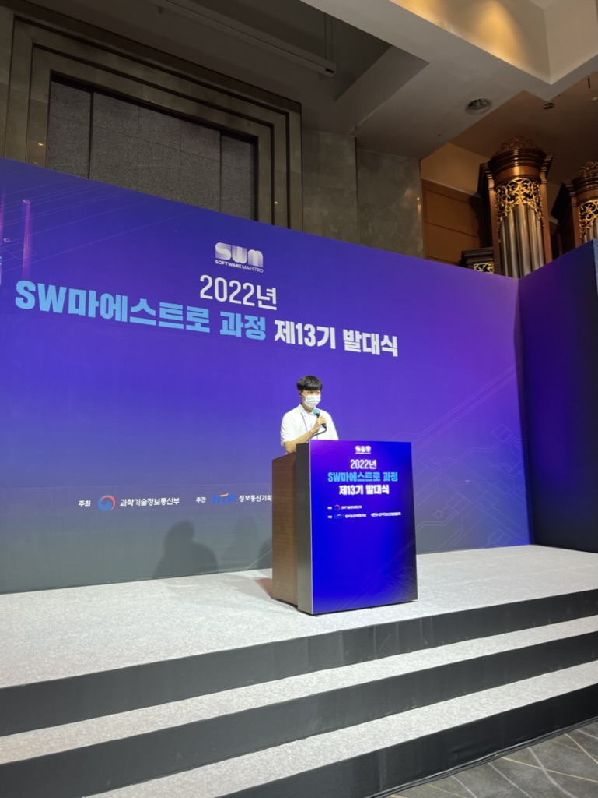
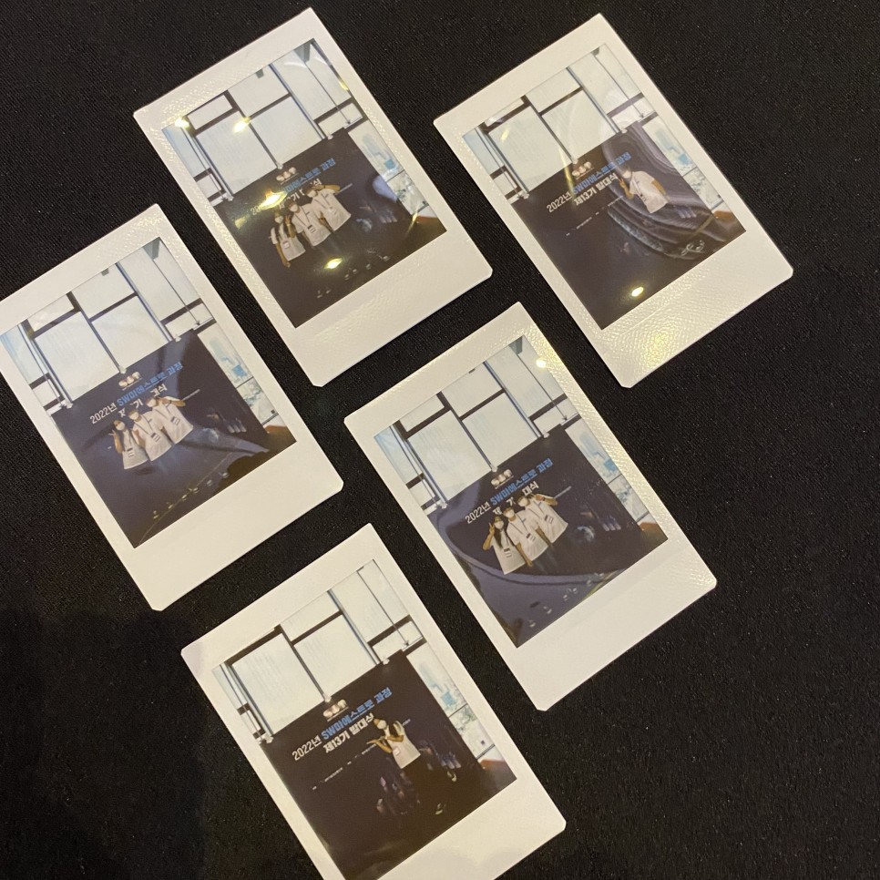
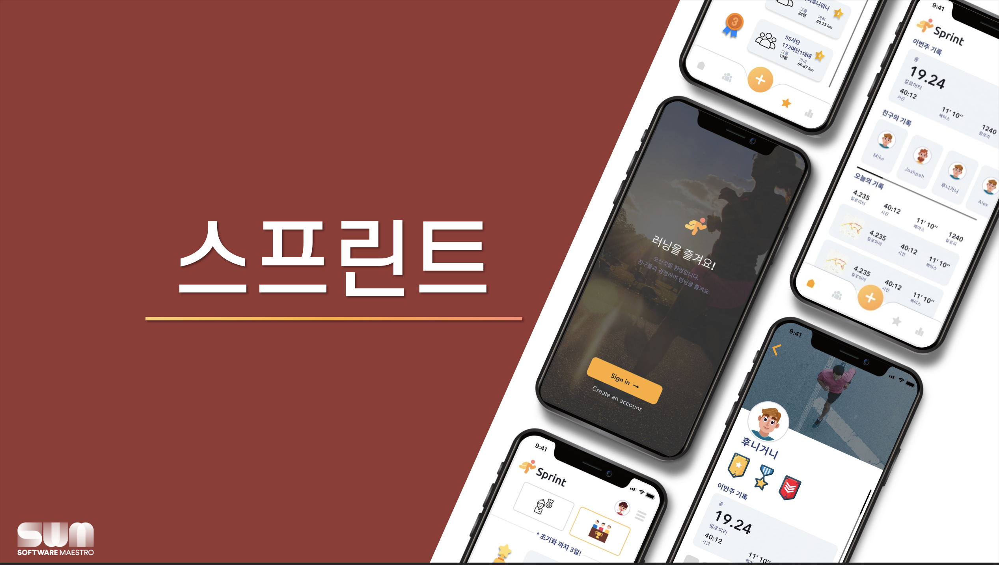
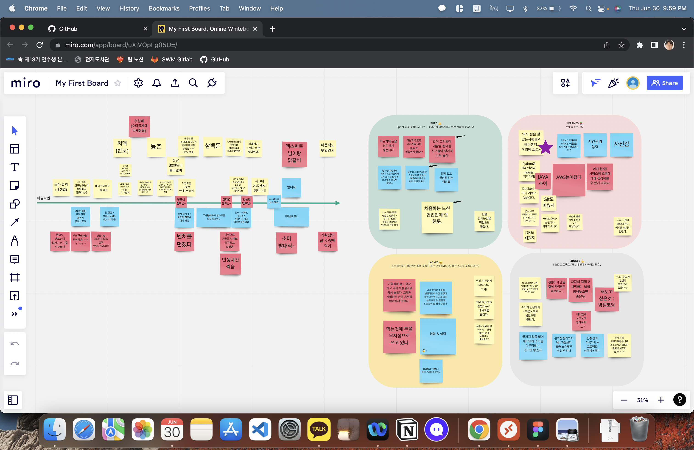
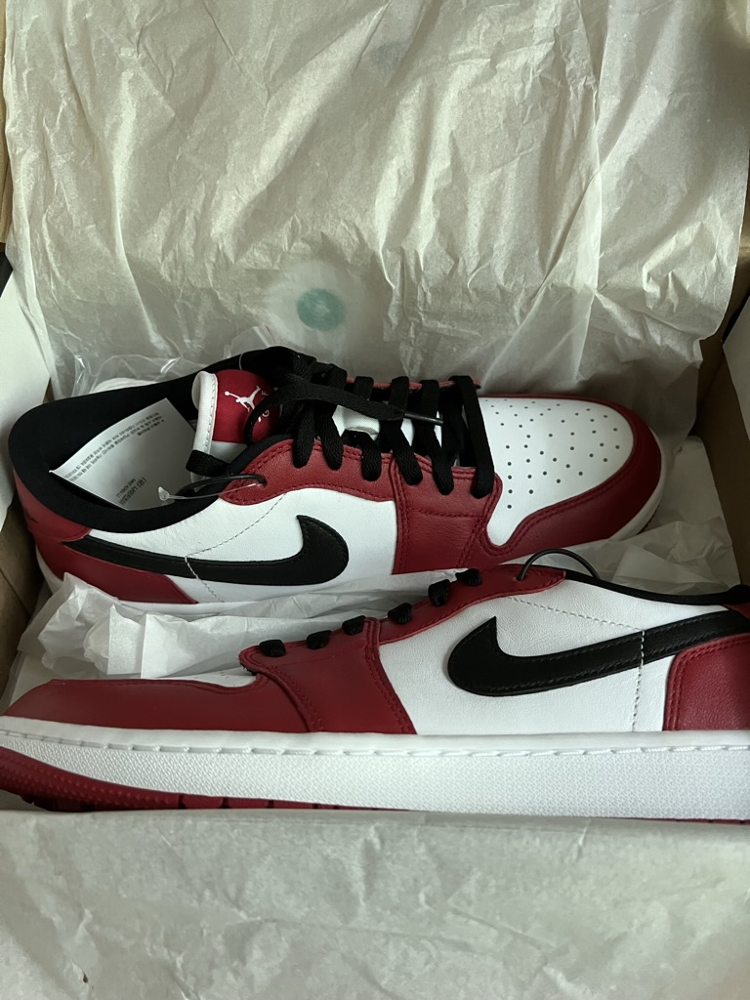

6월 회고이자 상반기 회고, 그리고 하반기 (+인생(?)) 계획

## 6월 Review

### 학교생활

길었던 한 학기가 끝났다! 지금 와서 돌아보면 워낙 바쁜 한 학기였다 보니 순식간에 정신없이 지나갔던 것 같다. 24학점 + 뎁코 스터디 + 소마 잘 버텨낸 거 대단해!

월초에 공휴일 몇일을 쉬고 나니 바로 시험기간이었고 후딱 종강이었다.

이런 말 하면 아무도 안 믿어주지만 이번 시험기간은 진짜 시험 공부를 거의 안 했다. 내 시험은 16, 17, 20일이었고 17일에 내야 되는 대체 과제도 하나 있었는데 소마 기획평가가 17일이라 시험에 거의 집중하지 못했었다.

그래도 정말 만족스러운 성적이 나왔다. 앞서 얘기했듯 학교 수업에 대한 회의감도 있었고, 정말로 시간을 쏟지 못했던 부분도 있어서 재수강만 안 했음 좋겠다고 계속 생각을 하고 있었는데, 예상보다 성적들이 잘 나와서 쁠이 거의 없지만 B도 거의 없어 4점대 방어에 성공한 학점을 받을 수 있었다. (솔직히 목표는 3.75였다.) 쁠컷에서 잘린 과목이 두 개나 있어 조금 아쉽긴 하지만 그래도 목표보다 훨씬 좋은 학점을 받아서 만족하기로 했다.

### 소마

소마도 이제 예비 과정이 끝나고 본 과정에 들어가다 보니 한 달 동안 정말 바빴던 것 같다. 순서대로 나열해 보면

- 발대식

소마 발대식이 오프라인으로 진행되어 차관님이 오셔서 좋은 얘기도 해주시고, 윗 기수 인증자들 상 받는 것도 보고, 사진도 찍고, 레크레이션도 하고, 비싼 밥도 먹었다. (솔직히 밥은 현금으로 주는게 더 좋았을 것 같다.) 나름의 인생샷 카톡프사도 건졌다.

컨셉샷이지만 뭔가 중요한거 하는 척

스프린트 팀 6개월동안 잘해보자요~

- 기획 평가

평가에 반영되지는 않지만 두 달간의 예비 과정동안 했던 팀빌딩과 기획을 평가받고, 6개월간 본과정에서 진행하는 프로젝트의 큰 그림을 준비하는 자리이다. 다른 팀원들은 어땠을지 모르지만, 나는 솔직히 막연하게 우리 그동안 잘 해왔는데 설마 기획평가에서 떨어지겠어 하는 생각으로 걱정 없이 준비했던 것 같다.

기획 평가 자리는 예상과는 달리 우리의 프로젝트에 대해 심사위원들이 허점을 찾고 공격하는 자리가 아니라, 가져온 주제에 대해 이러이러한 방향으로 발전시키면 좋을 것 같다는 아이디어들을 계속 던져 주는 자리였다. 솔직히 그분들이 제시해 주는 아이디어들이 마음에 들지는 않았지만, 조금 날카로운 평가들이 초반에 날아와서 잘못하면 떨어져서 재심사를 받아야 될 수 도 있겠다는 생각이 들어서 걱정이 되었던 것 같다. 그래도 일단은 잊고 지내기로 하고 팀원들끼리 맛있는 아웃백 회식을 하고, 한강가서 커피한잔 하고 며칠 쉬다 보니 (저는 시험공부 했어요 ㅠㅠ) 다행히 합격 메일을 받았다.

그 뒤로는 이제 소마에서 터치하지 않으니 자유롭게 프로젝트 설계 상세화시키고, 개발에 들어가 8월 말 중간발표까지 열심히 달리면 된다. 지금은 아직 API와 DB 설계를 하며 기획 구체화를 하는 단계인데, 솔직히 기획심의 전보다 조금 풀어진 것 같다. 다시 각 잡고 열심히 달려봐야겠다.

최근에 소마 엑스퍼트 님과 멘토링 진행하면서 그동안을 정리하는 팀 회고를 진행해 봤는데, 기록해 볼 가치가 있는 좋은 자리였던 것 같아 남겨 보자면,

- 먹는 얘기가 정말 많네요... 진짜 선릉 구석구석 맛있는거 많이 먹으러 다니긴 했는데 소마 지원금 들어오는거 다 식비로 나가서 남는게 없는 느낌....
- 다시 한번 목표를 새기고 가야 될 것 같은데 싸우지 않고 재미있게 팀원들과 프로젝트 마무리 할 수 있으면 좋겠다.
- 배운 점 파트가 제일 인상적이었던 것 같은데 소마에서 배운 점이 아니라 한 학기동안 배운 점인 것 같아서 다시 밑에 정리하겠다.

### 개인생활

- 야구 얘기는 그만합시다 이제.

6위긴 한데 5위권 진입하면 다시 얘기하는거로...

- 소소한 현질

저번에도 시험이 끝날 때마다 나름의 수고했다는 현질을 좀 한다는 글을 썼었는데 이번에도 어김없이 돈을 좀 썼다. 옷장을 봤더니 입을 옷이 없어서 옷을 좀 샀다. 그리고 사고싶었는데 비싸서 계속 고민하던 시카고 조던도 곧 스터디 지원금 들어오는 거로 산다는 생각에 질렀다.

이쁘네요...

- 고민

굳이 왜 이런 고민을 하고 있나 싶긴 한데 소마 끝나고 뭐하지 라는 고민을 최근에 계속 하고 있다. 대충 선택지는

1. 창업 (쉽지 않음)
2. 인턴
3. 42 서울, BOB, 네이버 부스트캠프 등 공부 환경

1번의 경우는 아마 거의 가능성이 없는 이야기 인 것 같다. 창업하는 팀에 탑승해서 기여하는 건 상상이 가도 (이것도 진짜 내 생각에 회사가 성장 가능성이 충분하고, 회사 비전이 뚜렷해야지만 일어날 일이다.), 내 손으로 직접 창업하는 일은 드물 것 같다.

2번은 이제 가장 크게 생각하고 있는 부분이긴 한데 사실 실현 가능성은 아직 미지수라고 생각한다. 겉에서 봤을 때 가진 타이틀은 빵빵하긴 한데 실력은 아직 무언가를 하기에 부족한 거 같다고 생각하고, 무엇보다 학업과 병행해야 하는 학부생, 4학년도 아닌 3학년을 인턴으로 데려가려는 회사가 얼마나 있을 지 모르겠다.

3번은 이제 주변에서 많이 하다 보니 생각하는 선택지이다. 소마에서 기술을 배운다는 생각보다 경험을 쌓는다는 생각을 많이 하고 있고, 전문적으로 기술 교육을 받을 필요성도 있다고 생각한다. 선택지 중 42 서울은 주변에 소마 끝나고 간다는 사람도 있고, 금전적 입장에서 정말 매력적인 선택지이지만, 소마를 이미 이수한 입장에서 커리어적으로 도움이 될 선택지는 아닌 것 같다. BOB도 내가 보안 분야에 생각이 크게 없는데 굳이 타이틀 하나 달려고 가는 것은 좋은 선택지가 아닌 것 같다.

최근 가장 확률이 높은 옵션으로 생각하고 있는 선택지는 네이버 AI 부스트캠프이다. AI를 지금 계속 혼자서 공부하고 있는데 뭘 공부해야 될지 찾는지에도 어려움이 있고, 내가 제대로 이해하고 넘어가고 있는지에 대해서도 잘 모르겠다. 전문적인 커리큘럼의 지도를 따르고, 특히 AI 의 이론적인 내용에서만 끝나지 않고 대회 참여와 Production Level의 AI까지 다뤄볼 수 있다는 것이 정말 매력적이라고 생각하고 있다. 일단 4기는 일반 전형으로 지원해야 하고 코테 준비도 별로 안해서 힘들지 않을까 생각하고 있는데 1차 합격을 하면 다음 기수에서 1차 시험이 면제되어 일단 지원은 해볼 예정이다. 떨어지더라도 5기 부터는 KDT로 지원이 가능하니 경쟁률도 널널해지고, 교육 시기가 밀리긴 하더라도 합격할 수 있을 것이라 생각중이다. 주변에 소마 출신들이 있어 진행에 있어 도움을 받을 수 있었는데 부스트캠프 수강생은 없어 후기를 들어볼 수 없어 고민을 혼자 계속 해 봐야 될 것 같다.

## 한 학기 동안 배운 점

2022년의 절반이 지났으니 적어 보는 중요 세션이다. 이번 한 학기가 내 인생에서 가장 열심히 살았던 한 학기였던 만큼 배우고 느낀 점도 많다.

- 시간 관리 능력

주변에 힘들다고 찡찡대긴 했는데... 잘 들어주신 분들 감사합니다.

24학점 + 뎁코 스터디 + 소마 잘 버틸 수 있을 까 고민했는데 학기가 끝난 지금 와서 평가해 보면 셋 모두 성공적으로 해결한 것 같다. 학점은 예상보다 잘 나왔고, 뎁코 스터디도 펑크 없이 모두 마무리했으며 소마도 마음 맞는 팀원과 멘토님들 잘 찾고 기획평가도 한번에 통과 했다. (물론 이건 내가 바쁘다고 정신나가있을때 내 몫가지 달려준 팀원들
덕분이다. 항상 감사합니다. 🥰 )

항상 만나는 그 친구들과 금요일 저녁에 피파 때리다가 집에 가면서, 내가 이러고 있는거 보면 아직 시간 널널하구나 라는 생각이 들었던 것 같고, 더 힘을 내서 열심히 달려 학기를 완주한 것 같다. 또, 주변에 나보다 몇 배는 더 열심히 사는 바쁜 선배들을 만나면서 자극받고 달린 것 같다.

이렇게 시간관리 하는 데에는 내 성격도 한 몫 한 것 같다. 일단 벌린 일은 어떻게든 결과를 내야 되는 성격이라, 셋 모두 포기 못하고 최대한 성과가 나오더록 끝까지 붙잡고 어떻게든 한 것 같다. 일을 이것저것 벌려 놓으면 어떻게든 시간 분배해서 해낼 수 있다는 생각? 이것도 버텨냈으니 이것저것 더 해볼까 하는 미친 생각을 하게 되던데 누가 말려 주면 좋을 것 같습니다.

- 사회 생활

학교를 제외하고 다양한 나이대의 사람들과 지속적으로 소통하는 사회 생활의 경험을 처음 해 보았다. 아직 눈치도 많이 부족하고 처세술, 말하는 능력 같이 길러야 되는 것도 많고 낯 가리는 등 성격에서도 고쳐야 될 부분이 많이 보인다. 그래도 소마에서 (특히 팀 구성한다고 모르는 사람들이랑 먼저 연락도 해 보고 커피챗 계속 하면서) 많이 경험해 보는 것 같고 다 나중에 도움이 되지 않을까 생각한다.

- 자신감

솔직히 열심히는 달려왔지만 올바른 방향으로 가고 있는지에 대해 의문이 계속 있었는데 소마에 합격하고 활동하면서 어린 나이에 잘 나아가고 있다는 자신감이 많이 생긴 것 같다. 소마에서 앞으로의 미래의 방향성에 대한 탐색도 많이 하고 있는데 선택에 도움이 될 많은 경험들을 쌓는 중이라 생각하고 이것저것 열심히 지금처럼 해봐야겠다.

## 7월 Preview

방학했어요! 너무너무 행복해요! 근데 너무 더워요!

위에 시간관리 항목의 연장선인 것 같은데, 소마 시작할 때는 진짜 여기에 정신을 100% 쏟아야 되서 아무것도 못 할 것 같은데, 소마하고 비는 시간 쪼개면서 끼우면 이것 저것 할 수 있을 것 같다.

- 일단 언제나 1번은 소마입니다. 프로젝트 이제 설계 끝나면 개발 들어갈꺼고, 일정에 맞춰서 개발 해야 됩니다.
- 소마 출근일 : 월 (김준범 멘토님), 화 (방요셉 멘토님, Expert), 금 (장태영 멘토님) + 필요 시 주 1일 정도 더? + 열심히 자택근무
- 그래도 이것저것 휴식할 계획도 있어요: 설곽 MT (7/8-9), 손흥민 보러 상암 (7/13), 사국 MT(7/21-22), 부산 본가 (7/22~24) (부산은 가서 카페에서 개발 해야 될 거 같은 예감이...)
- DevKor 캐글 대회: 매주 일 저녁 (막차 타고 올 수 있겠죠?). 근데 진짜 여기서 경험치 엄청 쌓을 수 있을 거 같으니 좀 열심히 해봐야곘음.
- 개인적인 (CV) + 성현이 서폿 (NLP) 논문 구현 스터디: AI를 좀 더 공부할 필요성을 느꼈다.

써놓고 보니 바쁘네요! 저 이렇게 열심히 살고 있어요 🙌
