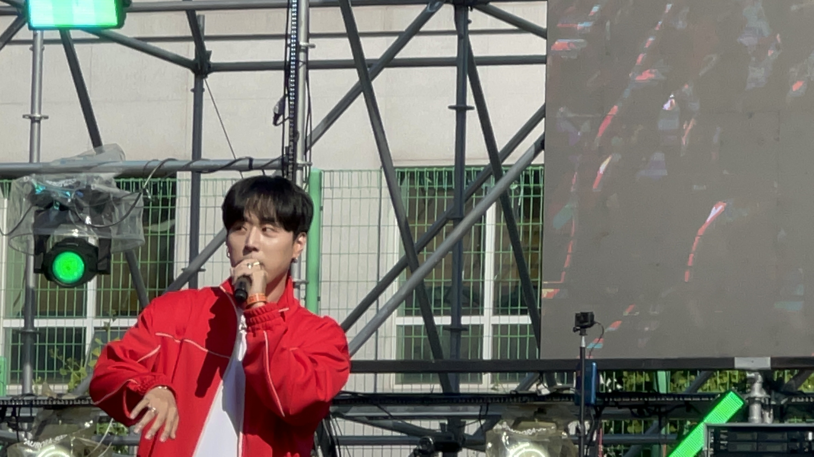
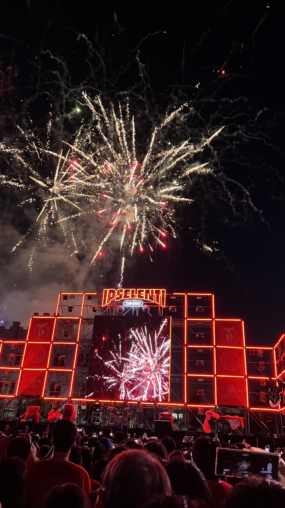
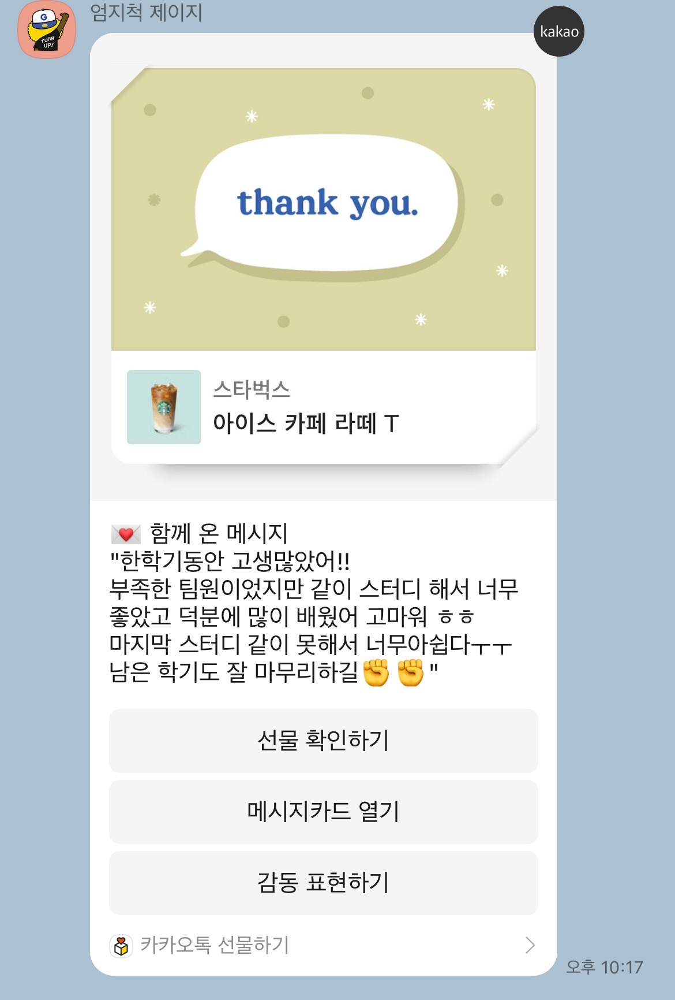
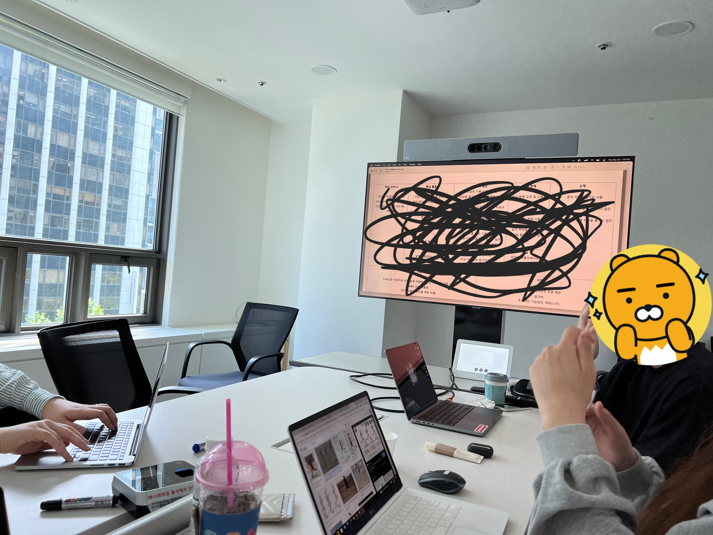
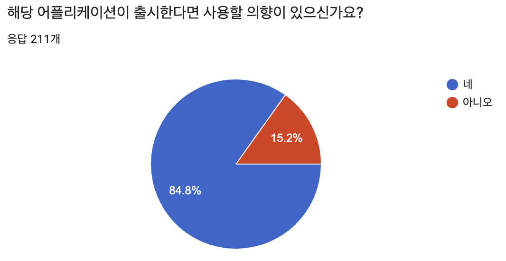
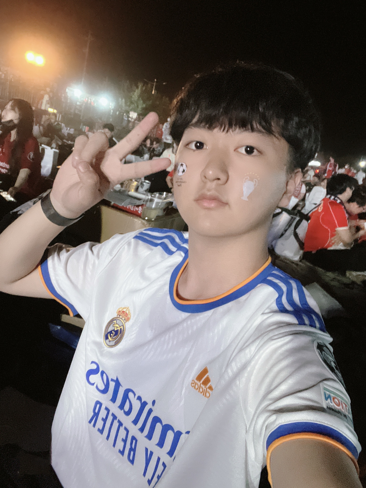

시간이 정말 빠르네요 벌써 한달이 갔어요.

## 5월 Review

이번에도 목차는 비슷할듯?
크게 정리하면 3분야 : 학교생활, 소마, 개인생활로 정리될 것 같다.

### 학교생활

솔직히 말하겠습니다. 이번달 수업중에 똑바로 들은게 없는 거 같아요. 교수님 죄송합니다.

나름의 핑계 겸 이유를 대보자면...

어느 정도 확신이 생겼다. 내가 몸담고 있는 분야는 학벌과 학점으로 평가받게 되는 분야가 아니고, 무조건 실력, 그리고 꾸준한 공부가 필요한 분야이다. 학교 수업 외에 공부 해야 할 게 너무나도 많고 거기에 집중하고 싶었다.

학점이 필요한 거는 대학원 가는 정도? 솔직히 공부 안해도 학점을 아 정도로 만족스러운 선까지는 방어할 수 있을 것 같다.

5월은 또 학교 축제가 있는 달이다. 일주일동안 대동제, 입실렌티 가서 재밌게 놀면서 그동안 힘들었던 거를 좀 풀 수 있었던 것 같아 좋았다. 주준위는 안 했지만 주점 하는 데 가서 노가다도 뛰고, 한양대 축제에 놀러가기도 하고, 수많은 인파 속에 끼어들어 꾸역꾸역 연예인 무대 보는 것도 재미있었다. 몇 개 꼽아보자면

- 비와이: 무대 진짜 잘하신다. 랩도 잘하시는데, 관중을 휘어잡고 호응을 유도하며 무대를 이끄는 능력이 진짜 대단하신 것 같다.
- 악뮤: 노래 진짜 잘한다... 대박이다...
- pH-1: 입실렌티 끝나고 얘기해보니 친구들은 다들 싸이가 가장 좋았다고 했다. 맞는 말이지만, 개인적인 팬심에서 나는 pH-1 무대가 가장 기억에 남는 것 같다. 다른 연예인들과 달리 예고나 스포 없이 깜짝 등장하신 부분도 있었고, 중 3때 하이어뮤직 처음 생겼을 때 부터 노래를 듣고 정말 좋아했었는데 무대를 직접 볼 수 있었다는 게 너무 좋았던 것 같다.
- 헤이즈: 노래 잘하시는건 당연하고... 딩고 봤을때 말투 특이하다 (매력있습니다😍) 생각했었는데 실제 말투가 그거랑 똑같으셔서 재미있었다.
- 싸이: 실제로 싸이 무대를 보러 가게 될 줄 몰랐는데 직접 볼 수 있어 너무 좋았고 무대 장악력이 어마어마하시다. 곡의 대중성이 넘쳐나니 모두가 즐길 수 있고 관중 조련까지 완벽하니 공연 원탑인 이유가 있다.
- 아이들, 레드벨벳: 제가 좋아하는 걸그룹이 아니라 잘 모르는데요... 다들 실물이 너무 이뻐요...

특히 입실렌티 같은 경우는 응원제다 보니 과별 단체 입장이었는데 과대님이 좋은 자리 뽑아 주셔서 무대 앞쪽 센터를 배정받아 연예인들을 화면이 아닌 코앞에서 실물로 볼 수 있어 너무 좋았다. 감사합니다!!

마지막으로 기억에 남는 것은 5월의 마지막 날인 어제, 열심히 달려왔던 DevKor 알고리즘 스터디가 끝났다. 스터디를 시작하며 생각했던 난이도와 진행 속도가 실제 스터디를 진행하다 보니 많이 달라서 시행착오도 많았고 우여곡절도 많았지만 막판까지 출석율이 좋았던 걸로 보아 다행히 한 학기 무사히 완주한 것 같아 다행이다. 학교 수업과 과제도 있고 다른 대외활동들로 다들 바빴을 텐데 마지막까지 열심히 따라와준 스터디원들에게 너무 고맙다. 스터디 하면서 느낀 점은...

- 스터디에서 잠깐 문제 풀 시간을 주고 풀이하는 것은 미친 짓이었다.

한 문제 푸는데 3-40분, 길게는 한시간씩 썼으면서 스터디 때는 2시간이라는 시간에 이론 설명을 하고 문제를 풀 시간을 주고, 그 안에 풀어내는 사람이 있기를 바란 것은 내가 잘못한 부분인 것 같다. 이런 점을 인지하고 중간고사 휴강 이후에는 내가 수업자료를 수업 전에 빠르게 배포해 예습과 문제풀이를 미리 해 볼 수 있는 시간을 주었고, 막판 수업들이 잘 진행된 것을 생각하면 나름 성공적인 방법이었던 것 같다.

- 다들 많이 바쁘시다...

스터디 처음에 회장님께서 빡세게 회원 관리를 요청하셔서 결석 + 숙제 미완 4회시 퇴출을 기준으로 잡았다. 숙제는 매주 수업한 내용에 대해 백준 실버 ~ 골드 초반으로 4~6 문제씩을 내주었는데, 다들 바쁘셔서 그런지 숙제를 완성하시는 분이 거의 없어 숙제 미완 퇴출은 포기하고 결석 퇴출만 진행하였다. 저도 소마에 학교에 뎁코 스터디 두개까지 하느라 바쁘긴한데... 남들도 다 바쁜 일이 있겠죠 뭐

- 코드를 설명할 수 있는 능력을 더 길러야 된다.

알고리즘과 코드에 대해 설명을 진행하다 내 설명이 꼬이고 있다, 뭔가 잘못되고 있다고 느끼면서 수업 중간에 멘붕이 왔던 시점들이 몇번 있었는데 (연결리스트 구현한거 설명할때, 마지막주 백트래킹), 코드를 조금 더 깔끔하게 짜고 설명할 수 있는 능력을 길러서 다른 사람들이 이해할 수 있도록 해야겠다는 생각이 많이 들었다.

솔직히 내가 한 학기동안 스터디를 잘 이끌었나요? 라는 질문에 대한 내 답은 No 에 가깝다. 스터디원들이 이번 학기 알고리즘 스터디에서 무엇을 얼마나 얻어갔는지 잘 모르곘다. 다들 수고했다고 말은 해 주는데, 제 앞이라 해주는 이야기인지 진짜 얻어가는게 많았는지는 모르겠네요...

그래도 이런거 보면 행복합니다. 감동 많이 받았어요.

### 소마

5월에도 소마시계는 바쁘게 돌아갑니다. 4월은 이제 막 소마에 들어와서 팀매칭도 시작했고 여러 멘토님 멘토링 수업을 들어보는 시간이었다면, 5월은 6개월간의 소마 본과정을 위해 바닥을 다지는 시간이었던 것 같다. 매 주 2-3번씩 팀원들을 만나 주제를 잡기 위해 회의하고, 우리 팀을 잘 이끌어 주실 것 같은 멘토님들을 list-up 하고 연락을 돌려 멘토링을 잡고 만나뵜다. 주제를 정하기 전에는 진짜 머리가 복잡했는데, 주제를 정하고 멘토님들까지 확정하고 나니 우리 팀은 나름 잘 순항중인 것 같다. 아직 팀구성이 완료되지 않은 팀, 주제를 못 잡고 있는 다른 팀들도 있으니 우리 팀은 나름 잘 헤처나가고 있는 게 아닐까. 프로젝트 구현만 잘 해낸다면 인증도 가능할 것 같은데 열심히 해 봐야겠다.

언제나 열심히 하는 우리팀 Sprint ^^ (내용은 대외비!)

우리 팀이 정한 주제를 간단히 설명하자면 "팀원 및 경쟁상대 매칭을 통해 Entertainment적인 심리적 요소를 제공하여 사람들에게 러닝에 대한 흥미와 동기부여를 줄 수 있는 앱 서비스"이다. 기획심의를 준비하면서 설문조사를 받아보았는데 분위기가 좋다. 미국의 향기가 나네요. 아이디어는 좋으니 구현만 잘 하면 될 것 같다.

원래 웹 프론트엔드를 맡을 거라 생각하고 React 와 NextJS를 공부하고 있었는데 프로젝트 구체화를 하다보니 Flutter 개발을 하게 될 것 같아 급하게 Flutter를 공부 중이다. 빠르게 공부해서 프로젝트 완벽하게 진행하고 인증도 받고 미국 갈 수 있도록 노력해야겠다.

### 개인생활

- 야구 왤케 못함

한달만에 2위에서 7위로 꼬라박는 멋진 모습... 6연패하며 한주동안 무승... 한 경기 4실책... 참 보기 좋네요 그죠

- 당일치기 양양

축구 보는 걸 좋아하다 보니 챔피언스리그 결승은 놓칠 수 없는 행사다. 처음 봤던 게 박지성 선수가 뛰었던 2011년이었는데, 그 뒤로 매년 결승은 놓치지 않고 라이브로 챙겨 본 것 같다.

올해는 친구들끼리 방을 잡고 보자고 준비중이었는데, 일정이 꼬이면서 두명만 남게 되어 파토 직전까지 갔다가, 양양의 물치해수욕장에서 단체관람 이벤트가 있어서 친구와 둘이 저녁 버스를 타고 가서 아침 버스를 타고 오는 당일치기를 달리고 왔다. 경기 보러 간다고 오랜만에 유니폼도 샀다.

전날 입실렌티에서 힘을 다 쏟기도 했고 입실렌티 일정이 늦게 끝나서 피곤했지만, 그래도 가서 무제한 맥주와 레드불, 치킨을 즐기다 보니 시간이 금방 흘러갔던 것 같다. 최애 팀과 차애 팀이 붙게 되는 마음 아픈 경험이었지만, 분위기도 좋았고 경기도 재미있어서 다행이었다. 레알이 1 대 0 으로 이겨서 기분 좋게 집으로 돌아왔다. 우리 14번째 우승했지롱~

### 조금 더 개인적인 얘기

한달동안 여러가지 일들 거쳐가면서 느낀 점들이 조금 있다.

- 시끄러운 술자리는 싫더라.

이건 딱히 고쳐질 일도 아니고 고쳐야 할 점도 아닌 거 같다. 사람 엄청 많이 불러놓고 시끄럽게 소리 지르며 술 마시는것보다 그냥 진짜 친한 사람끼리 모여서 이런저런 썰 풀면서 노는게 나는 더 좋다. 잘 모르는 사람들 앞에서 억지로 분위기 맞추고 앉아있는거 나는 잘 못 하겠다.

- 성격 진짜 고쳐야 된다.

옛날부터 느껴왔는데 약간의 편집증 기질이 있다. 이거 진짜 고쳐야 되는건데 쉽지 않네요. 일단 노력해볼게요.

## 6월 Preview

### 학교생활

좀만 있으면 방학이네요. 기말고사 말고는 학교생활에서 크게 고려해야 할 부분이 없는 것 같다. 올해 소마도 하고 있고 어느 정도 학점에 대한 강박을 버린 만큼 평균 정도만 유지해도 나름의 성과라고 생각한다.

### 소마

6월부터 소마는 이제 예비 과정이 끝나고 본 과정에 진입한다. 돈 받는 것도 있고, 컴퓨터도 새거 살 수 있고 (데스크탑 살라 했는데 노트북만 사준다네요 ㅠㅠ), 인강비랑 책값 지원도 나오는게 너무 설렌다.

6월에 해야 할 일은 프로젝트 구체화를 완전히 마쳐 그 내용을 토대로 기획 평가를 진행해 통과하고, 이제 개발에 들어가는 것이다. 그동안 계속 사람 대하는 법만 배웠던 것 같은데 이제 개발에 들어갈 수 있는게 기대되기도 하고 한편 걱정되기도 한다.

일단 가장 먼저 해야되는 일은 기획 평가이다. 아직 목에 칼이 안 들어와서 그런지 설마 기획평가에서 떨어지겠어 하고 걱정이 별로 없긴 한데, 무조건 한 번에 통과해야 한다. 기획 평가 한번 떨어지고 다시 준비하는 과정은 정말 스트레스이고 일정에 차질이 많이 생길 것 같다.

또, 구체화된 프로젝트에 맞춰 백엔드와 데이터베이스 설계를 해야 한다. 일단은 추상적으로 생각만 하고 있는 기능들을 정리하고 구현할 준비를 하기 위해 와이어프레임을 그리는 중인데, 이에 맞춰 어떠한 정보를 어떻게 저장하고 어떻게 호출할지에 대한 설계가 필요하다. 우리 팀원들 모두 이 경험이 없어 걱정이 되기는 한데, 이런 기회에 한번 해보는 것도 정말 많은 도움이 될 것 같다. 열심히 공부해야겠다.

그 뒤에는 개발만 남았다. 아직 Flutter를 잘 모르다 보니 어디서부터 어떻게 해야 할 지 막막하긴 한데, 방학 두달 불태우면 할 수 있을 것이라 믿는다.
