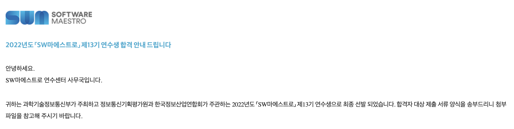

소마 과정을 준비하면서 인터넷에서 각종 합격 후기들을 많이 찾아보고 도움을 많이 받았던 것 같다. 개인적으로 이 시기의 간절함을 남기기 위해서, 그리고 소마과정을 준비하는 또 다른 누군가를 위해서 이 과정을 기록하고 경험을 공유해보고자 한다. 특히, 이 글을 사람들이 보게 될 지 모르겠지만 프로젝트 경험이 부족하여 소마 서류 작성으로 고민하는 사람들에게 도움이 되기를 바란다. 나 또한 같은 경험을 했으며, 같은 고민을 나누었기 때문이다. 합격 발표가 나고 바로 글을 쓰고 싶었지만 예비 연수 준비도 해야 됬고 무엇보다 학교 과제가 몰아서 나와 너무 많아 정신이 없었어서 한 주가 지난 이제서야 글을 쓰게 된다.

## 1단계: 서류 평가 (마감 : 2/17, 합격자발표 : 2/24 )

소마의 시작 관문은 인적사항과 코딩 경험에 대한 작은 프로필을 하나 작성하고 자기소개를 작성하는 일이다. 이 과정에서 떨어지는 사람은 소프트웨어 마에스트로 과정을 진행하는 데 자격 요건을 충족하지 않는 사람만 걸러내는 것으로 알고 있으나, 작성한 자기소개서는 마지막 면접 단계의 질문의 대상이 되니 소홀히 작성해서는 안된다고 생각한다.

자기소개서는 4문항으로 구성되며, 자기소개 2문항과 연수계획 2문항으로 구성된다. 모든 문항은 최소 400자, 최대 3000자를 입력할 수 있지만, 글자수를 모두 채우는 데 부담은 가지지 않고 솔직하게 자기 이야기를 하면 될 것 같다.

### [자기소개 1] 소프트웨어 분야 전문성을 키우기 위해 남다른 노력을 한 경험 -> 922자

프로그래밍 공부를 시작하게 된 계기를 시작으로 고등학교 때 공부하고 싶던 ML 분야 수업 개설을 요청해 공부한 경험, 그리고 프로그래밍을 졸업 논문에 활용해 결과물을 만들어낸 경험을 작성하였다. 대부분 여기서 프로젝트 경험과 그 과정에서 부딪힌 문제점과 해결방법을 적으면 될 것 같다.

### [자기소개 2] 장래 희망 ->862자

​ 학과 특성과 연계지어 입대 후 사이버보안 분야에서 일하는 것에 대한 내용과, 임과 후 소프트웨어 보안을 연구하여 취약점을 찾고 해결책을 제시할 수 있는 활동을 하고 싶기 때문에 소마 과정을 통해 소프트웨어 개발 프로세스를 배우고 싶다는 이야기를 담았다.

여기 작성한 내용이 면접 질문 내용으로 등장하였다. 면접관 님께서 소마가 끝나고 자신의 10년 후 미래는 어떨 것이라 생각하는지 물어보셨는데, 여기 적힌 내용을 요약해서 대답하였다. 크게 변별력이 있는 질문은 아니였을 것이라 생각한다. 본인 확인용...?

### [연수계획서 1] 소마 과정에서 어떤 능력을 갖춘 연수생들과 어떠한 프로젝트를 어떻게 수행할 것인지 구체적인 계획 -> 1402자

​ 개인적인 프로젝트 아이디어를 제시하고, 이 아이디어를 해결하는 데 있어서 어떠한 경험과 기술 스택을 가진 조원을 만나고 싶은지 적었다. 그리고 프로젝트 구현 과정에서 만나게 될 것으로 예상되는 문제들과, 소마 과정에서 멘토님들의 도움으로 그 문제를 해결할 방법을 배우고 싶다고 서술하였다. 또, 솔직하게 내가 부족한 점이 기술 스택과 프로젝트 경험이라고 이야기하고 그것은 충분히 각오하고 있으며 합격하면 어떻게 팀원들에게 피해가 가지 않도록 다른 연수생들과의 간격을 극복해나갈 것인지 계획을 서술하였다.

​ 연수생들 중 이때 작성한 프로젝트 아이디어를 소마에서 실제로 하는 사람은 매우 드물다고 하니 너무 부담가질 필요는 없다고 생각한다. 본인에게는 여기서 질문이 들어오지 않았지만 여기서 질문을 받은 분들도 있다 하니 한번 생각해볼 필요는 있다고 생각한다.

### [연수계획서 2] 소마 과정을 통해 받게 될 지원금과 멘토링을 통해 이루고자 하는 궁극적인 목표 -> 824 자

​ 내가 생각하는 훌륭한 프로그래머의 모습을 제시하고, 소마 활동이 어떻게 나를 그러한 프로그래머로 만들어줄 수 있는지 작성하였다. 소마 과정을 통해 해보고 싶은 경험들을 적고, 그러한 경험들에서 무엇을 얻어갈 수 있는지 제시하며 왜 소마가 아니면 이러한 경험을 할 수 없는지를 적어 꼭 소마를 하고 싶다고 어필했다. 또, 다른 연수생과 멘토들과 소통할 자세가 되어 있음을 알리고 부족한 점을 소통하며 채워나가고싶다는 각오를 적었다. 또, 끝나고 교내 학회와 동아리를 통해 소마에서의 경험을 소마에 참여하지 못한 다른 사람들과도 공유하고 함께 성장하도록 돕고 싶다는 내용을 적었다.

나이 제한이나 국적 등에 결격 사유가 없었기 때문에, 합격했다.

### 2단계: 1차 코딩테스트 (일시 : 3/5, 합격자발표 : 3/10 )

​ 코로나 관련 상황으로 인해 1차, 2차 코딩테스트는 모두 소마 출신 기업 elice 에서 만든 플랫폼에서 진행되었다. 내년의 경우 코로나 규제가 완화된다면 어떻게 될 지 모르겠다. 메일로 시험을 볼 수 있는 계정이 주어지고, 해당 계정으로 플랫폼에 접속해 2시간동안 문제를 풀면 된다. 코딩테스트는 화면 공유와 웹 캠을 킨 상태에서 진행되며, IDE를 사용할 수는 있지만 인터넷 검색이나 화장실 등 자리 이탈은 금지된다. Elice 플랫폼에서 코드를 작성하는 것은 프로그래머스 화면과 상당히 유사하니 거기서 연습해 보면 될 것 같다. 플랫폼이 크게 불편하지 않아 외부 IDE 를 사용하지 않고 바로 코드를 짰다. 주의할 점은 백준 등의 플랫폼과 같이 제출을 하면 바로 결과를 표시해 주지 않기 때문에, 본인이 맞았다고 생각한 문제도 틀릴 수 있다.

​ 코딩테스트는 알고리즘 6문제 + SQL 1문제 + WEB 1문제 로 출제된다. 특이한 점은 각 문제의 시간제한이 40초 정도로 널널하기 때문에 시간복잡도가 커도 정답이 출력되면 정답으로 채점이 되며, 실행시간이 짧을수록 가산점을 받을 수 있는 형태인 것으로 알고 있다. 2차 코테와 달리 1차 코테는 면접관의 질문 대상이 아니기 때문에 일단 어떻게든 푼다는 생각으로 임하면 될 것 같다. 코딩 테스트 문제는 비공개가 원칙이라 알려줄 수도 없고, 기억이 잘 나지 않지만 [여기](https://kbwplace.tistory.com/139) 잘 복기된 내용이 있어 참고하면 좋을 것 같다.

​ 알고리즘은 2~3 문제를 풀고, SQL과 WEB 문제를 풀어 총 4~5문제로 합격했던 것으로 기억한다. 컷트라인을 공개하지 않지만 2~3문제가 합격 커트라인이었고 여기서 약 1000명 정도 남은 것으로 인터넷에서 소문을 들었다.

### 3단계: 2차 코딩테스트 (일시 : 3/19, 합격자발표 : 3/22 )

​ 2차 코딩테스트는 1차와 형식은 같지만 문제의 난이도가 조금 더 높고 갯수는 적은 것이 특징이다. 알고리즘 3문제 + SQL 1문제 + WEB 1문제가 출제되었다. Web에서는 자바스크립트 문제가 나와서 시간이 많이 걸릴 것 같아 패스했고, SQL 을 풀고 알고리즘 2문제를 풀어 합격할 수 있었던 것 같다. 2시간중 첫 1시간동안 한 문제도 못풀어 멘붕이 왔었는데 마음을 다잡고 다시 집중하여 SQL 문제부터 해결하고 알고리즘 두문제를 빠르게 구현해 합격하였다.

​ 2차 코딩테스트에서 주의하여야 할 점은 여기서 작성한 코드들은 면접관들이 면접에서 보면서 질문의 대상이 될 수 있다는 점이다. 그동안 다른 사람들의 후기를 읽어 보았을 때 알고리즘 문제만 질문의 대상이라 생각하였는데 의외로 SQL 문제에 대해 질문이 들어와 당황했었기에, WEB 도 풀었다면 충분히 질문의 대상이 될 수 있다고 생각한다. 면접 일정표로 역산해 보았을 때 500 명이 남은 것으로 알고 있다.

### 4단계: 심층 면접 (일시: 3/28 ~ 3/31, 합격자 발표 : 4/8 )

​ 2차 코딩테스트 합격 후 면접 일시와 안내사항이 담긴 메일을 받게 된다. 면접은 코엑스 컨퍼런스룸 에서 진행되고, 면접 일자와 시간이 정해져 공지되기 때문에 수정이 불가능하다. 수요일 15:30 면접으로 전공 수업이 있는 시간이었지만 면접참가확인서를 제공하기 때문에 받아 교수님께 전달드려 출석인정 처리를 받을 수 있었다.

올해 특별히 포트폴리오 발표 시간 (3분) 이 면접에 추가되었다. 메일에 Notion으로 포트폴리오 양식이 첨부되었고, 해당 양식을 바탕으로 자기소개와 경력, 프로젝트 경험 등을 채우고 발표할 수 있는 시간이다. 포트폴리오는 공정성을 위해 면접 전주 금요일까지 제출하도록 되어 있다.

하나의 면접실에는 5명이 들어가며, 1타임에 5개의 면접실이, 하루 6타임 (마지막 날은 2타임) 으로 면접이 진행된 것으로 알고 있다. 면접장에 도착해 본인 인증을 하고 나면 본인의 면접실과 번호를 알려주는 번호와, 스티커 등의 기념품, 면접참가확인서와 물, 면접비 (3만원) 등을 받을 수 있다.

나는 4분과 1번을 배정받았다. 관심 분야가 비슷한 사람끼리 묶는 것으로 알고 있지만 확실하지는 않다. 각 분과마다 면접관이 다르기 때문에 면접실 분위기와 질문들이 모두 다르다. 2분과, 4분과 면접관들이 상당히 날카로운 질문들을 하신다는 소문을 들어 걱정을 했는데, 면접 때 딱히 그런 부분을 느끼지 못해 너무 소문에 걱정할 필요는 없을 것 같다.

면접실에 들어가면 5명의 심사위원이 앞에 앉아 있으며, 각자 자리에 커다란 모니터를 하나씩 두고 있다. 그 모니터를 통해 작성한 포트폴리오나 자기소개서, 코딩테스트 등을 열람하며 질문을 하신다. (다른 면접실에서는 면접자 github에 접속해 기록들과 코드들을 읽어보고 질문한 분도 계셨다고 한다!)

또, 커다란 모니터와 단상이 있다. TV에는 미리 제출한 포트폴리오가 송출된다. 면접자들의 자리에는 각각 2차 코딩테스트 문제지가 있다.

​ 가장 먼저 3분간의 포트폴리오 발표가 진행된다. 1~5번 면접자가 순서대로 단상으로 나와 자신의 포트폴리오에서 핵심만 짚어 발표한다. 단상에는 3분으로 설정된 타이머가 있으며, 해당 시간 안에 발표를 하는 것이 원칙이지만 우리 면접실의 경우 타이머가 울려도 마무리 지을 시간을 더 주셨다. 1번이라 가장 먼저 발표하여 시간조절하여 2분 50초대로 끊어서 말하지 못한 부분이 있었는데, 뒷 면접자들이 시간을 더 쓰는 모습이 조금 허무하기도 했다.

​ 5명의 면접자가 모두 발표한 후에는 면접관 분들이 자유롭게 질의응답을 한다. 면접실마다 분위기와 질문 형식이 다르지만, 내가 경험해본 점을 위주로 서술해 보자면 우리 면접실의 특징은 공통질문은 하나도 없고 개인에게 질문을 던졌다는 점이며, 인성면접은 거의 없었고 대부분의 질문이 포트폴리오에 작성한 프로젝트 경험에 대한 검증 위주의 질문들이었다. 또, 우리 면접실에 데이터베이스 전문가 면접관님이 계셨는지 SQL에 대한 질문이 나 뿐만 아니라 다른 참가자들에게도 나왔으며, 알고리즘 문제에 대한 질문은 오히려 거의 없었다.

​ 자기소개와 포트폴리오를 진실되고 성실하게 작성해서 크게 발목을 잡을 만한 날카로운 질문은 없었던 것 같다. 개인 질문 위주의 면접이 진행되다 보니 면접관님들도 관심이 가는 지원자에게 질문을 더 많이 하게 되는데, 1번 면접자다 보니 초반에 질문을 몰아서 받고 후반에 는 다른 사람들의 질문을 계속 듣다 온 것 같아 괜히 면접관들이 나에 대해 더 궁금한 것이 없는 것처럼 불안하게 느껴졌던 기억이 난다.

​ 면접이 끝나고 기억에 남는 질문들을 복기해 보았는데 다음과 같았으니 참고해보면 좋을 것 같다. 면접장마다 질문이 다르기 때문에 여기저기 글들을 많이 찾아보면서 준비해 보는게 가장 도움이 많이 되지 않을까 싶다.

> 아직 군복무도 안했고 학교 생활이랑 병행이 가능한가요?
>
> 실생활에 유용한 프로그램을 만들고 싶다 했는데 혹시 그런 경험에 무엇이 있나요?
>
> SQL 문제를 풀때 대소문자를 섞어 사용했는데 이러면 문제가 없을까요?
>
> SQL 문제가 오름차순으로 정렬하라는 것으로 문제의 조건이 바뀐다면 어떠한 구문을 추가하여야 하나요?
>
> SQL 문제에 DATEDIFF() 함수를 사용하셨는데 이것이 무엇을 하는 함수인가요?
>
> (프로젝트 관련) 활성 함수로 sigmoid 함수를 안 쓴 이유는 무엇인가요? 결론적으로 어떠한 함수를 사용했고 그 이유가 뭐죠?
>
> (프로젝트 관련) 프로젝트의 의의가 뭔가요? 다른 경쟁자들에 비해 성과가 있었다는 점은 알겠는데 만드신 결과물이 현업에 바로 적용 가능한 부분인가요?
>
> (프로젝트 관련) 프로젝트가 고등학생 수준에서 하기는 복잡해 보이는데 다른 사람의 도움 없이 혼자 하신 게 맞나요?
>
> (여기서 부터는 다른 사람 질문 중 인상깊었던 것들)
>
> SQL- Distinct 와 Group By 의 차이?
>
> 10 년 뒤 어떤 사람이 되어 있으실 것 같나요
>
> 주석의 종류 세 가지를 설명해 보세요? - 질문만 들었을 때 몰랐는데 헤더주석, 구간주석, 줄주석 에 작성할 내용을 설명하라는 것이었다.
>
> 마크다운 언어의 장점이 무엇인가요?

면접 과정에서 다른 면접자들의 답변에 감탄하며 실력들이 다들 뛰어나다고 느꼈던 것 같다. 더 열심히 공부해야겠다는 의지가 생긴 면접이었던 것 같기도 하다.

그렇게 생각보다 무난한 면접이었다는 생각으로 아쉬움 반, 기대감 반으로 합격자 조기발표가 나지 않을까 하며 매일 소마 홈페이지를 들락날락 했던 것 같다. 조기발표는 없었고, 발표 당일 오전 10:30 문자와 메일을 받았다.

소마 선발 과정 동안 느꼈던 간절함과 합격 후의 감사함을 기억하고 연수 과정에 끝까지 열심히 임해야겠다. 연수 과정 중간중간 후기도 이렇게 글로 남겨보도록 하겠다.

혹시 더 궁금한 점이 있으시거나 포트폴리오/자소서가 궁금하신 분은 편하게 개인적으로 연락주시면 됩니다!
