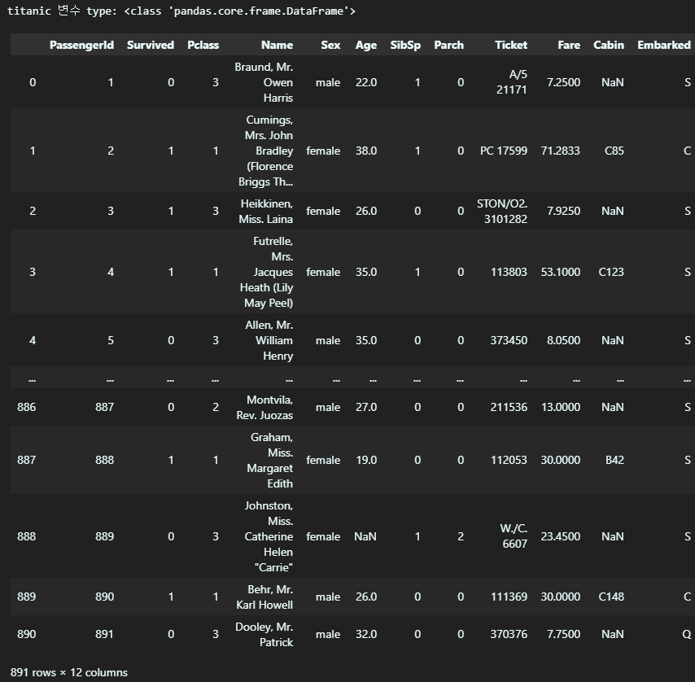
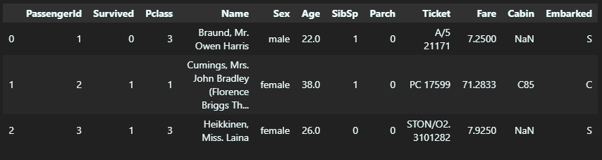
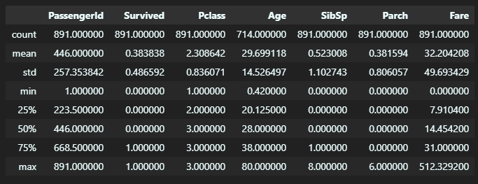
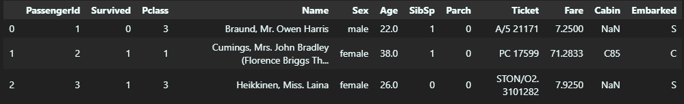
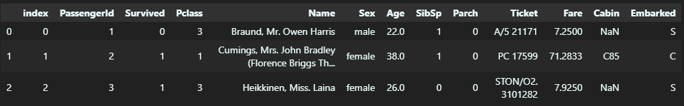
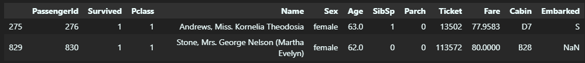
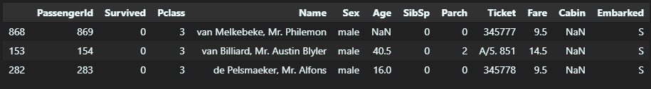
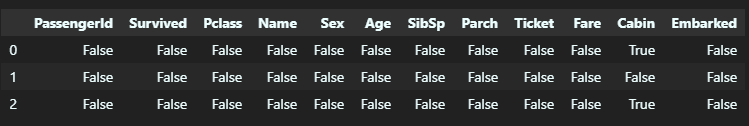

Chapter 1 의 이전 내용은 [이전 글](https://kunheekimkr.github.io/ML/chapter1-1/) 을 확인해 주세요!

## 4. 판다스 (Pandas)

판다스는 파이썬의 데이터 핸들링 라이브러리입니다. 데이터를 2차원의 `DataFrame` 객체로 변환하여 각종 데이터 핸들링을 수행할 수 있습니다.

### 4.1 판다스 시작 - 파일을 DataFrame으로 로딩, 기본 API

`Pandas` 패키지를 사용하기 위해서 다음과 같이 `Pandas`를 임포트합니다.

```python
import pandas as pd
```

판다스 사용법을 익히기 위해 데이터로 캐글의 타이타닉 탑승자 데이터 파일을 사용할 것입니다. 데이터는 [링크](https://www.kaggle.com/c/titanic/data)를 통해 다운받을 수 있습니다.

가장 먼저 해야 할 일은 불러온 저장한 데이터를 불러와 `DataFrame` 의 형태로 변환시키는 것입니다. 데이터의 확장자에 따라 판다스의 `read_csv()`, `read_table()`, `read_fwf()` 등의 API 중에 골라 사용하면 됩니다. 함수인자로는 데이터 파일의 경로가 주어집니다.

저장한 타이타닉 탑승자 데이터 파일을 불러와보겠습니다.

```python
titanic_df = pd.read_csv('titanic_train.csv')
print('titanic 변수 type:', type(titanic_df))
titanic_df
```

[실행결과]

불러온 데이터 titanic_df 는 `DataFrame` type 임을 알 수 있습니다. 891개의 행과 12개의 열로 구성되어 있으며, 상위 5행과 하위 5행의 값을 살펴볼 수 있습니다.

이처럼 불러온 데이터는 매우 크기 때문에 그 값을 모두 확인하는 것은 효율적이지 못합니다. 따라서 불러온 데이터의 구성을 살펴보기 위해 판다스의 다양한 매서드들을 사용해 볼 수 있습니다.

`head()` 매서드는 주어진 함수인자 n 에 대해 상위 n 행을 출력합니다. `shape()` 매서드는 행과 열의 개수를 튜플의 형태로 반환합니다. `info()` 매서드는 각 열별 데이터의 건수와 데이터 타입, `Null` 데이터의 개수를 표시하여 줍니다. `describe()` 매서드는 각 열의 평균값, 최댓값, 최솟값, 표준편차 등의 통계적인 정보를 제공합니다. 타이타닉 탑승자 데이터에 다음 매서드들을 적용해봅시다.

```python
titanic_df.head(3)
```

[실행결과]


```python
print('Dataframe 의 크기: ', titanic_df.shape)

titanic_df.info()
```

[실행결과]

```
Dataframe 의 크기:  (891, 12)
<class 'pandas.core.frame.DataFrame'>
RangeIndex: 891 entries, 0 to 890
Data columns (total 12 columns):
 #   Column       Non-Null Count  Dtype
---  ------       --------------  -----
 0   PassengerId  891 non-null    int64
 1   Survived     891 non-null    int64
 2   Pclass       891 non-null    int64
 3   Name         891 non-null    object
 4   Sex          891 non-null    object
 5   Age          714 non-null    float64
 6   SibSp        891 non-null    int64
 7   Parch        891 non-null    int64
 8   Ticket       891 non-null    object
 9   Fare         891 non-null    float64
 10  Cabin        204 non-null    object
 11  Embarked     889 non-null    object
dtypes: float64(2), int64(5), object(5)
memory usage: 83.7+ KB
```

```python
titanic_df.describe()
```

[실행결과]


한 열의 데이터의 분포를 살펴보고 싶을 때는 그 행을 따로 분리하여 `Series`의 형태로 만든 다음, `.value_counts()` 매서드를 통해 각 값의 개수를 세주면 됩니다. 타이타닉 탑승자 데이터에서 `Pclass` 열의 데이터 분포를 살펴봅시다.

```python
value_counts = titanic_df['Pclass'].value_counts()
print(value_counts)
```

[실행결과]

```
3    491
1    216
2    184
Name: Pclass, dtype: int64
```

Pclass 값이 3 인 행이 491개, 1인 행이 216개, 2인 행이 184개 존재한다는 것을 알 수 있습니다.

### 4.2 DataFrame 과 리스트, 딕셔너리, 넘파이 ndarray 상호변환

데이터의 가공을 위해 `DataFrame`을 다양한 데이터형으로 변환하여 사용하고, 다양한 데이터형을 다시 `DataFrame` 으로 변환시킬 수 있습니다.

### 4.2.1 넘파이 ndarray, 리스트, 딕셔너리를 DataFrame으로 변환하기

`DataFrame`의 특징은 리스트와 넘파이 `ndarray`와 다르게 칼럼명을 가지고 있다는 점입니다. 넘파이 ndarray, 리스트를 `DataFrame` 으로 변환시켜 줄 때는 `pd.DataFrame()` 매서드를 사용하고, 인자로 사용할 칼럼명들을 넘겨주면 됩니다. 딕셔너리를 `DataFrame` 으로 변환시켜줄 때는 저절로 딕셔너리의 키가 칼럼명으로 변환됩니다.
주의하여야 할 점은 `DataFrame`은 2차원이기 때문에 2차원 이하의 리스트와 `ndarray` 만 `DataFrame`으로 변환이 가능합니다.

```python
import numpy as np
import pandas as pd
col_name=['col1', 'col2', 'col3']

list = [[1,2,3,],[4,5,6]]
array = np.array(list)
dict = {'col1': [1, 4], 'col2': [2, 5], 'col3': [3, 6]}

print('2차원 리스트로 만든 DataFrame:\n', pd.DataFrame(list, columns= col_name))
print('2차원 ndarray로 만든 DataFrame:\n', pd.DataFrame(array, columns= col_name))
print('Dictionary 로 만든 DataFrame:\n', pd.DataFrame(dict))
```

[실행결과]

```
2차원 리스트로 만든 DataFrame:
    col1  col2  col3
0     1     2     3
1     4     5     6
2차원 ndarray로 만든 DataFrame:
    col1  col2  col3
0     1     2     3
1     4     5     6
Dictionary 로 만든 DataFrame:
    col1  col2  col3
0     1     2     3
1     4     5     6
```

### 4.2.2 넘파이 ndarray, 리스트, 딕셔너리를 DataFrame으로 변환하기

`values` 매서드를 사용하면 쉽게 `DataFrame` 을 `ndarray` 로 변환시킬 수 있습니다. 이렇게 변환된 `ndarray` 를 다시 `tolist()` 매서드를 통해 리스트로 변환시켜 사용할 수 있습니다. `DataFrame` 을 딕셔너리로 변환시키기 위해서는 바로 `to_dict()`매서드를 사용하면 됩니다.

```python
data = {'col1': [1, 4], 'col2': [2, 5], 'col3': [3, 6]}
dataframe = pd.DataFrame(data)

array = dataframe.values
print("array의 타입:",type(array))
print(array)

list = dataframe.values.tolist()
print("array의 타입:",type(list))
print(list)

dict = dataframe.to_dict()
print("array의 타입:",type(dict))
print(dict)
```

[실행결과]

```
array의 타입: <class 'numpy.ndarray'>
[[1 2 3]
 [4 5 6]]
array의 타입: <class 'list'>
[[1, 2, 3], [4, 5, 6]]
array의 타입: <class 'dict'>
{'col1': {0: 1, 1: 4}, 'col2': {0: 2, 1: 5}, 'col3': {0: 3, 1: 6}}
```

### 4.3 DataFrame 과 리스트, 딕셔너리, 넘파이 ndarray 상호변환

`[]` 연산자를 활용하여 `DataFrame` 의 칼럼 데이터 세트 생성과 수정을 쉽게 할 수 있습니다. 다음과 같은 예시를 살펴봅시다.

```python
titanic_df['Age_by_10']= titanic_df['Age']*10
titanic_df['Family_No']= titanic_df['SibSp'] + titanic_df['Parch'] +1
titanic_df.head(3)
```

[실행결과]


기존 칼럼들의 데이터를 가공하여 새로운 칼럼 `Age` 와 `Family_No` 가 만들어지는 것을 확인할 수 있습니다.

### 4.3 DataFrame 데이터 삭제

`DataFrame` 에서 데이터를 삭제하기 위해서는 `drop()` 매서드를 사용합니다. `drop()` 매서드의 원형은 다음과 같습니다.

```python
DataFrame.drop(labels=None, axis=0, index=None, columns=None, level=None, inplace=False, errors='raise')
```

가장 중요한 파라미터는 `labels`, `axis`, 그리고 `inplace` 입니다.

`axis` 는 축의 방향을 지정하는 파라미터로, 값이 0 일 경우 로우 방향 축, 1일 경우 칼럼 방향 축으로 데이터를 삭제합니다. `labels` 파라미터는 제거할 데이터의 인덱스를 지정합니다.

`inplace` 는 원본 `DataFrame`에서 삭제를 수행할지를 지정하는 코드입니다. `inplace` 의 값이 False 로 지정되었다면, 원본에서는 삭제를 수행하지 않고, 삭제가 수행된 결과의 새로운 `DataFrame`을 결과값으로 리턴합니다. 반면 `inplace` 의 값이 True 로 지정되었다면, 원본에서는 삭제를 수행합니다.

```python
titanic_drop_df = titanic_df.drop(['Age_by_10', 'Family_No'], axis=1)
titanic_drop_df.head(3)
```

[실행결과]

실행 결과 `Age_by_10` 칼럼과 `Family_No` 칼럼이 삭제된 새로운 데이터셋이 생성된 것을 확인할 수 있습니다.

```python
titanic_df.drop([0,1,2], axis=0, inplace=True)
titanic_df.head(3)
```

[실행결과]

실행 결과 원본 `dataFrame`에서 3개의 행이 삭제된 새로운 데이터셋이 생성된 것을 확인할 수 있습니다. 이때 위에서 `inplace=False` 로 칼럼들을 삭제하였기 떄문에 아직 `Age_by_10` 칼럼과 `Family_No`칼럼이 남아있다는 사실도 확인할 수 있습니다. 또, `inplace=True` 로 매서드를 사용할 때에는 반환 값이 없기 때문에 반환 값을 다시 자신에게 할당하지 않고 매서드를 호출해야 한다는 것도 확인할 수 있습니다.

### 4.4 Index 객체

`index` 매서드를 통해 `DataFrame` 또는 `Series` 를 1차원 넘파이 `ndarray`의 형태로 추출할 수 있습니다. 단, Index 객체의 값은 함부로 변경 할 수 없다는 특징을 갖습니다.

```python
titanic_df = pd.read_csv('titanic_train.csv')
indexes= titanic_df.index
print(indexes)
print('Index 객체 array 값:\n', indexes.values)
```

[실행 결과]

```
RangeIndex(start=0, stop=891, step=1)
Index 객체 array 값:
 [  0   1   2   3   4   5   6   7   8   9  10  11  12  13  14  15  16  17
  18  19  20  21  22  23  24  25  26  27  28  29  30  31  32  33  34  35
    ...
 882 883 884 885 886 887 888 889 890]
```

연산으로 Index의 구성에 변화가 생겼을 시, `reset_index()` 매서드를 수행하면 새롭게 인덱스를 연속 숫자 형으로 할당하고 기존 인덱스를 `index` 라는 새로운 칼럼 명으로 추가할 수 있습니다.

```python
titanic_reset_df= titanic_df.reset_index(inplace= False)
titanic_reset_df.head(3)
```

[실행결과]


### 4.5 데이터 셀렉션 및 필터링

### 4.5.1 DataFrame의 [] 연산자

넘파이에서 `[]` 연산자를 활용한 것과 유사하게 판다스에서도 데이터 추출을 할 수 있습니다. 단, `DataFrame`에서는 [] 칼럼 명 문자 또는 인덱스로 변환 가능한 표현식만 들어갈 수 있습니다.

```python
print('단일 칼럼 데이터 추출:\n',titanic_df['Pclass'].head(3))
print('\n여러 칼럼 데이터 추출:\n',titanic_df[['Survived','Pclass']].head(3))
```

[실행 결과]

```
단일 칼럼 데이터 추출:
 0    3
1    1
2    3
Name: Pclass, dtype: int64

여러 칼럼 데이터 추출:
    Survived  Pclass
0         0       3
1         1       1
2         1       3
```

다음과 같이 불린 인덱싱을 사용하는 것도 가능합니다.

```python
titanic_df[ titanic_df['Pclass'] ==3]
```

[실행 결과]


### 4.5.2 DataFrame ix[] 연산자

(생략)

### 4.5.3 명칭 기반 인덱싱과 위치 기반 인덱싱 구분

(생략)

위 두개의 단원은 생략합니다. `ix[]` 연산자는 데이터를 추출할 때 숫자를 이용한 칼럼의 위치 기반 인덱싱 구분을 지원하지만, 이로 인해 숫자가 행 인덱스와 칼럼 인덱스 중 어떤 것을 의미하는지 구분하기 어려워 코드의 가독성을 떨어뜨립니다. 이를 개선하기 위해 아래에 설명할 `iloc[]` 과 `loc[]` 연산자를 주로 사용합니다.

### 4.5.4 DataFrame iloc[] 연산자

`iloc[]` 는 위치 기반 인덱싱만 허용하기 때문에 행과 열 값으로 `integer` 값을 입력해 주어야 합니다.

```python
titanic_df.iloc[0, 0:3]
```

[실행 결과]

```
PassengerId    1
Survived       0
Pclass         3
Name: 0, dtype: object
```

위의 예시에서는 인덱스가 0 인 첫 행의 0~2번 칼럼의 값을 출력하는 것을 확인할 수 있습니다.

### 4.5.4 DataFrame loc[] 연산자

`loc[]` 는 명칭 기반 인덱싱만 허용하기 때문에 칼럼 값으로 칼럼의 명칭을 입력해 주어야 합니다.

```python
titanic_df.loc[0:2, ['Pclass','Name']]
```

[실행 결과]

```
	Pclass	Name
0	3	Braund, Mr. Owen Harris
1	1	Cumings, Mrs. John Bradley (Florence Briggs Th...
2	3	Heikkinen, Miss. Laina
```

위의 예시에서는 인덱스가 0~2인 행의 `Pclass`와 `Name` 칼럼의 값을 출력하는 것을 확인할 수 있습니다.

### 4.5.5 불린 인덱싱

데이터 필터링을 위해 불린 인덱싱을 사용할 수 있습니다.

```python
titanic_df[(titanic_df['Age'] > 60) & (titanic_df['Pclass'] == 1) & (titanic_df['Sex'] =='female')]
```

[실행 결과]


불린 인덱싱을 통해 나이가 60 이상이고, `Pclass` 가 1이며, 성별이 여성인 조건을 만족하는 행 두 개만 필터링하는 것을 확인할 수 있습니다.

## 4.6 정렬, Aggregation, GroupBy 적용

### 4.6.1 DataFrame, Series의 정렬 - sort_values()

`DataFrame` 과 `Series`를 정렬하기 위해서는 `sort_values()` 매서드를 사용합니다. `sort_values()` 매서드는 파라미터로 `by`,`ascending`,`inplace`를 받습니다. `by`로 칼럼을 입력하면 해당 칼럼으로 정렬을 수행합니다. `ascending` 이 true 라면 오름차순, false라면 내림차순으로 정렬을 수행하며 기본값은 true입니다. `inplace`가 true라면 원본 데이터에 정렬을 적용하며, false라면 정렬이 적용된 데이터셋을 새로 생성하여 리턴하며 기본값은 false입니다.

```python
titanic_sorted = titanic_df.sort_values(by=['Pclass', 'Name'], ascending=False)
titanic_sorted.head(3)
```

[실행 결과]


`Pclass` 와 `Name` 을 기준으로 정렬된 결과를 확인할 수 있습니다.

### 4.6.2 Aggregation 함수 적용

`min()`, `max()`, `sum()`, `count()`와 같은 aggregation 함수도 쉽게 적용할 수 있습니다. 이때 `DataFrame`에 함수를 적용하면 모든 칼럼의 결과를 반환하고, 특정 칼럼의 결과만 얻기 위해서는 특정 칼럼만 추출해 함수를 적용하면 됩니다.

```python
titanic_df[['Age', 'Fare']].mean()
```

[실행 결과]

```
Age     29.699118
Fare    32.204208
dtype: float64
```

### 4.6.3 groupby() 적용

특정 칼럼의 값을 기준으로 다른 데이터들을 분석하고 싶다면 `groupby()`를 사용하면 됩니다. `DataFrame` 에 `groupby(by = '칼럼명')` 을 적용시켬 원하는 칼럼의 값을 기준으로 그룹이 나누어진 새로운 `DataFrame Groupby` 객체가 반환됩니다. 새로운 객체에 Aggergation 함수들을 적용시켜 데이터를 분석할 수 있습니다. 여러 개의 Aggergation 함수를 적용한 결과를 확인하고 싶을 때에는 `.agg()` 매서드를 적용하여 인자로 사용할 함수들의 이름을 제공하면 됩니다.

```python
titanic_groupby = titanic_df.groupby(by='Pclass')
titanic_groupby['Age'].agg([min, max])
```

[실행 결과]

```
	min	max
Pclass
1	0.92	80.0
2	0.67	70.0
3	0.42	74.0
```

`Pclass` 값에 따라 `Age` 값의 최솟값과 최댓값을 확인할 수 있습니다.

만약 여러 칼럼에 대하야 각 칼럼마다 다른 aggregation 함수를 적용하고 싶다면 각각의 칼럼에 사용할 함수를 딕셔너리로 만든 다음에 `agg`의 함수 인자로 전달하면 됩니다.

```python
titanic_groupby = titanic_df.groupby(by='Pclass')
agg_format = {'Age' : 'max', 'SibSp':'sum', 'Fare':'mean'}
titanic_groupby.agg(agg_format)
```

[실행 결과]

```
	Age	SibSp	Fare
Pclass
1	80.0	90	84.154687
2	70.0	74	20.662183
3	74.0	302	13.675550
```

`Pclass` 값에 따라 `Age`의 최댓값, `SibSp`의 합, `Fare`의 평균값을 확인할 수 있습니다.

## 4.7 결손 데이터 처리하기

판다스는 머신 러닝 알고리즘에서 처리되지 않는 NaN 값의 결손 데이터를 다른 값으로 대체하기 위해 결손 여부를 확인하는 `isna()`와 결손값을 대체하는 `fillna()`을 제공합니다.

### 4.7.1 isna()로 결손 데이터 여부 확인

`DataFrame`에 `isna()`를 수행하면 모든 칼럼의 값이 NaN인지 아닌지를 True 또는 False의 형태로 제공합니다.

```python
titanic_df.isna().head(3)
```

[실행 결과]



### 4.7.2 fillna()로 결손 데이터 대체하기

`DataFrame`의 칼럼에 `fillna()`를 적용하여 결손 데이터를 편리하게 다른 값으로 대체할 수 있습니다.

```python
titanic_df['Cabin'] = titanic_df['Cabin'].fillna('C000')
titanic_df['Age'] = titanic_df['Age'].fillna(titanic_df['Age'].mean())
titanic_df['Embarked'] = titanic_df['Embarked'].fillna('S')

titanic_df.isna().sum()
```

[실행 결과]

```
PassengerId    0
Survived       0
Pclass         0
Name           0
Sex            0
Age            0
SibSp          0
Parch          0
Ticket         0
Fare           0
Cabin          0
Embarked       0
dtype: int64
```

결측값이 존재하는 칼럼을 각각 `fillna()`를 통해 결측치를 대체한 다음, `isna()`를 활용하여 더 이상 결측치가 없다는 것을 확인할 수 있습니다.

## 4.8 apply lambda 식으로 데이터 가공

복잡한 데이터 가공의 경우 `apply` 를 통해 파이썬의 lambda 식을 활용할 수 있습니다.
lambda 식은 다음과 같이 구성됩니다.

```python
lamda (입력 인자) : (입력 인자를 기반으로 한 계산식)
```

다음 예시를 한번 살펴봅시다.

```python
titanic_df['Name_len'] = titanic_df['Name'].apply(lambda x : len(x))

titanic_df[['Name', 'Name_len']].head(3)
```

[실행 결과]

```
	Name	Name_len
0	Braund, Mr. Owen Harris	23
1	Cumings, Mrs. John Bradley (Florence Briggs Th...	51
2	Heikkinen, Miss. Laina	22
```

다음과 같이 람다 식을 활용하여 이름의 길이를 나타내는 새로운 칼럼을 만들어 줄 수 있습니다.

람다 식을 사용할 경우 주의하여야 할 점은 `if else` 문을 사용할 때에는, `if` 문의 리턴 값이 `if` 보다 먼저 나와야 하며 `elif` 는 사용이 불가능하다는 점입니다.

다음 예시를 살펴봅시다.

```python
titanic_df['Age_cat'] = titanic_df['Age'].apply(lambda x: 'chlid' if x<=15 else ('Adult' if x <= 60 else 'Elderly'))

titanic_df['Age_cat'].value_counts()
```

[실행 결과]

```
Adult      786
chlid       83
Elderly     22
Name: Age_cat, dtype: int64
```

`Age` 칼럼의 값을 기준으로 `Age_cat`이라는 새로운 칼럼을 만들 때 `lambda` 식을 사용하는 예시입니다. 이때 리턴값 `child` 가 if 문 앞에 온다는 점과, `elif` 를 사용할 수 없기 때문에 `else` 뒤에 괄호를 이용해 `if else` 문을 한번 더 사용한다는 점을 확인할 수 있습니다.

따라서 연산 내용이 길어질 경우 해당 부분을 함수로 따로 분리하여 작성한 다음 람다 식에 함수를 적용하는 것이 가독성이 더 좋을 수도 있습니다.
