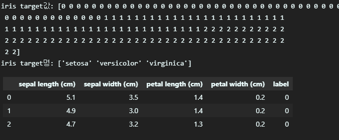
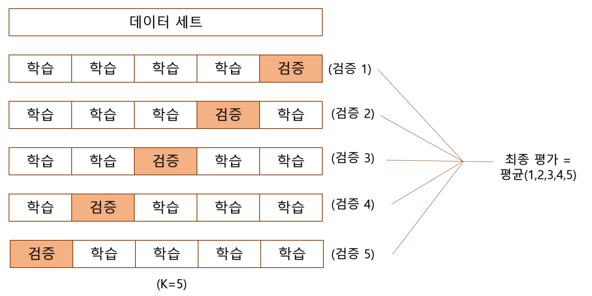
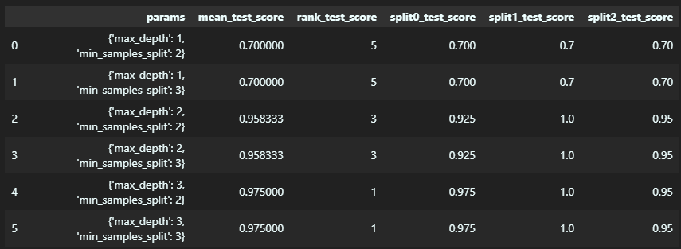

## 1. 사이킷런 소개와 특징

`사이킷런(Scikit-learn)`은 가장 많이 사용되는 파이썬 머신 러닝 라이브러리입니다. 이 책은 사이킷런을 기반으로 하여 다양한 머신 러닝 모델을 작성하는 것을 가르치고 있습니다.

## 2. 첫 번째 머신러닝 만들어 보기 - 붓꽃 품종 예측하기

사이킷런을 통해 첫 번째로 만들어볼 머신러닝 모델은 붓꽃 꽃잎의 길이와 너비, 꽃받침의 길이와 너비 피처를 기반으로 꽃의 품종을 예측하는 분류 모델 입니다.

우선 필요한 모듈들을 임포트합니다. 붓꽃 데이터 세트를 생성하고 학습 데이터와 테스트 데이터로 분리하고 의사 결정트리를 사용하기 위해 다음과 같이 필요한 모듈을 임포트합니다.

```python
from sklearn.datasets import load_iris
from sklearn.tree import DecisionTreeClassifier
from sklearn.model_selection import train_test_split
```

`load_iris()` 함수를 통해 붓꽃 데이터 세트를 로딩한 후 `DataFrame` 으로 변환하여 데이터를 분석합니다.

```python
#데이터 분석을 위해 pandas 사용
import pandas as pd

#붓꽃 데이터셋 로딩
iris=load_iris()

#피쳐 데이터와 레이블 데이터를 서로 분리
iris_data=iris.data
iris_label=iris.target
print('iris target값:', iris_label)
print('iris target명:', iris.target_names)

#붓꽃 데이터 세트를 DataFrame 으로 변환하여 분석
iris_df=pd.DataFrame(data=iris_data, columns=iris.feature_names)
iris_df['label']=iris.target
iris_df.head(3)
```

[실행 결과]


피처에는 `sepal length`, `sepal width`, `petal length`, `petal width`의 4 종류가 있으며, 레이블 데이터는 `setosa`, `versicolor`, `virginica` 의 세 가지로 각각 0, 1, 2 의 값으로 저장이 되어 있습니다.

다음으로 할 일은 붓꽃 데이터 세트를 학습용 데이터와 테스트용 데이터로 분리하는 일입니다. 테스트용 데이터를 통해 학습 데이터를 이용해 학습된 모델이 얼마나 뛰어난 성능을 가지는지 평가하기 위해서입니다.
이를 위해 `train_test_split()` 함수를 이용합니다.

```python
X_train, X_test, y_train, y_test = train_test_split(iris_data, iris_label, test_size=0.2, random_state=11)
```

확보한 데이터를 바탕으로 머신러닝 분류 알고리즘 주 하나인 의사 결정 트리를 이용해 학습과 예측을 수행해 보겠습니다. 사이킷런에서 머신러닝 알고리즘을 사용할 때에는 알고리즘에 따라 객체를 생성한 뒤, 객체의 `fit` 매서드에 학습용 피처 데이터 세트와 레이블 데이터 세트를 입력하여 호출하여 학습을 진행시킵니다.

```python
#DecisionTreeClassifier 객체 생성
dt_clf=DecisionTreeClassifier(random_state=11)

#학습 수행
dt_clf.fit(X_train, y_train)
```

학습된 모델을 기반으로 예측을 수행하기 위해서는 `predict` 메서드에 피처 데이터 세트를 입력해 호출하면 학습된 모델 기반에서 피처 데이터 세트에 대한 레이블 예측값을 반환합니다.

```python
pred=dt_clf.predict(X_test)
```

예축 결과를 기반으로 의사 결정 트리의 예측 성능을 평가해 봅시다. `sklearn.datasets` 내의 모듈은 모델의 성능을 측정하는 모듈들의 모임입니다. 이중 `accuracy_score()` 를 이용하여 정확도를 측정해 보겠습니다.

```python
from sklearn.metrics import accuracy_score
print('예측 정확도: {0:.4f}'.format(accuracy_score(y_test,pred)))
```

[실행 결과]

```
예측 정확도: 0.9333
```

실제 테스트 레이블 데이터 세트와 예측값을 비교한 결과 정확도 0.9333을 확인 할 수 있습니다.

수행한 분류 예측 프로세스를 정리하면 다음과 같습니다.

> 1. 데이터 세트 분리: 데이터를 학습 데이터와 테스트 데이터로 분리합니다.
> 2. 모델 학습: 학습 데이터를 기반으로 ML 알고리즘을 적용해 모델을 학습시킵니다.
> 3. 예측 수행: 학습된 ML 모델을 이용해 테스트 데이터의 분류를 예측합니다.
> 4. 평가: 이렇게 예측된 결과값과 테스트 데이터의 실제 결과값을 비교해 ML 모델 성능을 평가합니다.

## 3. 사이킷런의 기반 프레임워크 익히기

### 3.1. Estiamtor 이해 및 fit(), predict() 메서드

사이킷런은 지도학습의 주요 두 축인 분류와 회귀의 다양한 알고리즘을 클래스로 구현하여 사용하기 쉽게 합니다. 분류 알고리즘을 구현한 클래스는 `Classifier`, 회귀 알고리즘을 구현한 클래스는 `Regressor`로 지칭하며, 이들을 합쳐 `Estimator` 클래스라고 부릅니다. 이들은 `fit()` 과 `predict()` 매서드를 통해 간단하게 학습과 예측을 합니다. `cross_val_score` 와 같은 평가 함수나, `GridSearchCV`와 같은 하이퍼 파라미터 튜닝을 지원하는 클래스는 이 `Estimator` 클래스를 인자로 받아 주어진 역할을 수행합니다.

사이킷런은 비지도학습인 차원 축소, 클러스터링, 피처 추출 등도 클래스로 구현하여 사용하기 쉽게 합니다. 이러한 클래스는 입력 데이터의 형테에 맞춰 데이터를 변환하기 위한 사전 구조 작업인 `fit()` 과, 입력 데이터의 차원 변환, 클러스터링, 피처 추출 등 작업을 수행하는 `transform()` 매서드를 사용해 비지도학습을 쉽게 수행할 수 있도록 합니다.

### 3.2. 사이킷런의 주요 모듈

| 분류                              | 모듈명                       | 설명                                                                      |
| --------------------------------- | ---------------------------- | ------------------------------------------------------------------------- |
| 예제 데이터                       | `sklearn.datasets`           | 예제 데이터세트                                                           |
| 피처 처리                         | `sklearn.preprocessing`      | 데이터 전처리에 필요한 가공 기능                                          |
| 피처 처리                         | `sklearn.feature_selection`  | 알고리즘에 큰 영향을 미치는 피처를 우선순위대로 선택                      |
| 피처 처리                         | `sklearn.feature_extraction` | 텍스트 데이터나 이미지 데이터의 벡터화된 피처 추출                        |
| 피처 처리 & 차원 축소             | `sklearn.decomposition`      | 차원 축소와 관련된 알고리즘                                               |
| 데이터 분리, 검증 & 파라미터 튜닝 | `sklearn.model_selection`    | 교차 검증을 위한 학습용/테스트용 분리, 그리드 서치로 최적 파라미터 추출   |
| 평가                              | `sklearn.metrics`            | 다양한 성능 측정 방법 제공                                                |
| ML 알고리즘                       | `sklearn.ensemble`           | 앙상블 알고리즘                                                           |
| ML 알고리즘                       | `sklearn.linear_model`       | 선형 회귀, 릿지, 라쏘, 로지스틱 회귀 등 회귀 관련 알고리즘 제공           |
| ML 알고리즘                       | `sklearn.naive_bayes`        | 나이브 베이즈 알고리즘                                                    |
| ML 알고리즘                       | `sklearn.neighbors`          | 최근접 이웃 알고리즘 알고리즘                                             |
| ML 알고리즘                       | `sklearn.svm`                | 서포트 벡터 머신 알고리즘                                                 |
| ML 알고리즘                       | `sklearn.tree`               | 의사 결정 트리 알고리즘                                                   |
| ML 알고리즘                       | `sklearn.cluster`            | 비지도 클러스터링 알고리즘                                                |
| 유틸리티                          | `sklearn.pipeline`           | 피처 처리 등 변환과 ML 알고리즘 학습, 예측을 묶어 실행할 수 있는 유틸리티 |

### 3.3. 사이킷런의 주요 모듈

(생략)

## 4. Model Selection 모듈 소개

### 4.1. 학습/테스트 데이터 세트 분리 - train_test_split()

학습과 예측을 동일한 데이터 세트로 수행하게 되면, 이미 학습한 데이터 세트를 기반으로 예측하기 때문에 정확도가 100%가 나오는 문제가 발생합니다. 이러한 문제를 해결하기 위해 사이킷런의 `train_test_split()` 을 통해 원본 데이터 세트에서 학습 및 테스트 데이터 세트를 쉽게 분리할 수 있습니다. 파라미터로 피처 데이터 세트와 레이블 데이터 세트를 입력받습니다. 선택적으로, 테스트 데이터 세트의 비율, 데이터를 섞을지, 난수 발생 값을 사용합니다. 다음 예제를 살펴봅시다.

```python
from sklearn.tree import DecisionTreeClassifier
from sklearn.metrics import accuracy_score
from sklearn.datasets import load_iris
from sklearn.model_selection import train_test_split

dt_clf = DecisionTreeClassifier()
iris_data = load_iris()
X_train, X_test, y_train, y_test = train_test_split(iris_data.data, iris_data.target, test_size=0.3, random_state=121)

dt_clf.fit(X_train, y_train)
pred= dt_clf.predict(X_test)
print('예측 정확도: {0:.4f}'.format(accuracy_score(y_test,pred)))
```

[실행결과]

```
예측 정확도: 0.9556
```

전체 데이터 세트의 30%를 테스트 데이터로, 70%를 학습 데이터로 분리한 뒤 학습시킨 모델의 예측 정확도를 확인할 수 있습니다.

### 4.2. 교차 검증

모델이 학습 데이터에만 과도하게 최적화되어 실제 예측을 다른 데이터로 수행할 경우 예측 성능이 과도하게 떨어지는 과적합 현상을 막기 위해, 여러 개의 학습 데이터 세트와 테스트 데이터 세트에 대해 학습과 평가를 수행하는 교차 검증이 효율적일 수 있습니다.

#### 4.3.1. K 폴드 교차 검증

K폴드 교차 검증은 전체 데이터 세트를 K개의 데이터 폴드 세트로 만든 다음, 각 폴드 세트에 학습과 검증 평가를 반복적으로 수행하는 방법입니다.


예를 들어, k=5 일때는 그림과 같이 데이터 세트를 5개로 나눈 뒤 그 중 1개를 검증, 나머지 4개를 학습에 사용하는 것을 5회 반복한 후 각 결과를 평균 내어 평가 결과로 반영하면 됩니다.

사이킷런의 KFold 클래스를 이용해 교차 검증을 쉽게 할 수 있습니다. 다음 예시를 살펴봅시다.

```python
from sklearn.datasets import load_iris
from sklearn.tree import DecisionTreeClassifier
from sklearn.metrics import accuracy_score
from sklearn.model_selection import KFold
import numpy as np


iris=load_iris()
features=iris.data
label=iris.target
dt_clf=DecisionTreeClassifier(random_state=156)

#5개의 폴드 세트로 분리하는 KFold 객체와 폴드 세트별 정확도를 담을 리스트 객체 생성
kfold = KFold(n_splits=5)
cv_accuracy = []

n_iter=0

# KFold 객체의 split()를 호출하면 폴드별 학습용, 검증용 테스트의 로우 인덱스를 array로 변환
for train_index, test_index in kfold.split(features):

    #kfold.split()으로 반환된 인덱스를 이용해 학습용, 검증용 테스트 데이터 추출
    X_train, X_test = features[train_index], features[test_index]
    y_train, y_test = label[train_index], label[test_index]

    #학습 및 예측
    dt_clf.fit(X_train, y_train)
    pred=dt_clf.predict(X_test)
    n_iter += 1

    #정확도 측정
    accuracy=np.round(accuracy_score(y_test, pred),4)
    train_size=X_train.shape[0]
    test_size=X_test.shape[0]
    print('\n#{0} 교차 검증 정확도 :{1}, 학습 데이터 크기: {2}, 검증 데이터 크기: {3}'.format(n_iter, accuracy, train_size, test_size))
    cv_accuracy.append(accuracy)

#평균 정확도 계산
print('\n## 평균 검증 정확도:', np.mean(cv_accuracy))
```

[실행 결과]

```

#1 교차 검증 정확도 :1.0, 학습 데이터 크기: 120, 검증 데이터 크기: 30

#2 교차 검증 정확도 :0.9667, 학습 데이터 크기: 120, 검증 데이터 크기: 30

#3 교차 검증 정확도 :0.8667, 학습 데이터 크기: 120, 검증 데이터 크기: 30

#4 교차 검증 정확도 :0.9333, 학습 데이터 크기: 120, 검증 데이터 크기: 30

#5 교차 검증 정확도 :0.7333, 학습 데이터 크기: 120, 검증 데이터 크기: 30

## 평균 검증 정확도: 0.9
```

전체 데이터 세트 150 개를 5등분 하였으므로 120개의 학습 데이터와 30개의 검증 데이터로 학습과 검증이 진행되는 것을 확인할 수 있습니다. 학습 데이터와 검증 데이터가 변하기 때문에 매번 검증 정확도가 달라지며, 교차 검증 정확도의 평균으로 전체 정확도를 측정할 수 있습니다.

#### 4.3.2. Stratified K 폴드

Stratified K 폴드는 특정 레이블 값이 특이하게 많거나 매우 적어 값의 분포가 한쪽으로 치우치는 불균형한 분포도를 가진 레이블 데이터 집합을 위한 K 폴드 방식입니다. Stratified K 폴드는 원본 데이터의 레이블 분포를 먼저 고려한 뒤, 이 분포와 동일하게 학습과 검증 데이터 세트를 분배합니다.

우선 붓꽃 데이터 세트에서 레이블 값의 분포도를 확인합시다.

```python
import pandas as pd

iris = load_iris()
iris_df = pd.DataFrame(data = iris.data, columns = iris.feature_names)
iris_df['label'] = iris.target
iris_df['label'].value_counts()
```

[실행 결과]

```
0    50
1    50
2    50
Name: label, dtype: int64
```

확인 결과 레이블 값은 0, 1, 2 모두 50개로 동일합니다. `StratifiedKFold` 를 수행하고 각 교차 검증에서 학습과 검증 레이블데이터의 분포를 살펴보겠습니다. 이때 주의하여야 할 점은 `StratifiedKFold` 를 사용할 때는 `split()` 매서드의 인자로 피처 데이터 세트 뿐만 아니라 레이블 데이터 세트도 반드시 필요하다는 사실입니다.

```python
from sklearn.model_selection import StratifiedKFold

skf = StratifiedKFold(n_splits=3)
n_iter=0

for train_index, test_index in skf.split(iris_df, iris_df['label']):
    n_iter+=1
    label_train = iris_df['label'].iloc[train_index]
    label_test = iris_df['label'].iloc[test_index]
    print('## 교차 검증: {0}'.format(n_iter))
    print('학습 레이블 데이터 분포:\n', label_train.value_counts())
    print('검증 레이블 데이터 분포:\n', label_test.value_counts())
```

[실행 결과]

```
## 교차 검증: 1
학습 레이블 데이터 분포:
 2    34
0    33
1    33
Name: label, dtype: int64
검증 레이블 데이터 분포:
 0    17
1    17
2    16
Name: label, dtype: int64
## 교차 검증: 2
학습 레이블 데이터 분포:
 1    34
0    33
2    33
Name: label, dtype: int64
검증 레이블 데이터 분포:
 0    17
2    17
1    16
Name: label, dtype: int64
## 교차 검증: 3
학습 레이블 데이터 분포:
 0    34
1    33
2    33
Name: label, dtype: int64
검증 레이블 데이터 분포:
 1    17
2    17
0    16
Name: label, dtype: int64
```

`StratifiedKFold` 를 사용하면 학습 레이블과 검증 레이블 데이터 값의 분포도가 동일하게 할당되었음을 확인할 수 있습니다. 이를 활용하여 붓꽃 데이터를 교차 검증하면 다음과 같습니다.

```python
from sklearn.datasets import load_iris
from sklearn.tree import DecisionTreeClassifier
from sklearn.metrics import accuracy_score
from sklearn.model_selection import StratifiedKFold
import numpy as np

iris=load_iris()
features=iris.data
label=iris.target
dt_clf=DecisionTreeClassifier(random_state=156)

skf = StratifiedKFold(n_splits=3)
n_iter=0
cv_accuracy=[]

for train_index, test_index in skf.split(features, label):
    X_train, X_test = features[train_index], features[test_index]
    y_train, y_test = label[train_index], label[test_index]

    dt_clf.fit(X_train, y_train)
    pred=dt_clf.predict(X_test)

    n_iter += 1
    accuracy=np.round(accuracy_score(y_test, pred), 4)
    train_size=X_train.shape[0]
    test_size=X_test.shape[0]
    print('\n#{0} 교차 검증 정확도 :{1}, 학습 데이터 크기: {2}, 검증 데이터 크기: {3}'.format(n_iter, accuracy, train_size, test_size))
    cv_accuracy.append(accuracy)

print('\n## 교차 검증별 정확도:', np.round(cv_accuracy, 4))
print('## 평균 검증 정확도:', np.mean(cv_accuracy))
```

[실행 결과]

```

#1 교차 검증 정확도 :0.98, 학습 데이터 크기: 100, 검증 데이터 크기: 50

#2 교차 검증 정확도 :0.94, 학습 데이터 크기: 100, 검증 데이터 크기: 50

#3 교차 검증 정확도 :0.98, 학습 데이터 크기: 100, 검증 데이터 크기: 50

## 교차 검증별 정확도: [0.98 0.94 0.98]
## 평균 검증 정확도: 0.9666666666666667
```

3 개의 `Stratified K 폴드`로 교차 검증한 결과 평균 검증 정확도가 96.7% 정도임을 확인할 수 있습니다. 왜곡된 레이블 데이터 세트에서는 반드시 `Stratified K 폴드`를 이용해 교차 검증해야 합니다.

#### 4.3.3. 교차 검증을 보다 간편하게- cross_val_score()

사이킷런은 교차 검증을 좀 더 편리하게 수행할 수 있는 `cross_val_score()` API 를 제공합니다. 다음과 같은 형태로 선언합니다.

```python
cross_val_score(estimator, X, y=None, scoring=None, cv=None, n_jobs=1, verbose=0, fit_params=None, pre_dispatch='2*n_jobs')
```

이중 주요 파라미터는 `estimator`, `X`, `y`, `scoring`, `cv` 입니다. `estimator`는 사이킷런의 분류 또는 회귀 알고리즘 클래스를 의미하며, `X`는 피처 데이터 세트, `y`는 레이블 데이터 세트, `scoring`은 예측 성능 평가 지표, `cv`는 교차 검증 폴드 수를 의미합니다. `cross_val_score()`는 실행되면 `Stratified K 폴드` 방식으로 진행한 교차 검증의 `scoring` 파라미터 성능 지표 값을 배열로 반환합니다.

```python
from sklearn.tree import DecisionTreeClassifier
from sklearn.model_selection import cross_val_score, cross_validate
from sklearn.datasets import load_iris

iris_data=load_iris()
dt_clf=DecisionTreeClassifier(random_state=156)

data=iris_data.data
label=iris_data.target

scores=cross_val_score(dt_clf,data,label,scoring='accuracy',cv=3)
print('교차 검증별 정확도:', np.round(scores,4))
print('평균 검증 정확도:', np.round(np.mean(scores),4))
```

[실행 결과]

```
교차 검증별 정확도: [0.98 0.94 0.98]
평균 검증 정확도: 0.9667
```

주어진 파라미터에 따라 3개의 교차 검증 세트로 측정한 정확도를 확인할 수 있습니다. 비슷한 API로, 여러 평가 지표에 대한 성능을 확인하고 싶을 때에는 `cross_validate()` 를 사용하면 됩니다.

#### 4.3.4. GridSearchCV - 교차 검증과 하이퍼 파라미터 튜닝을 한 번에

하이퍼 파라미터는 머신 러닝 알고리즘을 구성하는 주요 요소로, 이 값을 조정하여 예측 성능을 개선시킬 수 있습니다. 하이퍼 파라미터를 순차적으로 변경하면서 최고 성능을 가지는 파라미터 조합을 찾고자 한다면 해당 파라미터의 집합을 딕셔너리의 형태로 설정하고 `GridSearchCV` 를 사용한다면 최적의 파라미터와 수행 결과를 찾을 수 있습니다. `GridSearchCV`의 주요 파라미터는 `estimator`, 튜닝할 파라미터의 딕셔너리인 `param_grid`, `scoring`, 교차 검증 세트의 개수인 `cv`, 최적 학습 파라미터로 `estimator` 객체를 재학습시킬지의 유무를 결정하는 `refit` 이 있습니다. 다음 예시를 살펴봅시다.

```python
from sklearn.datasets import load_iris
from sklearn.tree import DecisionTreeClassifier
from sklearn.model_selection import GridSearchCV
import pandas as pd

#데이터를 로딩하고 학습과 테스트 데이터 분리
iris_data=load_iris()
X_train, X_test, y_train, y_test = train_test_split(iris_data.data, iris_data.target, test_size=0.2, random_state=121)
dtree = DecisionTreeClassifier()

#튜닝할 파라미터를 딕셔너리의 형태로 결정
parameters={'max_depth':[1,2,3], 'min_samples_split':[2,3]}

grid_dtree=GridSearchCV(dtree,param_grid=parameters, cv=3, refit=True)
grid_dtree.fit(X_train, y_train)

scores_df=pd.DataFrame(grid_dtree.cv_results_)
scores_df[['params','mean_test_score','rank_test_score','split0_test_score','split1_test_score','split2_test_score']]
```

[실행 결과]


하이퍼 파라미터 `max_depth` 와 `min_samples_split`을 각각 변화 시켜 가며 6번 학습을 시킨 후 평가 결과를 확인할 수 있습니다. 하이퍼 파라미터 값에 대해 각 폴드 평가 결과와, 전체 평균, 그리고 전체 평균의 순위를 확인할 수 있습니다.

`fit()` 을 수행하고 나면 `best_params_`, `best_score_` 속성에 최고 성능을 나타낸 파라미터와 결과값이 저장됩니다. 그 값을 알아보고 파라미터로 학습된 모델을 이용해 새로운 테스트 데이터 세트에 대한 예측 결과를 알아보겠습니다.

```python
print('GridSearchCV 최적 파라미터:',grid_dtree.best_params_)
print('GridSearchCv 최적 정확도:{0:.4f}'.format(grid_dtree.best_score_))

estimator=grid_dtree.best_estimator_

pred=estimator.predict(X_test)
print('테스트 데이터 세트 정확도: {0:.4f}'.format(accuracy_score(y_test,pred)))
```

[실행 결과]

```
GridSearchCV 최적 파라미터: {'max_depth': 3, 'min_samples_split': 2}
GridSearchCv 최적 정확도:0.9750
테스트 데이터 세트 정확도: 0.9667
```

Chapter 2 의 나머지 내용은 [다음 글](https://kunheekimkr.github.io/ML/chapter2-2/) 에서 이어서 설명하겠습니다.
