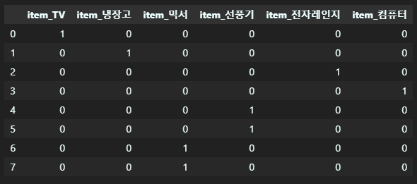

Chapter 1 의 이전 내용은 [이전 글](https://kunheekimkr.github.io/ML/chapter2-1/) 을 확인해 주세요!

## 5. 데이터 전처리

데이터 전처리 과정은 ML 알고리즘만큼 중요합니다. 사이킷런의 ML 알고리즘을 적용하기 전에 데이터에 대해 미리 처리해야할 사항이 있습니다. 우선 결손값 NaN과 Null 은 허용되지 않기 때문에 적당한 값으로 대체되거나 피처가 제거되어야 하며, 사이킷런의 머신러닝 알고리즘은 문자열 값을 입력 값으로 허용하지 않기 때문에 인코딩돼서 숫자 형으로 변환되어야 합니다.

### 5.1. 데이터 인코딩

#### 5.1.1. 레이블 인코딩

레이블 인코딩은 카테고리 피처를 코드형 숫자 값으로 변환하는 것입니다. 예를 들어 상품 구분 'TV', '냉장고', '전자레인지', '컴퓨터', '선풍기', '믹서' 가 있다면, TV:0, 냉장고:1, 전자레인지:2, 컴퓨터:3, 선풍기:4, 믹서:5 과 같은숫자 값으로 변환하는 것입니다. 이는 사이킷런의 `LabelEncoder` 클래스를 이용해 쉽게 구현이 가능합니다.

```python
from sklearn.preprocessing import LabelEncoder

items=['TV', '냉장고', '전자레인지', '컴퓨터', '선풍기', '선풍기', '믹서', '믹서']

encoder=LabelEncoder()
encoder.fit(items)
labels = encoder.transform(items)
print('인코딩 변환값:', labels)
print('인코딩 클래스:',encoder.classes_)
print('디코딩 원본값:',encoder.inverse_transform(labels))
```

[실행 결과]

```
인코딩 변환값: [0 1 4 5 3 3 2 2]
인코딩 클래스: ['TV' '냉장고' '믹서' '선풍기' '전자레인지' '컴퓨터']
디코딩 원본값: ['TV' '냉장고' '전자레인지' '컴퓨터' '선풍기' '선풍기' '믹서' '믹서']
```

`fit()` 매서드를 호출해 레이블 인코딩을 수행할 수 있습니다. `classes_` 속성에 0번부터 순서대로 변환된 인코딩 값에 대한 원본값을 가지고 있으며, `inverse_transform()`을 통해 인코딩된 값을 다시 디코딩할 수 있습니다.

레이블 인코딩은 문자열 값이 숫자형 카테고리 값으로 변환되면서 숫자 값의 크고 작음에 대한 특성이 작용하기 때문에 특정 ML 알고리즘에서 예측 성능이 떨어지는 문제가 발생할 수 있습니다. 이러한 특성 때문에 레이블 인코딩은 선형 회귀와 같은 ML 알고리즘에는 적영되지 않아야 합니다. 트리 계열의 ML 알고리즘은 숫자의 크고 작음 특성을 반영하지 않으므로 레이블 인코딩이 사용되어도 됩니다.

#### 5.1.2. 원-핫 인코딩 (One-Hot Encoding)

원-핫 인코딩은 피처 값의 유형에 따라 새로운 피처를 추가하고 고유 값에 해당하는 칼럼에만 1을 표시하고 나머지 말럼은 0을 표시하는 방식입니다. 예를 들어, 위의 예시에서 'TV', '냉장고', '전자레인지', '컴퓨터', '선풍기', '믹서' 라는 칼럼을 모두 만들어준 후, TV 인 경우에는 TV 칼럼에 1을, 나머지 칼럼에는 0을 표시하는 방식입니다. 이는 사이킷런의 `OneHotEncoder` 클래스를 이용해 쉽게 구현이 가능합니다.

```python
from sklearn.preprocessing import LabelEncoder, OneHotEncoder
import numpy as np

items=['TV', '냉장고', '전자레인지', '컴퓨터', '선풍기', '선풍기', '믹서', '믹서']

#먼저 숫자 값으로 변환을 위해 LabelEncoder로 변환
encoder=LabelEncoder()
encoder.fit(items)
labels = encoder.transform(items)
#2차원 데이터로 변환
labels = labels.reshape(-1,1)

#원-핫 인코딩 적용
oh_encoder = OneHotEncoder()
oh_encoder.fit(labels)
oh_labels=oh_encoder.transform(labels)
print('원-핫 인코딩 데이터')
print(oh_labels.toarray())
```

[실행 결과]

```
원-핫 인코딩 데이터
[[1. 0. 0. 0. 0. 0.]
 [0. 1. 0. 0. 0. 0.]
 [0. 0. 0. 0. 1. 0.]
 [0. 0. 0. 0. 0. 1.]
 [0. 0. 0. 1. 0. 0.]
 [0. 0. 0. 1. 0. 0.]
 [0. 0. 1. 0. 0. 0.]
 [0. 0. 1. 0. 0. 0.]]
```

8개의 레코드를 가진 원본 데이터와 8개의 레코드와 상품의 종류 수인 6개의 칼럼을 가진 데이터로 변환된 것을 확인할 수 있습니다.

판다스에는 원-핫 코딩을 더 쉽게 지원하는 `get_dummies()` 를 사용할 수 있습니다. 이는 `OneHotEncoder()`와는 다르게 문자열 카테고리 값을 바로 변환할 수 있다는 장점을 갖습니다.

```python
import pandas as pd

df=pd.DataFrame({'item' : ['TV', '냉장고', '전자레인지', '컴퓨터', '선풍기', '선풍기', '믹서', '믹서']})
pd.get_dummies(df)
```

[실행 결과]


### 5.2. 피처 스케일링과 정규화
