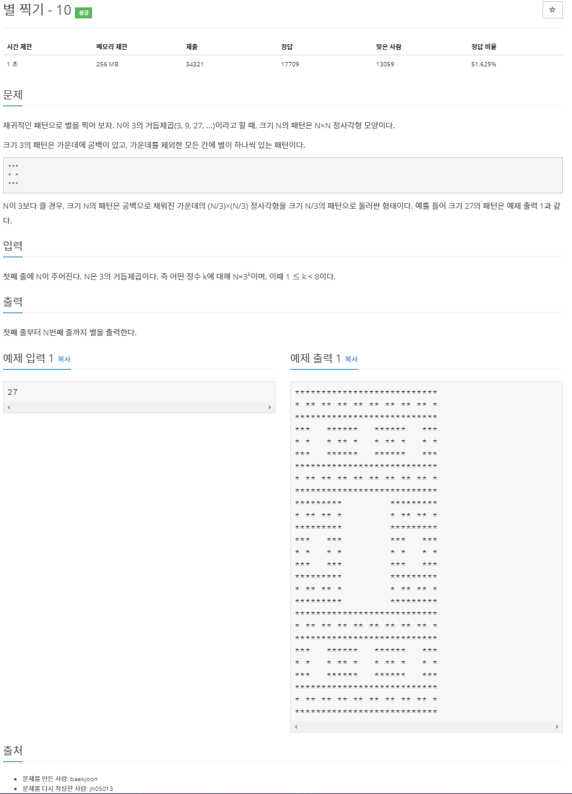
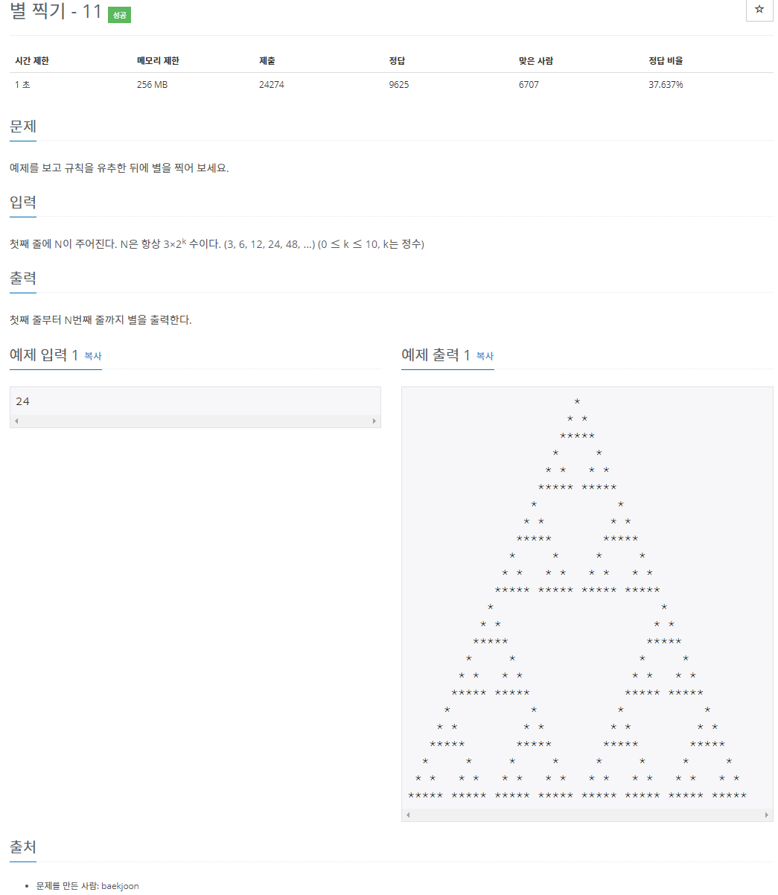
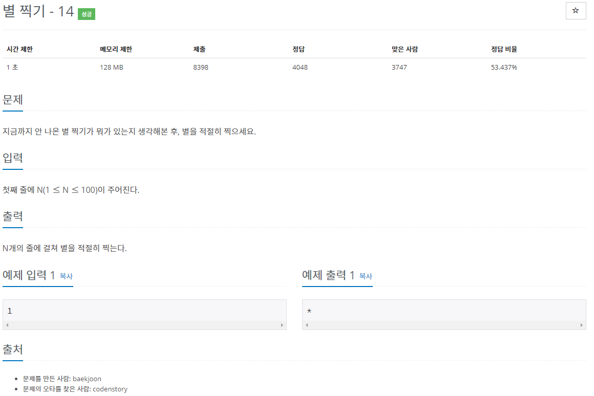
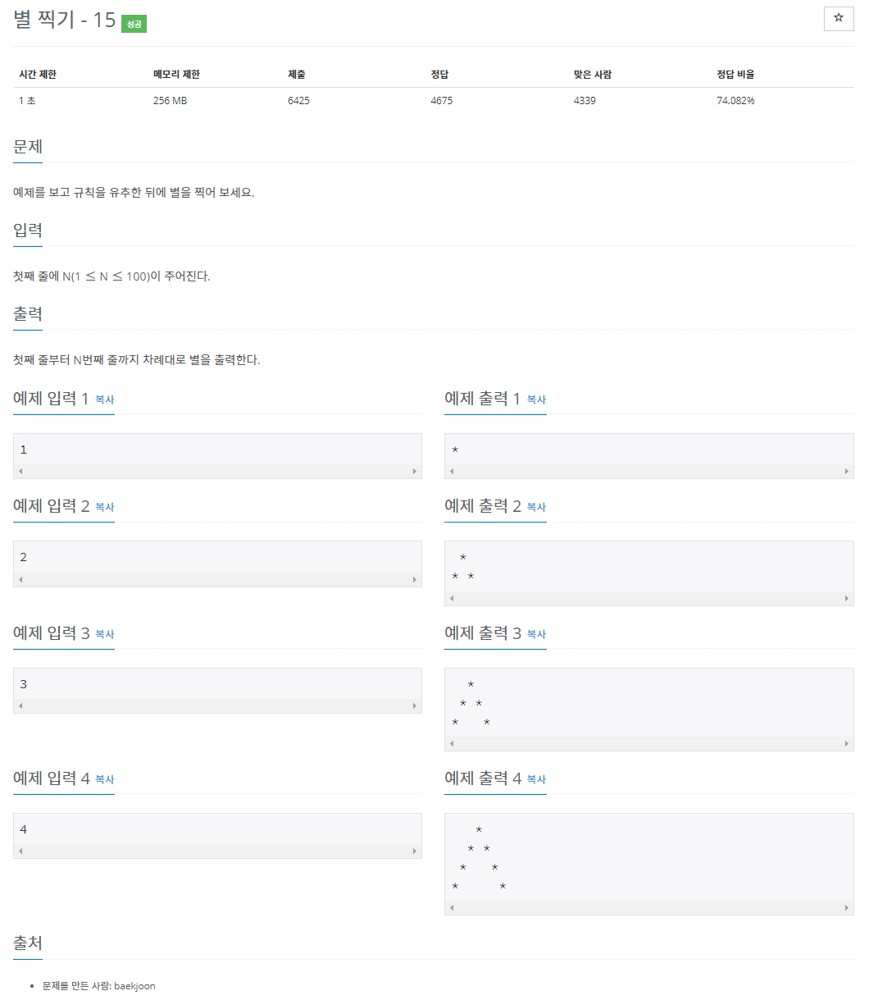
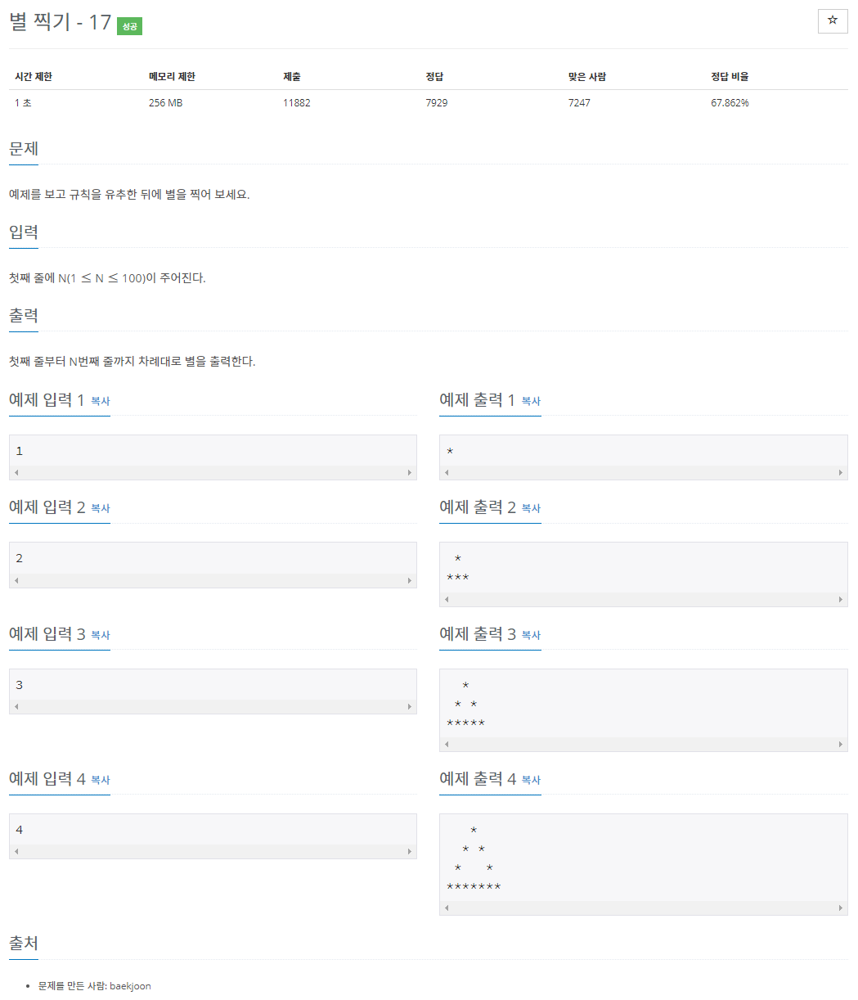
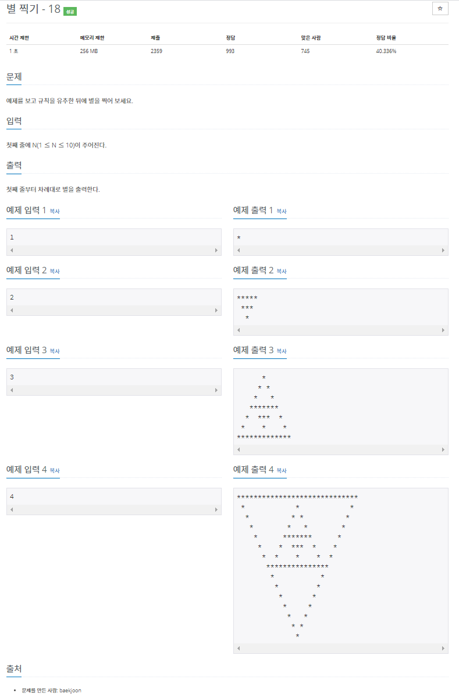
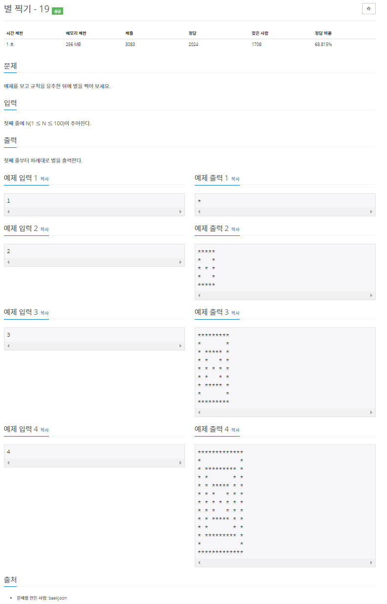
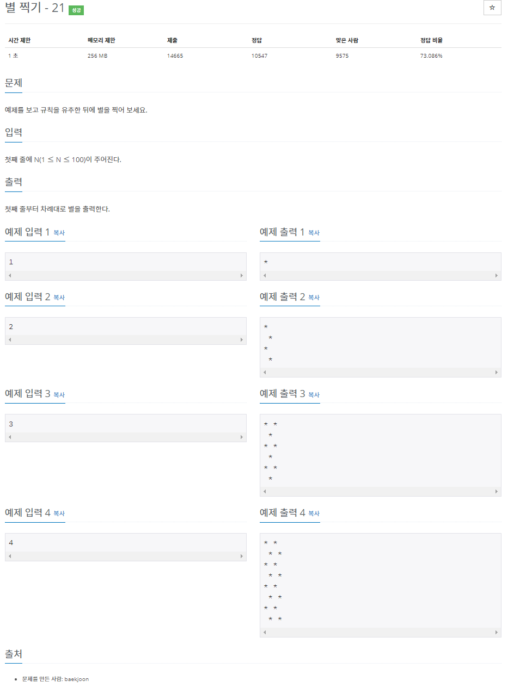
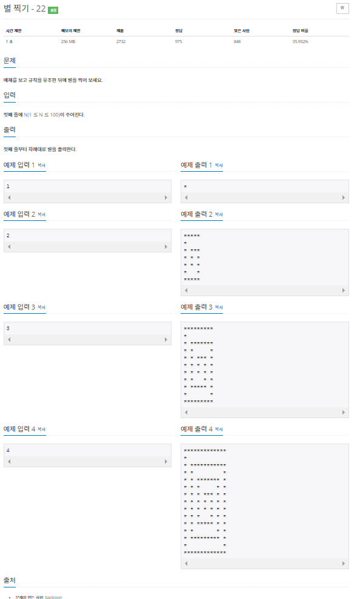
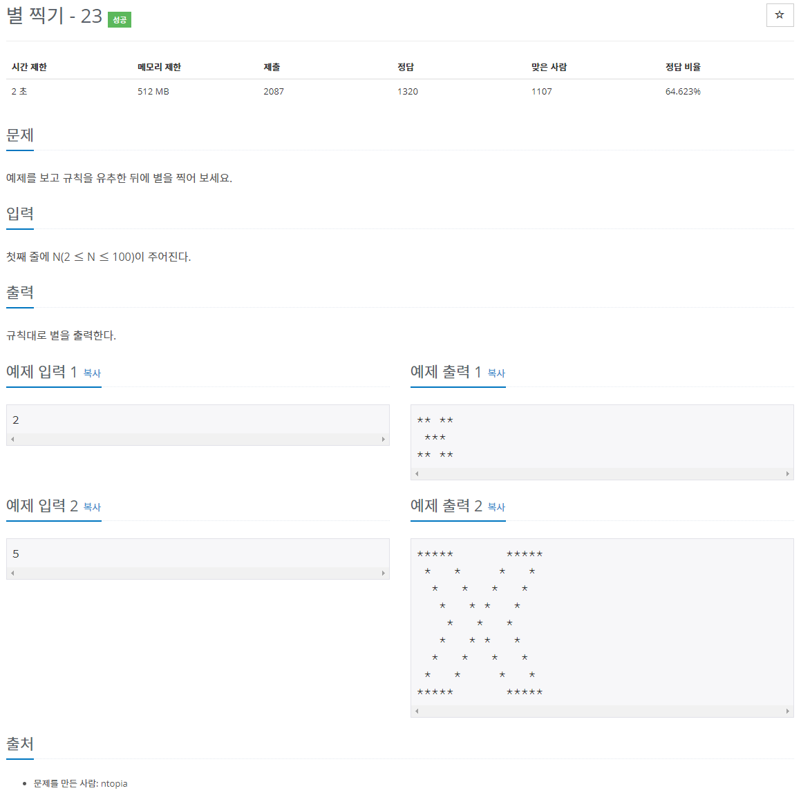

## 별 찍기 - 10 (#2447)

[(링크)](https://www.acmicpc.net/problem/2447)



[풀이]

```cpp
#include<iostream>
using namespace std;
void star(int i, int j, int n){
    if(n==0)
        cout << '*';
    else{
        if (i%3==2 && j%3==2)
            cout << ' ';
        else{
            star((i+2)/3,(j+2)/3,n/3);
        }
    }

}
int main(){
    int n;
    cin >> n;
    for(int i=1; i<=n; i++){
        for(int j=1; j<=n;j++ ){
            star(i,j,n);
        }
        cout << endl;
    }
}
```

## 별 찍기 - 11 (#2448)

[(링크)](https://www.acmicpc.net/problem/2448)



[풀이]

```cpp
#include<iostream>
using namespace std;
char arr[3072][6143];
void star(int n, int row, int column){
    if( n==3){
        for(int i=0; i<=2; i++){
            for(int j=0; j<=i; j++){
                if( i!=1 || j!=0 ){
                    arr[row+i][column+j]='*';
                    arr[row+i][column-j]='*';
                }
            }
        }
    }
    else{
        star( n/2 ,row ,column);
        star( n/2, row+n/2, column-n/2);
        star( n/2, row+n/2, column+n/2);
    }
}
int main(){
    int n;
    cin >> n;
    for(int i=0; i<n;i++)
        for(int j=0; j<2*n-1; j++)
            arr[i][j]=' ';

    star(n,0,n-1);

    for(int i=0; i<n;i++){
        for(int j=0; j<2*n-1; j++)
            cout << arr[i][j];
        cout << endl;
    }

}
```

## 별 찍기 - 14 (#2556)

[(링크)](https://www.acmicpc.net/problem/2556)



[풀이]

```cpp
#include<iostream>
using namespace std;
int main(){
    int n;
    cin >> n;
    for(int i=1; i<=n; i++){
        for(int j=1; j<=n; j++){
            cout << '*';
        }
        cout << endl;
    }
}
```

## 별 찍기 - 15 (#10990)

[(링크)](https://www.acmicpc.net/problem/10990)



[풀이]

```cpp
#include<iostream>
using namespace std;
int main(){
    int n;
    cin >> n;
    for(int i=1; i<=n; i++){
        for(int j=1; j-i<n-1; j++){
            if( i+j==n+1)
                cout << "*";
            else
                cout << " ";
        }
        cout << "*" << endl;
    }
}
```

## 별 찍기 - 17 (#10992)

[(링크)](https://www.acmicpc.net/problem/10992)



[풀이]

```cpp
#include<iostream>
using namespace std;
int main(){
    int n;
    cin >> n;
    for(int i=1; i<=n-1; i++){
        cout << " ";
        for(int j=1; j-i<n-2; j++){
            if( i+j==n)
                cout << "*";
            else
                cout << " ";
        }
        cout << "*" << endl;
    }
    for(int i=1; i<=2*n-1;i++)
        cout << "*";
}
```

## 별 찍기 - 18 (#10993)

[(링크)](https://www.acmicpc.net/problem/10993)



[풀이]

```cpp
#include<iostream>
using namespace std;
char arr[1023][2045];
int pow(int n){
    int a=1;
    while(n--){
        a*=2;
    }
    return a;
}
void star(int n, int row, int col){
    if(n%2==1){
        arr[row][col]='*';
        for(int i=0; i<pow(n)-2;i++){
            arr[row+i][col+i]='*';
            arr[row+i][col-i]='*';
        }
        for(int i=0; i<pow(n)-1;i++){
            arr[row+pow(n)-2][col+i]='*';
            arr[row+pow(n)-2][col-i]='*';
        }
    }
    else{
        arr[row][col]='*';
        for(int i=0; i<pow(n)-2;i++){
            arr[row-i][col+i]='*';
            arr[row-i][col-i]='*';
        }
        for(int i=0; i<pow(n)-1;i++){
            arr[row-pow(n)+2][col+i]='*';
            arr[row-pow(n)+2][col-i]='*';
        }
    }


    if(n!=1){
        if(n%2==1)
            star(n-1,row+pow(n)-3,col);
        else
            star(n-1,row-pow(n)+3,col);
    }
}
int main(){
    int n;
    cin >> n;

    int row= pow(n)-1;
    int col= pow(n+1)-3;
    for(int i=0; i< row;i++)
        for(int j=0; j<col; j++)
            arr[i][j]=' ';

    if (n%2 ==1)
        star(n, 0, (col+1)/2-1);
    else
        star(n, row-1, (col+1)/2-1);

    for(int i=0; i< row;i++){
        if(n%2==1){
            for(int j=0; j<row+i; j++)
                cout << arr[i][j];
        }
        else{
            for(int j=0; j<col-i; j++)
                cout << arr[i][j];
        }
        cout << endl;
    }
}
```

## 별 찍기 - 19 (#10994)

[(링크)](https://www.acmicpc.net/problem/10994)



[풀이]

```cpp
#include<iostream>
using namespace std;
char arr[397][397];
void star(int n, int row, int column){
    for(int i=0; i< 4*n-3; i++){
        if(i==0 || i==4*n-4){
            for (int j=0; j< 4*n-3; j++){
            arr[row+i][column+j]='*';
            }
        }
        else{
            arr[row+i][column]='*';
            arr[row+i][column+4*n-4]='*';
        }
    }

    if(n>1){
            star(n-1,row+2,row+2);
    }
}

int main(){
    int n;
    cin >> n;
    for(int i=0; i<=4*n-3;i++){
        for(int j=0; j<=4*n-3; j++){
            arr[i][j]=' ';
        }
    }

    star(n,0,0);

    for(int i=0; i<4*n-3;i++){
        for(int j=0; j<4*n-3; j++){
            cout << arr[i][j];
        }
        cout << endl;
    }
}
```

## 별 찍기 - 21 (#10996)

[(링크)](https://www.acmicpc.net/problem/10996)



[풀이]

```cpp
#include<iostream>
using namespace std;
int main(){
    int n;
    cin >> n;
    for(int i=1; i<=2*n; i++){
        for(int j=1; j<=n; j++){
            if(i%2==1){
                if(j%2==1)
                    cout << '*';
                else
                    cout << ' ';
            }
            else{
                if(j%2==1)
                    cout << ' ';
                else
                    cout << '*';
            }

        }
        cout << endl;
    }
}
```

## 별 찍기 - 22 (#10997)

[(링크)](https://www.acmicpc.net/problem/10997)



[풀이]

```cpp
#include<iostream>
using namespace std;
char arr[399][397];
void star(int n, int row, int column){
    for(int i=0; i<4*n-3; i++)
        arr[row][column-i]='*';
    for(int i=0; i<4*n-2;i++)
        arr[row+1+i][column-4*n+4]='*';
    for(int i=0; i<4*n-4;i++)
        arr[row+4*n-2][column-4*n+5+i]='*';
    for(int i=0; i< 4*n-3; i++)
        arr[row+4*n-2-i][column]='*';
    arr[row+2][column-1]='*';


    if(n>2){
        star(n-1,row+2,column-2);
    }

    else if (n==2){
        arr[row+2][column-2]='*';
        arr[row+3][column-2]='*';
        arr[row+4][column-2]='*';
    }
}

int main(){
    int n;
    cin >> n;
    if( n==1){
        cout << '*';
    }
    else{
        for(int i=0; i<4*n-1;i++)
            for(int j=0; j<4*n-3; j++)
                arr[i][j]=' ';

        star(n,0,4*n-4);


        for(int i=0; i<4*n-1;i++){
            if(i!=1){
                for(int j=0; j<4*n-3; j++)
                    cout << arr[i][j];
            }
        else
            cout << '*';
        cout << endl;
        }
    }

}
```

## 별 찍기 - 23 (#13015)

[(링크)](https://www.acmicpc.net/problem/13015)



[풀이]

```cpp
#include<iostream>
using namespace std;
int main(){
    int n;
    cin >> n;
    for(int i=1; i<=n;i++){
        for(int j=1; j<=4*n-2-i;j++){
            if(i==1){
                if ((1<=j && j<= n)||(j>=3*n-2 && j<=4*n-2-i))
                    cout << '*';
                else
                    cout << ' ';
            }
            else{
                if(j==i || j==n+i-1 || j==3*n-1-i || j==4*n-2-i )
                    cout << '*';
                else
                    cout << ' ';
            }
        }
        cout << endl;
    }
    for(int i=n-1; i>=1;i--){
        for(int j=1; j<=4*n-2-i;j++){
            if(i==1){
                if ((1<=j && j<= n)||(j>=3*n-2 && j<=4*n-2-i))
                    cout << '*';
                else
                    cout << ' ';
            }
            else{
                if(j==i || j==n+i-1 || j==3*n-1-i || j==4*n-2-i )
                    cout << '*';
                else
                    cout << ' ';
            }
        }
        cout << endl;
    }
}
```
