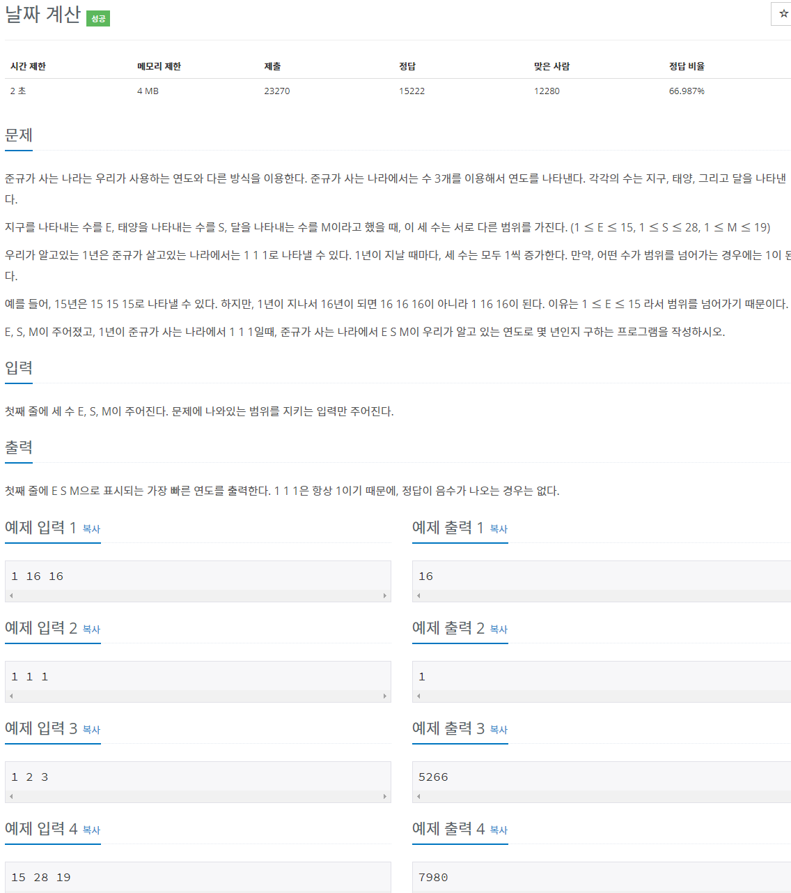
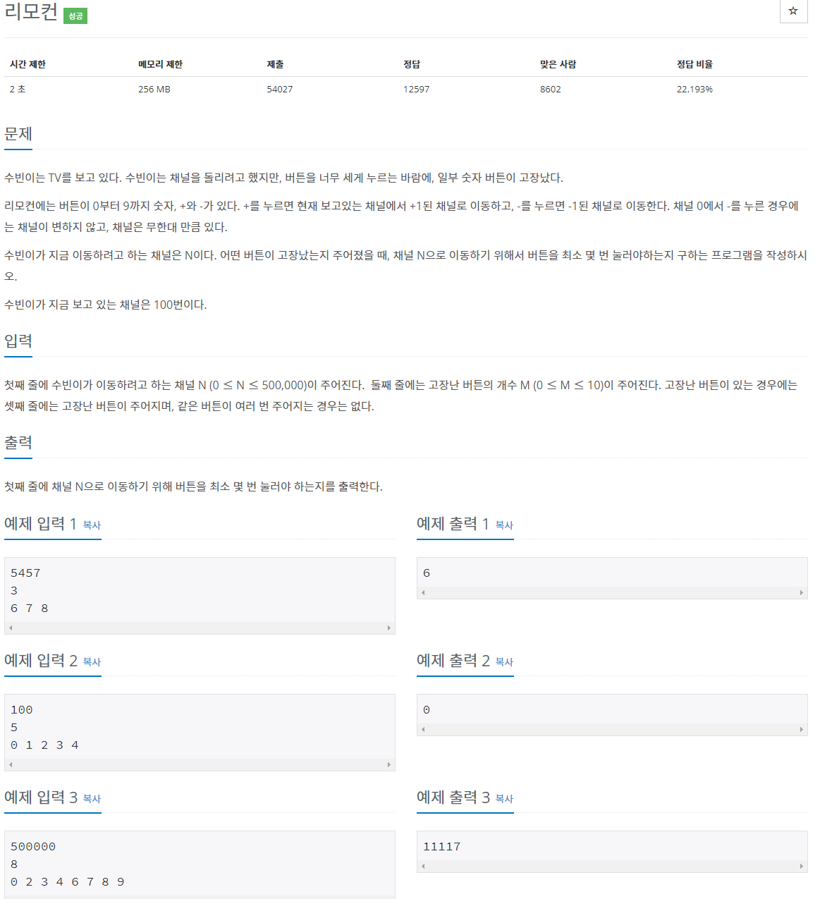
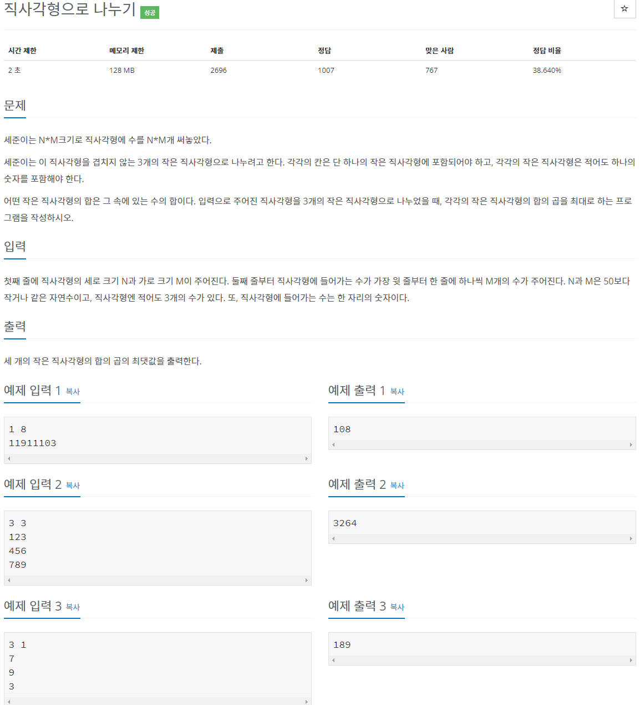
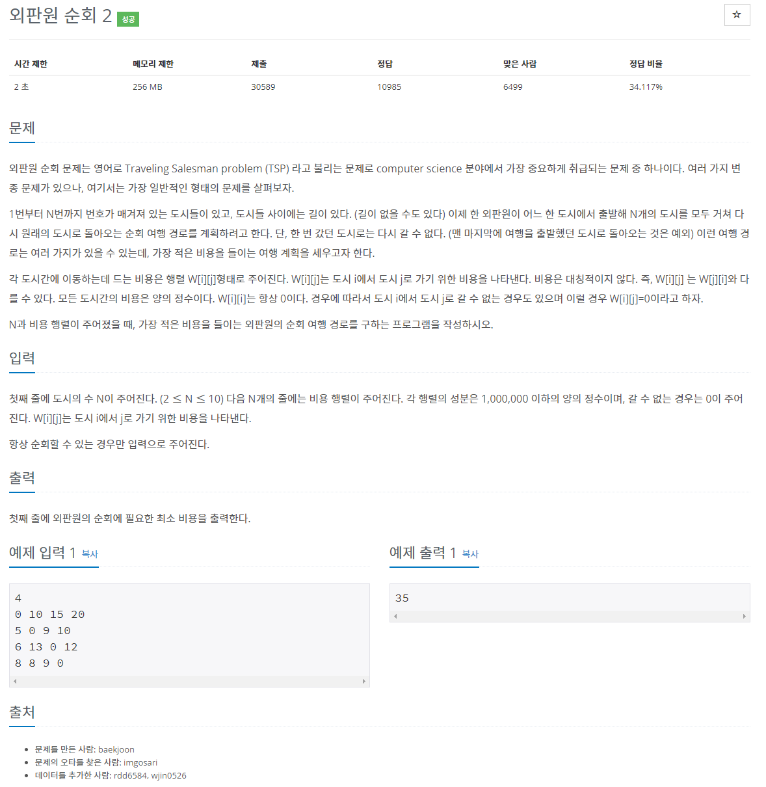
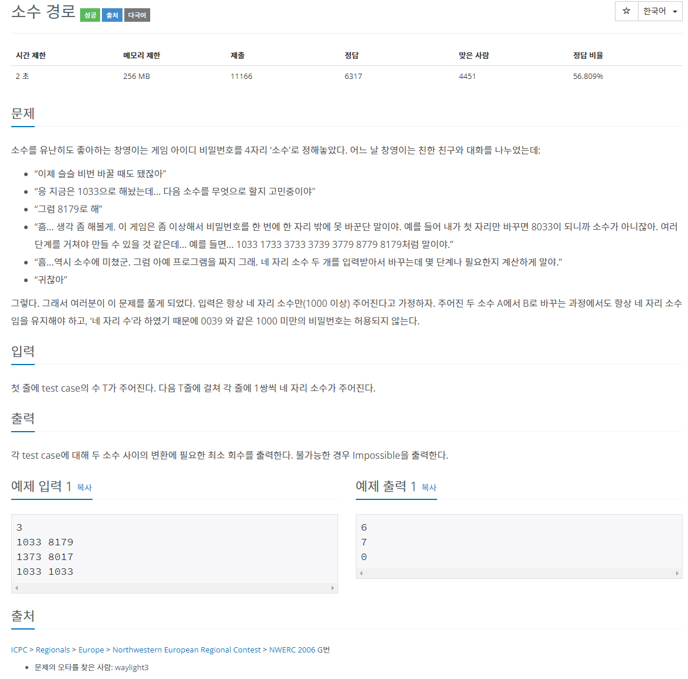
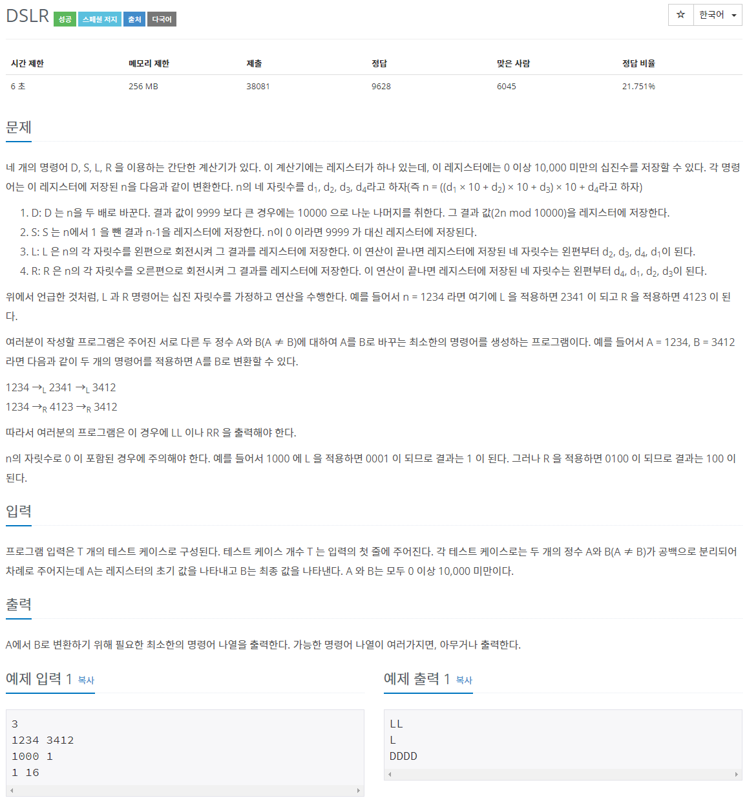
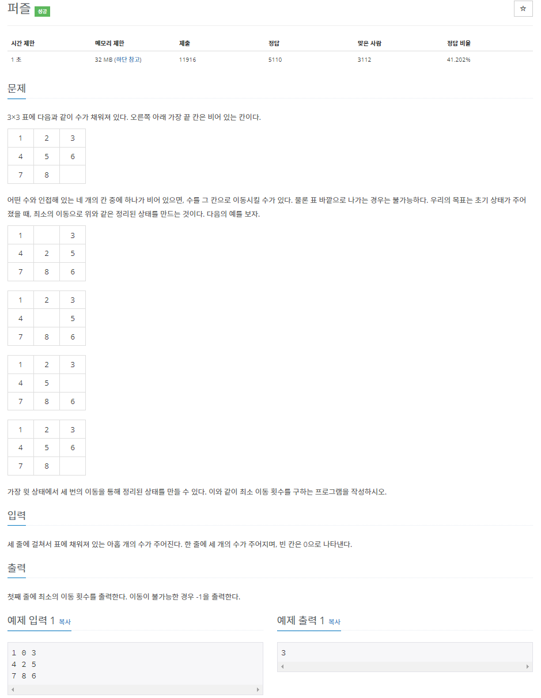

[문제집 출처](https://plzrun.tistory.com/entry/%EC%95%8C%EA%B3%A0%EB%A6%AC%EC%A6%98-%EB%AC%B8%EC%A0%9C%ED%92%80%EC%9D%B4PS-%EC%8B%9C%EC%9E%91%ED%95%98%EA%B8%B0)

## 날짜 계산 (#1476)

[(링크)](https://www.acmicpc.net/problem/1476)



[풀이]

```cpp
#include<iostream>
using namespace std;
int main(){
    int e=15;
    int s=28;
    int m=19;
    int ei,si,mi;
    for(ei=1; ei<15; ei++){
        if(ei*s*m%15==1)
            break;
    }
    for(si=1; si<28; si++){
        if(si*e*m%28==1)
            break;
    }
    for(mi=1; mi<19; mi++){
        if(mi*e*s%19==1)
            break;
    }
    int a,b,c;
    cin >> a >> b >> c;
    int result=(a*ei*s*m+b*si*e*m+c*mi*e*s)%(e*s*m);
    if(result>0)
        cout << result;
    else
        cout << 15*28*19;
}
```

## 리모컨 (#1107)

[(링크)](https://www.acmicpc.net/problem/1107)



[풀이]

```cpp
#include<iostream>
using namespace std;

bool broken[10]={false,};

int abs(int a){
    if(a>0)
        return a;
    else
        return -a;
}

int check(int n){
    if(n ==0){
        if(broken[0]){
            return 0;
        }
        else
            return 1;
    }
    int result=0;
    while(n>0){
        if(broken[n%10])
            return 0;
        n/=10;
        result++;
    }
    return result;
}

int main(){
    int n, m;
    cin >> n >> m;
    for(int i=0; i<m; i++){
        int temp;
        cin >> temp;
        broken[temp]=true;
    }

    int result=abs(100-n);
    for(int i=0; i<= 1000000; i++){
        int len=check(i);
        if(len>0){
            if(result > len+abs(n-i)){
                result=len+abs(n-i);
            }
        }
    }
    cout << result;
}
```

## 직사각형으로 나누기 (#1451)

[(링크)](https://www.acmicpc.net/problem/1451)



[풀이]

```cpp
#include<iostream>
using namespace std;

int arr[100][100];

long long area(int lx, int ly, int rx, int ry){
    long long result=0;
    for(int i=ly; i<=ry; i++){
        for(int j=lx; j<=rx; j++){
            result+=arr[i][j];
        }
    }
    return result;
}

int main(){
    int n,m;
    cin >> n >> m;


    for(int i=0; i<n; i++){
        for(int j=0;j<m;j++){
            char temp;
            cin >>temp;
            arr[i][j]=temp-'0';
        }
    }

    long long sum=0;

    //case 1 세로로 두번 자르는 경우
    for(int i=0; i<m-2; i++){
        for(int j=i+1; j<m-1; j++){
            long long s1=area(0,0,i,n-1);
            long long s2=area(i+1,0,j,n-1);
            long long s3=area(j+1,0,m-1,n-1);
            if(sum<s1*s2*s3)
                sum=s1*s2*s3;
        }
    }

    //case 2 가로로 두번 자르는 경우
    for(int i=0; i<n-2; i++){
        for(int j=i+1; j<n-1; j++){
            long long s1=area(0,0,m-1,i);
            long long s2=area(0,i+1,m-1,j);
            long long s3=area(0,j+1,m-1,n-1);
            if(sum<s1*s2*s3)
                sum=s1*s2*s3;
        }
    }

    //case 3 가로로 한번 자른 후 위쪽 조각을 세로로 자르는 경우
    for(int i=0; i<m-1; i++){
        for(int j=0; j<n-1; j++){
            long long s1=area(0,0,i,j);
            long long s2=area(i+1,0,m-1,j);
            long long s3=area(0,j+1,m-1,n-1);
            if(sum<s1*s2*s3)
                sum=s1*s2*s3;
        }
    }

    //case 4 가로로 한번 자른 후 아래쪽 조각을 세로로 자르는 경우
    for(int i=0; i<m-1; i++){
        for(int j=0; j<n-1; j++){
            long long s1=area(0,0,m-1,j);
            long long s2=area(0,j+1,i,n-1);
            long long s3=area(i+1,j+1,m-1,n-1);
            if(sum<s1*s2*s3)
                sum=s1*s2*s3;
        }
    }

    //case 5 세로로 한번 자른 후 왼쪽 조각을 가로로 자르는 경우
    for(int i=0; i<m-1; i++){
        for(int j=0; j<n-1; j++){
            long long s1=area(0,0,i,j);
            long long s2=area(0,j+1,i,n-1);
            long long s3=area(i+1,0,m-1,n-1);
            if(sum<s1*s2*s3)
                sum=s1*s2*s3;
        }
    }

    //case 6 세로로 한번 자른 후 오른쪽 조각을 가로로 자르는 경우
    for(int i=0; i<m-1; i++){
        for(int j=0; j<n-1; j++){
            long long s1=area(0,0,i,n-1);
            long long s2=area(i+1,0,m-1,j);
            long long s3=area(i+1,j+1,m-1,n-1);
            if(sum<s1*s2*s3)
                sum=s1*s2*s3;
        }
    }
    cout << sum;
}
```

## 차이를 최대로 (#10819)

[(링크)](https://www.acmicpc.net/problem/10819)


[풀이]

```cpp
#include<iostream>
using namespace std;
int n;
int arr[8];
int shuffled[8];
bool visited[8]={false,};
int answer=0;

int abs(int n){
    if(n>=0)
        return n;
    else
        return -n;
}

void search(int num){
    if(num == n){
        int result=0;
        for(int i=0; i<n-1; i++){
            result += abs(shuffled[i]-shuffled[i+1]);
        }
        if(result >answer)
            answer=result;
        return;
    }

    for(int i=0; i<n; i++){
        if(visited[i])
            continue;
        visited[i]=true;
        shuffled[num]= arr[i];
        search(num+1);
        visited[i]=false;
    }
}

int main(){
    cin >>n;
    for(int i=0; i<n; i++)
        cin >> arr[i];
    search(0);
    cout << answer;
}
```

## 외판원 순회 2 (#10971)

[(링크)](https://www.acmicpc.net/problem/10971)



[풀이]

```cpp
#include<iostream>
using namespace std;
bool visited[10]={false,};
int n;
int arr[10][10];
int cost=10000000;
void search(int start, int current, int sum, int count){
    if(!visited[current]){
        visited[current]=true;
        for(int j=0;j<n;j++){
            if (arr[current][j]){
                search(start,j,sum+arr[current][j],count+1);
            }
        }
        visited[current]=false;
    }

    if(count==n && start== current){
        if(sum<cost)
            cost=sum;
    }

}

int main(){
    cin >> n;
    for(int i=0; i<n; i++){
        for(int j=0; j<n; j++){
            cin >> arr[i][j];
        }
    }

    for(int i=0; i<n;i++)
        search(i,i,0,0);
    cout << cost;
}
```

## 숨바꼭질 (#1697)

[(링크)](https://www.acmicpc.net/problem/1697)


[풀이]

```cpp
#include<iostream>
using namespace std;
bool visited[10]={false,};
int n;
int arr[10][10];
int cost=10000000;
void search(int start, int current, int sum, int count){
    if(!visited[current]){
        visited[current]=true;
        for(int j=0;j<n;j++){
            if (arr[current][j]){
                search(start,j,sum+arr[current][j],count+1);
            }
        }
        visited[current]=false;
    }

    if(count==n && start== current){
        if(sum<cost)
            cost=sum;
    }

}

int main(){
    cin >> n;
    for(int i=0; i<n; i++){
        for(int j=0; j<n; j++){
            cin >> arr[i][j];
        }
    }

    for(int i=0; i<n;i++)
        search(i,i,0,0);
    cout << cost;
}
```

## 소수 경로 (#1963)

[(링크)](https://www.acmicpc.net/problem/1963)



[풀이]

```cpp
#include<iostream>
#include<queue>
using namespace std;
int n,k;
bool isprime[10001];
int check[10001];
queue <int> q;
int pow(int a, int b){
    int result=1;
    for(int i=0; i<b; i++)
        result *= a;
    return result;
}

void sieve (){
    for(int i=0; i<10001; i++){
        isprime[i]=true;//초기화
    }
    isprime[0]=false;
    isprime[1]=false;
    for(int i=2; i<=100; i++){
        if(isprime[i])
            for(int j=i*i; j<10001; j+=i){
                isprime[j]=false;
            }
    }
}
void search(){
    q.push(n);
    check[n]=1;
    while(!q.empty()){
        int current=q.front();
        q.pop();
        for(int i=0; i<4; i++){
            for(int j=0;j<10;j++){ // i번쨰 자리수를 j로 치환 하여 next로 저장
                int next=current%(pow(10,3-i))+(current/pow(10,4-i))*pow(10,4-i)+j*pow(10,3-i);
                if(next>=1000 && isprime[next] && check[next]==0){
                    q.push(next);
                    check[next]=check[current]+1;
                }
            }
        }
    }
}


int main(){
    sieve();
    int t;
    cin >> t;
    while(t--){
        for(int i=0; i<10001; i++)
            check[i]=0; //초기화
        cin >> n >> k;
        search();
        if(check[k]!=0)
            cout << check[k]-1 << '\n';
        else
            cout << "Impossible\n";
    }
}
```

## DSLR (#9019)

[(링크)](https://www.acmicpc.net/problem/9019)



[풀이]

```cpp
#include<iostream>
#include<string>
#include<queue>
using namespace std;
int a,b;
bool visited[10000];

int calculate(int n, char c){
    if (c == 'D'){
        return (n*2)%10000;
    }
    else if (c == 'S'){
        if (n ==0)
            return 9999;
        else
            return n-1;
    }
    else if (c == 'L'){
        return (n%1000)*10 + n/1000;
    }
    else if (c == 'R'){
        return (n%10)*1000 + n/10;
    }
}

string search(int n){
    queue<pair<int,string>> q;
    q.push(make_pair(n,""));
    visited[n]=true;

    while(!q.empty()){
        int current=q.front().first;
        string s=q.front().second;
        q.pop();
        if (current == b)
            return s;
        int next;
        char c;

        c='D';
        next= calculate(current,c);
        if(!visited[next]){
            visited[next]=true;
            q.push(make_pair(next,s+c));
        }

        c='S';
        next= calculate(current,c);
        if(!visited[next]){
            visited[next]=true;
            q.push(make_pair(next,s+c));
        }

        c='L';
        next= calculate(current,c);
        if(!visited[next]){
            visited[next]=true;
            q.push(make_pair(next,s+c));
        }

        c='R';
        next= calculate(current,c);
        if(!visited[next]){
            visited[next]=true;
            q.push(make_pair(next,s+c));
        }
    }
}

int main(){
    int t;
    cin >> t;
    while(t--){
        cin >> a >> b;
        for(int i=0; i<10000; i++)
            visited[i]=false;
        cout << search(a) << endl;
    }
}
```

## 퍼즐 (#1525)

[(링크)](https://www.acmicpc.net/problem/1525)



[풀이]

```cpp
#include<iostream>
#include<queue>
#include<string>
#include<set>
using namespace std;
string start;
string finish="123456780";
set<string> visited;
int dx[4]={0,0,1,-1};
int dy[4]={1,-1,0,0};

int search(){
    queue <pair <string, int >> q;
    q.push(make_pair(start,0));
    visited.insert(start);
    while(!q.empty()){
        string current=q.front().first;
        int count= q.front().second;
        q.pop();

        if(current == finish)
            return count;

        int zero= current.find('0'); //0의 위치를 찾아 좌표로 만듬
        int x= zero / 3;
        int y= zero % 3;

        for(int i=0; i<4; i++){
            int nx=x+dx[i];
            int ny=y+dy[i];
            if( nx >=0 && nx <3 && ny >=0 && ny<3 ){
                string next=current;
                char temp=next[3*x+y]; //(x,y) 와 (nx,ny) 를 교환
                next[3*x+y]=next[3*nx+ny];
                next[3*nx+ny]=temp;
                if(visited.find(next)==visited.end()){
                    visited.insert(next);
                    q.push(make_pair(next,count+1));
                }
            }
        }
    }
    return -1;
}
int main(){
    for(int i=0; i<9; i++){
        char c;
        cin >> c;
        start+=c;
    }
    cout << search();

}
```

## 물통 (#2251)

[(링크)](https://www.acmicpc.net/problem/2251)


[풀이]

```cpp
#include<iostream>
#include<vector>
#include<queue>
#include<tuple>
#include<algorithm>
using namespace std;
int a, b, c;
bool visited[201][201][201];
vector<int> v;

void search(){
    queue <tuple<int,int,int>> q;
    q.push(make_tuple(0,0,c));
    while(!q.empty()){
        int curr_a=get<0>(q.front());
        int curr_b=get<1>(q.front());
        int curr_c=get<2>(q.front());
        q.pop();
        if(!visited[curr_a][curr_b][curr_c]){
            visited[curr_a][curr_b][curr_c]=true;

            if (curr_a==0)
                v.push_back(curr_c);

            //a->b
            if(curr_a+curr_b>b)
                q.push(make_tuple(curr_a+curr_b-b,b,curr_c));
            else
                q.push(make_tuple(0,curr_a+curr_b,curr_c));

            //b->a
            if(curr_a+curr_b>a)
                q.push(make_tuple(a,curr_a+curr_b-a,curr_c));
            else
                q.push(make_tuple(curr_a+curr_b,0,curr_c));

            //a->c
            if(curr_a+curr_c>c)
                q.push(make_tuple(curr_a+curr_c-c,curr_b,c));
            else
                q.push(make_tuple(0,curr_b,curr_a+curr_c));

            //c->a
            if(curr_a+curr_c>a)
                q.push(make_tuple(a,curr_b,curr_a+curr_c-a));
            else
                q.push(make_tuple(curr_a+curr_c,curr_b,0));

            //b->c
            if(curr_b+curr_c>c)
                q.push(make_tuple(curr_a,curr_b+curr_c-c,c));
            else
                q.push(make_tuple(curr_a,0,curr_b+curr_c));

            //c->b
            if(curr_b+curr_c>b)
                q.push(make_tuple(curr_a,b,curr_b+curr_c-b));
            else
                q.push(make_tuple(curr_a,curr_b+curr_c,0));
        }
    }
}

int main(){
    cin >> a >> b >> c;
    search();
    sort(v.begin(),v.end());
    for(int i=0; i<v.size();i++)
        cout << v[i] << ' ';
}
```
