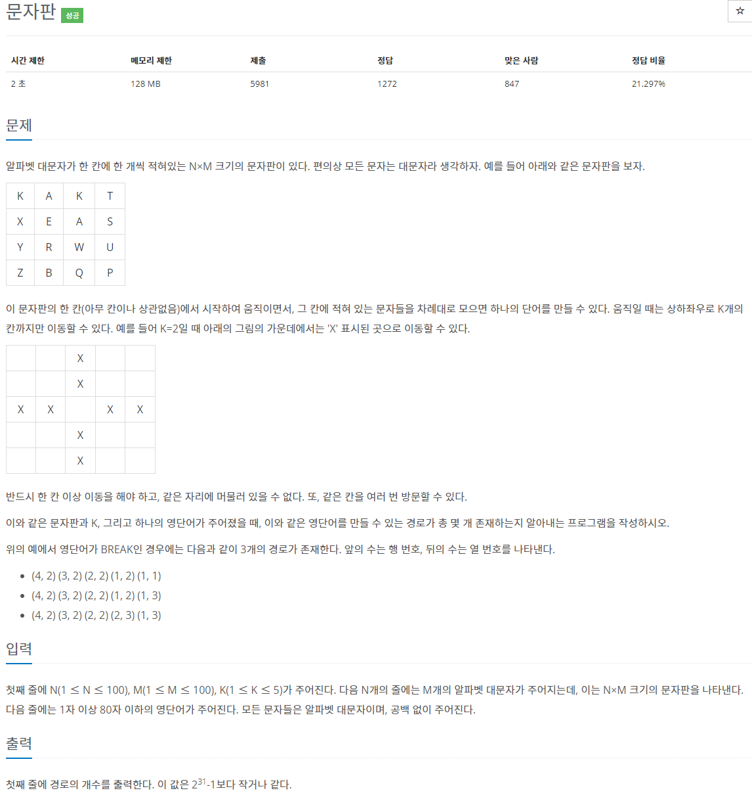
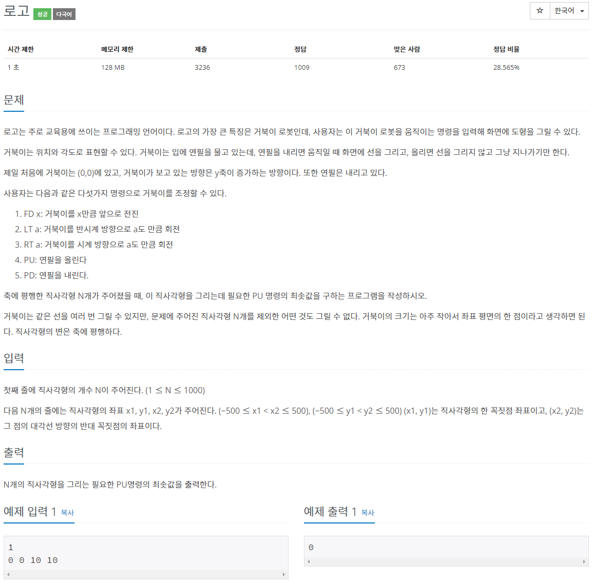
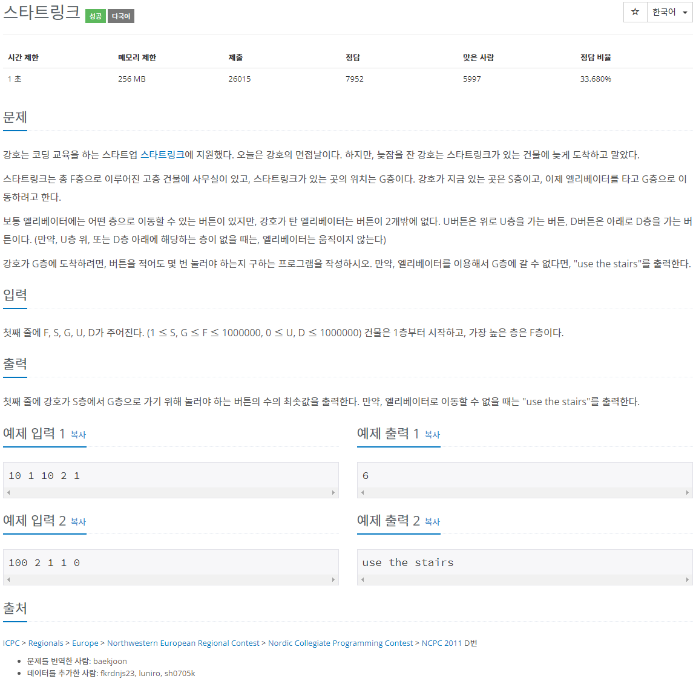
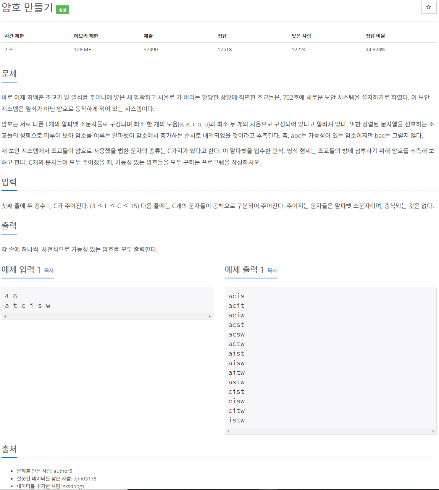
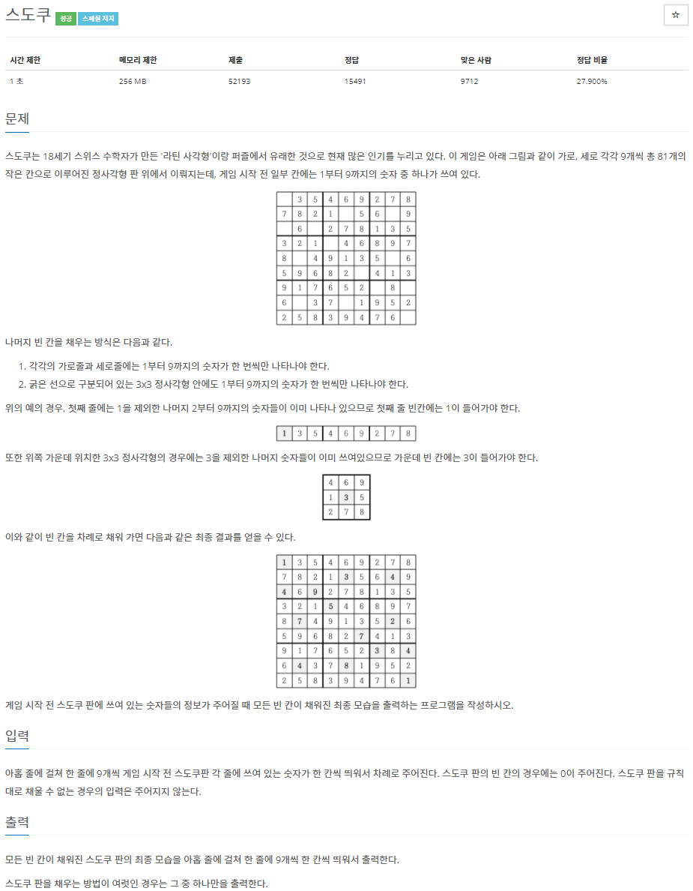
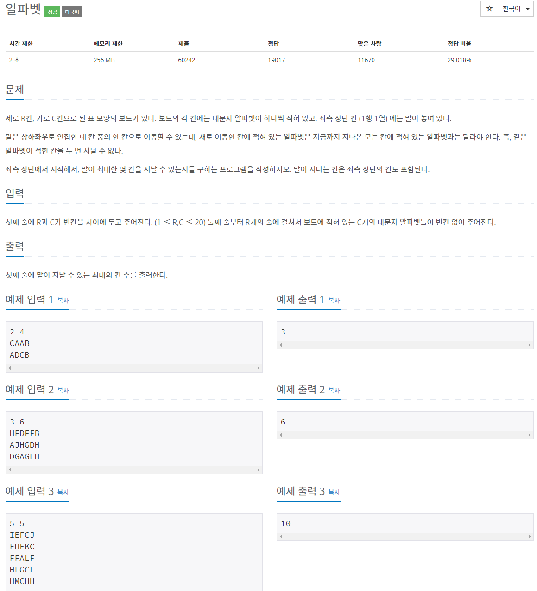
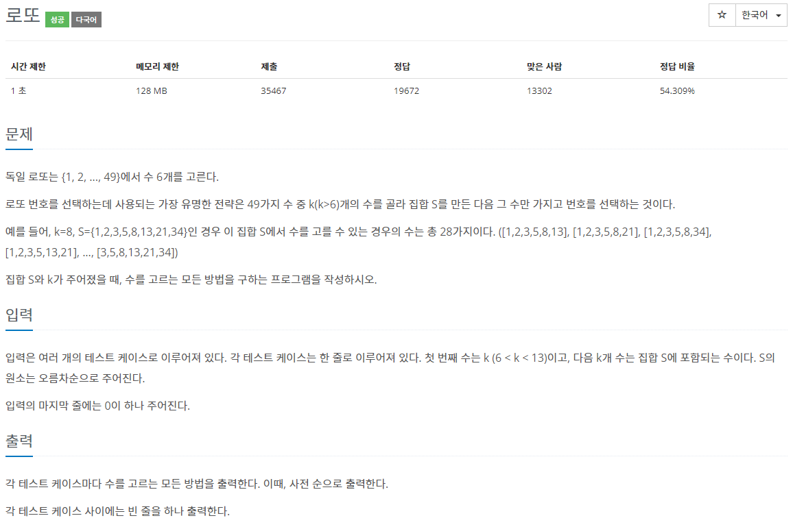
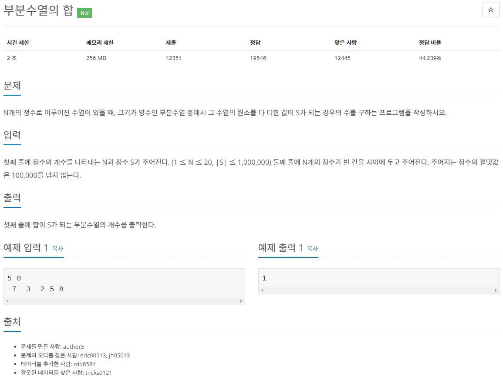

[문제집 출처](https://plzrun.tistory.com/entry/%EC%95%8C%EA%B3%A0%EB%A6%AC%EC%A6%98-%EB%AC%B8%EC%A0%9C%ED%92%80%EC%9D%B4PS-%EC%8B%9C%EC%9E%91%ED%95%98%EA%B8%B0)

## 문자판 (#2186)

[(링크)](https://www.acmicpc.net/problem/2186)



[풀이]

```cpp
#include<iostream>
#include<string>
using namespace std;

int n,m,k;
char board[100][100];
string word;
int dp[100][100][80]; // dp[x][y][index] = (x,y) 지점의 단어를 index번째에서 지날 때 뒤에 word가 나오는 조합의 개수

int dx[4]={1,-1,0,0};
int dy[4]={0,0,1,-1};

int search(int x, int y, int index){
    if(dp[x][y][index]!=-1) //이미 한번 탐색한 경우 그 값을 리턴
        return dp[x][y][index];

    if(index>=word.size()) //정확하게 word를 완성한 경우
        return 1;

    dp[x][y][index]=0; //(x,y) 를 index번째에서 지나는 경우 탐색
    for(int i=0; i<4; i++){
        for(int j=1; j<=k; j++){
            int nx= x + j*dx[i];
            int ny= y + j*dy[i];
            if(nx>=0 && nx<n && ny>=0 && ny<m){
                if(board[nx][ny]==word[index])
                    dp[x][y][index]+=search(nx,ny,index+1);
            }
        }
    }
    return dp[x][y][index];
}

int main(){
    cin >> n >> m >> k;
    for(int i=0; i<n; i++){
        for(int j=0; j<m; j++){
            cin >> board[i][j];
        }
    }

    cin >> word;

    for(int i=0; i<100; i++){
        for(int j=0; j<100; j++){
            for(int k=0; k<80; k++){
                dp[i][j][k]=-1;
            }
        }
    }

    int ans=0;
    for(int i=0; i<n; i++){
        for(int j=0; j<m; j++){
            if(board[i][j] == word[0]){
                ans+=search(i,j,1);
            }
        }
    }
    cout << ans;
}

```

## 로고 (#3108)

[(링크)](https://www.acmicpc.net/problem/3108)



[풀이]

```cpp
#include<iostream>
using namespace std;
int board[2001][2001]; //(x,y) 를 board(2*(x+500),2*(y+500))에 저장하자. 이렇게 하면 음수 좌표도 양수 좌표로 저장 가능하며, 사각형 안에 사각형이 들어가는 예외처리도 가능하다.

int dx[4]={1,-1,0,0};
int dy[4]={0,0,1,-1};

void search(int y, int x){
    if(y>=0 && y<=2000 && x>=0 && x<=2000){
        if(board[y][x]==1){
            board[y][x]=2; //한번 지나간 점은 2로 표시
            for(int i=0; i<4; i++){
                int nx=x+dx[i];
                int ny=y+dy[i];
                search(ny,nx);
            }
        }
    }
}

int main(){
    int n;
    cin >>n;

    for(int i=0; i<2001; i++)
        for(int j=0; j<2001; j++)
            board[i][j]=0;

    while(n--){
        int x1,x2,y1,y2;
        cin >> x1 >> y1 >> x2 >> y2;

    //사각형의 둘레에 포함되는 점(x,y)에 대해 board[2(y+500)][2(x+500)]=1 로 저장하자
        for(int i=2*(x1+500); i<=2*(x2+500); i++){
            board[2*(y1+500)][i]=1;
            board[2*(y2+500)][i]=1;
        }

        for(int i=2*(y1+500); i<=2*(y2+500); i++){
            board[i][2*(x1+500)]=1;
            board[i][2*(x2+500)]=1;
        }
    }

    int ans=0;
    for(int i=0;i<2001;i++){
        for(int j=0; j<2001; j++){
            if(board[i][j]==1){
                search(i,j);
                ans++;
            }
        }
    }


    if(board[1000][1000]==2) //(0,0)에서 연필을 내린 채로 시작하므로 이 점을 지나는 경우 -1
        ans--;

    cout << ans;
}
```

## 스타트링크 (#5014)

[(링크)](https://www.acmicpc.net/problem/5014)



[풀이]

```cpp
#include<iostream>
using namespace std;
int main(){
    int f,s,g,u,d;
    cin >> f >> s >> g >> u >> d;
    int result=0;
    bool failure=false;
    int i=0;
    for(i=0; i<1000000; i++){
        if(s==g){
            cout << result;
            break;
        }
        if(s+u>f && s-d<1){
            failure=true;
            break;
        }
        if(s<g && s+u<=f){
            result++;
            s+=u;
        }
        else{
            result++;
            s-=d;
        }
    }
    if(i==1000000 || failure)
        cout <<"use the stairs";
}
```

## 암호 만들기 (#1759)

[(링크)](https://www.acmicpc.net/problem/1759)



[풀이]

```cpp
#include<iostream>
#include<algorithm>
using namespace std;
int l,c;
char alphabet[15];
char word[15];

void backtracking(int cnt, int idx, int consonant, int vowel){
//cnt=만들어진 단어의 길이, idx= 가장 최근에 들어온 단어-> idx 이후의 글자들만 뒤에 붙일 수 있음

    if(cnt==l){
        if(consonant >=2 && vowel >=1){ //문제 조건을 만족하는 단어일 경우 출력
            for(int i=0; i<l; i++)
                cout << word[i];
            cout << '\n';
            return;
        }
    }

    for(int i= idx+1; i<c; i++){ //idx 이후의 글자들에 대하여
        word[cnt]=alphabet[i]; //i번째 글자를 단어에 붙임
        if(alphabet[i]=='a' || alphabet[i]=='e' || alphabet[i]=='i' || alphabet[i]=='o' || alphabet[i]=='u')
            backtracking(cnt+1,i,consonant,vowel+1);
        else
            backtracking(cnt+1,i,consonant+1,vowel);
    }
}

int main(){
    cin >> l >> c;
    for(int i=0; i<c; i++){
        cin >> alphabet[i];
    }
    sort(alphabet,alphabet+c);
    backtracking(0,-1,0,0);

}
```

## 스도쿠 (#2580)

[(링크)](https://www.acmicpc.net/problem/2580)



[풀이]

```cpp
#include<iostream>
using namespace std;
int board[9][9];
bool row[9][10]; // row[a][b]: a번째 행에 b라는 숫자가 있는지를 저장
bool col[9][10]; // col[a][b]: a번째 열에 b라는 숫자가 있는지를 저장
bool square[9][10]; // square[a][b]: a번째 사각형에 b라는 숫자가 있는지를 저장

void search(int cnt){//cnt 번째 칸을 탐색
    if(cnt==81){
        for (int i=0; i<9; i++){
            for(int j=0; j<9; j++){
                cout << board[i][j] << ' ';
            }
            cout << '\n';
        }
        exit(0);
    }
    int x=cnt/9;
    int y=cnt%9;
    if(board[x][y]==0){
        for(int i=1; i<10; i++){
            if(row[x][i]==false && col[y][i]==false && square[(x/3)*3+y/3][i]==false){
                //board[x][y] 에 i를 넣어도 문제가 없다면 i를 대입하고 다음 칸 탐색
                row[x][i]=true;
                col[y][i]=true;
                square[(x/3)*3+(y/3)][i]=true;
                board[x][y]=i;
                search(cnt+1);
                //이후 탐색에서 문제가 생겼다면 다시 돌아와서 이전 상태로 되돌리고 board[x][y]에 다음 i 시도
                board[x][y]=0;
                row[x][i]=false;
                col[y][i]=false;
                square[(x/3)*3+(y/3)][i]=false;
            }
        }
    }
    else
        search(cnt+1);
}

int main(){
    ios::sync_with_stdio(false);
    cin.tie(NULL);
    cout.tie(NULL);
    for (int i=0; i<9; i++){
        for(int j=0; j<9; j++){
            cin >> board[i][j];
            if(board[i][j]!=0)
                row[i][board[i][j]]=true;
                col[j][board[i][j]]=true;
                square[(i/3)*3+j/3][board[i][j]]=true;
        }
    }
    search(0);
}
```

## 알파벳 (#1987)

[(링크)](https://www.acmicpc.net/problem/1987)



[풀이]

```cpp
#include<iostream>
using namespace std;
int r,c;
char board[20][20];
bool visited[26];
int dx[4]={1,-1,0,0};
int dy[4]={0,0,1,-1};
int ans=0;
void search(int x, int y, int cnt){
    if(cnt> ans)
        ans=cnt;
    for(int i=0; i<4; i++){
        int nx=x+dx[i];
        int ny=y+dy[i];
        if(nx>=0 && nx <r && ny>=0 && ny<c){
            if(visited[board[nx][ny]-'A']==false){
                visited[board[nx][ny]-'A']=true;
                search(nx,ny,cnt+1);
                visited[board[nx][ny]-'A']=false;
            }
        }
    }
}

int main(){
    cin >> r >> c;
    for(int i=0; i<r; i++){
        for(int j=0; j<c; j++){
            cin>> board[i][j];
        }
    }
    visited[board[0][0]-'A']=true;
    search(0,0,1);
    cout << ans;
}
```

## 로또 (#6603)

[(링크)](https://www.acmicpc.net/problem/6603)



[풀이]

```cpp
#include<iostream>
#include<string>
using namespace std;
int k;
int s[12];
int temp[12];
void backtracking(int cnt, int idx){ //cnt=현재까지 넣은 숫자의 수 ,idx= 마지막에 넣은 숫자의 크기순 위치
    if(cnt==6){
        for (int i=0; i<6; i++)
            cout << temp[i] << ' ';
        cout << '\n';
        return;
    }

    for (int i=idx;i<k;i++){
        temp[cnt]=s[i];
        backtracking(cnt+1,i+1);
    }
}

int main(){
    while (true){
        for(int i=0; i<12; i++){
            s[i]=0;
            temp[i]=0;
        }
        cin >> k;
        if(k==0)
            break;
        for(int i=0; i<k; i++){
            cin >> s[i];
        }
        backtracking(0,0);
        cout << '\n';
    }
}
```

## 부분수열의 합 (#1182)

[(링크)](https://www.acmicpc.net/problem/1182)



[풀이]

```cpp
#include<iostream>
using namespace std;
int n,s;
int num[20];
int answer=0;
int temp[20];

void search(int cnt, int idx, int size){
    if (cnt==size){
        int sum=0;
        for(int i=0; i<size; i++)
            sum+=temp[i];
        if(sum == s){
            answer++;
        }
        return;
    }

    for (int i=idx; i<n; i++){
        temp[cnt]=num[i];
        search(cnt+1,i+1,size);
    }

}

int main(){
    cin >> n >> s;
    for(int i=0; i<n; i++)
        cin >> num[i];
    for(int i=1; i<=n; i++){
        search(0,0,i);
    }
    cout << answer;
}
```
