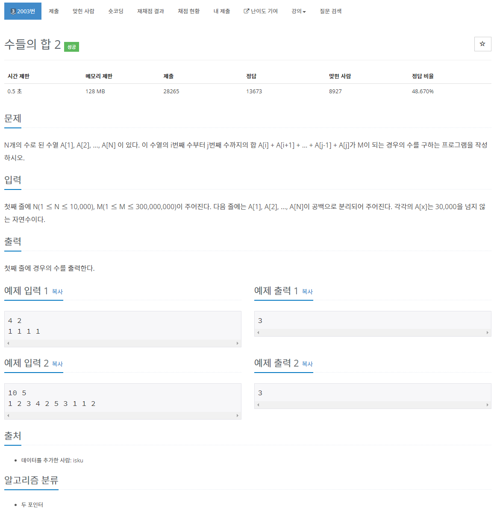
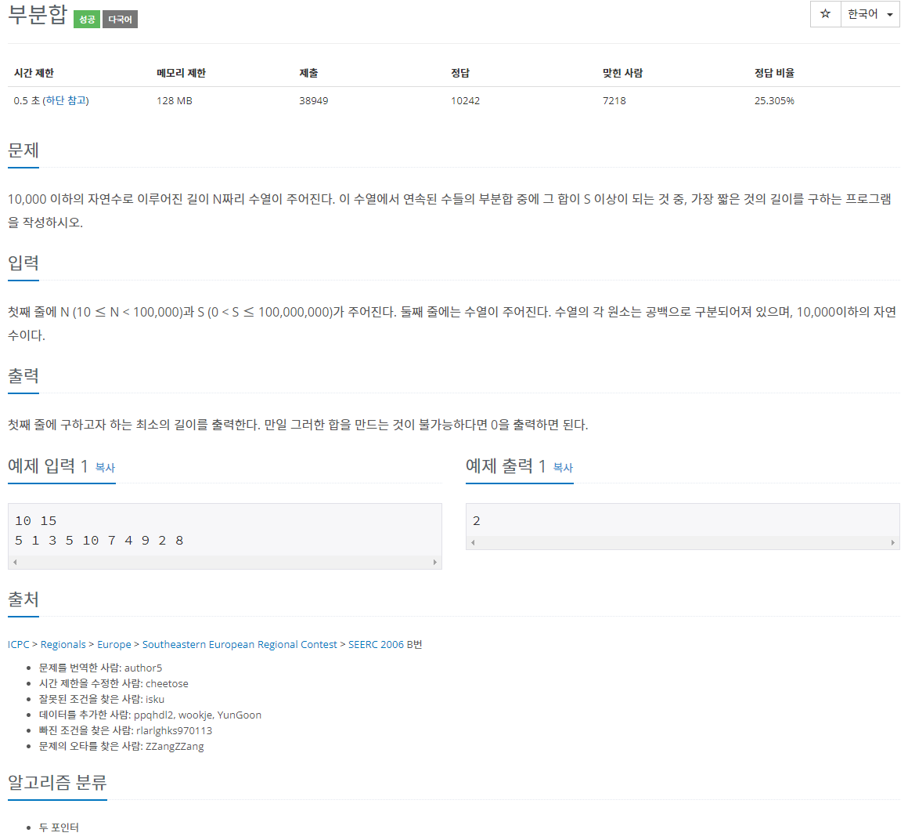
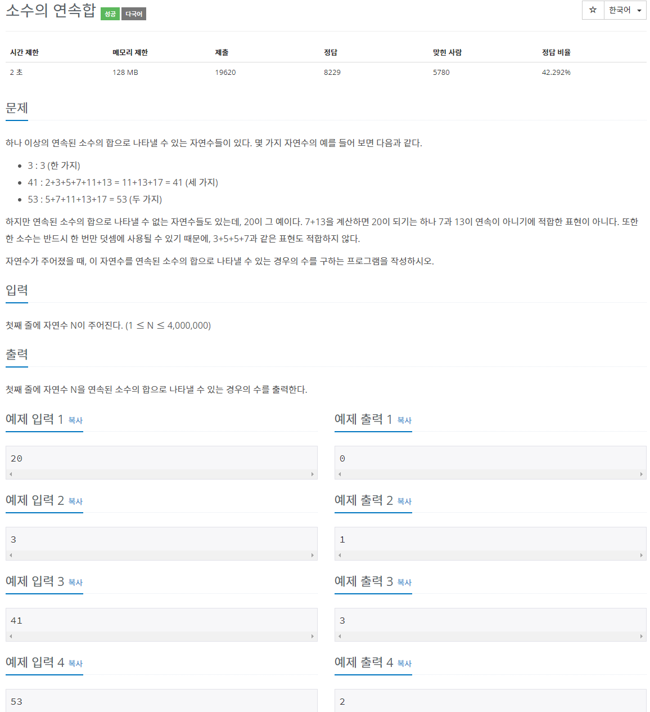
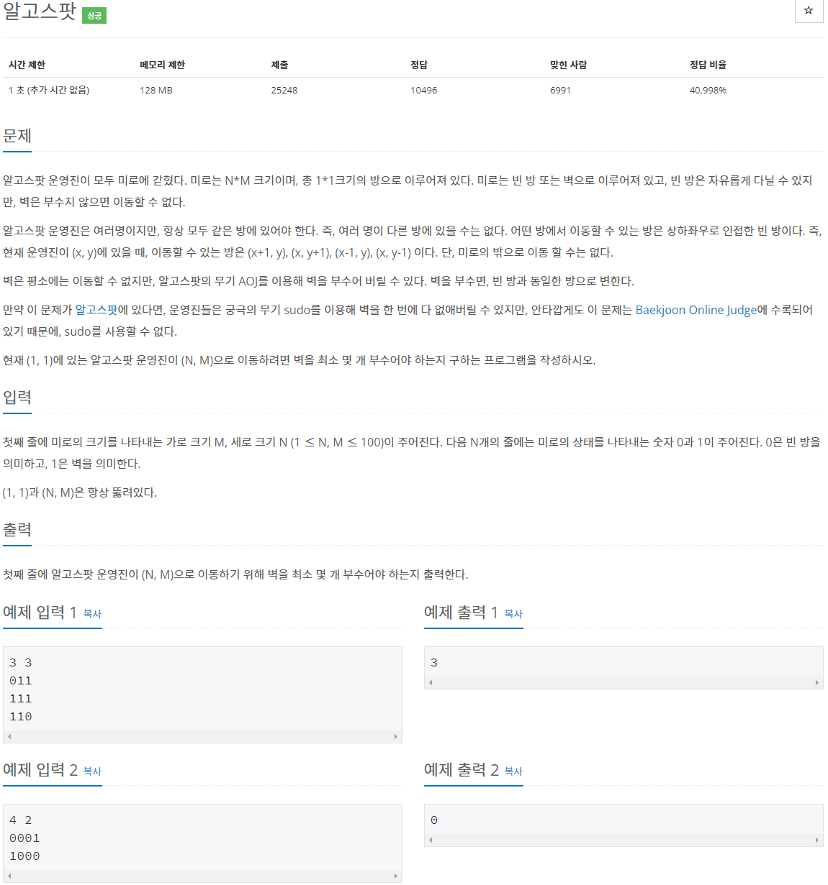
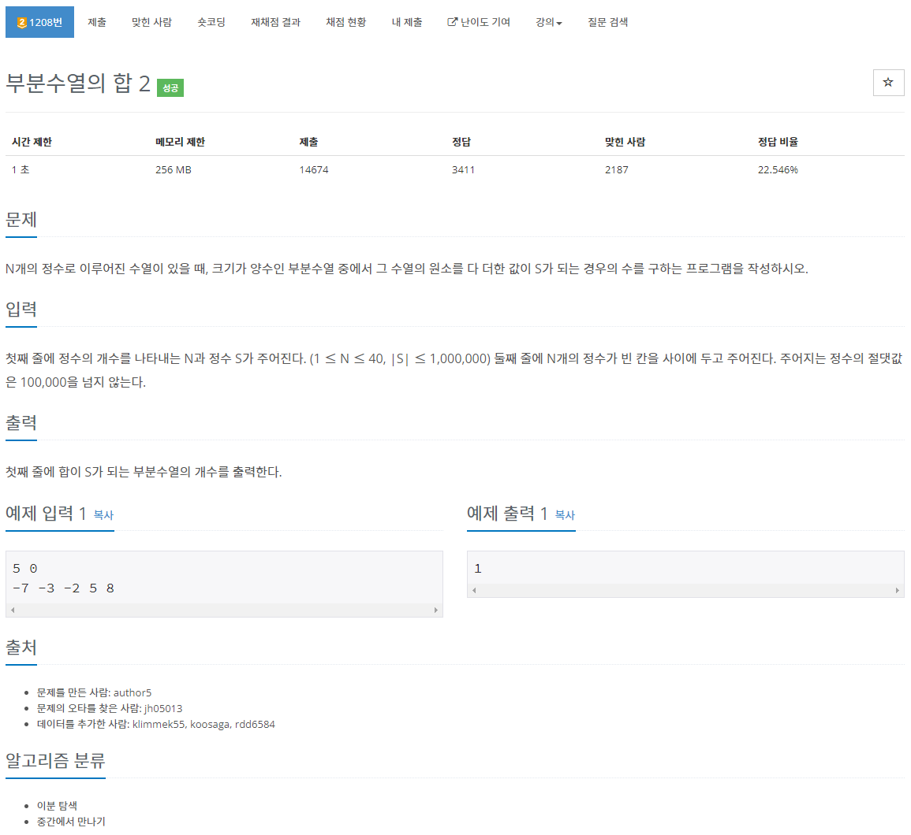
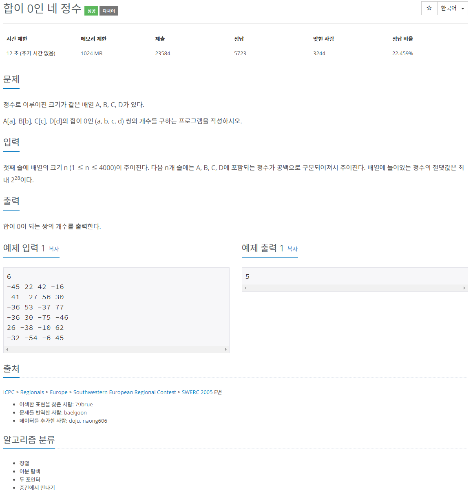
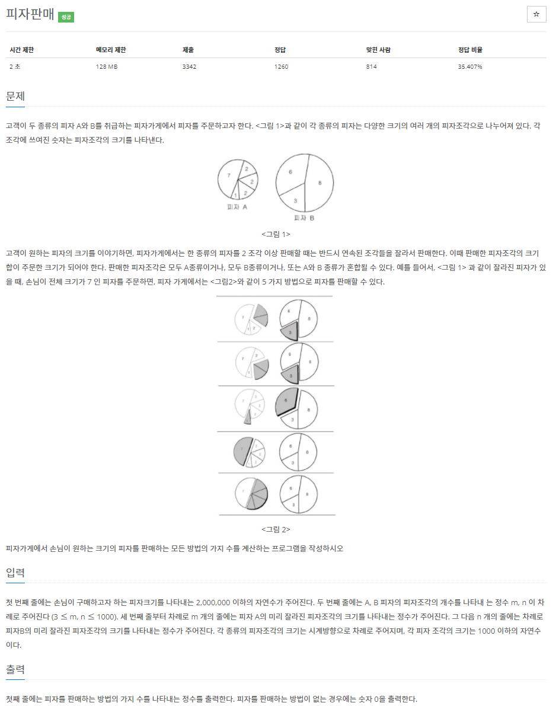
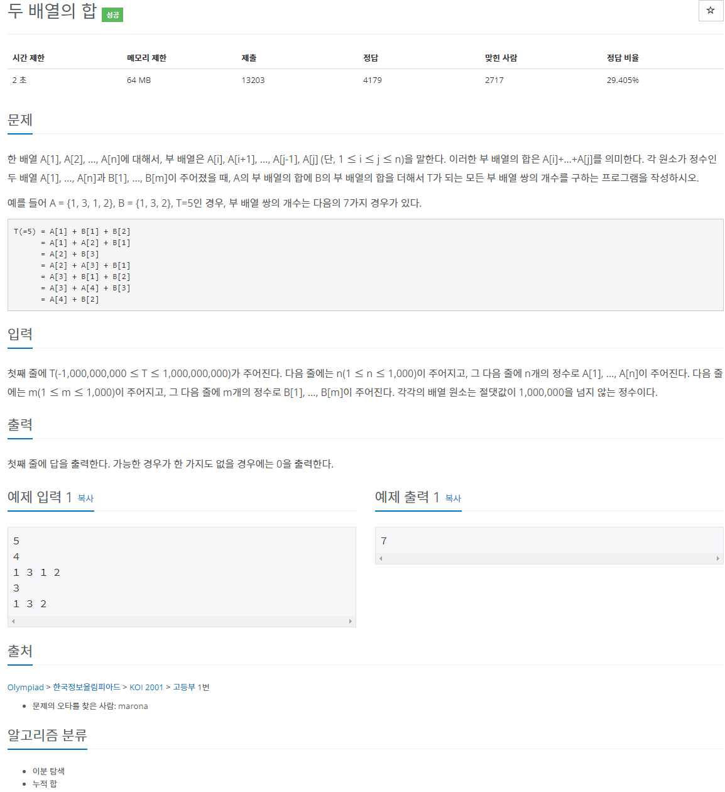

[문제집 출처](https://plzrun.tistory.com/entry/%EC%95%8C%EA%B3%A0%EB%A6%AC%EC%A6%98-%EB%AC%B8%EC%A0%9C%ED%92%80%EC%9D%B4PS-%EC%8B%9C%EC%9E%91%ED%95%98%EA%B8%B0)

## 수들의 합 2 (#2003)

[(링크)](https://www.acmicpc.net/problem/2003)



[풀이]

```cpp
#include<iostream>
using namespace std;
int n,m;
int a[10000];
int main(){
    ios::sync_with_stdio(false);
    cin.tie(NULL);
    cout.tie(NULL);

    cin >> n >> m;
    for(int i=0; i<n; i++)
        cin >> a[i];
    int start=0;
    int sum=a[0];
    int end=0;
    int cnt=0;

    while (true){ //투 포인터 알고리즘
        if (end >= n)
            break;
        if(sum == m)
            cnt++;
        if(sum <= m){ //start부터 end까지의 합이 m보다 클 경우 end를 늘림
            end++;
            sum+=a[end];
        }
        else{ //start부터 end까지의 합이 m보다 작을 경우 start를 늘림
            sum-=a[start];
            start++;
        }
    }
    cout << cnt;
}
```

## 부분합 (#1806)

[(링크)](https://www.acmicpc.net/problem/1806)



[풀이]

```cpp
#include<iostream>
using namespace std;
int n,m;
int a[100000];
int main(){
    ios::sync_with_stdio(false);
    cin.tie(NULL);
    cout.tie(NULL);

    cin >> n >> m;
    for(int i=0; i<n; i++)
        cin >> a[i];
    int start=0;
    int sum=a[0];
    int end=0;
    int min=n+1;

    while (true){
        if (end >= n)
            break;

        if(sum >= m){
            if(end-start+1 < min)
                min =end-start+1;
        }

        if(sum <= m){
            end++;
            sum+=a[end];
        }
        else{
            sum-=a[start];
            start++;
        }
    }

    if (min == n+1) //합을 만드는것이 불가능한 경우
        min=0;
    cout << min;
}
```

## 소수의 연속합 (#1644)

[(링크)](https://www.acmicpc.net/problem/1644)



[풀이]

```cpp
#include<iostream>
#include<vector>
using namespace std;
int n;
vector <int> prime;
bool is_prime[4000001];
void sieve(int n){
    for (int i=0; i<=n; i++)
        is_prime[i]=true;

    for(int i=2; i*i <=n; i++){
        if(is_prime[i]==false){
            continue;
        }

        for(int j= i*i ;j<=n;j+=i)
            is_prime[j]=false;
    }

    for (int i=2; i<=n; i++)
        if (is_prime[i]==true)
            prime.push_back(i);
}

int main(){
    ios::sync_with_stdio(false);
    cin.tie(NULL);
    cout.tie(NULL);
    cin >> n;
    if (n==1){
        cout << 0;
        return 0;
    }
    sieve(n);
    int num=prime.size();
    int start=0;
    int end=0;
    int cnt=0;
    int sum=prime[0];
    while (true){
        if (end >= num)
            break;
        if(sum == n)
            cnt++;
        if(sum <= n){
            end++;
            sum+=prime[end];
        }
        else{
            sum-=prime[start];
            start++;
        }
    }
    cout << cnt;
}
```

## 알고스팟 (#1261)

[(링크)](https://www.acmicpc.net/problem/1261)



[풀이]

```cpp
#include<iostream>
#include<string>
#include<queue>
using namespace std;
int map[100][100];
bool visited[100][100];
int shortest[100][100];
int n,m;
int answer=10000;
int dx[4]={1,-1,0,0};
int dy[4]={0,0,1,-1};

void BFS(int a, int b){
    queue<pair<int, int>> q;
    q.push(make_pair(a,b));
    shortest[a][b]=0;
    while(q.empty() == false){
        int x=q.front().first;
        int y=q.front().second;
        q.pop();

        for (int i=0; i<4; i++){
            int nx=x+dx[i];
            int ny=y+dy[i];
            if(nx>=0 && nx < m && ny >=0 && ny <= n){
                if(map[nx][ny]==1){ //다음 칸이 벽인 경우
                    if(shortest[nx][ny]>shortest[x][y]+1){ //다음 칸까지의 거리의 최소값보다 현재 칸까지의 거리+1이 더 짧으면 현재 칸에서 다음칸으로 이동
                        shortest[nx][ny]=shortest[x][y]+1;
                        q.push(make_pair(nx,ny));
                    }
                }
                else{ //다음 칸이 벽이 아닌 경우
                    if(shortest[nx][ny]>shortest[x][y]){ //다음 칸까지의 거리 최소값보다 현재 칸까지가 더 짧으면 현재 칸에서 다음칸으로 이동
                        shortest[nx][ny]=shortest[x][y];
                        q.push(make_pair(nx,ny));
                    }
                }
            }
        }
    }

}

int main(){
    ios::sync_with_stdio(false);
    cin.tie(NULL);
    cout.tie(NULL);
    cin >> n >> m;
    for(int i=0; i<m;i++){
        string temp;
        cin >> temp;
        for(int j=0; j<n; j++){
            map[i][j]=temp[j]-'0';
            shortest[i][j]=10000;
        }
    }
    BFS(0,0);
    cout << shortest[m-1][n-1];
}

```

## 부분수열의 합 2 (#1208)

[(링크)](https://www.acmicpc.net/problem/1208)



[풀이]

```cpp
#include<iostream>
#include<map>
using namespace std;
int n,s;
long long answer;
int arr[41];
map<int,int> halfsum;

void dfs_left(int index, int sum){ // 왼쪽 절반에서 파생되는 부분집합의 합 계산
    if(index == n/2){ // 합이 sum인 부분집합의 개수를 halfsum[sum]에 저장
        halfsum[sum]++;
        return;
    }
    dfs_left(index+1,sum); //index를 부분집합에 포함시키지 않고 다음 탐색
    dfs_left(index+1,sum+arr[index]); //index를 부분집합에 포함시키고 다음 탐색
}

void dfs_right(int index, int sum){// 오른쪽 절반에서 파생되는 부분집합의 합 계산
    if (index ==n){
        answer +=halfsum[s-sum]; //왼쪽 부분집합의 합이 s-sum, 오른쪽 부분집합의 합이 sum 이라면 두 집합의 합집합이
        return;
    }
    dfs_right(index+1,sum); //index를 부분집합에 포함시키지 않고 다음 탐색
    dfs_right(index+1,sum +arr[index]); //index를 부분집합에 포함시키고 다음 탐색
}

int main(){
    ios_base::sync_with_stdio(false);
    cin.tie(NULL);
    cout.tie(NULL);
    cin >> n >> s;
    for(int i=0; i<n; i++)
        cin >> arr[i];

    dfs_left(0,0);
    dfs_right(n/2,0);
    if (s==0)
        answer--;
    cout << answer;
}
```

## 합이 0인 네 정수 (#7453)

[(링크)](https://www.acmicpc.net/problem/7453)



[풀이]

```cpp
#include<iostream>
#include<vector>
#include<algorithm>
using namespace std;
int n;
long long int arr[4][4000];
vector<int> halfsum;
long long int answer=0;
int main(){
    ios_base::sync_with_stdio(false);
    cin.tie(NULL);
    cout.tie(NULL);
    cin >> n;
    for(int i=0; i<n; i++)
        for(int j=0; j<4; j++)
            cin >> arr[j][i];
    for(int i=0; i<n; i++)
        for(int j=0; j<n; j++)
            halfsum.push_back(arr[0][i]+arr[1][j]); //앞 두 행렬에서 수를 골라 더함

    sort(halfsum.begin(),halfsum.end());

    for(int i=0; i<n; i++)
        for(int j=0; j<n; j++){
            long long int half=arr[2][i]+arr[3][j];

            //halfsum 의 값중 -half 보다 크거나 같은 가장 작은 값의 index low
            long long int low = lower_bound(halfsum.begin(),halfsum.end(),-half)-halfsum.begin();
            //halfsum 의 값중 -half 보다 작거나 같은 가장 큰 값의 index how
            long long int high = upper_bound(halfsum.begin(),halfsum.end(),-half)-halfsum.begin();

            if(-half == halfsum[low]) //
                answer += (high-low);
        }
    cout << answer;
}
```

## 피자판매 (#2632)

[(링크)](https://www.acmicpc.net/problem/2632)



[풀이]

```cpp
#include<iostream>
using namespace std;
int order;
int m,n;
int pieces1[1000],chosen1[2000001]={1,};
int pieces2[1000],chosen2[2000001]={1,};
int result=0;

void search(int num, int pieces[], int chosen[]){
    for(int i=1; i<=num;i++){ // i개의 연속한 조각을 뽑는 경우
        int sum=0;
        for (int j=0;j<i;j++)
            sum+=pieces[j]; //0번부터 i개 조각을 뽑음
        chosen[sum]++;
        if(i!=num)
            for(int j=1; j<num; j++){ //j번부터 i개 조각을 뽑음
                sum-=pieces[j-1];
                sum+=pieces[(j+i-1)%num];
                chosen[sum]++;
            }
    }
}

int main(){
    ios_base::sync_with_stdio(false);
    cin.tie(NULL);
    cout.tie(NULL);
    cin >> order >> m >> n;
    for (int i=0; i<m; i++)
        cin >> pieces1[i];
    for (int i=0; i<n; i++)
        cin >> pieces2[i];
    search(m,pieces1,chosen1);
    search(n,pieces2,chosen2);

    for(int i=0; i<=order; i++){
        result+= chosen1[i]*chosen2[order-i];
    }
    cout << result;
}
```

## 두 배열의 합 (#2143)

[(링크)](https://www.acmicpc.net/problem/2143)



[풀이]

```cpp
#include<iostream>
#include<vector>
#include<algorithm>
using namespace std;
int t;
int n,m;
int a[1000],b[1000];
long long answer=0;
vector<int> sum_a,sum_b;

int main(){
    cin >> t;
    cin >> n;
    for(int i=0; i<n; i++)
        cin >> a[i];
    cin >> m;
    for(int i=0; i<m; i++)
        cin >> b[i];

    for(int i=0; i<n; i++){
        int sum=a[i];
        sum_a.push_back(sum);
        for(int j=i+1; j<n; j++){
            sum+=a[j];
            sum_a.push_back(sum);
        }
    }

    sort(sum_a.begin(),sum_a.end());

    for(int i=0; i<m; i++){
        int sum=b[i];
        sum_b.push_back(sum);
        for(int j=i+1; j<m; j++){
            sum+=b[j];
            sum_b.push_back(sum);
        }
    }

    for(int i=0; i<sum_b.size(); i++){
        int sum=t-sum_b[i];
        answer += (upper_bound(sum_a.begin(),sum_a.end(),sum) - lower_bound(sum_a.begin(),sum_a.end(),sum));
    }

    cout << answer;
}
```
