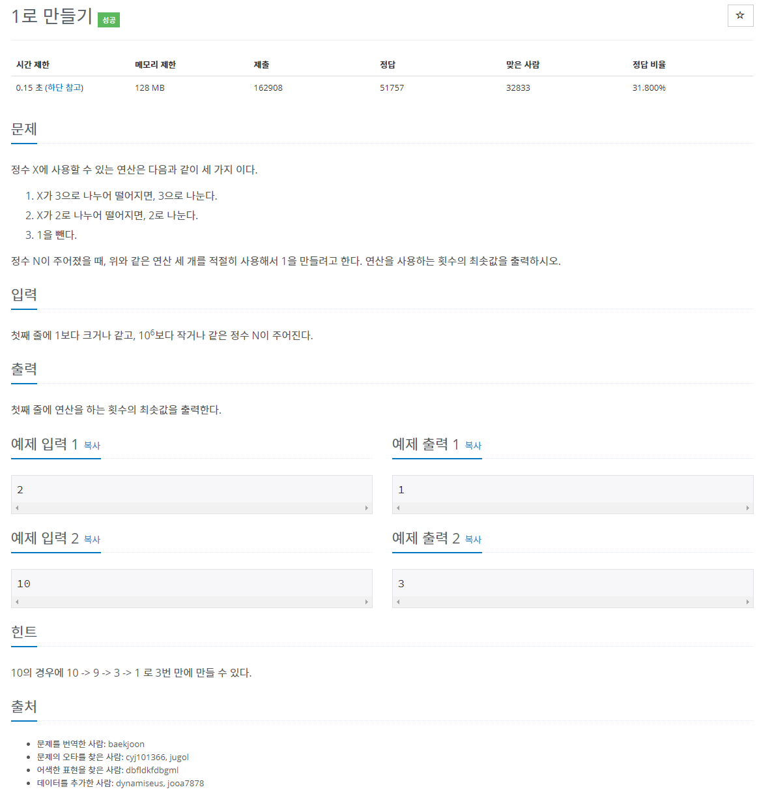
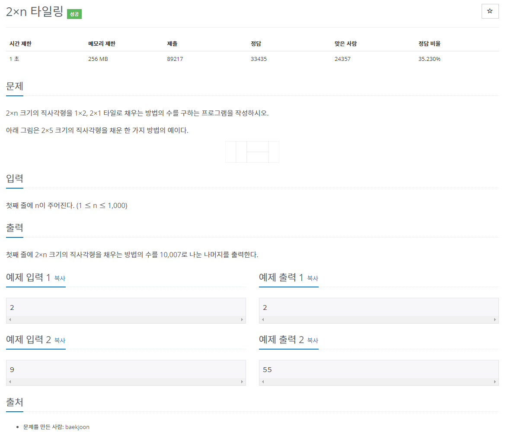
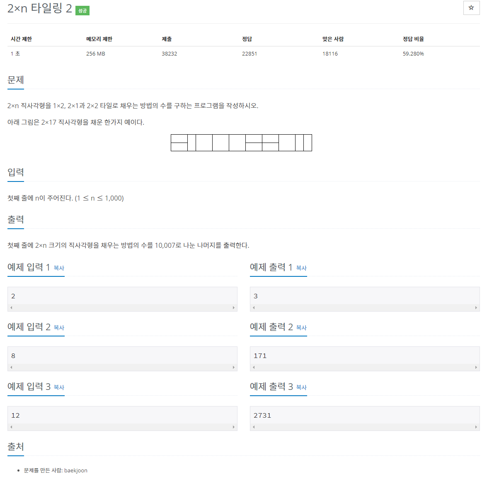
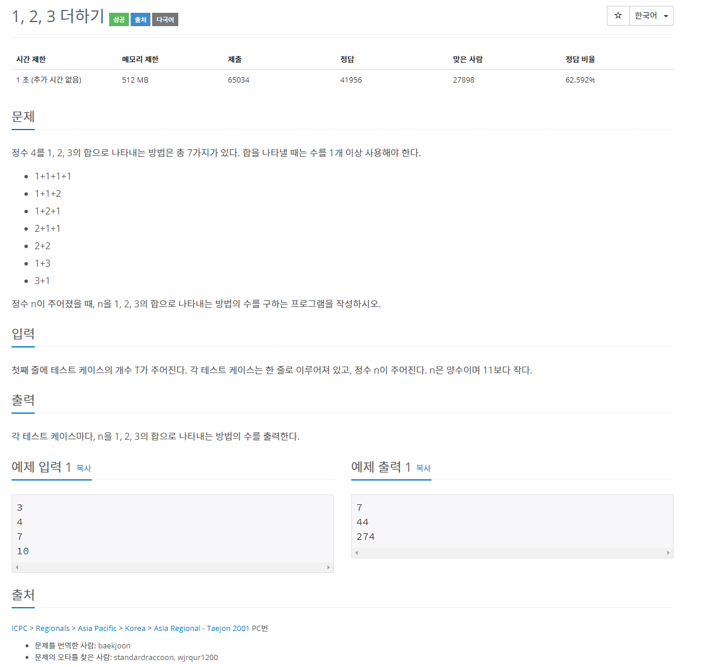
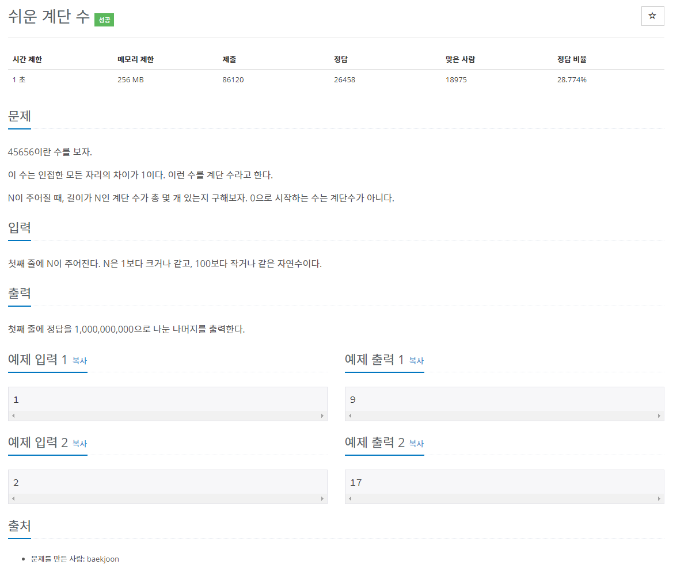
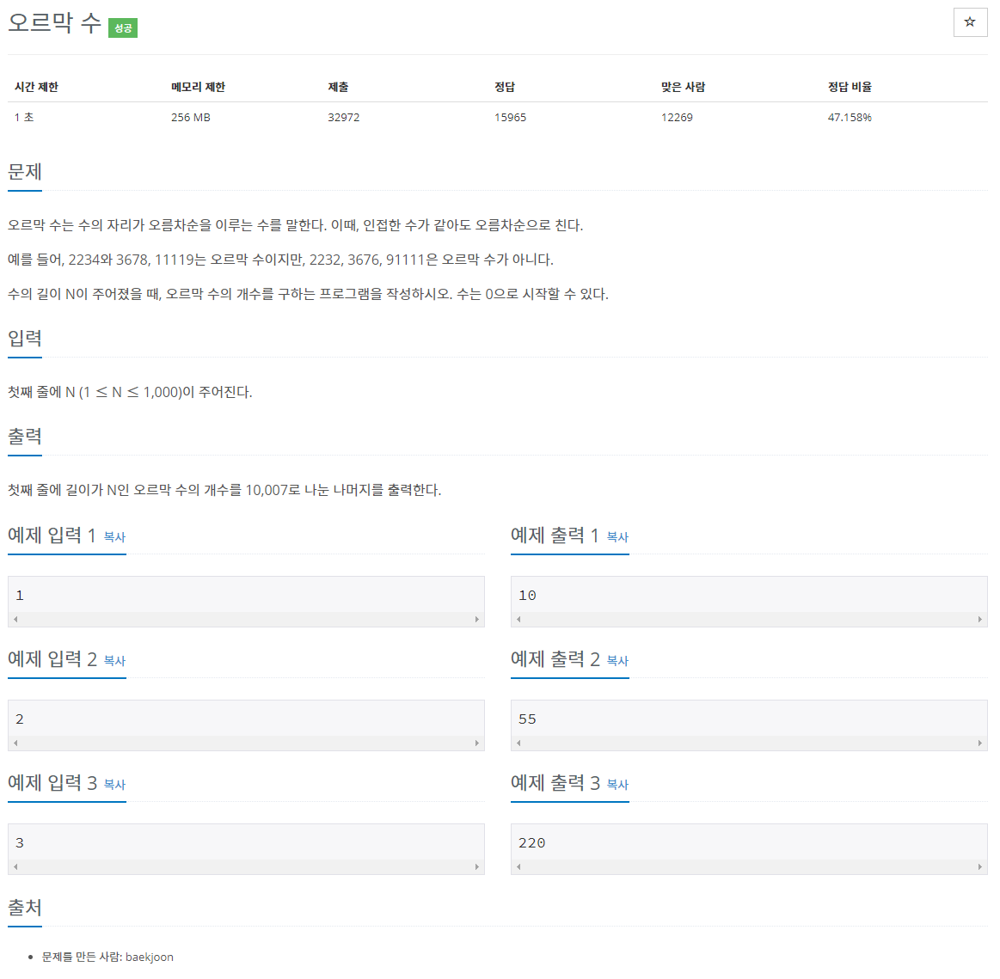
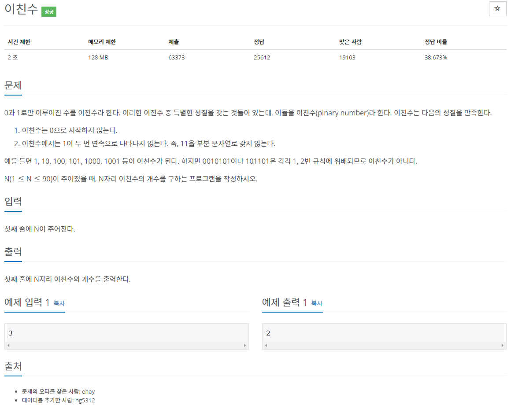
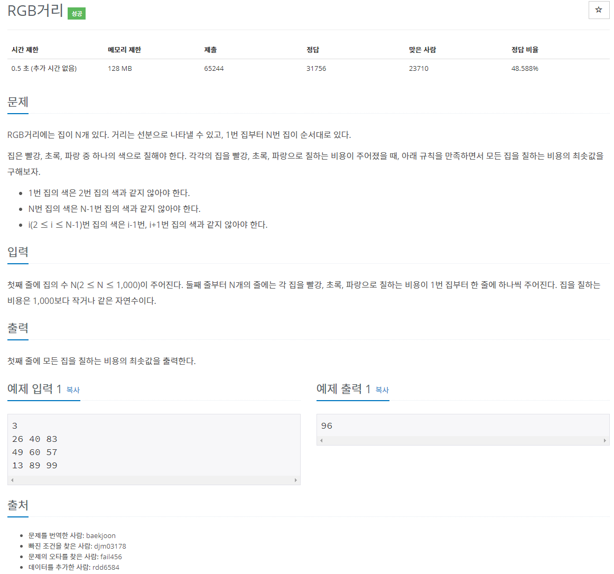
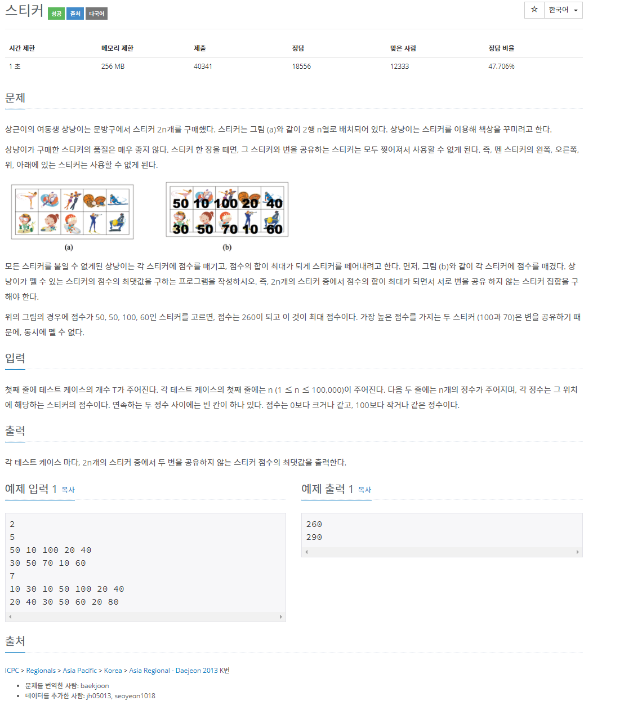
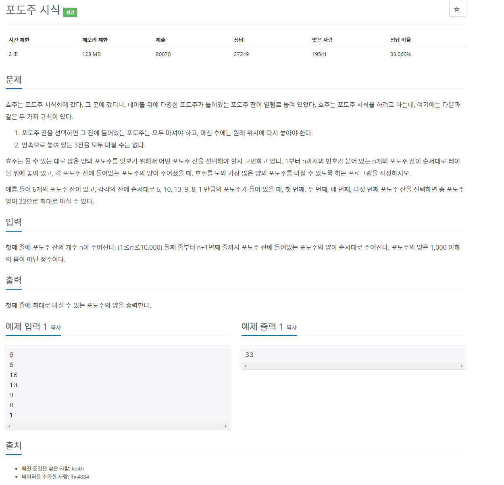

[문제집 출처](https://plzrun.tistory.com/entry/%EC%95%8C%EA%B3%A0%EB%A6%AC%EC%A6%98-%EB%AC%B8%EC%A0%9C%ED%92%80%EC%9D%B4PS-%EC%8B%9C%EC%9E%91%ED%95%98%EA%B8%B0)

## 1로 만들기 (#1463)

[(링크)](https://www.acmicpc.net/problem/1463)



[풀이]

```cpp
#include<iostream>
#include<algorithm>
using namespace std;
int dp[1000000];
int main(){
    int n;
    cin >> n;

    dp[1]=0;
    for(int i=2; i<=n;i++){
        if(i%6==0)
            dp[i]=min(min(dp[i/2],dp[i-1]),dp[i/3])+1;
        else if (i%2==0)
            dp[i]=min(dp[i/2],dp[i-1])+1;
        else if (i%3==0)
            dp[i]=min(dp[i/3],dp[i-1])+1;
        else
            dp[i]=dp[i-1]+1;
    }
    cout << dp[n];
}
```

## 2×n 타일링 (#11726)

[(링크)](https://www.acmicpc.net/problem/11726)



[풀이]

```cpp
#include<iostream>
using namespace std;
int dp[1001];
int main(){
    dp[1]=1;
    dp[2]=2;

    int n;
    cin >> n;
    for(int i=3;i<=n;i++){
        dp[i]=(dp[i-1]+dp[i-2])%10007;
    }
    cout << dp[n];
}
```

## 2×n 타일링 2 (#11727)

[(링크)](https://www.acmicpc.net/problem/11727)



[풀이]

```cpp
#include<iostream>
using namespace std;
int dp[1001];
int main(){
    dp[1]=1;
    dp[2]=3;

    int n;
    cin >> n;
    for(int i=3;i<=n;i++){
        dp[i]=(dp[i-1]+2*dp[i-2])%10007;
    }
    cout << dp[n];
}
```

## 1, 2, 3 더하기 (#9095)

[(링크)](https://www.acmicpc.net/problem/9095)



[풀이]

```cpp
#include<iostream>
using namespace std;
int dp[11];
int main(){
    dp[1]=1;
    dp[2]=2;
    dp[3]=4;
    for(int i=4; i<11; i++){
        dp[i]=dp[i-1]+dp[i-2]+dp[i-3];
    }
    int t;
    cin >> t;
    while(t--){
        int n;
        cin >> n;
        cout << dp[n] << '\n';
    }
}
```

## 쉬운 계단 수 (#10844)

[(링크)](https://www.acmicpc.net/problem/10844)



[풀이]

```cpp
#include<iostream>
using namespace std;
int dp[101][10];// 길이 n, 마지막 자리가 a 인 계단수의 개수 dp[n][a]
int main(){
    dp[1][0]=0;
    for(int i=1;i<10;i++){
        dp[1][i]=1;
    }

    int n;
    cin >>n;
    for(int i=2;i<=n;i++){
        dp[i][0]=dp[i-1][1];
        for(int j=1;j<=8;j++){
            dp[i][j]=(dp[i-1][j-1]+dp[i-1][j+1])%1000000000;
        }
        dp[i][9]=dp[i-1][8];
    }

    int sum=0;
    for(int i=0;i<10;i++){
        sum=(sum+dp[n][i])%1000000000;
    }
    cout << sum;
}
```

## 오르막 수 (#11057)

[(링크)](https://www.acmicpc.net/problem/11057)



[풀이]

```cpp
#include<iostream>
using namespace std;
int dp[1001][10]={0,};// 길이 n, 마지막 자리가 a 인 오르막 수의 개수 dp[n][a]
int main(){
    for(int i=0;i<10;i++){
        dp[1][i]=1;
    }

    int n;
    cin >>n;
    for(int i=2;i<=n;i++){
        for(int j=0;j<=9;j++){
            for(int k=0; k<=j;k++){
                dp[i][j]=(dp[i][j]+dp[i-1][k])%10007;
            }
        }
    }

    int sum=0;
    for(int i=0;i<10;i++){
        sum=(sum+dp[n][i])%10007;
    }
    cout << sum;
}
```

## 이친수 (#2193)

[(링크)](https://www.acmicpc.net/problem/2193)



[풀이]

```cpp
#include<iostream>
using namespace std;
long long int dp[91][2]={0,};// 길이 n, 마지막 자리가 a 인 이친수의 개수 dp[n][a]
int main(){
    dp[1][1]=1;

    int n;
    cin >>n;
    for(int i=2;i<=n;i++){
        dp[i][0]=dp[i-1][0]+dp[i-1][1];
        dp[i][1]=dp[i-1][0];
    }

    cout << dp[n][0]+dp[n][1];
}
```

## RGB거리 (#1149)

[(링크)](https://www.acmicpc.net/problem/1149)



[풀이]

```cpp
#include<iostream>
using namespace std;

long long int dp[1001][3]={0,};

long long int min(long long int a,long long int b){
    if(a>b)
        return b;
    else
        return a;
}

int main(){
    int n;
    cin >> n;
    int arr[n+1][3];
    for(int i=1; i<=n;i++){
        cin >> arr[i][0] >> arr[i][1] >> arr[i][2];
    }

    dp[1][0]=arr[1][0];
    dp[1][1]=arr[1][1];
    dp[1][2]=arr[1][2];

    for(int i=2; i<=n;i++){
        dp[i][0]=min(dp[i-1][1], dp[i-1][2])+arr[i][0];
        dp[i][1]=min(dp[i-1][0], dp[i-1][2])+arr[i][1];
        dp[i][2]=min(dp[i-1][0], dp[i-1][1])+arr[i][2];
    }

    cout << min(min(dp[n][0],dp[n][1]),dp[n][2]);
}
```

## 스티커 (#9465)

[(링크)](https://www.acmicpc.net/problem/9465)



[풀이]

```cpp
#include<iostream>
using namespace std;
long long int dp[2][100000];// a 행 b열의 스티커를 포함하는 조합의 최댓값 dp[a][b];
long long int max(long long int a, long long int b){
    if(a>=b)
        return a;
    else
        return b;
}
int main(){
    int t;
    cin >> t;
    while(t--){
        int n;
        cin >> n;
        int arr[2][n+1];
        for(int i=1; i<=n;i++)
            cin >> arr[0][i];
        for(int i=1;i<=n; i++)
            cin >> arr[1][i];

        dp[0][1]=arr[0][1];
        dp[1][1]=arr[1][1];
        dp[0][2]=arr[1][1]+arr[0][2];
        dp[1][2]=arr[0][1]+arr[1][2];
        for(int i=3; i<=n; i++){
            dp[0][i]=arr[0][i]+max(dp[1][i-1],dp[1][i-2]);
            dp[1][i]=arr[1][i]+max(dp[0][i-1],dp[0][i-2]);
        }

        cout << max(dp[0][n],dp[1][n]) << '\n';
    }
}
```

## 포도주 시식 (#2156)

[(링크)](https://www.acmicpc.net/problem/2156)



[풀이]

```cpp
#include<iostream>
using namespace std;
long long int dp[10001]={0,}; //앞선 연속한 i개가 포함되고 n번째를 포함할때 최대값 dp[i][n];
long long int max(long long int a, long long int b, long long int c){
    if(a>b){
        if(a>c)
            return a;
        else
            return c;
    }
    else{
        if(b<c)
            return c;
        else
            return b;
    }
}

int main(){
    int n;
    cin >> n;
    int arr[n+1];
    for(int i=1; i<=n; i++){
        cin >> arr[i];
    }

    dp[1]=arr[1];
    dp[2]=arr[1]+arr[2];
    for(int i=3; i<=n;i++){
        dp[i]=max(dp[i-1],dp[i-2]+arr[i],dp[i-3]+arr[i-1]+arr[i]);
    }

    cout << dp[n];
}
```
