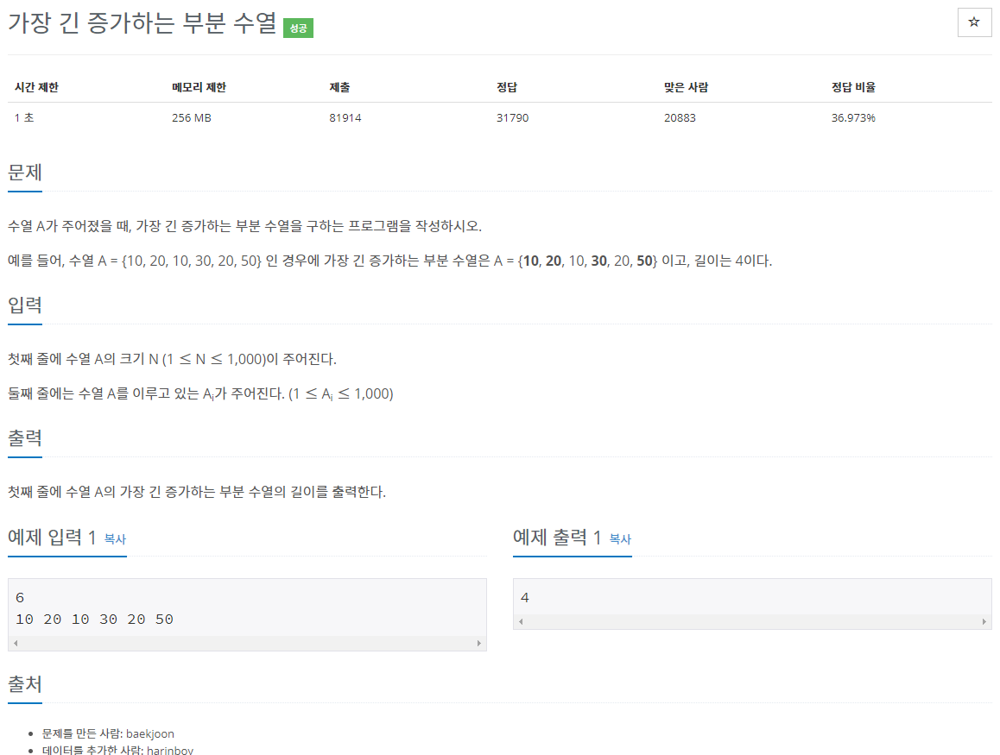
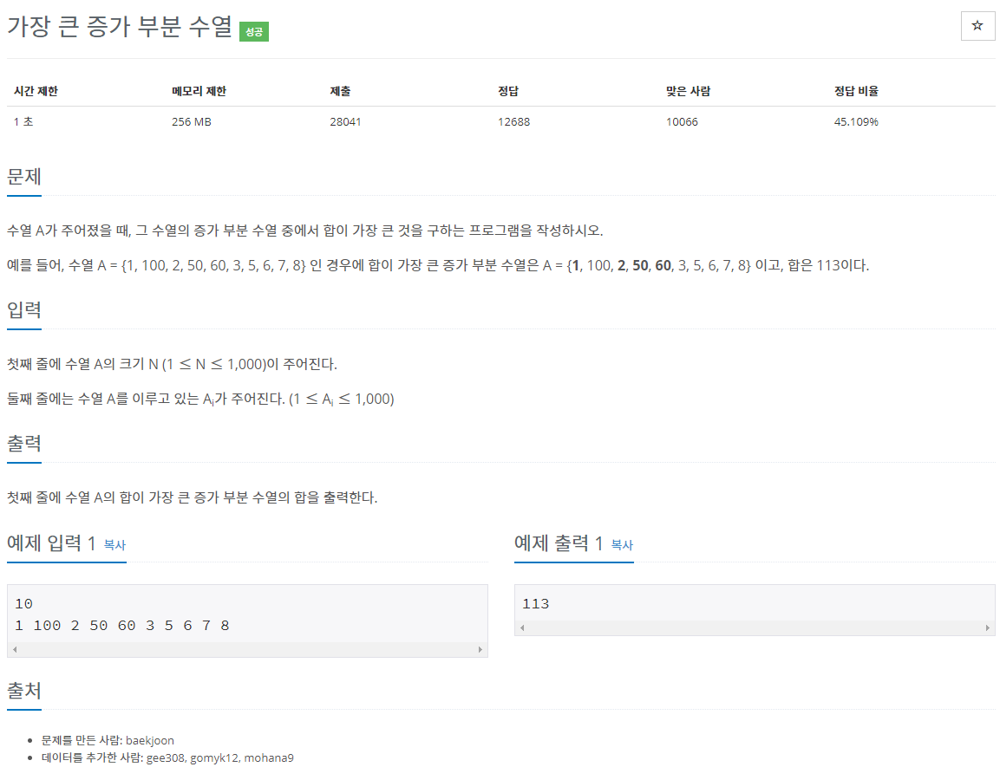
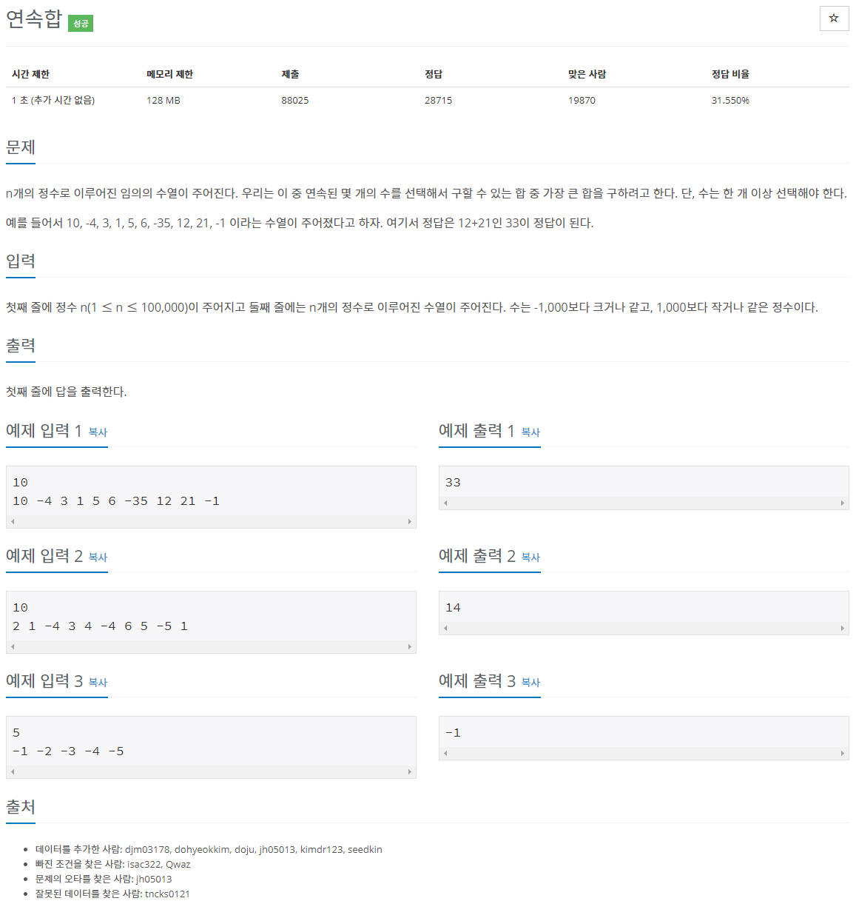
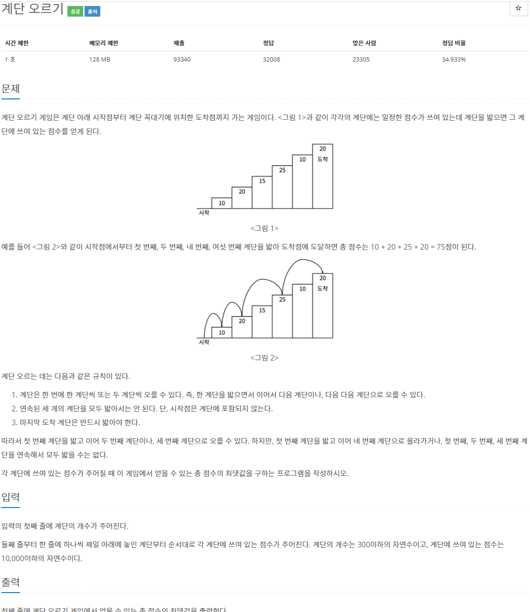
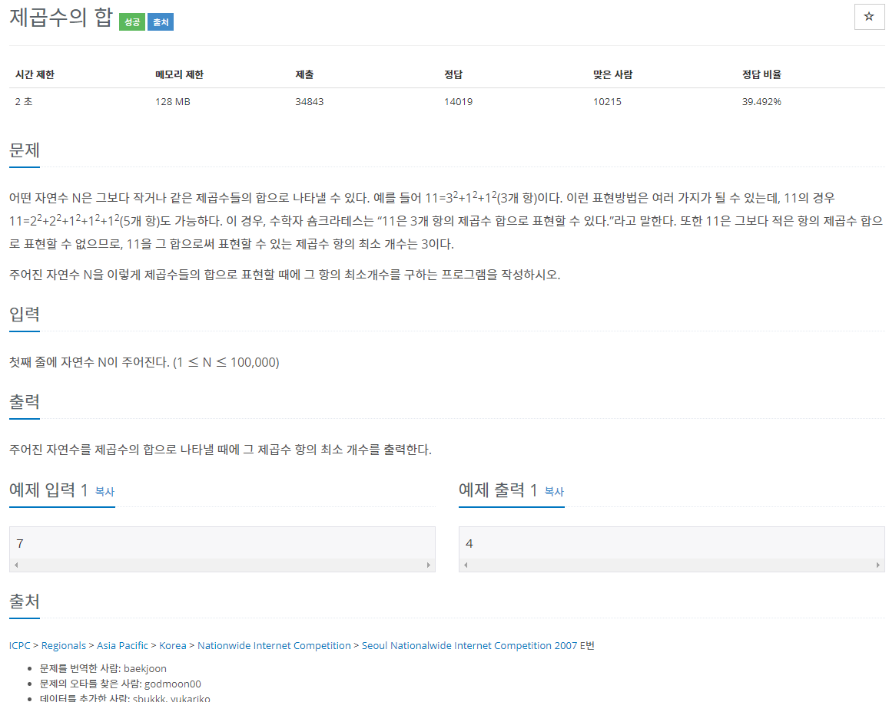
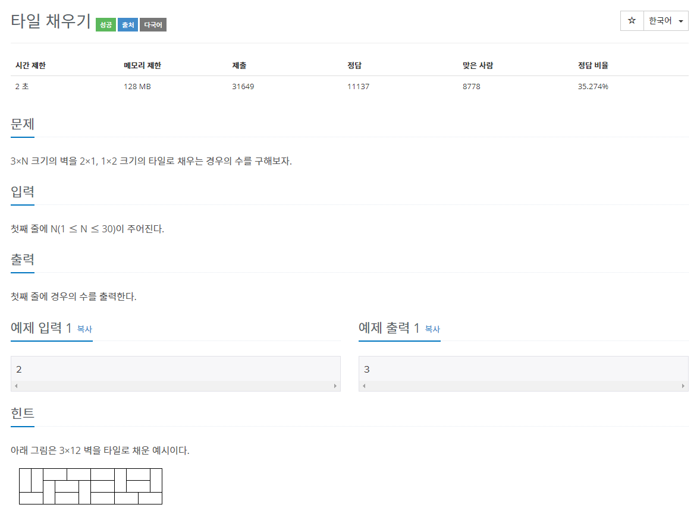
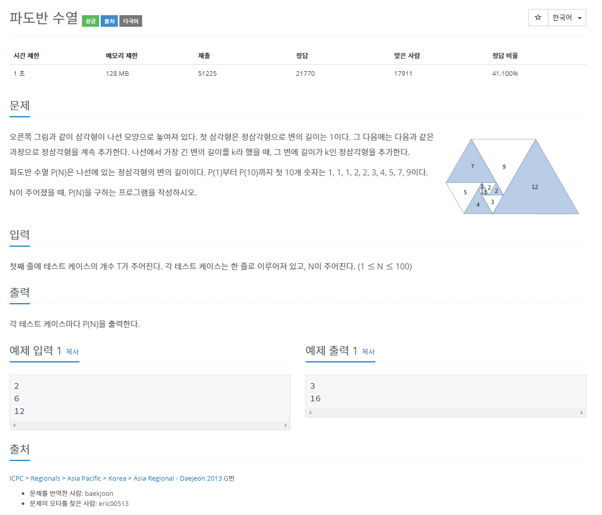
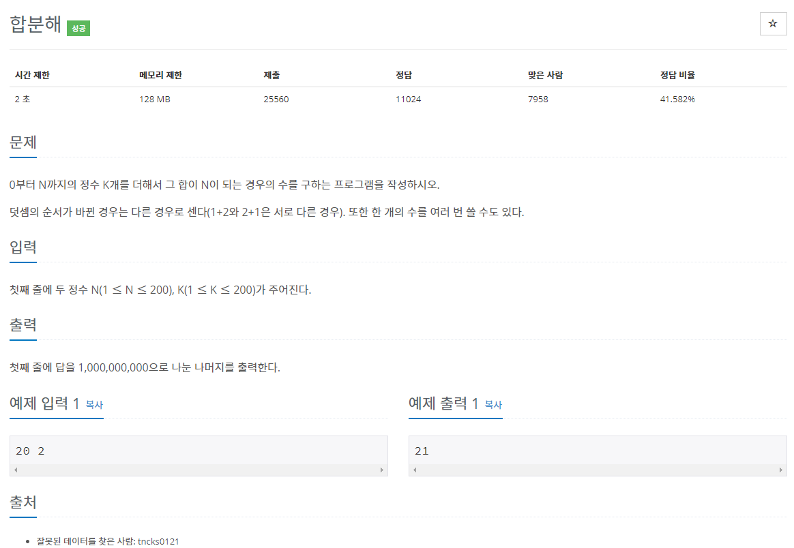
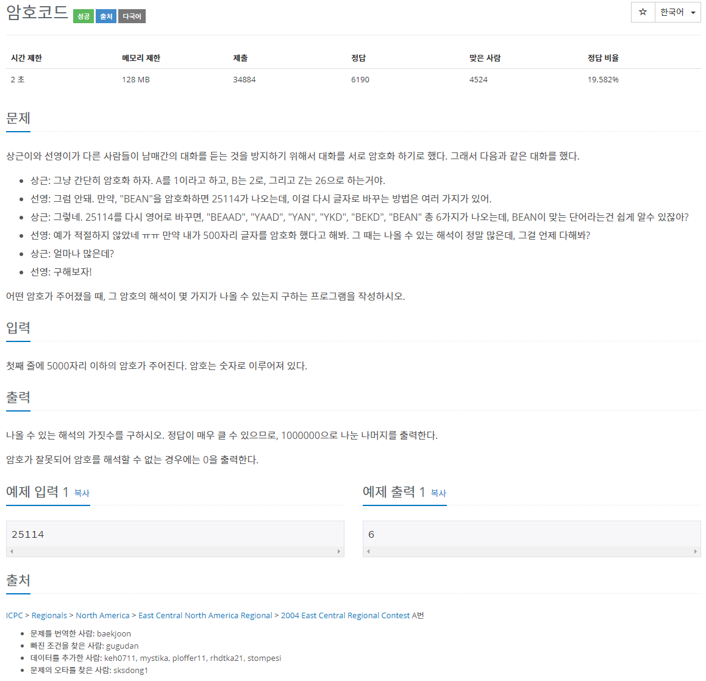
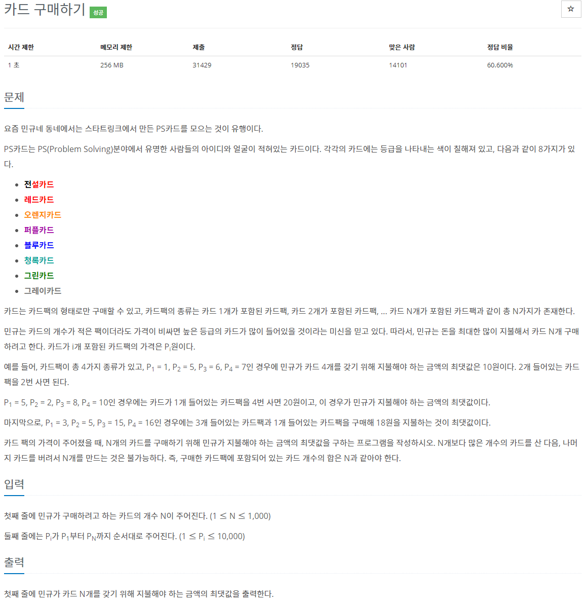

[문제집 출처](https://plzrun.tistory.com/entry/%EC%95%8C%EA%B3%A0%EB%A6%AC%EC%A6%98-%EB%AC%B8%EC%A0%9C%ED%92%80%EC%9D%B4PS-%EC%8B%9C%EC%9E%91%ED%95%98%EA%B8%B0)

## 가장 긴 증가하는 부분 수열 (#11053)

[(링크)](https://www.acmicpc.net/problem/11053)



[풀이]

```cpp
#include<iostream>
using namespace std;
int dp[1001]={0,}; // n번째 수로 끝나는 가장 긴 증가하는 부분수열 dp[n];
int main(){
    int n;
    cin >> n;
    int arr[n+1];
    for (int i=1; i<=n; i++){
        cin >> arr[i];
    }
    dp[1]=1;
    for(int i=2;i<=n;i++){
        int max=0;
        for(int j=1;j<i;j++){
            if(arr[j] < arr[i]){
                if(dp[j]>max)
                    max=dp[j];  // 가장 큰 수가 i 번째 수 보다 작은 가장 긴 증가하는 부분 수열 을 max에 저장
            }
        }
        dp[i]=max+1;
    }

    int max=0;
    for(int i=1; i<=n;i++){
        if (dp[i]>max)
            max=dp[i];
    }
    cout << max;
}
```

## 가장 큰 증가 부분 수열 (#11055)

[(링크)](https://www.acmicpc.net/problem/11055)



[풀이]

```cpp
#include<iostream>
using namespace std;
long long int dp[1001]={0,}; // n번째 수로 끝나는 가장 긴 증가하는 부분수열 dp[n];
int main(){
    int n;
    cin >> n;
    int arr[n+1];
    for (int i=1; i<=n; i++){
        cin >> arr[i];
    }
    dp[1]=arr[1];
    for(int i=2;i<=n;i++){
        int max=0;
        for(int j=1;j<i;j++){
            if(arr[j] < arr[i]){
                if(dp[j]>max)
                    max=dp[j];  // 가장 큰 수가 i 번째 수 보다 작은 가장 긴 증가하는 부분 수열 을 max에 저장
            }
        }
        dp[i]=max+arr[i];
    }

    int max=0;
    for(int i=1; i<=n;i++){
        if (dp[i]>max)
            max=dp[i];
    }
    cout << max;
}
```

## 가장 긴 감소하는 부분 수열 (#11722)

[(링크)](https://www.acmicpc.net/problem/11722)


[풀이]

```cpp
#include<iostream>
using namespace std;
int dp[1001]={0,}; // n번째 수로 끝나는 가장 긴 감소하는 부분수열 dp[n];
int main(){
    int n;
    cin >> n;
    int arr[n+1];
    for (int i=1; i<=n; i++){
        cin >> arr[i];
    }
    dp[1]=1;
    for(int i=2;i<=n;i++){
        int max=0;
        for(int j=1;j<i;j++){
            if(arr[j] > arr[i]){
                if(dp[j]>max)
                    max=dp[j];  // 가장 작은 수가 i 번째 수 보다 큰 가장 긴 감소하는 부분 수열 을 max에 저장
            }
        }
        dp[i]=max+1;
    }

    int max=0;
    for(int i=1; i<=n;i++){
        if (dp[i]>max)
            max=dp[i];
    }
    cout << max;
}
```

## 가장 긴 바이토닉 부분 수열 (#11054)

[(링크)](https://www.acmicpc.net/problem/11054)


[풀이]

```cpp
#include<iostream>
using namespace std;
int dpa[1001]={0, }; // n번째 수로 끝나는 가장 긴 감소하는 부분수열 dpa[n];
int dpd[1001]={0, }; // n번째 수부터 시작하는 가장 긴 감소하는 부분수열 dpd[n];
int main(){
    int n;
    cin >> n;
    int arr[n+1];
    for (int i=1; i<=n; i++){
        cin >> arr[i];
    }

    dpa[1]=1;
    for(int i=2;i<=n;i++){
        int maxa=0;
        for(int j=1;j<i;j++){
            if(arr[j] < arr[i]){
                if(dpa[j]>maxa)
                    maxa=dpa[j];  // 가장 큰 수가 i 번째 수 보다 작은 가장 긴 증가하는 부분 수열 을 maxa에 저장
            }
        }
        dpa[i]=maxa+1;
    }//1부터 i번째 수 중 i로 끝나는 가장 긴 증가수열 계산

    dpd[n]=1;
    for(int i=n-1; i>0; i--){
        int maxd=0;
        for(int j=n;j>i;j--){
            if(arr[j] < arr[i]){
                if(dpd[j]>maxd)
                    maxd=dpd[j];
            }
        }
        dpd[i]=maxd+1;

    }// 역으로 i부터 n번째 수 중 i로 시작하는 가장 긴 감소수열 계산

    int max=0;
    for(int i=1; i<=n;i++){
        if (dpa[i]+dpd[i]-1>max)//i가 최대값인 가장 긴 바이토닉 수열 = dpa[i] + dpd[i] -1
            max=dpa[i]+dpd[i]-1;
    }
    cout << max;
}
```

## 연속합 (#1912)

[(링크)](https://www.acmicpc.net/problem/1912)



[풀이]

```cpp
#include<iostream>
using namespace std;
int main(){
    int n;
    cin >> n;
    int arr[n];
    for(int i=0; i<n; i++){
        cin >> arr[i];
    }
    int dp[n]; //n번째 수를 포함하는 최대 연속합
    dp[0]=arr[0];
    for(int i=1; i<n; i++){
        if(dp[i-1]<0)
            dp[i]=arr[i];
        else
            dp[i]=dp[i-1]+arr[i];
    }
    int max=dp[0];
    for(int i=1; i<n; i++){
        if(dp[i]>max)
            max=dp[i];
    }
    cout << max;

}
```

## 계단 오르기 (#2579)

[(링크)](https://www.acmicpc.net/problem/2579)



[풀이]

```cpp
#include<iostream>
using namespace std;

int max(int a, int b){
    if( a>b)
        return a;
    else
        return b;
}

int main(){
    int n;
    cin >> n;
    int arr[n+1];
    for(int i=1; i<=n; i++){
        cin >> arr[i];
    }
    int dp1[n+1]; // n번째 계단과 n-1번쨰 계단을 밟았을 때의 최댓값 dp1[n];
    int dp2[n+1]; // n번째 계단을 밟고 n-1계단을 밟지 않았을 때의 최댓값 dp2[n];

    dp1[1]=arr[1];
    dp1[2]=arr[1]+arr[2];
    dp2[1]=arr[1];
    dp2[2]=arr[2];

    for(int i=3; i<=n; i++){
        dp1[i]=dp2[i-1]+arr[i];
        dp2[i]=max(dp1[i-2],dp2[i-2])+arr[i];
    }

    cout << max(dp1[n],dp2[n]);

}
```

## 제곱수의 합 (#1699)

[(링크)](https://www.acmicpc.net/problem/1699)



[풀이]

```cpp
#include<iostream>
using namespace std;
int min(int a,int b){
    if( a < b)
        return a;
    else
        return b;
}

int main(){
    int n;
    cin >> n;
    int dp[n+1];
    for(int i=0;i<=n;i++){
        dp[i]=i; // 최댓값= 모두 1로 더할 때
    }
    for(int i=2;i<=n;i++){
        for(int j=1; j*j <=i; j++){
            dp[i]=min(dp[i],dp[i-j*j]+1);
        }
    }

    cout << dp[n];
}
```

## 타일 채우기 (#2133)

[(링크)](https://www.acmicpc.net/problem/2133)



[풀이]

```cpp
#include<iostream>
using namespace std;
int main(){
    int n;
    cin >> n;
    int a[n+1]; // 3xN 벽을 채우는 경우의 수
    int b[n+1]; // 3XN 벽에 2X1 타일을 한개 채운 ㄱ자형 벽을 채우는 경우의 수

    a[0]=0;
    a[1]=0;
    a[2]=3;
    b[0]=0;
    b[1]=0;
    b[2]=1;
    for(int i=3; i<=n; i++){
        b[i]=a[i-2]+b[i-2];
        a[i]=2*a[i-2]+b[i]+b[i-2];
    }
    cout << a[n];
}

```

## 파도반 수열 (#9461)

[(링크)](https://www.acmicpc.net/problem/9461)



[풀이]

```cpp
#include<iostream>
using namespace std;
int main(){
    int t;
    cin >> t;
    long long int dp[101];
    dp[1]=1;
    dp[2]=1;
    dp[3]=1;
    dp[4]=2;
    dp[5]=2;
    for(int i=6;i<101;i++){
        dp[i]=dp[i-1]+dp[i-5];
    }
    while(t--){
        int n;
        cin >> n;
        cout << dp[n] << '\n';
    }
}
```

## 합분해 (#2225)

[(링크)](https://www.acmicpc.net/problem/2225)



[풀이]

```cpp
#include<iostream>
using namespace std;
long long int dp[201][201]={0,}; //k개의 수의 합으로 n을 표현하는 경우의 수 arr[k][n]
int main(){
    int n,k;
    cin >> n >> k;

    for(int i=1; i<=k; i++){
        for(int j=0; j<=n;j++){
            if(i==1)
                dp[i][j]=1;
            else{
                for(int l=0; l<=j; l++){
                    dp[i][j]+=dp[i-1][l];
                    dp[i][j]%=1000000000;
                }
            }
        }
    }

    cout << dp[k][n];
}
```

## 암호코드 (#2011)

[(링크)](https://www.acmicpc.net/problem/2011)



[풀이]

```cpp
#include<iostream>
#include<string>
using namespace std;
int main(){
    string str;
    cin >> str;
    if(str[0]== '0'){
        cout << '0'; //암호가 0으로 시작하면 오류
        return 0;
    }
    int dp[str.size()+1]={0,}; //n번째 자리까지 끊었을 때 해독 가능한 경우의 수 dp[n]
    dp[0]=1;
    dp[1]=1;
    for(int i=2; i<=str.size(); i++){
        if(str[i-1]=='0' && str[i-2]=='0'){
            cout << 0;
            return 0;
        }
        if (str[i-1]!= '0')
            dp[i]+=dp[i-1]; // n번째 자리가 0이 아니면 따로 한 자리 수로 끊을 수 있음
        if (str[i-2]!= '0'){
            if(((str[i-2]-'0')*10+(str[i-1]-'0'))<=26){
                dp[i]+=dp[i-2]; // n-1번째 자리가 0이 아니면 n번째 자리와 함께 두 자리로 끊을 수도 있음
            }
        }
        dp[i]%=1000000;
    }

    cout << dp[str.size()];
}
```

## 카드 구매하기 (#11052)

[(링크)](https://www.acmicpc.net/problem/11052)



[풀이]

```cpp
#include<iostream>
using namespace std;
int main(){
    int n;
    cin >> n;
    int p[n+1]={0,};
    for(int i=1; i<=n; i++){
        cin >> p[i];
    }
    int dp[n+1]={0,}; //n개 카드를 사는 가격의 최댓값 dp[n]
    dp[1]=p[1];
    for(int i=2; i<=n; i++){
        int max=0;
        for(int k=1; k<=i; k++){
            if(max< dp[i-k]+p[k])
                max= dp[i-k]+p[k];
        }
        dp[i]=max;
    }
    cout << dp[n];
}
```
