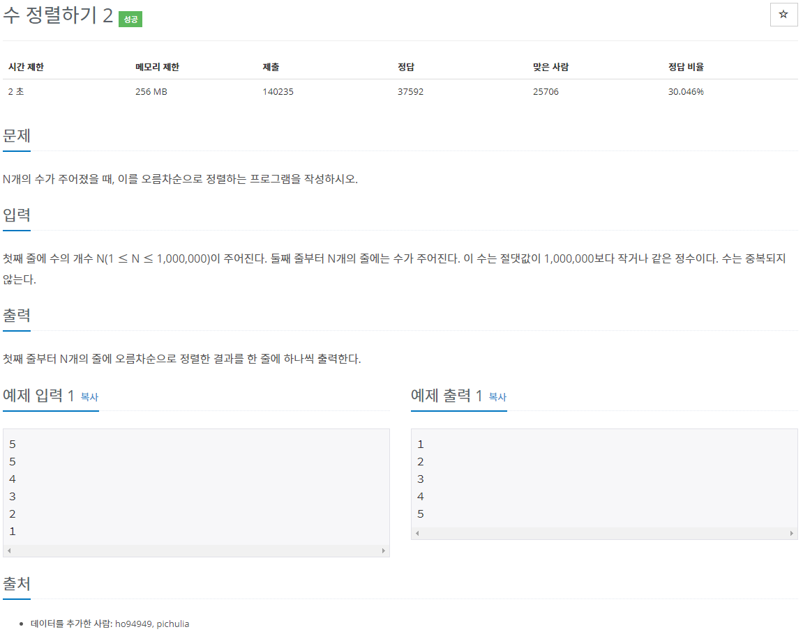
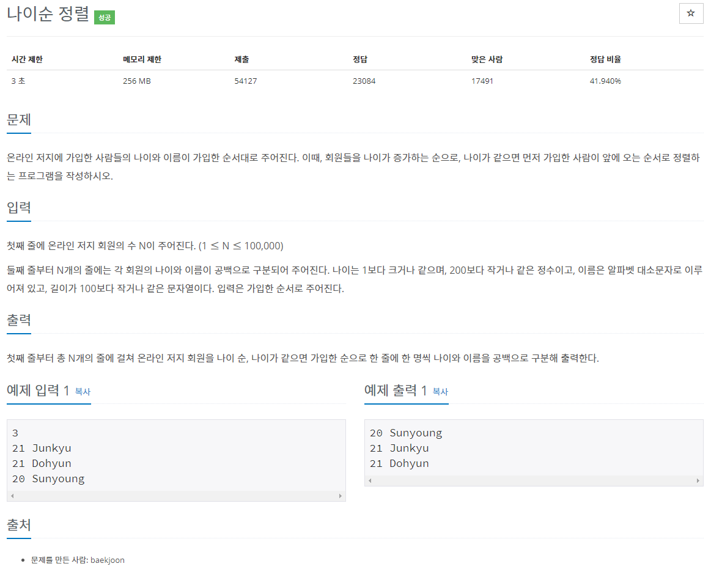
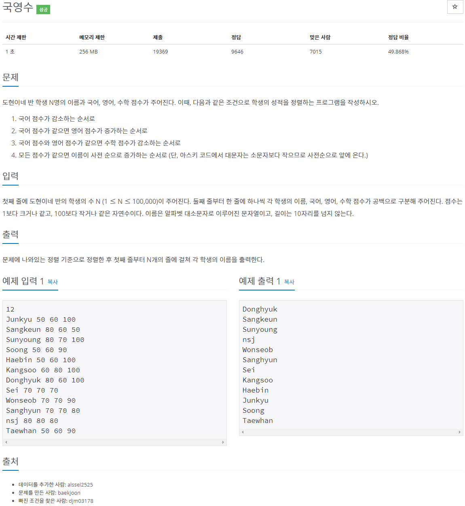
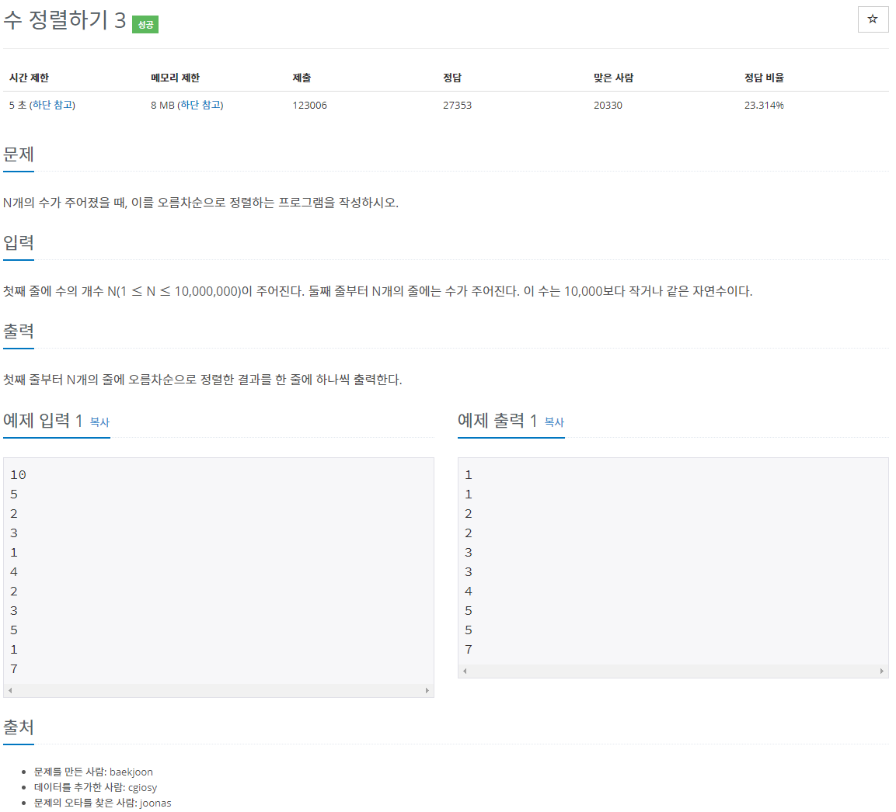
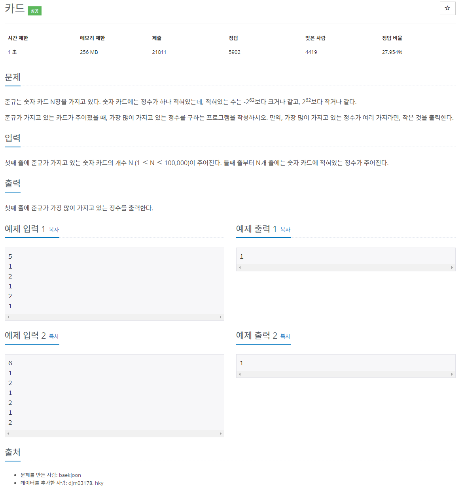
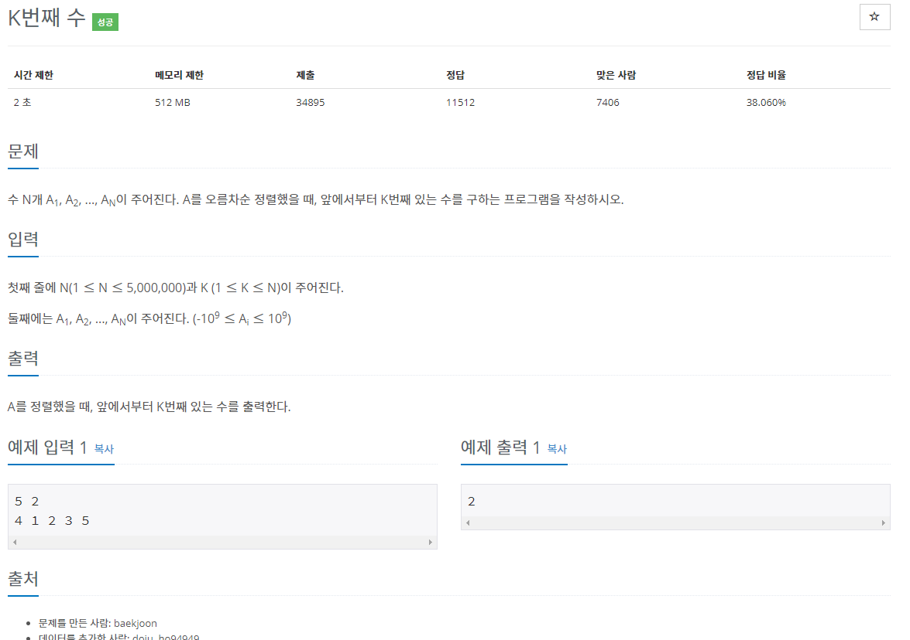

[문제집 출처](https://plzrun.tistory.com/entry/%EC%95%8C%EA%B3%A0%EB%A6%AC%EC%A6%98-%EB%AC%B8%EC%A0%9C%ED%92%80%EC%9D%B4PS-%EC%8B%9C%EC%9E%91%ED%95%98%EA%B8%B0)

## 수 정렬하기 2 (#2751)

[(링크)](https://www.acmicpc.net/problem/2751)



[풀이]

```cpp
#include<iostream>
#include<algorithm>
using namespace std;
int main(){
    int n;
    cin >> n;
    int arr[n];

    for(int i=0; i<n; i++){
        cin >> arr[i];
    }

    sort(arr,arr+n);

    for(int i=0; i<n; i++){
        cout << arr[i] << '\n';
    }
}
```

## 나이순 정렬 (#10814)

[(링크)](https://www.acmicpc.net/problem/10814)



[풀이]

```cpp
#include<iostream>
#include<algorithm>
#include<string>
using namespace std;

typedef struct member{
    int age;
    string name;
    int join; //가입 순서도 구조체 변수로 저장
} member;

bool compare(member a, member b){
    if(a.age >= b.age)
        return false;
    else
        return true;
}

int main(){
    int n;
    cin >> n;

    member arr[n];
    for(int i=0; i<n; i++){
        cin >> arr[i].age >> arr[i].name;
        arr[i].join=i;
    }

    stable_sort(arr,arr+n,compare);

    for(int i=0; i<n; i++){
        cout << arr[i].age << ' ' << arr[i].name << '\n';
    }

}
```

## 국영수 (#10825)

[(링크)](https://www.acmicpc.net/problem/10825)



[풀이]

```cpp
#include<iostream>
#include<string>
#include<algorithm>
using namespace std;
typedef struct student{
    string name;
    int korean;
    int english;
    int math;
}student;

bool compare (student a, student b){
    if(a.korean != b.korean)
        return (a.korean > b.korean);
    if(a.english != b.english)
        return (a.english < b.english);
    if(a.math != b.math)
        return (a.math > b.math);
    return (a.name < b.name);
}

int main(){
    int n;
    cin >> n;
    student arr[n];

    for(int i=0; i<n; i++){
        cin >> arr[i].name >> arr[i].korean >> arr[i].english >> arr[i].math;
    }

    sort(arr,arr+n,compare);
    for(int i=0; i<n; i++){
        cout << arr[i].name << '\n';
    }
}
```

## 수 정렬하기 3 (#10989)

[(링크)](https://www.acmicpc.net/problem/10989)



[풀이]

```cpp
#include<iostream>
#include<algorithm>
using namespace std;
int main(){

    ios::sync_with_stdio(false);
    cin.tie(NULL);
    cout.tie(NULL);

    long long int n;
    cin >> n;

    int arr[10001]={0,};
    for(int i=0; i<n; i++){
        int num;
        cin >> num;
        arr[num]++;
    }

    for(int i=0; i<10001; i++){
        while(arr[i]--){
            cout << i << '\n';
        }
    }
}
```

## 카드 (#11652)

[(링크)](https://www.acmicpc.net/problem/11652)



[풀이]

```cpp
#include<iostream>
#include<algorithm>
using namespace std;
long long arr[1000000]={0,};
int main(){

    ios::sync_with_stdio(false);
    cin.tie(NULL);
    cout.tie(NULL);

    int n;
    cin >> n;

    for(int i=0; i<n; i++){
        cin >> arr[i];
    }

    sort(arr,arr+n);

    int max=0;
    int index=0;
    int cnt=1;
    for(int i=0; i<n-1; i++){

        if(arr[i]==arr[i+1]){
            cnt++;
            if(cnt>max){
                max=cnt;
                index=i;
            }
        }
        else{
            cnt=1;
        }
    }
    cout << arr[index];
}
```

## K번째 수 (#11004)

[(링크)](https://www.acmicpc.net/problem/11004)



[풀이]

```cpp
#include<iostream>
#include<algorithm>
using namespace std;
int main(){

    ios::sync_with_stdio(false);
    cin.tie(NULL);
    cout.tie(NULL);

    int n,k;
    cin >> n >> k;
    int arr[n];
    for (int i=0; i<n; i++){
        cin >> arr[i];
    }
    sort(arr,arr+n);
    cout << arr[k-1];
}
```
