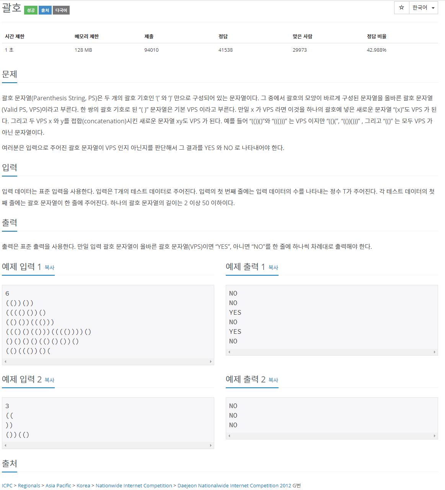
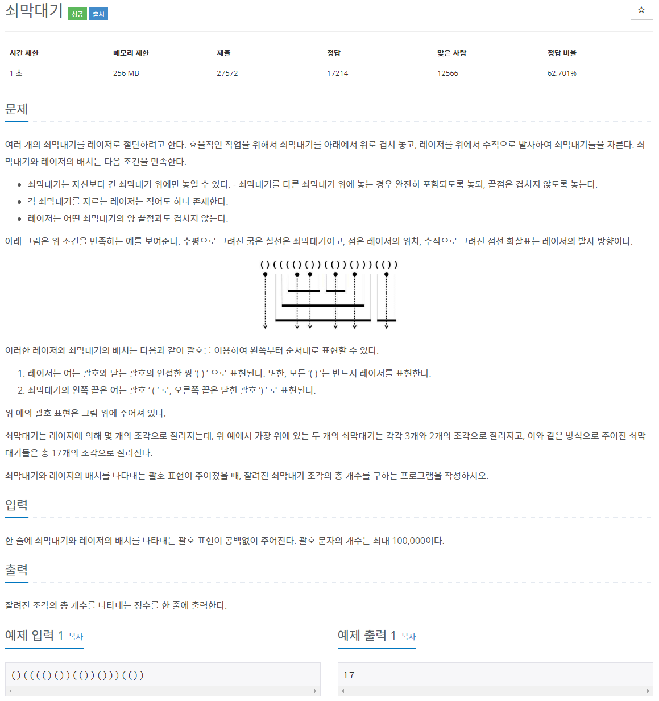
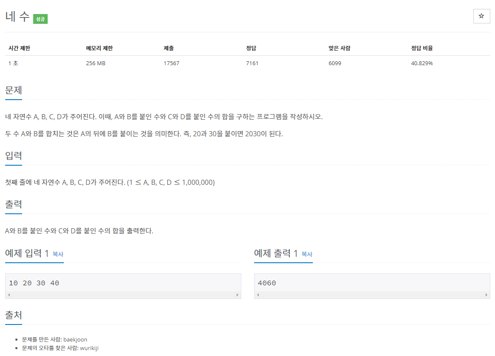
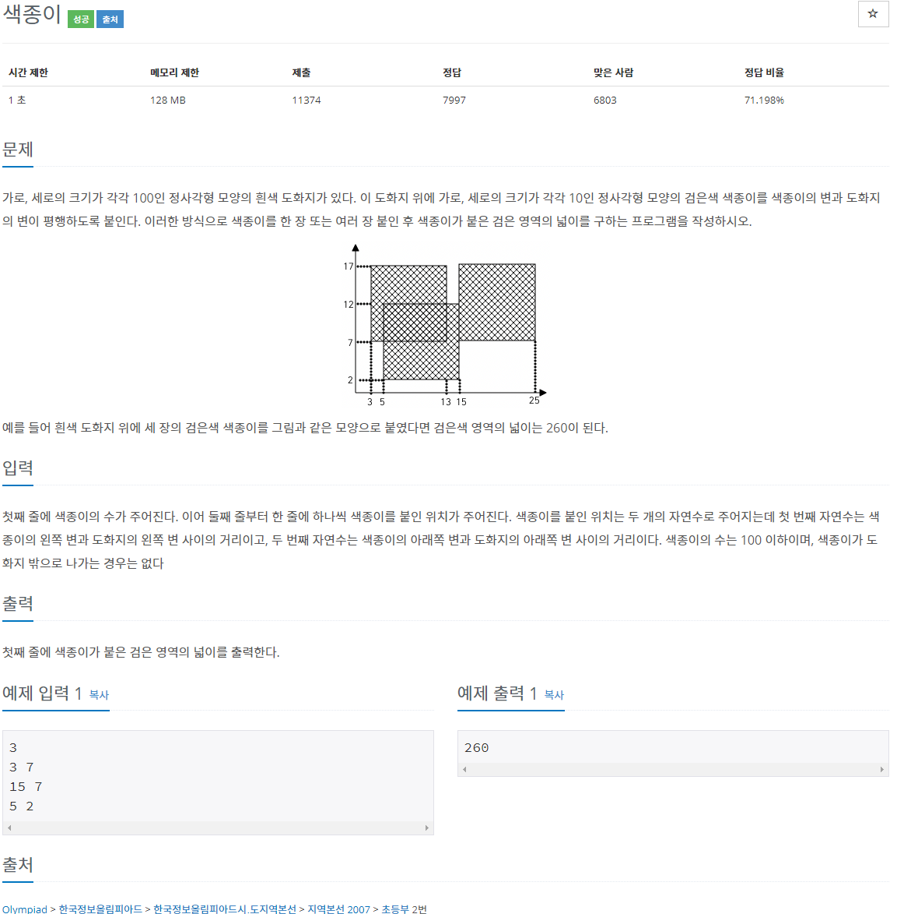
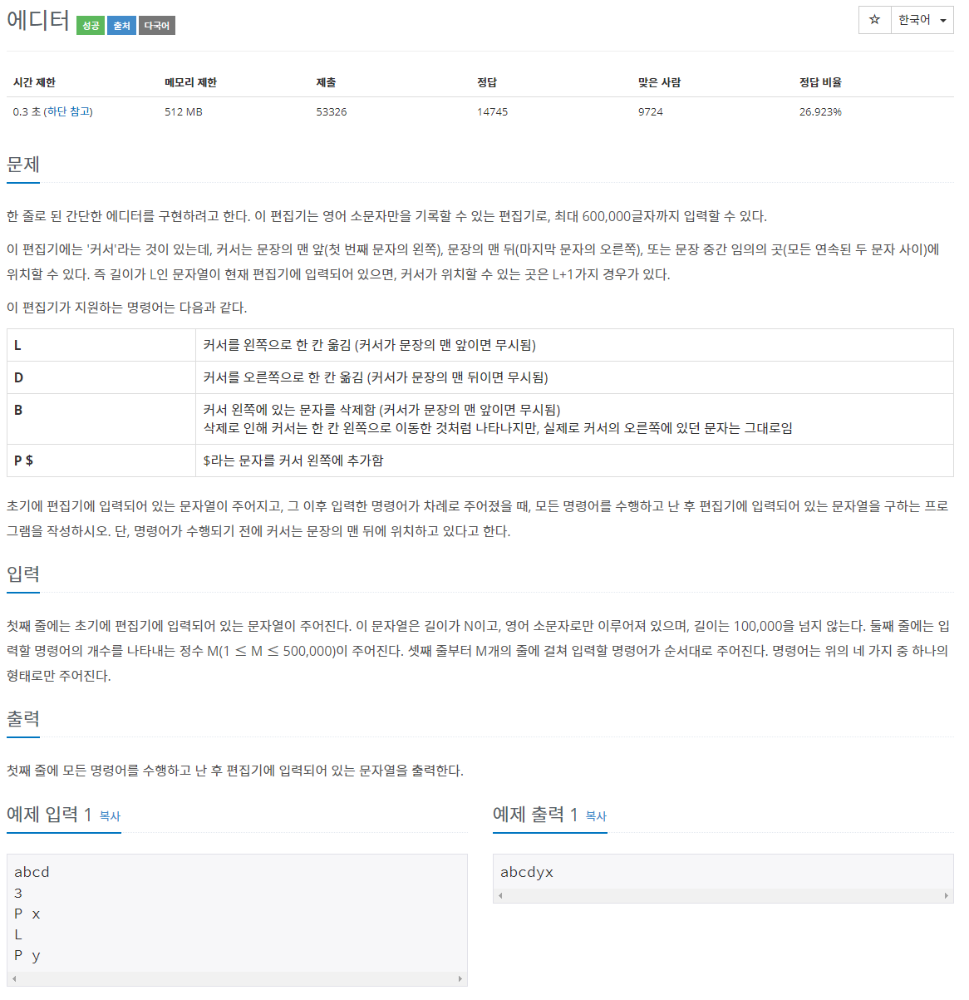
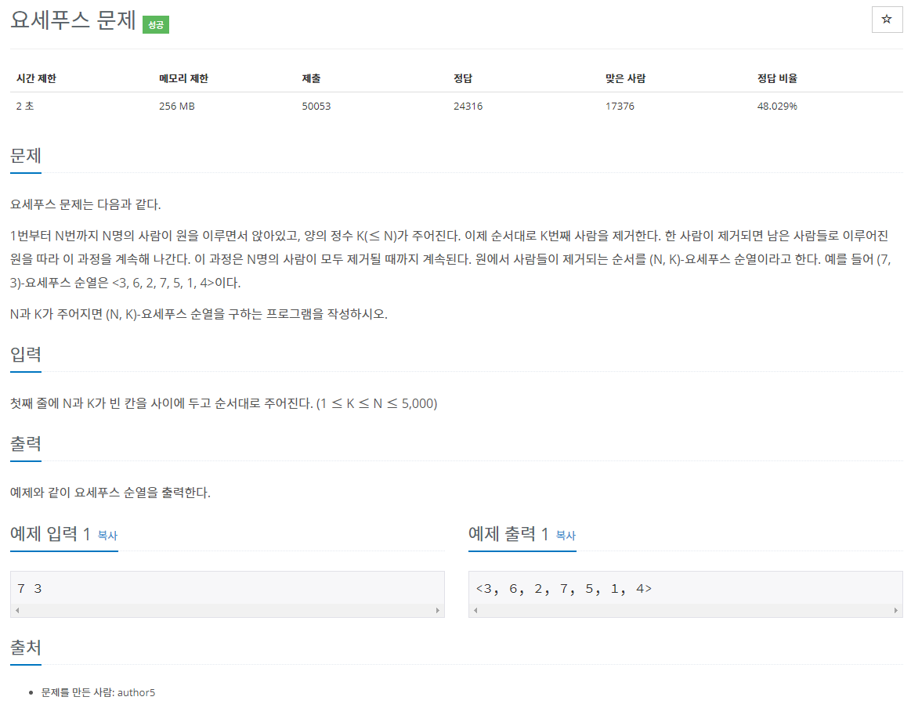
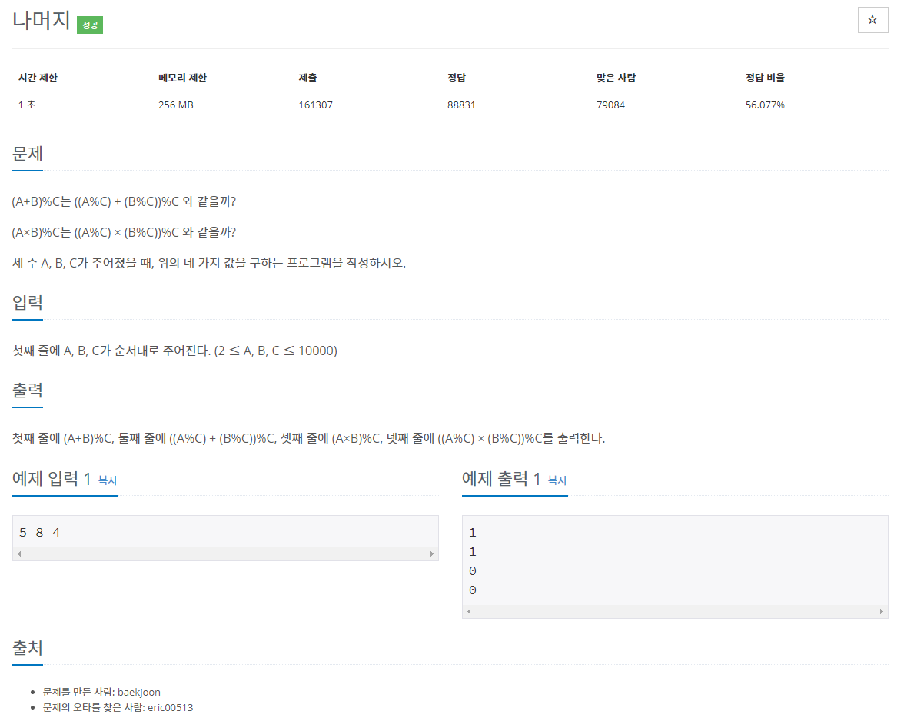
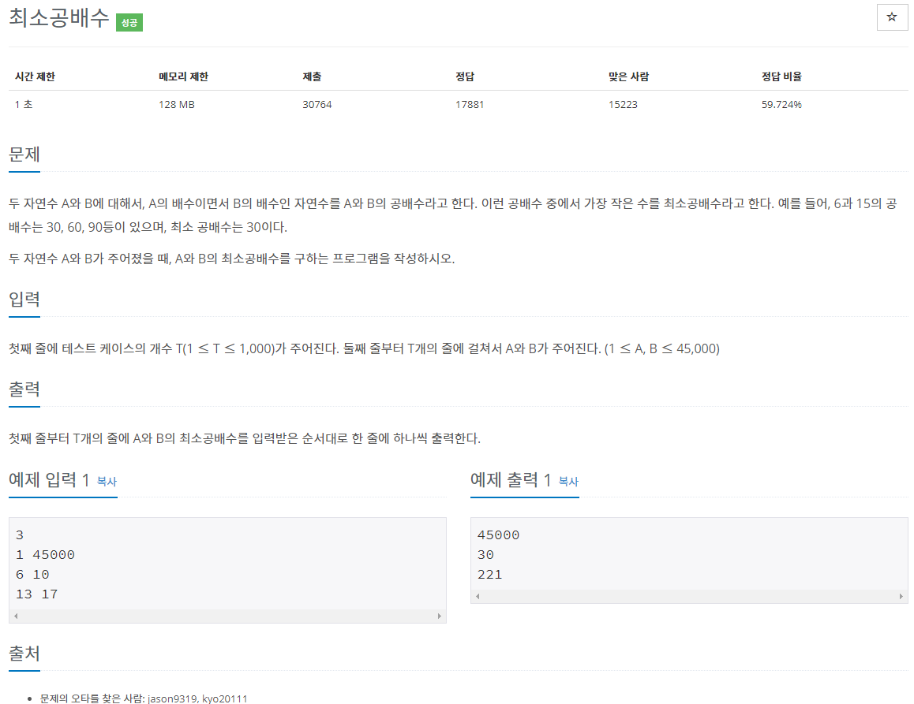
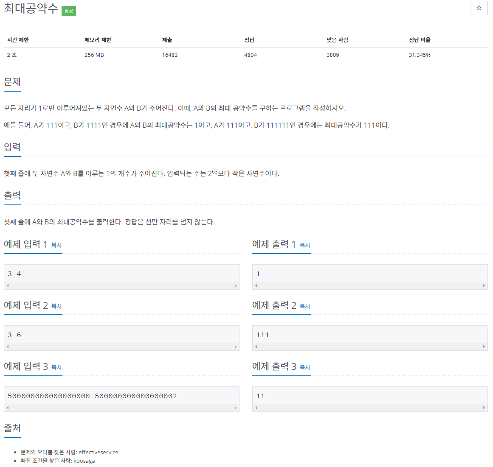
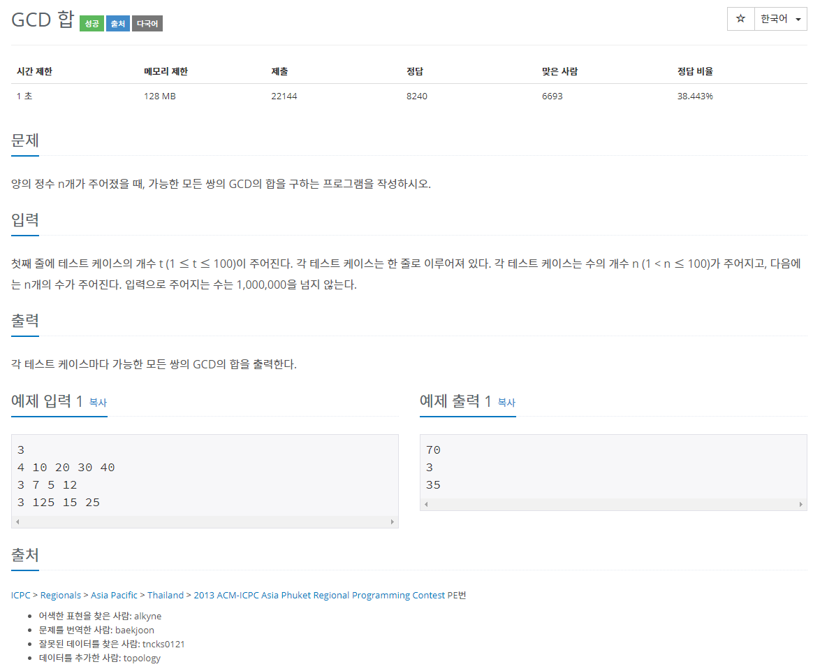

[문제집 출처](https://plzrun.tistory.com/entry/%EC%95%8C%EA%B3%A0%EB%A6%AC%EC%A6%98-%EB%AC%B8%EC%A0%9C%ED%92%80%EC%9D%B4PS-%EC%8B%9C%EC%9E%91%ED%95%98%EA%B8%B0)

## 괄호 (#9012)

[(링크)](https://www.acmicpc.net/problem/9012)



[풀이]

```cpp
#include<iostream>
#include<string>
#include<stack>
using namespace std;
int main(){
    int n;
    cin >> n;
    while(n--){
        string s;
        cin >> s;
        stack<char> st;
        for(int i=0; i<s.size() ; i++){
            if(s[i]=='(')
                st.push('!');  // '(' 가 들어올때마다 stack을 쌓음
            else{
                if(st.empty()){
                    cout << "NO" << '\n'; // '(' 보다 ')'의 개수가 많아지는 순간 거짓
                    break;
                }
                else{
                    st.pop();
                }
            }
            if( i==s.size()-1){
                if(st.empty())
                    cout << "YES" << '\n'; // 마지막에 '('와')'의 개수가 같아야 참
                else
                    cout << "NO" << '\n';
            }
        }
    }
}
```

## 쇠막대기 (#10799)

[(링크)](https://www.acmicpc.net/problem/10799)



[풀이]

```cpp
/*조각의 수= 각 레이저가 자르는 막대의 수 의 총합 + 총 막대의 개수*/
#include<iostream>
#include<string>
#include<stack>
using namespace std;
int main(){
    string s;
    cin >> s;
    stack<char> st;
    int num=0;
    for(int i=0; i<s.size(); i++){
        if(s[i]=='(' && s[i+1]==')'){ //레이저인 경우
                num+=st.size(); // 각 레이저가 자르는 막대의 수
                st.push('(');
        }
        else{
            if(s[i]=='('){ //막대 추가
                num++;
                st.push('(');
            }
            else
                st.pop();
        }
    }
    cout << num;
}

```

## 네 수 (#10824)

[(링크)](https://www.acmicpc.net/problem/10824)



[풀이]

```cpp
#include<iostream>
#include<string>
using namespace std;

int main(){
    int a,b,c,d;
    cin >> a >> b >> c >> d;
    cout << stoll(to_string(a)+to_string(b)) + stoll(to_string(c)+to_string(d));
}
```

## 색종이 (#2563)

[(링크)](https://www.acmicpc.net/problem/2563)



[풀이]

```cpp
#include<iostream>
using namespace std;
int arr[101][101]={0,};
int main(){
    int n;
    cin >> n;
    while(n--){
        int a,b;
        cin >> a >> b;
        for(int i=a; i<a+10; i++){
            for(int j=b; j<b+10; j++){
                arr[i][j]++;
            }
        }
    }
    int area=0;
    for(int i=0;i<100;i++){
        for(int j=0; j<100; j++){
            if(arr[i][j]>0)
                area++;
        }
    }
    cout << area;
}

```

## 에디터 (#1406)

[(링크)](https://www.acmicpc.net/problem/1406)



[풀이]

```cpp
#include<iostream>
#include<string>
#include<list>
using namespace std;
int main(){

    ios::sync_with_stdio(false);
    cin.tie(NULL);
    cout.tie(NULL);

    string s;
    cin >> s;
    int n;
    cin >> n;
    list<char> l(s.begin(),s.end());
    list<char>::iterator cursor=l.end();
    while(n--){

        char order;
        cin >> order;
        if(order=='L'){
            if(cursor !=l.begin())
                cursor--;
        }
        else if(order=='D'){
            if(cursor !=l.end())
                cursor++;
        }
        else if (order=='B'){
            if(cursor !=l.begin()){
                cursor--;
                cursor=l.erase(cursor);
            }
        }
        else if (order=='P'){
            char c;
            cin >> c;
            l.insert(cursor,c);
        }
    }

    for(list<char>::iterator i=l.begin(); i!=l.end(); i++){
        cout << *i;
    }
    return 0;
}
```

## 요세푸스 문제 (#1158)

[(링크)](https://www.acmicpc.net/problem/1158)



[풀이]

```cpp
#include <iostream>
#include <queue>
using namespace std;
int main(){
    int n,k;
    cin >> n >> k;
    queue<int> q;
    for(int i=1; i<=n; i++){
        q.push(i);
    }
    cout << '<';
    while (true){
        for(int i=0; i<k-1; i++){ //k의 배수번째가 아닌 수는 que의 제일 뒤로 보냄
            q.push(q.front());
            q.pop();
        }

        cout << q.front(); //k의 배수번쨰 숫자 제거
        q.pop();

        if(q.size()==0)
            break;
        cout << ", ";
    }
    cout << '>';
}
```

## 나머지 (#10430)

[(링크)](https://www.acmicpc.net/problem/10430)



[풀이]

```cpp
#include<iostream>
using namespace std;
int main(){
    int a,b,c;
    cin >> a >> b >> c;
    cout << (a+b)%c << '\n';
    cout << ((a%c) + (b%c))%c << '\n';
    cout << (a*b)%c << '\n';
    cout << ((a%c)*(b%c))%c;
}
```

## 최소공배수 (#1934)

[(링크)](https://www.acmicpc.net/problem/1934)



[풀이]

```cpp
#include<iostream>
using namespace std;
int gcd(int a, int b){
    if(a==0)
        return b;
    if(b==0)
        return a;
    return gcd(b,a%b);
}
int main(){
    int n;
    cin >> n;
    while(n--){
        int a,b;
        cin >> a >> b;
        cout << a*b/gcd(a,b) << '\n';
    }
}
```

## 최대공약수 (#1850)

[(링크)](https://www.acmicpc.net/problem/1850)



[풀이]

```cpp
#include<iostream>
#include<string>
using namespace std;
long long gcd(long long a, long long b){
    if(a==0)
        return b;
    if(b==0)
        return a;
    return gcd(b,a%b);
}
int main(){
    long long a,b;
    cin >> a >> b;
    long long g=gcd(a,b);
    while(g--){
        cout << '1';
    }
}
```

## GCD 합 (#9613)

[(링크)](https://www.acmicpc.net/problem/9613)



[풀이]

```cpp
#include<iostream>
using namespace std;
int gcd(int a, int b){
    if(a==0)
        return b;
    if(b==0)
        return a;
    return gcd(b,a%b);
}
int main(){
    int t;
    cin >> t;
    while(t--){
        int n;
        cin >> n;
        int arr[n];
        long long sum=0;
        for(int i=0; i<n; i++){
            cin >> arr[i];
        }
        for(int i=0; i<n; i++){
            for(int j=i+1; j<n; j++){
                sum+=gcd(arr[i],arr[j]);
            }
        }
        cout << sum <<'\n';
    }
}
```
