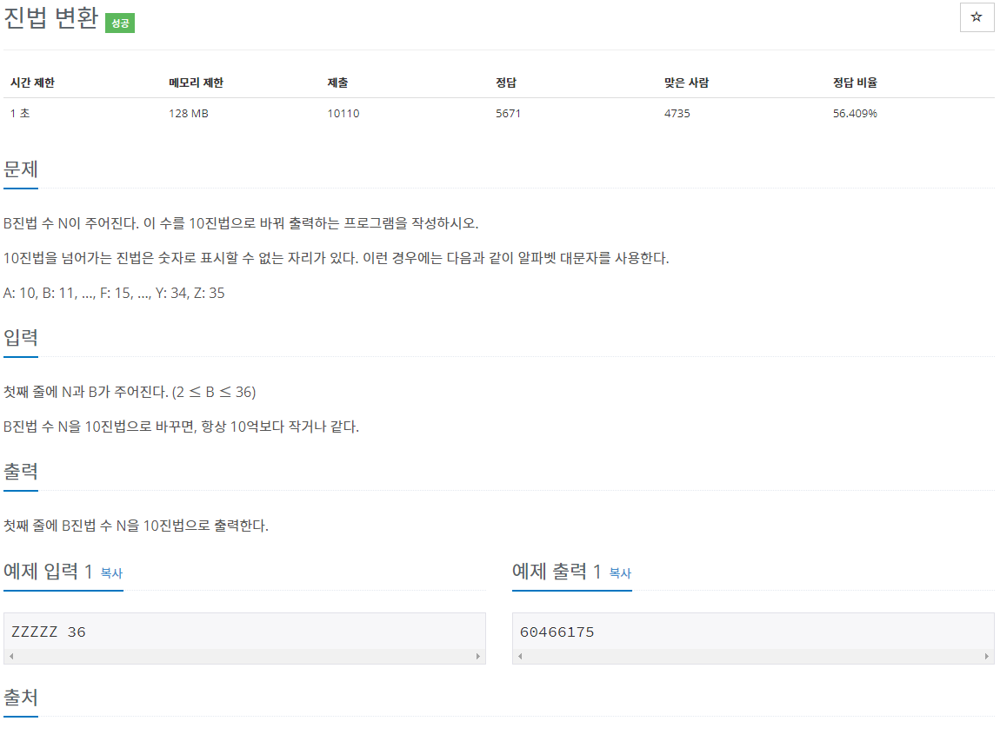
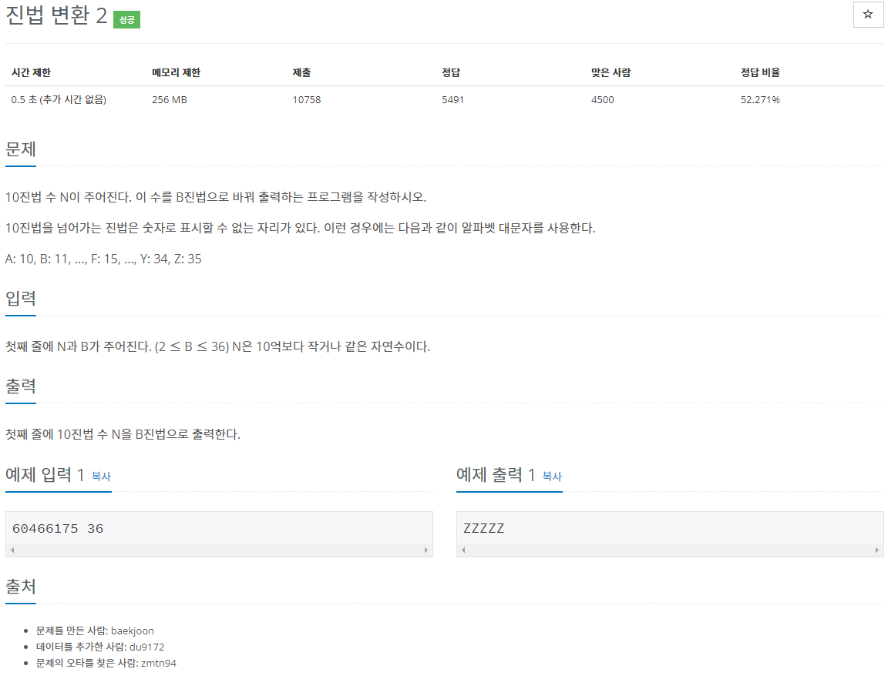
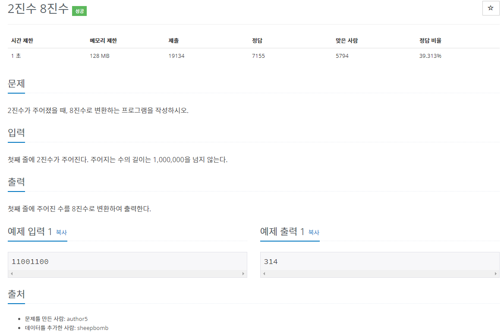
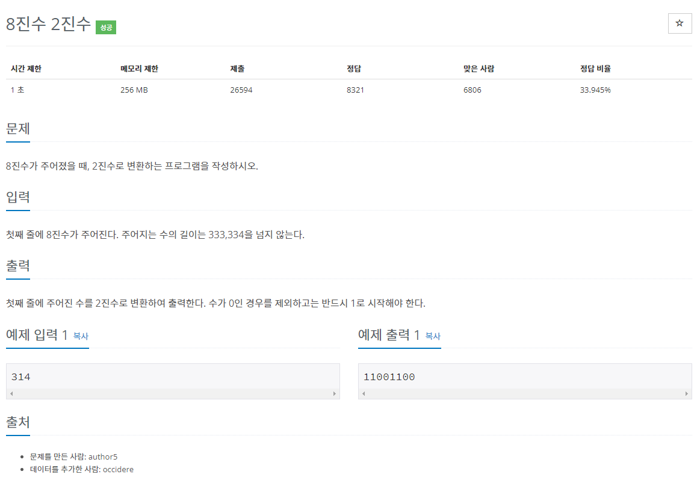
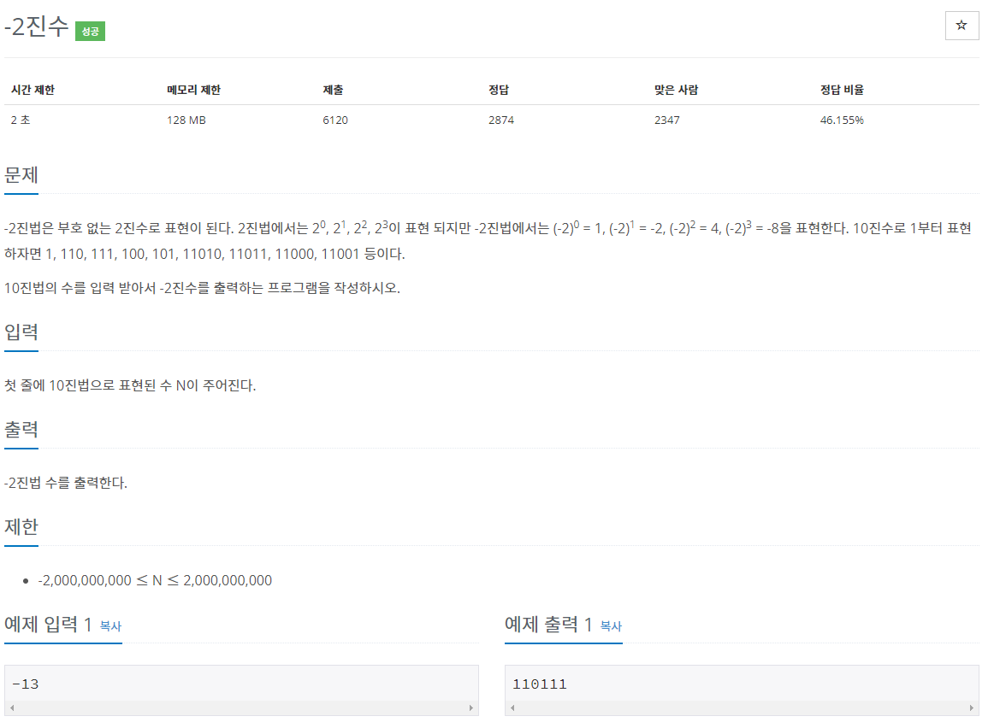
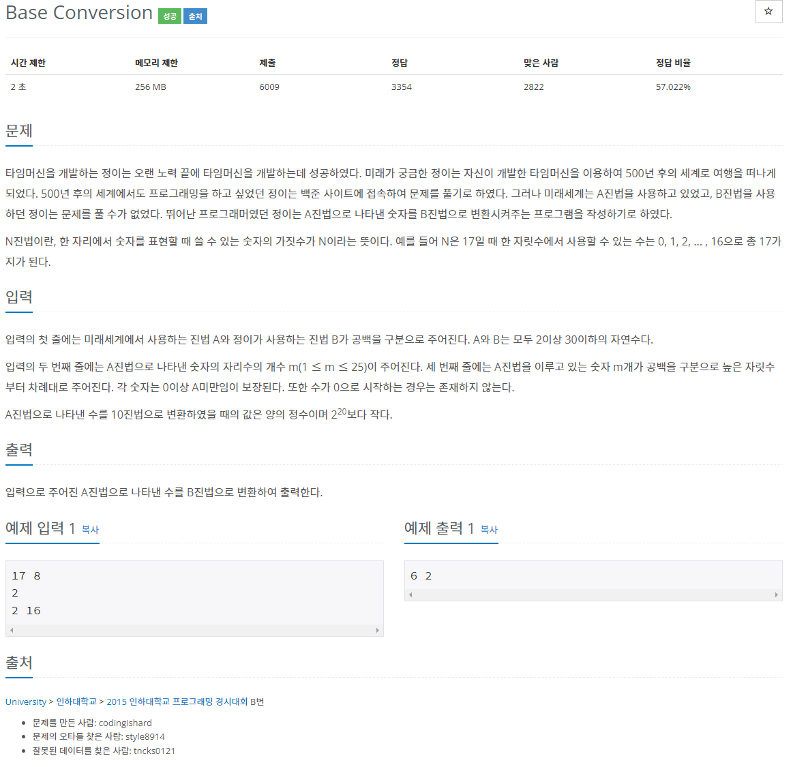
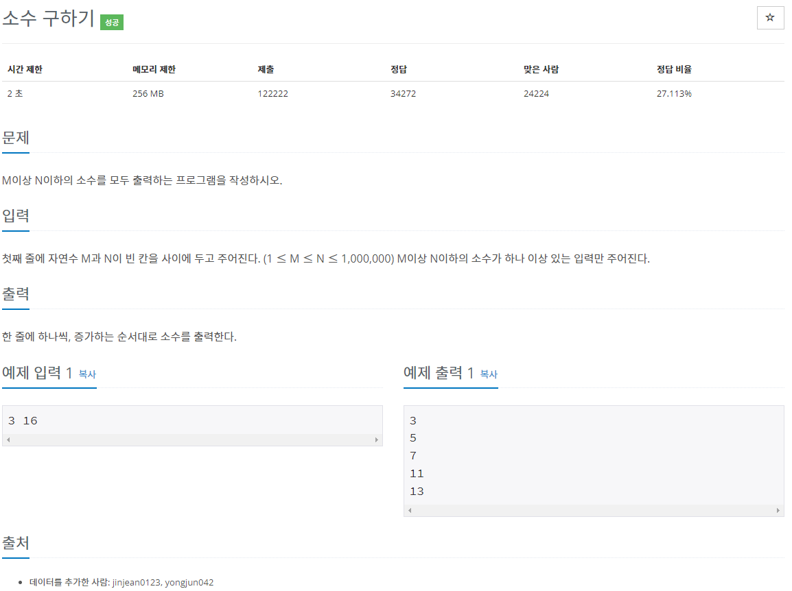
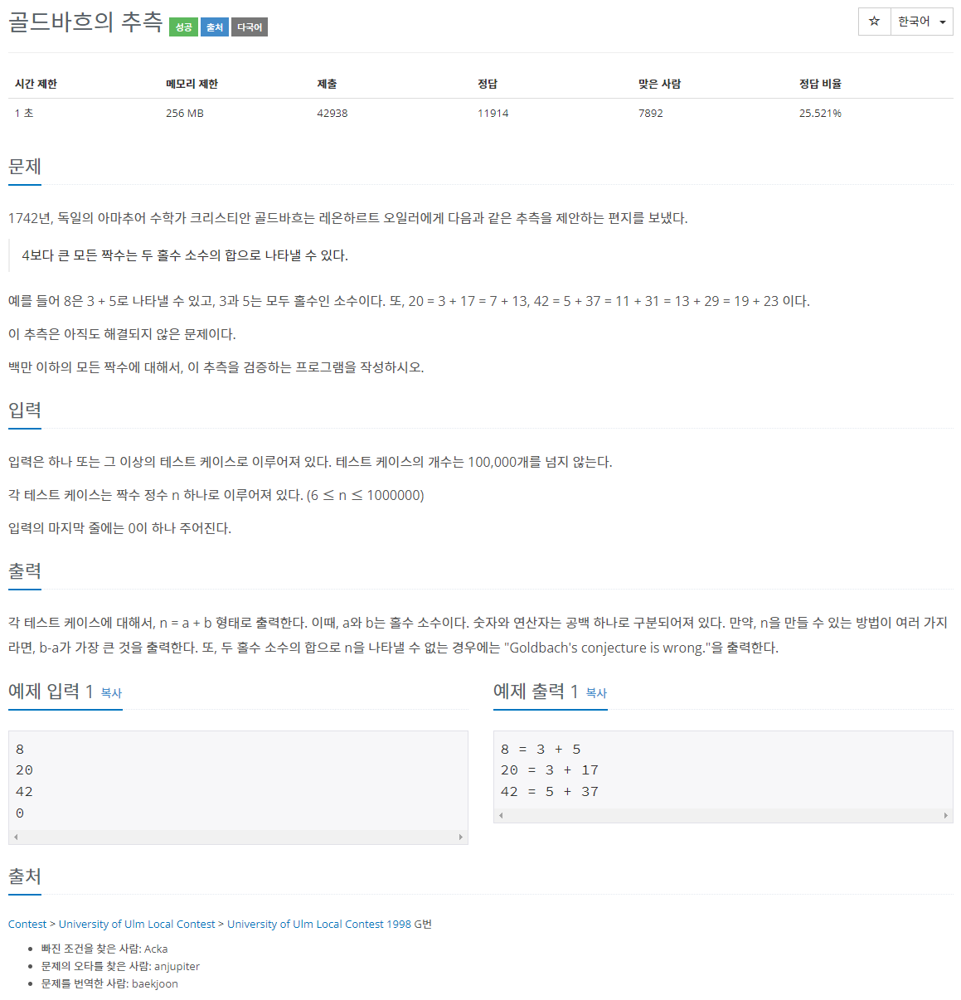
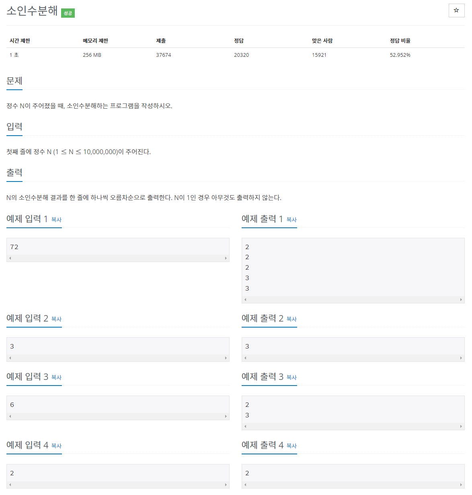
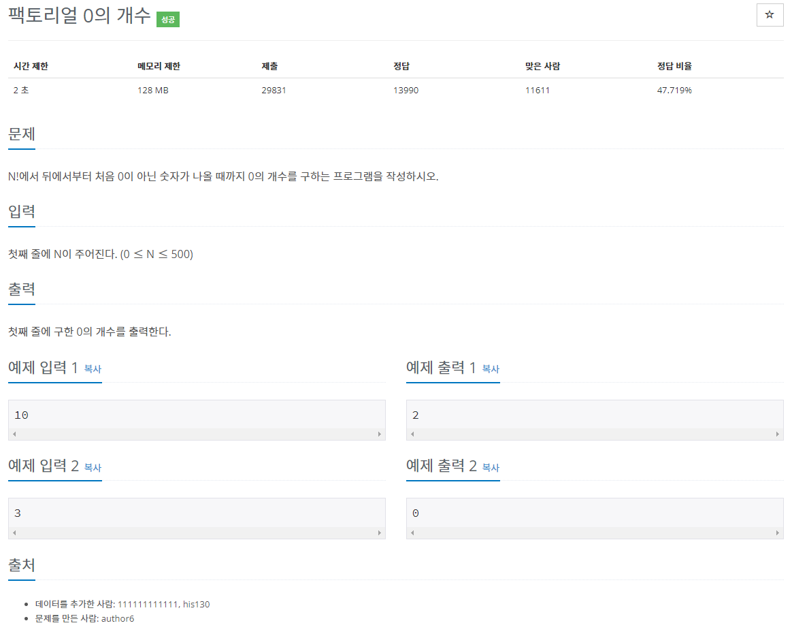

[문제집 출처](https://plzrun.tistory.com/entry/%EC%95%8C%EA%B3%A0%EB%A6%AC%EC%A6%98-%EB%AC%B8%EC%A0%9C%ED%92%80%EC%9D%B4PS-%EC%8B%9C%EC%9E%91%ED%95%98%EA%B8%B0)

## 진법 변환 (#2745)

[(링크)](https://www.acmicpc.net/problem/2745)



[풀이]

```cpp
#include<iostream>
#include<string>
using namespace std;

int main(){
    string n;
    int b;

    cin >> n >> b;
    long long int result=0;
    for(int i=0; i<n.size(); i++){
        if(n[i]>= 'A' && n[i] <= 'Z')
            result = result*b + n[i] - 'A' + 10;
        else
            result = result*b + n[i] - '0';
    }
    cout << result;
}
```

## 진법 변환 2 (#11005)

[(링크)](https://www.acmicpc.net/problem/11005)



[풀이]

```cpp
#include<iostream>
#include<string>
using namespace std;
int main(){
    long long int n;
    int b;
    string s;
    cin >> n >> b;
    while(n>0){
        int temp =n%b;
        char c;
        if(temp < 10)
            c= (temp+'0');
        else
            c= (temp+'A'-10);
        s+=c;
        n/=b;
    }
    for (int i=s.size()-1; i>=0; i--)
        cout << s[i];
}
```

## 2진수 8진수 (#1373)

[(링크)](https://www.acmicpc.net/problem/1373)



[풀이]

```cpp
#include<iostream>
#include<string>
using namespace std;
int main(){
    string s;
    cin >> s;
    string fs;
    while(s.size()%3!=0){
        s='0'+s;
    }
    for(int i=0; i<s.size()/3; i++){
        int temp=s[i*3+2]-'0' + 2*(s[i*3+1]-'0') + 4*(s[i*3]-'0');
        cout<< temp;
    }
}
```

## 8진수 2진수 (#1212)

[(링크)](https://www.acmicpc.net/problem/1212)



[풀이]

```cpp
#include<iostream>
#include<string>
using namespace std;
int main(){
    string s;
    cin >> s;
    if (s.compare("0") == 0){
        cout << 0;
    }
    else{
        int temp=s[0]-'0';
        if( temp >=4)
            cout << temp/4 << (temp%4)/2 << (temp)%2;
        else if (temp >=2)
            cout << temp/2 << temp %2;
        else
            cout << temp;

        for(int i=1; i<s.size();i++){
            int temp=s[i]-'0';
            cout << temp/4 << (temp%4)/2 << (temp)%2;
        }
    }
}
```

## -2진수 (#2089)

[(링크)](https://www.acmicpc.net/problem/2089)



[풀이]

```cpp
#include<iostream>
#include<string>
using namespace std;

int main(){
    int n;
    string answer;
    cin >> n;
    if(n == 0 || n == 1)
        cout << n;
    else{
        while (n!=0){
            if(n%2==0){
                answer+="0";
                n=-n/2;
            }
            else{
                answer+="1";
                if(n>0)
                    n= -(n/2);
                else
                    n= (-n+1)/2;
            }
        }
        for(int i=answer.size()-1; i>=0; i--)
            cout << answer[i];
    }
}
```

## Base Conversion (#11576)

[(링크)](https://www.acmicpc.net/problem/11576)



[풀이]

```cpp
#include<iostream>
#include<string>
#include<stack>
using namespace std;

int main(){
    int a,b;
    cin >> a >> b;
    int m;
    cin >> m;
    long long result=0;
    while(m--){
        int n;
        cin >> n;
        result=result*a+n;
    }
    stack<int> s;
    while (result>0){
        s.push(result%b);
        result/=b;
    }
    while(!s.empty()){
        cout << s.top() << ' ';
        s.pop();
    }
}
```

## 소수 구하기 (#1929)

[(링크)](https://www.acmicpc.net/problem/1929)



[풀이]

```cpp
#include<iostream>
using namespace std;
bool is_prime(int num){
    if (num==1)
        return false;
    else if (num ==2 || num ==3)
        return true;
    else{
        for(int i=2; i*i<=num; i++){
            if (num%i==0)
                return false;
        }
        return true;
    }
}
int main(){
    int m,n;
    cin >> m >> n;
    for(int i=m; i<=n; i++){
        if(is_prime(i))
            cout << i << '\n';
    }
}
```

## 골드바흐의 추측 (#6588)

[(링크)](https://www.acmicpc.net/problem/6588)



[풀이]

```cpp
#include<iostream>
using namespace std;
int is_prime[1000001]={0,};
void eratostenes(){
    for(int i=2; i*i < 1000001; i++){
        if(!is_prime[i]){
            for(int j=i*i; j<1000001; j+=i){
                is_prime[j]=1;
            }
        }
    }
}
int main(){
    ios_base::sync_with_stdio(false);
	cin.tie(NULL);
    int n;
    eratostenes();
    while(1){
        cin >> n;
        if(n ==0)
            break;
        for(int i=3; i<=n/2; i++){
            if(is_prime[i]==0 && is_prime[n-i]==0){
                cout << n << " = " << i << " + " << n-i << "\n";
                break;
            }
            else if (i ==n/2)
                cout << "Goldbach's conjecture is wrong." << "\n";
        }
    }
}
```

## 소인수분해 (#11653)

[(링크)](https://www.acmicpc.net/problem/11653)



[풀이]

```cpp
#include<iostream>
using namespace std;
int main(){
    int n;
    cin >> n;
    for(int i=2; i*i<=n;i++){
        while(n%i==0){
            cout << i << '\n';
            n/=i;
        }
    }
    if(n !=1)
        cout << n;
}
```

## 팩토리얼 0의 개수 (#1676)

[(링크)](https://www.acmicpc.net/problem/1676)



[풀이]

```cpp
#include<iostream>
using namespace std;
int main(){
    int n;
    cin >> n;
    int result=0;
    while(n){
        result+=n/5;
        n/=5;
    }
    cout << result;
}
```

## 조합 0의 개수 (#2004)

[(링크)](https://www.acmicpc.net/problem/2004)


[풀이]

```cpp
#include<iostream>
int five(int n){
    int result=0;
    while(n){
        result+=n/5;
        n/=5;
    }
    return result;
}
int two(int n){
    int result=0;
    while(n){
        result+=n/2;
        n/=2;
    }
    return result;
}

using namespace std;
int main(){
    int n,m;
    cin >> n >> m;
    int f= five(n)-five(m)-five(n-m);
    int t= two(n) -two(m) -two(n-m);
    if( f> t)
        cout << t;
    else
        cout << f;

}
```
