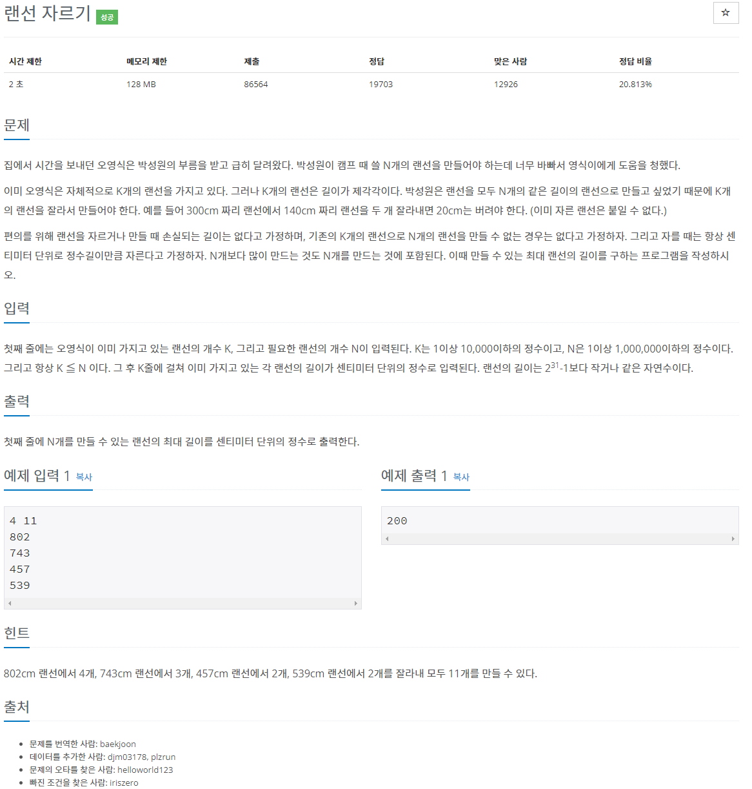
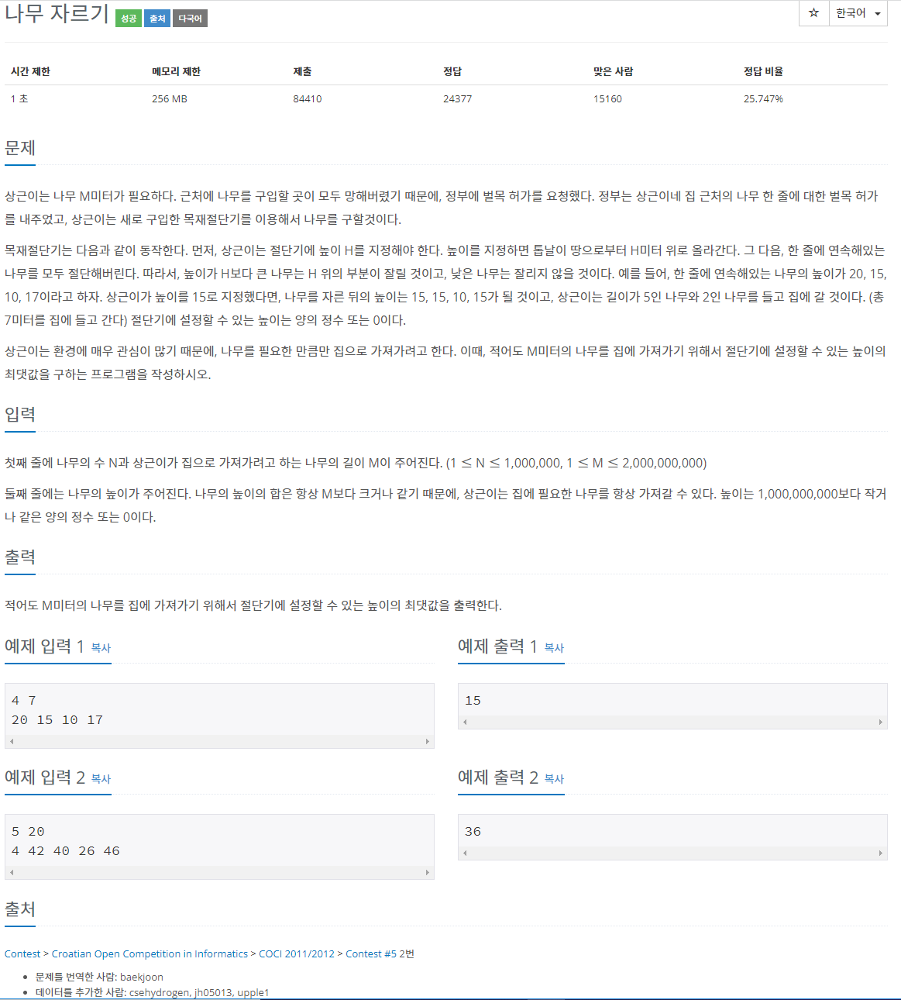
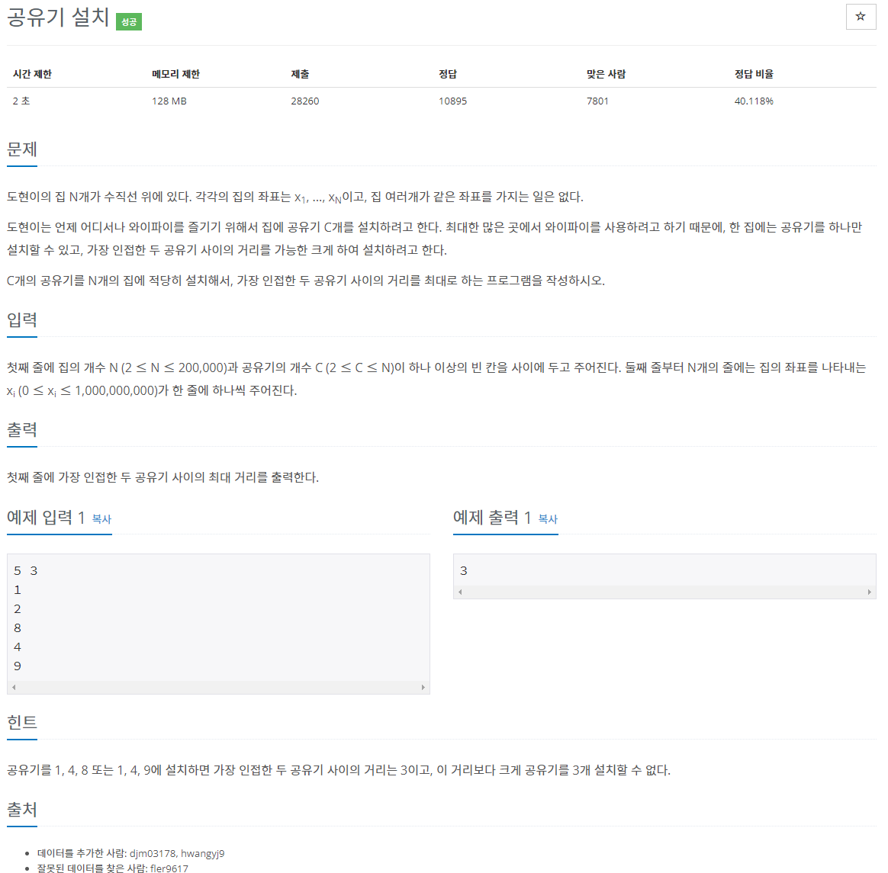
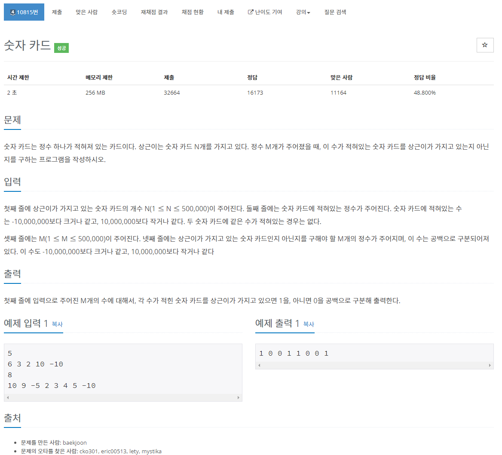
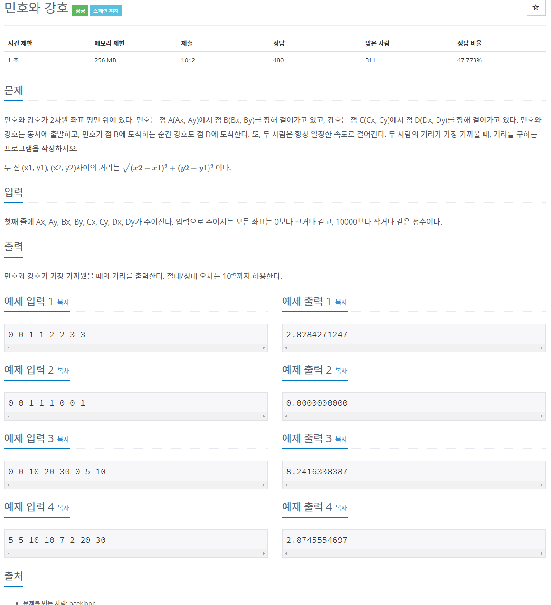

[문제집 출처](https://plzrun.tistory.com/entry/%EC%95%8C%EA%B3%A0%EB%A6%AC%EC%A6%98-%EB%AC%B8%EC%A0%9C%ED%92%80%EC%9D%B4PS-%EC%8B%9C%EC%9E%91%ED%95%98%EA%B8%B0)

## 랜선 자르기 (#1654)

[(링크)](https://www.acmicpc.net/problem/1654)



[풀이]

```cpp
#include<iostream>
#include<algorithm>
#include<vector>
using namespace std;
int main(){
    int k,n;
    cin >> k >> n;
    vector<long long> v;
    for(int i=0; i<k; i++){
        long long a;
        cin >> a;
        v.push_back(a);
    }
    sort(v.begin(),v.end());
    long long left=1;
    long long right=v[k-1];
    long long result=0;
    while(right>=left){
        long mid=(left+right)/2;
        int cnt=0;
        for(int i=0; i<k; i++)
            cnt+=v[i]/mid;
        if(cnt >=n){
            if(result<mid)
                result=mid;
            left=mid+1;
        }
        else{
            right=mid-1;
        }
    }
    cout << result;
}
```

## 나무 자르기 (#2805)

[(링크)](https://www.acmicpc.net/problem/2805)



[풀이]

```cpp
#include<iostream>
#include<algorithm>
#include<vector>
using namespace std;
int main(){
    long long n,m;
    cin >> n >> m;
    vector<int> v;
    for(int i=0; i<n; i++){
        long long tree;
        cin >> tree;
        v.push_back(tree);
    }
    sort(v.begin(),v.end());
    long long left=1;
    long long right=v[n-1];
    long long answer=0;
    while(right>=left){
        long long mid=(left+right)/2;
        long long cnt=0;
        for(int i=0; i<n; i++){
            if(v[i]>mid)
                cnt+=(v[i]-mid);
        }
        if(cnt >= m){
            if(answer<mid)
                answer=mid;
            left=mid+1;
        }
        else
            right=mid-1;
    }
    cout << answer;
}
```

## 공유기 설치 (#2110)

[(링크)](https://www.acmicpc.net/problem/2110)



[풀이]

```cpp
#include<iostream>
#include<vector>
#include<algorithm>
using namespace std;
int main(){
    int n,c;
    cin >> n >> c;
    vector <int> v;
    for(int i=0; i<n; i++){
        int temp;
        cin >> temp;
        v.push_back(temp);
    }
    sort(v.begin(),v.end());
    int left=1;
    int right=v[n-1]-v[0];
    int result=0;
    while(left <= right){
        int mid =(left+right)/2;
        int cnt=1;
        int prev=v[0];
        for(int i=1; i<n;i++){
            if(v[i]-prev >=mid){
                cnt++;
                prev=v[i];
            }
        }

        if(cnt >= c){
            if(mid > result)
                result=mid;
            left=mid+1;
        }
        else{
            right=mid-1;
        }
    }
    cout << result;
}
```

## 숫자 카드 (#10815)

[(링크)](https://www.acmicpc.net/problem/10815)



[풀이]

```cpp
#include<iostream>
#include<vector>
#include<algorithm>
using namespace std;
int main(){
    ios_base::sync_with_stdio(false);
    cin.tie(NULL);
    int n;
    cin >> n;
    vector <int> v;
    for(int i=0; i<n; i++){
        int temp;
        cin >> temp;
        v.push_back(temp);
    }
    sort(v.begin(),v.end());
    int m;
    cin >> m;
    while(m--){
        int num;
        cin >> num;
        int left=0;
        int right=n-1;
        int result=0;
        while(left <= right){
            int mid=(left+right)/2;
            if( v[mid] > num)
                right= mid-1;
            else if (v[mid] < num)
                left = mid+1;
            else{
                result=1;
                break;
            }
        }
        cout << result << ' ';
    }
}
```

## 숫자 카드 2 (#10816)

[(링크)](https://www.acmicpc.net/problem/10816)


[풀이]

```cpp
#include<iostream>
#include<vector>
#include<algorithm>
using namespace std;
vector <int> v;
int lower(int num){ //찾는 값 이상의 수가 처음 나타나는 위치
    int left=0;
    int right=v.size()-1;
    while(right >= left){
        int mid=(left+right)/2;
        if(v[mid]>= num )
            right=mid-1;
        else
            left=mid+1;
    }
    return right;
}

int upper(int num){ // 찾는 값보다 큰 수가 처음 나타나는 위치
    int left=0;
    int right=v.size()-1;
    while(right >= left){
        int mid=(left+right)/2;
        if(v[mid]> num )
            right=mid-1;
        else
            left=mid+1;
    }
    return right;
}
int main(){
    ios_base::sync_with_stdio(false);
    cin.tie(NULL);
    int n;
    cin >> n;
    for(int i=0; i<n; i++){
        int temp;
        cin >> temp;
        v.push_back(temp);
    }
    sort(v.begin(),v.end());
    int m;
    cin >> m;
    while(m--){
        int num;
        cin >> num;
        int answer=upper(num)-lower(num); // 숫자의 개수= upper -lower
        cout << answer << ' ';
    }
}
```

## 민호와 강호 (#11662)

[(링크)](https://www.acmicpc.net/problem/11662)



[풀이]

```cpp
#include<iostream>
#include<cmath>
using namespace std;

int ax,ay,bx,by,cx,cy,dx,dy;

pair<double,double> minho(double p){ //p% 지점에서 민호의 위치
    return {ax+(bx-ax)*p/100, ay+(by-ay)*p/100};
}

pair<double,double> kangho(double p){ //p% 지점에서 강호의 위치
    return {cx+(dx-cx)*p/100, cy+(dy-cy)*p/100};
}

int main (){

    cin >> ax >> ay >> bx >> by >> cx >> cy >> dx >> dy;
    double left=0;
    double right=100; //0~100%
    double ans=1000000000; //대충 큰 수
    //삼분탐색
    while(right-left>=1e-10){
        double l= (left*2+right)/3;
        double r= (left+right*2)/3;
        pair <double,double> ml = minho(l);
        pair <double,double> mr = minho(r);
        pair <double,double> kl = kangho(l);
        pair <double,double> kr = kangho(r);
        double distl=pow(ml.first-kl.first,2)+pow(ml.second-kl.second,2);
        double distr=pow(mr.first-kr.first,2)+pow(mr.second-kr.second,2);

        ans=min(ans,min(distl,distr));

        if(distl > distr)
            left=l;
        else
            right =r;
    }
    cout<< fixed;
    cout.precision(10);
    cout << sqrt(ans);

}
```
