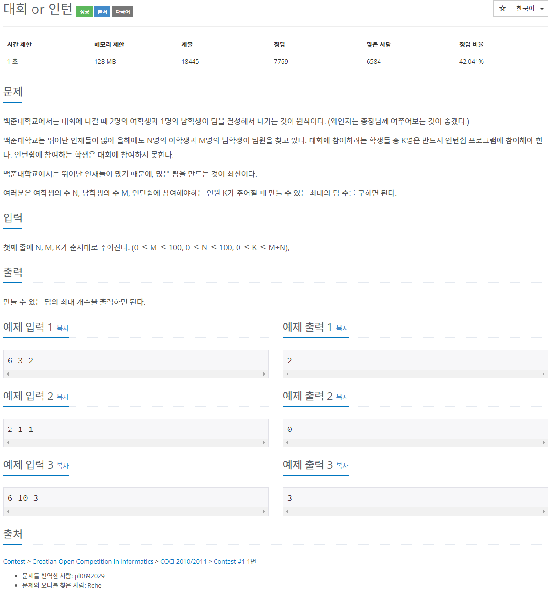
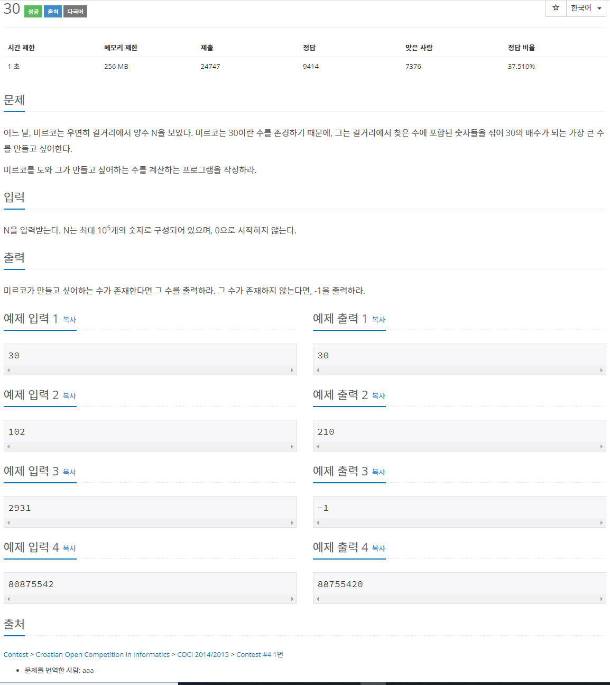
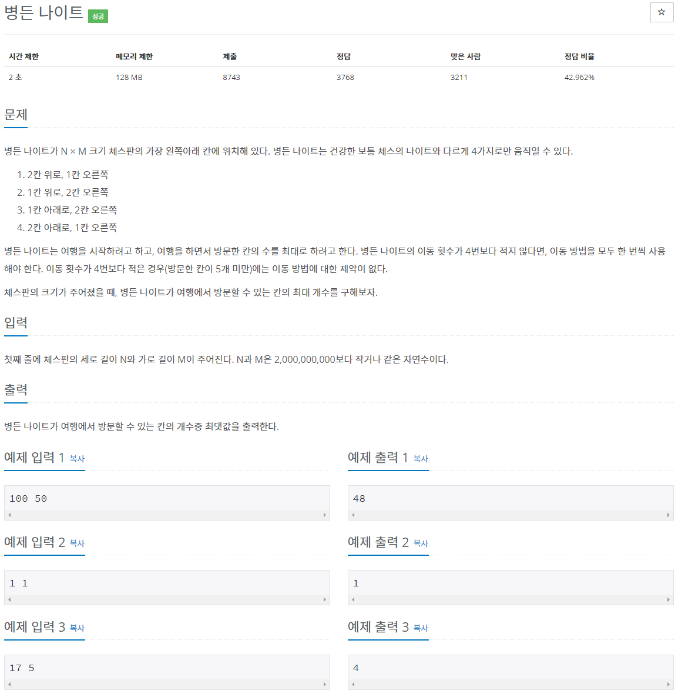
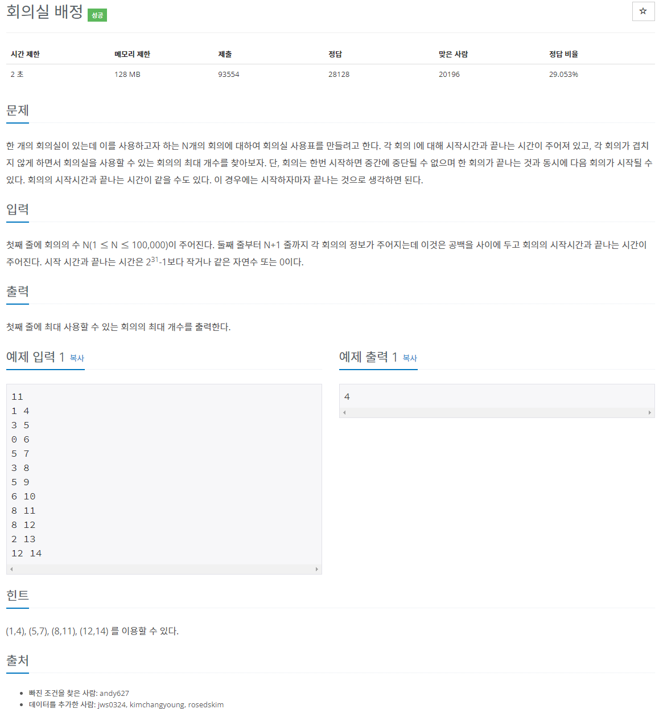
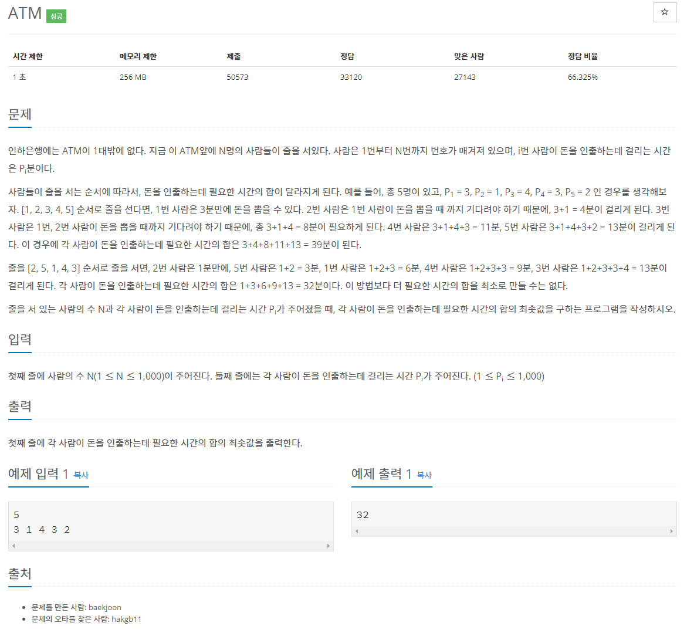
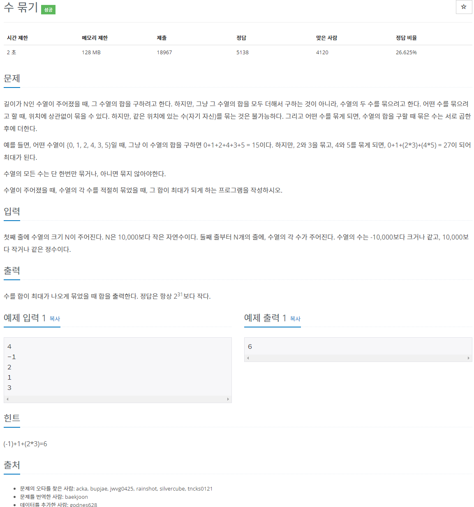

[문제집 출처](https://plzrun.tistory.com/entry/%EC%95%8C%EA%B3%A0%EB%A6%AC%EC%A6%98-%EB%AC%B8%EC%A0%9C%ED%92%80%EC%9D%B4PS-%EC%8B%9C%EC%9E%91%ED%95%98%EA%B8%B0)

## 대회 or 인턴 (#2875)

[(링크)](https://www.acmicpc.net/problem/2875)



[풀이]

```cpp
#include<iostream>
#include<algorithm>
using namespace std;
int main(){
    int n, m, k;
    cin >> n >> m >> k;

    int maxteam=min(n/2,m);
    int intern= m+n-3*maxteam;
    while(intern<k){
        maxteam--;
        intern+=3;
    }
    cout << maxteam;
}
```

## 30 (#10610)

[(링크)](https://www.acmicpc.net/problem/10610)



[풀이]

```cpp
#include<iostream>
#include<algorithm>
#include<vector>
#include<string>
using namespace std;
bool compare(int a, int b){
    return a>b;
}
int main(){
    vector<int>v;
    string s;
    cin >> s;
    for(int i=0; i<s.size();i++)
        v.push_back(s[i]-'0');
    sort(v.begin(),v.end(),compare);
    int sum=0;
    int cnt=0;
    for(int i=0;i <s.size();i++){
        sum+=v[i];
        if(v[i]==0)
            cnt++;
    }
    if(sum%3==0 && cnt !=0){
        for(int i=0; i<s.size();i++)
            cout <<v[i];
    }
    else
        cout << -1;
}
```

## 병든 나이트 (#1783)

[(링크)](https://www.acmicpc.net/problem/1783)



[풀이]

```cpp
#include<iostream>
#include<algorithm>
using namespace std;
int main(){
    int n,m;
    cin >> n >> m;
    if(n==1)
        cout <<1;
    else if (n ==2)
        cout << min(4,(m+1)/2);
    else if (m <7)
        cout << min(4,m);
    else
        cout << m-2 ;
}
```

## 회의실 배정 (#1931)

[(링크)](https://www.acmicpc.net/problem/1931)



[풀이]

```cpp
//빨리 끝나는 회의를 최대한 배정하는 것이 최선의 알고리즘!
#include<iostream>
#include<algorithm>
#include<vector>
using namespace std;
typedef struct meeting{
    int start;
    int end;
}meeting;
bool compare(meeting a, meeting b){ //먼저 끝나는 회의가 우선이 되도록 정렬!
    if(a.end!= b.end){
        return a.end < b.end;
    }
    else{
        return a.start < b.start;
    }
}
int main(){
    int n;
    cin >>n;
    vector <meeting> v;
    while(n--){
        int a,b;
        cin >> a >> b;
        meeting temp;
        temp.start=a;
        temp.end=b;
        v.push_back(temp);
    }
    sort(v.begin(),v.end(),compare);

    int cnt=0;
    int prev=0; //이전 회의가 끝난 시간 저장
    for(int i=0; i<v.size();i++){
        if (prev <= v[i].start){
            prev=v[i].end;
            cnt++;
        }
    }
    cout << cnt;
}
```

## ATM (#11399)

[(링크)](https://www.acmicpc.net/problem/11399)



[풀이]

```cpp
#include<iostream>
#include<vector>
#include<algorithm>
using namespace std;
int main(){
    int n;
    cin >> n;
    vector <int>v;
    for(int i=0; i<n; i++){
        int temp;
        cin >> temp;
        v.push_back(temp);
    }
    sort(v.begin(),v.end());
    int result=0;
    for(int i=0; i<n; i++){
        int sum=0;
        for(int j=0; j<=i; j++){
            sum+=v[j];
        }
        result+=sum;
    }
    cout << result;
}
```

## 롤러코스터 (#2873)

[(링크)](https://www.acmicpc.net/problem/2873)


[풀이]

```cpp
#include<iostream>
using namespace std;
int main(){
    int r,c;
    cin >> r >> c;
    int arr[r][c];

    for(int i=0; i<r; i++){
        for(int j=0; j<c; j++){
            cin >> arr[i][j];
        }
    }

    if(r%2){//짝수행의 경우 오른쪽끝까지-1칸아래-왼쪽끝까지-1칸아래...반복
        for(int i=0; i<r-1; i++){
            for(int j=1; j<c; j++){
                if(i%2==0)
                    cout <<'R';
                else
                    cout <<'L';
            }
            cout << 'D';;
        }
        for(int j=1; j<c; j++){
                cout <<'R';
        }
    }
    else if (c%2){//짝수행의 경우 아래쪽끝까지-1칸오른쪽-위쪽끝까지-1칸오른쪽...반복
        for(int i=0; i<c-1; i++){
            for(int j=1; j<r; j++){
                if(i%2==0)
                    cout <<'D';
                else
                    cout <<'U';
            }
            cout << 'R';
        }
        for(int j=1; j<r; j++){
                cout <<'D';
        }
    }
    //홀수행 홀수열의 경우 좌표(x,y)의 x+y가 홀수인 점 한 지점을 제외하고 모두 방문 가능
    // 짝수행일때와 같이 좌우로 반복하며 이동하다 제외할 칸이 있는 행에서는 위아래로 한칸씩 지그재그로 이동
    else{
        int min=1001;
        int min_x,min_y;
        for(int i=0; i<r; i++){ //최소 점의 좌표 탐색
            for(int j=0; j<c; j++){
                if((i+j)%2!=0){
                    if(min > arr[i][j]){
                        min=arr[i][j];
                        min_y=i;
                        min_x=j;
                    }
                }
            }
        }

        for(int i=0; i<min_y; i++){ //최소 점의 행에 도달하기 전까지 가로로 끝까지 지그재그 이동
            for(int j=0; j<c-1;j++){
                if(i%2==0)
                    cout << 'R';
                else
                    cout << 'L';
            }
            cout << 'D';
        }

        if(min_y%2==0){ //min_y가 짝수라면 위의 단계 결과 왼쪽에 도달하므로 오른쪽으로 위아래 지그재그 이동
            for(int i=0; i<min_x; i++){
                if(i%2==0)
                    cout <<'D';
                else
                    cout <<'U';
                cout << 'R';
            }
            for(int i=min_x; i<c-1; i++){
                cout << 'R';
                if(i%2==0)
                    cout <<'D';
                else
                    cout <<'U';
            }
        }
        else{ //min_y가 홀수라면 위의 단계 결과 오른쪽에 도달하므로 왼쪽으로 위아래 지그재그 이동
            for(int i=0; i<c-min_x-1; i++){
                if(i%2==0)
                    cout <<'D';
                else
                    cout <<'U';
                cout << 'L';
            }
            for(int i=0; i<min_x; i++){
                cout << 'L';
                if(i%2==0)
                    cout <<'U';
                else
                    cout <<'D';
            }
        }

        for(int i=min_y+1; i<r-1; i++){ //마지막 점까지 다시 가로로 끝까지 지그재그 이동
            cout << 'D';
            for(int j=0; j<c-1;j++){
                if(i%2==0)
                    cout << 'R';
                else
                    cout << 'L';
            }
        }
    }

}
```

## 수 묶기 (#1744)

[(링크)](https://www.acmicpc.net/problem/1744)



[풀이]

```cpp
#include<iostream>
#include<algorithm>
#include<vector>
using namespace std;
int main(){
    int n;
    cin >>n;
    vector <long long> v;
    long long sum=0;
    for(int i=0; i<n; i++){
        long long temp;
        cin >> temp;
        if(temp !=1)
            v.push_back(temp);
        else
            sum +=1; // 1 은 다른 수랑 곱하는 것보다 혼자 더하는 것이 이득이므로 제외!
    }
    sort(v.begin(),v.end());
    int pos=0; //양수가 나오기 시작하는 지점
    for(int i=0; i<v.size(); i++){
        if(v[i]>0){
            pos=i;
            break;
        }
    }

    //음수*음수, 음수*0은 각각 더하는것 보다 이득이므로 작은 것부터 서로 곱해서 더함!
    if(pos%2==0){
        for(int i=0; i<pos; i+=2)
            sum+=v[i]*v[i+1];
    }
    else{
        for(int i=0; i<pos-1; i+=2)
            sum+=v[i]*v[i+1];
        sum+=v[pos-1];
    }

    //1보다 큰 양수들을 각각 더하는것보다 서로 곱하는 것이 이득이므로 큰것부터 서로 곱해서 더함!
    if((v.size()-pos)%2==0){
        for(int i=v.size()-1; i>pos; i-=2){
            sum+=v[i]*v[i-1];
        }
    }
    else{
        for(int i=v.size()-1; i>pos; i-=2){
            sum+=v[i]*v[i-1];
        }
        sum+=v[pos];
    }
    cout << sum;
}
```
