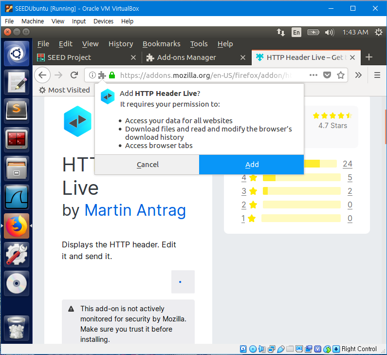
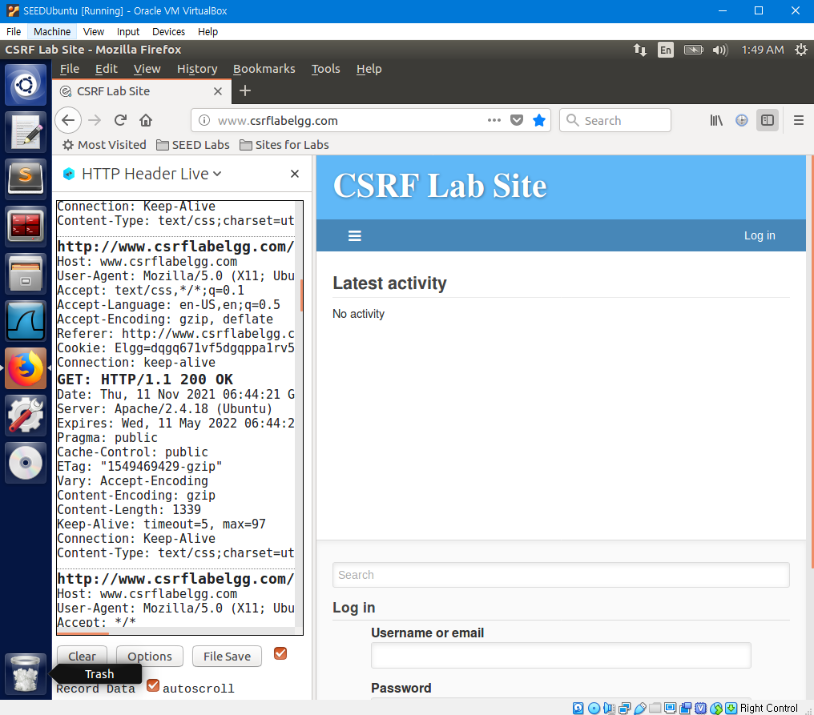
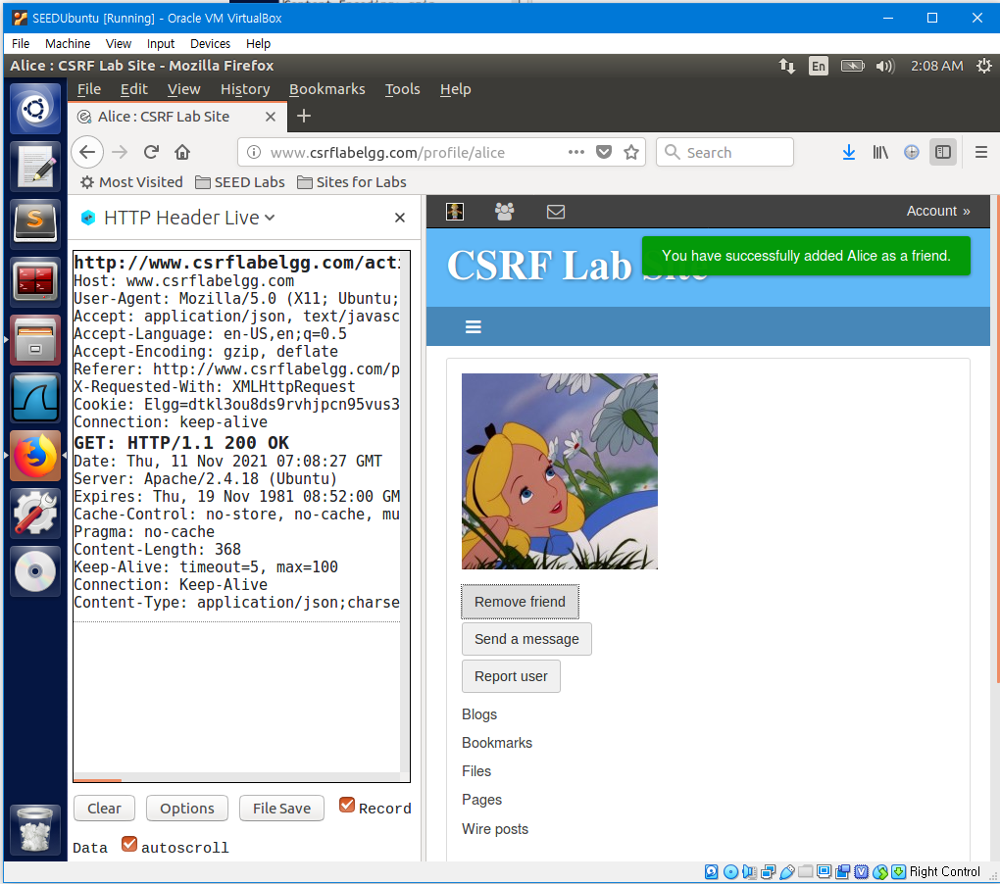
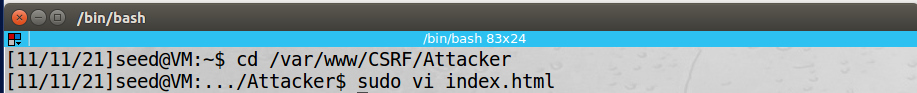
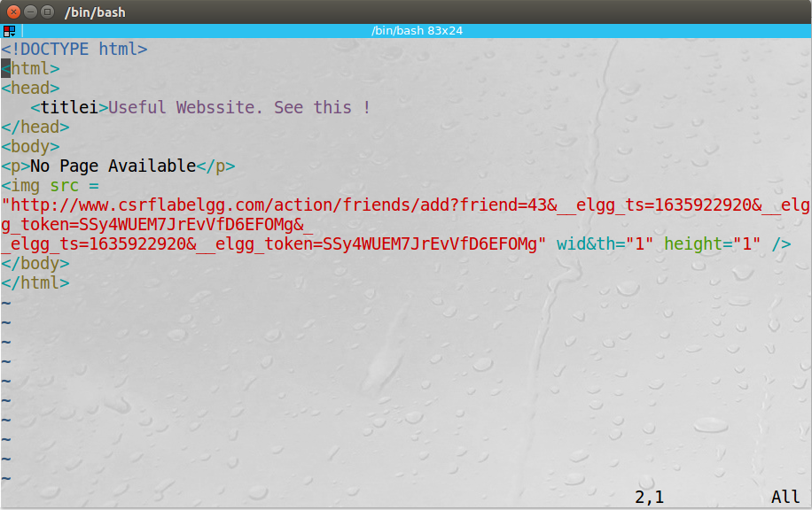
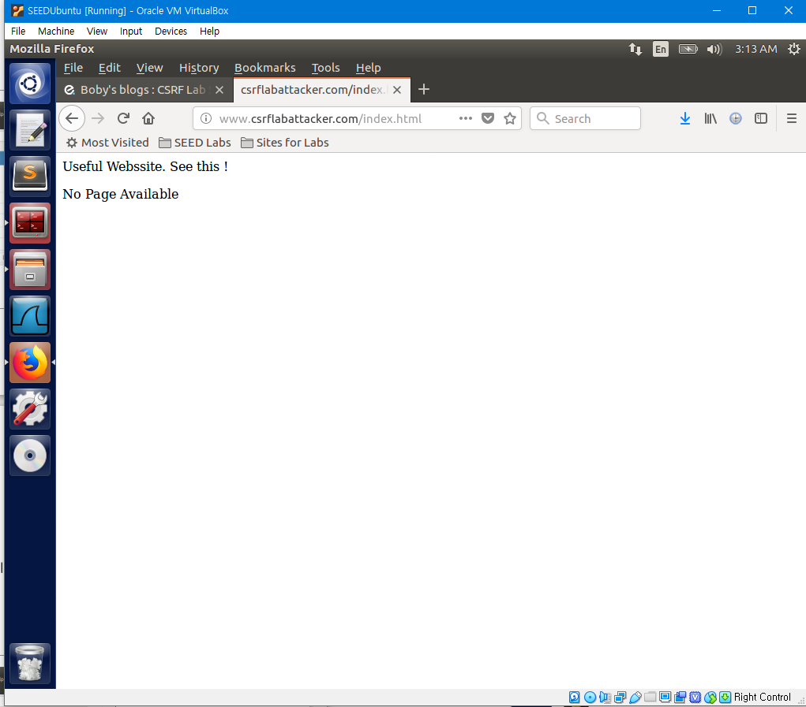
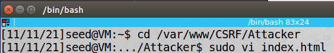
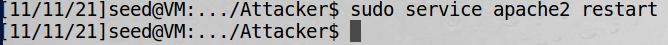
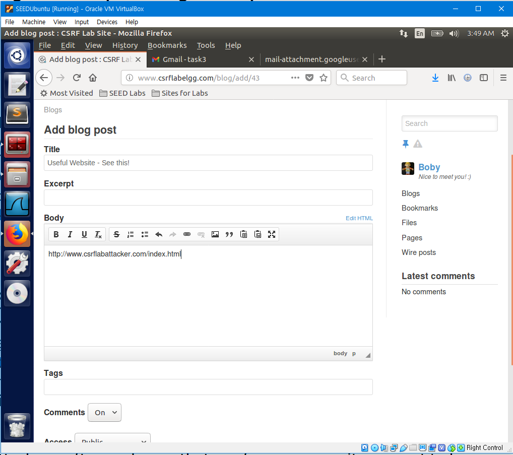

[Lab Instructions](https://seedsecuritylabs.org/Labs_16.04/PDF/Web_CSRF_Elgg.pdf)

## Task 1: Observing HTTP Request

The objective of this task is to check how a legitimate HTTP request looks like and what parameters it uses to prepare forging HTTP requests for a Cross-Site Request Forgery attack.

First, Install the Firefox add-on `HTTP Header Live`



Turn on the Add-on and Connect to www.csrflabelgg.com.

HTTP packets will be captured on the left.



This is one of the Captured Headers.

```
http://www.csrflabelgg.com/
Host: www.csrflabelgg.com
User-Agent: Mozilla/5.0 (X11; Ubuntu; Linux i686; rv:60.0) Gecko/20100101 Firefox/60.0
Accept: text/html,application/xhtml+xml,application/xml;q=0.9,*/*;q=0.8
Accept-Language: en-US,en;q=0.5
Accept-Encoding: gzip, deflate
Connection: keep-alive
Upgrade-Insecure-Requests: 1

GET: HTTP/1.1 200 OK
Date: Thu, 11 Nov 2021 06:44:20 GMT
Server: Apache/2.4.18 (Ubuntu)
Set-Cookie: Elgg=dqgq671vf5dgqppa1rv50ug5t6; path=/
Expires: Thu, 19 Nov 1981 08:52:00 GMT
Cache-Control: no-store, no-cache, must-revalidate
Pragma: no-cache
X-Frame-Options: SAMEORIGIN
Vary: Accept-Encoding
Content-Encoding: gzip
Content-Length: 1995
Keep-Alive: timeout=5, max=100
Connection: Keep-Alive
Content-Type: text/html; charset=UTF-8
```

We can check how a HTTP Request looks like and what parameters we need to forge a request.

## Task 2: CSRF Attack Using GET Request

In this task, Bob will perform a CSRF attack to make Alice to add Bob as her friend in `Elgg`.

First, Bob will have to find out how the HTTP packet of adding a friend looks like.

Log in to `Elgg` as Bobby's account and us HTTP Header Live to capture the header sent while adding Alice as a friend.



This is the captured header.

```
http://www.csrflabelgg.com/action/friends/add?friend=42&__elgg_ts=1636614494&__elgg_token=o5bVoh2HuEaOzAv3fvWyJw&__elgg_ts=1636614494&__elgg_token=o5bVoh2HuEaOzAv3fvWyJw
Host: www.csrflabelgg.com
User-Agent: Mozilla/5.0 (X11; Ubuntu; Linux i686; rv:60.0) Gecko/20100101 Firefox/60.0
Accept: application/json, text/javascript, */*; q=0.01
Accept-Language: en-US,en;q=0.5
Accept-Encoding: gzip, deflate
Referer: http://www.csrflabelgg.com/profile/alice
X-Requested-With: XMLHttpRequest
Cookie: Elgg=dtkl3ou8ds9rvhjpcn95vus3s1
Connection: keep-alive

GET: HTTP/1.1 200 OK
Date: Thu, 11 Nov 2021 07:08:27 GMT
Server: Apache/2.4.18 (Ubuntu)
Expires: Thu, 19 Nov 1981 08:52:00 GMT
Cache-Control: no-store, no-cache, must-revalidate
Pragma: no-cache
Content-Length: 368
Keep-Alive: timeout=5, max=100
Connection: Keep-Alive
Content-Type: application/json;charset=utf-8
```

Write a index.html at /var/www/CSRF/Attacker.





The img tag will trigger an HTTP Get request. When browsers render a web page and sees an imgtag, it sends an HTTP GET request to the URL specified in the src attribute.

In img src, the friend number '42' has been changed to '43' from the captured header because '42' is the inspect element of Alice. Since we will forge a request to add Bob as a friend, change the number to '43' which is the inspect element of Bob.

Write a blog post using Boby's account on `elgg` with the following title and content.


Log in to Alice's Account and click the link in Boby's blog post. It will be redirected to the following page.



Go back to `elgg`. We can see that Alice has added Bob as a friend even though she did not press the add friend button.


This is because the HTTP GET request to add Bob as a friend was triggered when the site was connected.

## Task 3: CSRF Attack Using POST Request

In this task, Bob will perform a CSRF attack to change Alice's profile brief description.

First, Bob will have to find out how the HTTP Header of changing the profile brief description looks like.

Log in to `Elgg` as Bobby's account and us HTTP Header Live to capture the header sent while changing his profile description.


This is the captured header.

```
http://www.csrflabelgg.com/action/profile/edit
Host: www.csrflabelgg.com
User-Agent: Mozilla/5.0 (X11; Ubuntu; Linux i686; rv:60.0) Gecko/20100101 Firefox/60.0
Accept: text/html,application/xhtml+xml,application/xml;q=0.9,*/*;q=0.8
Accept-Language: en-US,en;q=0.5
Accept-Encoding: gzip, deflate
Referer: http://www.csrflabelgg.com/profile/boby/edit
Content-Type: application/x-www-form-urlencoded
Content-Length: 494
Cookie: Elgg=cmpv2ddjatdtckr8hck4upu6s3
Connection: keep-alive
Upgrade-Insecure-Requests: 1
__elgg_token=L6KPQ8qbA9n4-EYlUM43Tg&__elgg_ts=1636619099&name=Boby&description=&accesslevel[description]=2&briefdescription=Nice to meet you! :)&accesslevel[briefdescription]=2&location=&accesslevel[location]=2&interests=&accesslevel[interests]=2&skills=&accesslevel[skills]=2&contactemail=&accesslevel[contactemail]=2&phone=&accesslevel[phone]=2&mobile=&accesslevel[mobile]=2&website=&accesslevel[website]=2&twitter=&accesslevel[twitter]=2&guid=43

POST: HTTP/1.1 302 Found
Date: Thu, 11 Nov 2021 08:25:25 GMT
Server: Apache/2.4.18 (Ubuntu)
Expires: Thu, 19 Nov 1981 08:52:00 GMT
Cache-Control: no-store, no-cache, must-revalidate
Pragma: no-cache
Location: http://www.csrflabelgg.com/profile/boby
Content-Length: 0
Keep-Alive: timeout=5, max=100
Connection: Keep-Alive
Content-Type: text/html;charset=utf-8
```

Now based on the content of the captured header, change the content in index.html made in task 2 into the following content.




Restart apache using the following command, and write a blog post using Bob.





Login Alice to `Elgg` and click the link in Boby's blog post.


Then, we can see that Alice's Brief description has been changed even though she didn't edit her profile.


This is because the HTTP Post request to change Alice's Breif description to "Boby is my Hero" was triggered when the site was connected.
