[Lab Instructions](https://seedsecuritylabs.org/Labs_16.04/PDF/Crypto_MD5_Collision.pdf)

## Task 1: Generating Two Different Files with the Same MD5 Hash

The objective of this task is to use the `md5collgen` command to generate two different files with the same MD5 hash values and have the same beginning parts.

To solve the task, these three questions must be answered :

> –**Question 1**. If the length of your prefix file is not multiple of 64, what is going to happen?
>
> –**Question 2**. Create a prefix file with exactly 64 bytes, and run the collision tool again, and see what happens.
>
> –**Question 3**. Are the data (128 bytes) generated by md5collgen completely different for the two output files? Please identify all the bytes that are different.

Make the file `prefix.txt` and use `md5collgen -p prefix.txt -o out1.bin out2.bin` to generate two files `out1.bin` and `out2.bin` that both start with the same prefix `prefix.txt` and have the same MD5 hash value. This can be Checked by the `diff` and `md5sum` command.

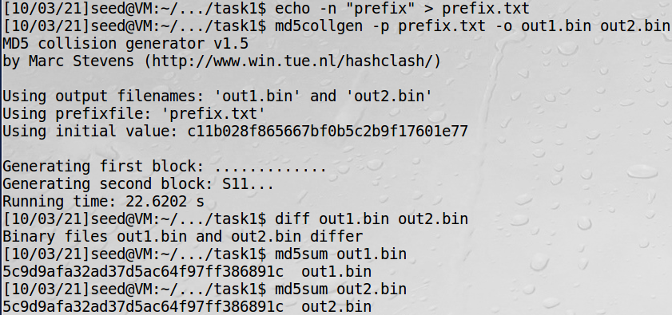

The result shows that `out1.bin` and `out2.bin` are different files that have the same MD5 hash value.

By using bless hex editor, we can read the hex values of the two files.

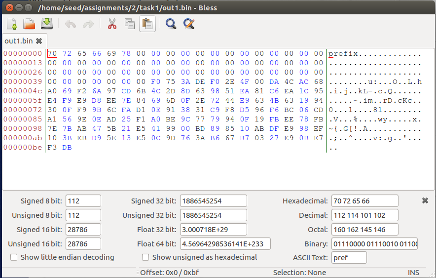

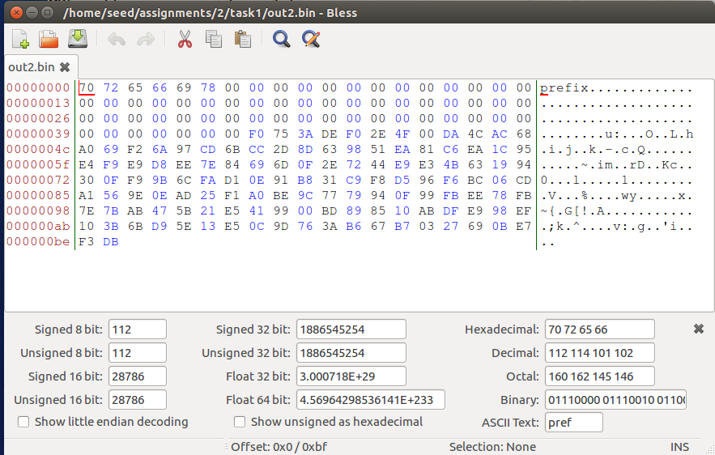

From the images, we can see that 0x00 is padded to make the length of the prefix 64.

**Answer of Question 1**: A padding of 0x00 is added until the length of the prefix is a multiple of 64.

To verify this, make a prefix file of 64 bytes and follow the same process.

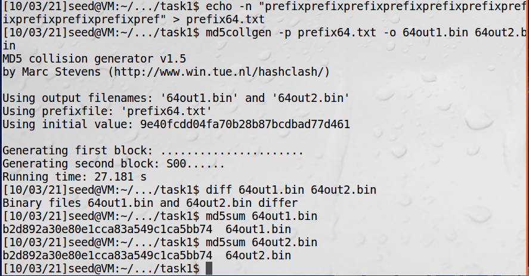

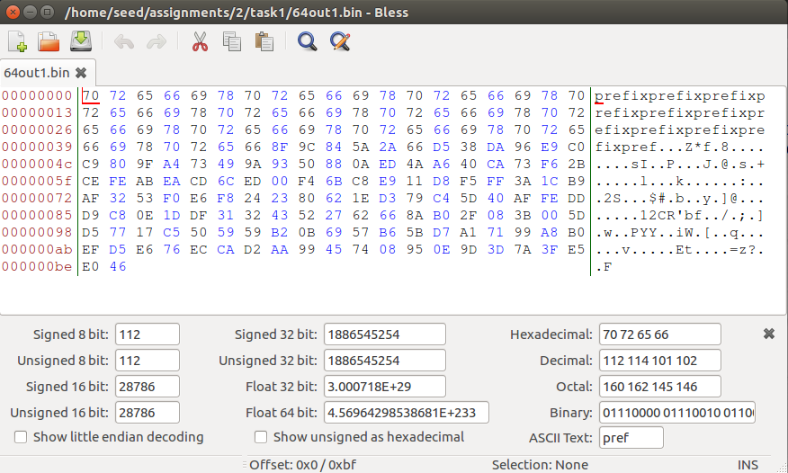

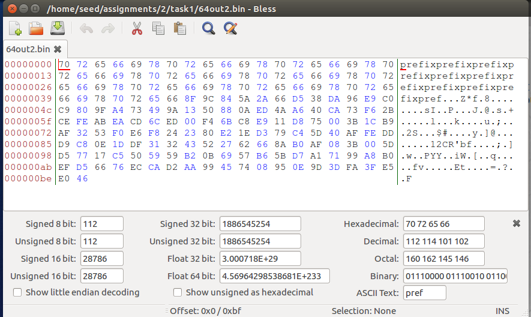

From the images, we can see that no padding is added this time.

**Answer of Question 2** : No padding is added.

Observing the images, It is true that `out1.bin` and `out2.bin` , `64out1.bin` and `64out2.bin` are different.

**Answer of Question 3** : The data(128 bytes) generated by `md5collgen` are different, but not all bytes are different. Comparing `out1.bin` and `out2.bin`, the 84, 110, 124, 148, 174, 188th bytes are different. Comparing `64out1.bin` and `64out2.bin`, the 84,110,111,112,124,148,174,188th bytes are different.

## Task 3: Generating Two Executable Files with the Same MD5 Hash

The objective of this task is to make two C programs that the hash values of the executables are same but have the different content.

To find where the content of the `xyz` array is in the binary executable file of the given code, fill the `xyz` array with 0x41 (the ASCII value of A), compile, and check the executable file with bless hex editor.

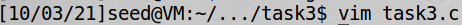

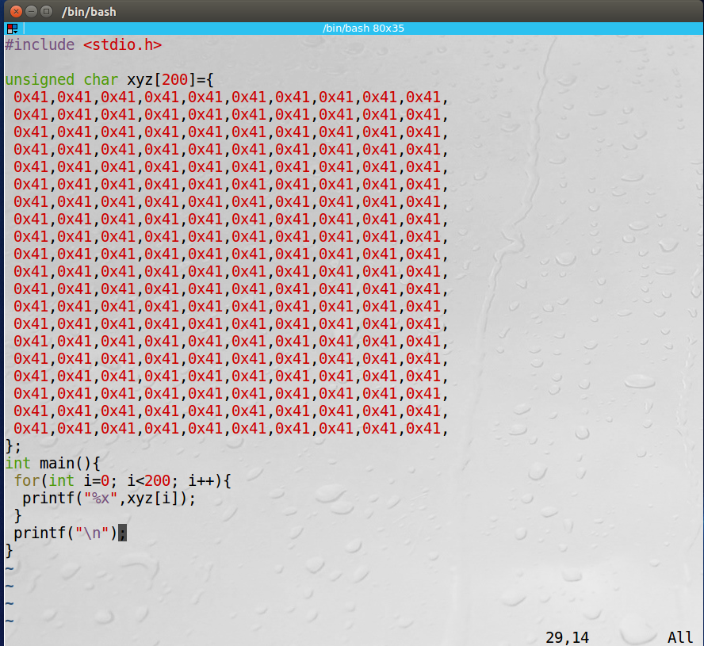

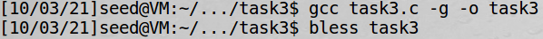

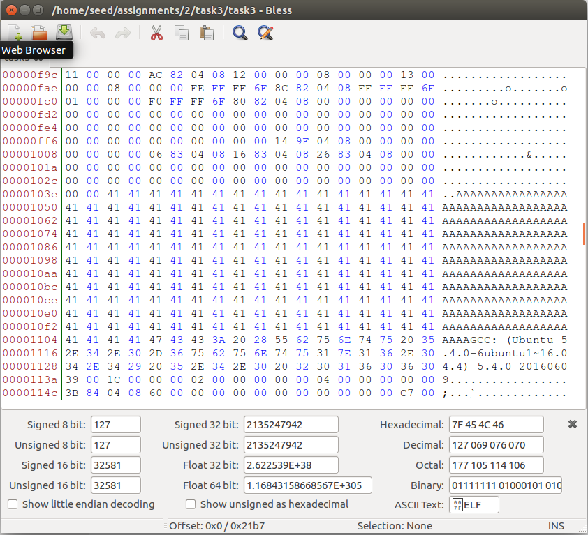

From the result, we can find that the content of the `xyz` array is the 4161~4360th byte of the executable file `task3` .

Therefore, set the first 4160 bytes of the file array as the prefix, make two files with the prefix that have the same MD5 hash, and add the bytes after 4288 bytes as the suffix using `head`, `tail`, and `cat`.

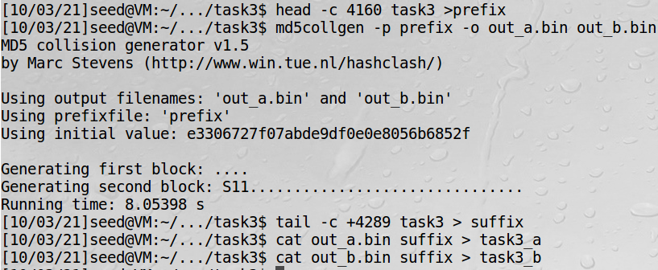

Compare the outputs and the MD5 hash value of the two executable files.

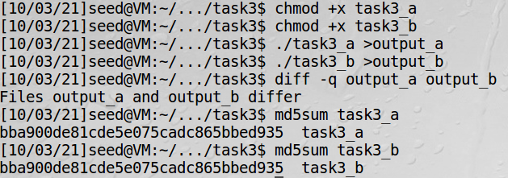

The two files `task3_a` and `task3_b` have the same MD5 hash value but have different outputs.

## Task 4: Making the Two Programs Behave Differently

The objective of this task is to make two C programs that the hash values of the executables are same but behave completely different.

To solve the task, make a C program that follows the give pseudo-code with same values in array x and y, and follow similar steps as task 3 for the C program. The purpose is to make two programs that have the same MD5 hash value, while one has the same `x` and `y` array while one has dfferent arrays.

First, make the program that follows the given pseudo-code with the value 0x41 in array x and y.

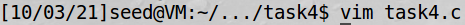

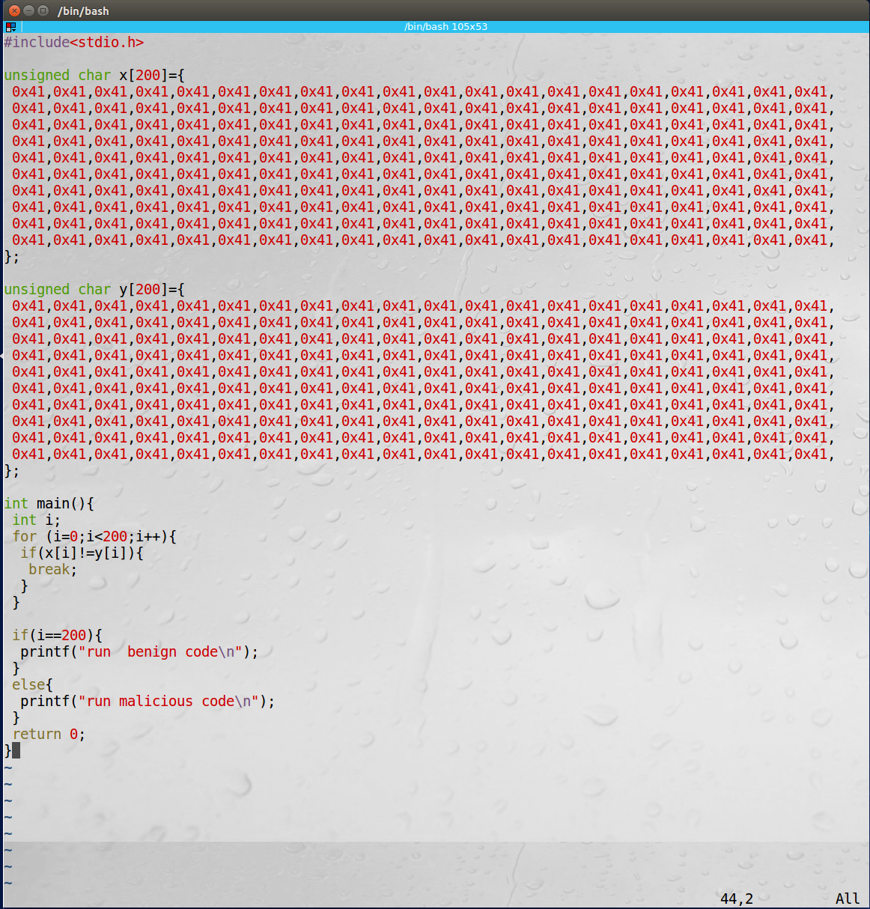

Then, compile the code and find where the content of the `x` and `y` array is in the binary executable file.

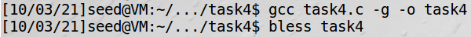

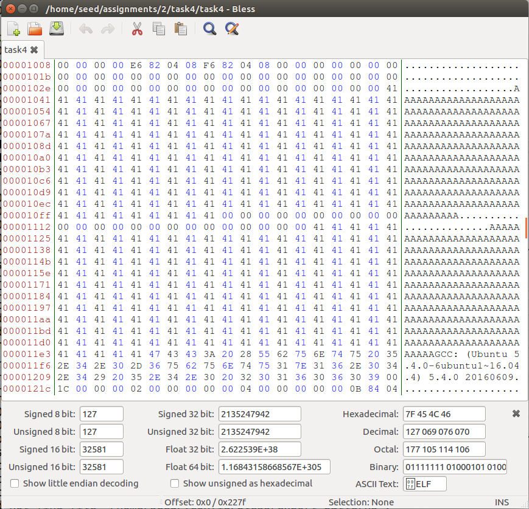

From the result, we can find that the content of the `x` array is the 4161~4360th byte, and the content of the `y` array is the 4385~4584th byte of the executable file .

With the information, we can make two hash colliding programs with different behaviors in the following way.

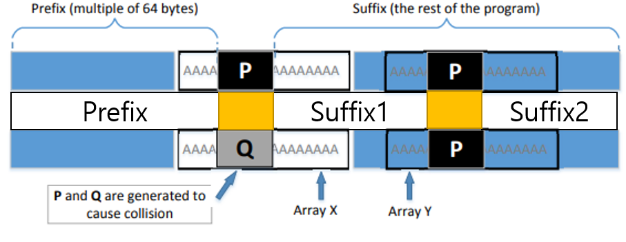

Prefix, Suffix 1, and Suffix 2 can be retrived from `task4` . P and Q can be made by using `md5collgen` with prefix.

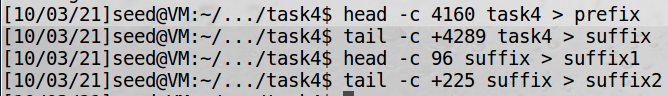

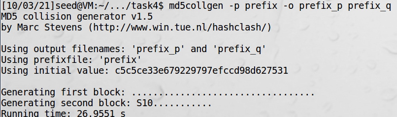

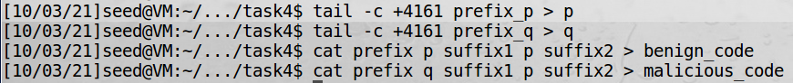

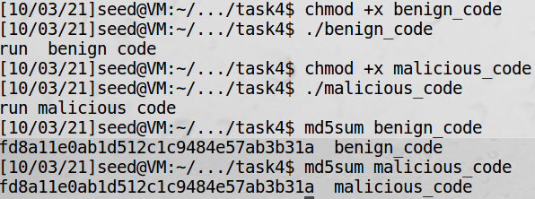

As a result, two different files `benign_code` and `malicious_code` are made. The two files have the same MD5 hash value, but show different behavior.
