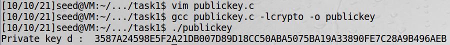
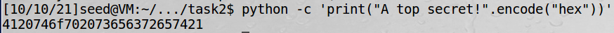
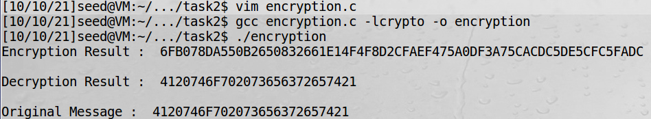
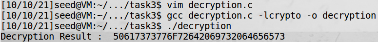
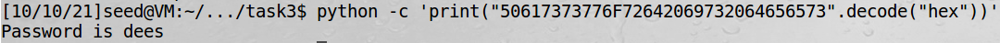

[Lab Instructions](https://seedsecuritylabs.org/Labs_16.04/PDF/Crypto_RSA.pdf)

## Task 1: Deriving the Private Key

The objective of this task is deriving the private key of RSA encryption while public key (e,n) and the factorization n=p\*q is given.

In the RSA Public-Key Encryption algorithm, the keys are derived by the following way.

> –**Step 1**. Choose two distinct prime numbers `p` and `q`.
>
> –**Step 2**. Compute`N=p*q`.
>
> -**Step 3**. Compute $\phi(n)=(p-1)(q-1)$
>
> -**Step 4.** Choose an integer `e` such that $1<e<\Phi(n)-1$ and $gcd(e,\phi(n))=1$
>
> -**Step 5.** Determine `d` as $d \equiv e^{-1} (mod\; \phi(n))$

Since p,q and e are given in this task, d can be calculated by the following C Program using BIGNUM APIs.

```c
#include <stdio.h>
#include <openssl/bn.h>

#define NBITS 256

void printBN(char *msg, BIGNUM *a)
{
	char *number_str = BN_bn2hex(a);
	printf("%s %s\n", msg, number_str);
	OPENSSL_free(number_str);
}

int main()
{

	BN_CTX *ctx = BN_CTX_new();
	BIGNUM *p = BN_new();
	BN_hex2bn(&p, "F7E75FDC469067FFDC4E847C51F452DF");
	BIGNUM *q = BN_new();
	BN_hex2bn(&q, "E85CED54AF57E53E092113E62F436F4F");
	BIGNUM *e = BN_new();
	BN_hex2bn(&e, "0D88C3");

	BIGNUM *n = BN_new();
	BN_mul(n,p,q,ctx); //n=p*q

	BIGNUM *one =BN_new(); // one=1
	BN_hex2bn(&one, "1");

	BIGNUM *p1 = BN_new(); //p1=p-1
	BN_sub(p1,p,one);

        BIGNUM *q1 = BN_new(); //q1=q-1
        BN_sub(q1,q,one);

	BIGNUM *phi = BN_new(); //phi(n)=(p-1)(q-1)
	BN_mul(phi,p1,q1,ctx);

	BIGNUM *d = BN_new();
	BN_mod_inverse(d,e,phi,ctx); //d=e^-1(mod phi(n))
	printBN("Private key d : ", d);

	BN_clear_free(p);
    BN_clear_free(q);
    BN_clear_free(e);
    BN_clear_free(n);
    BN_clear_free(p1);
    BN_clear_free(q1);
    BN_clear_free(phi);
    BN_clear_free(d);
}
```

Write the program using VIM, compile, and run the program with the following commands.



We can calculate the Private key `d`.

> `d= 0x3587A24598E5F2A21DB007D89D18CC50ABA5075BA19A33890FE7C28A9B496AEB`

## Task 2: Encrypting a Message

The objective of this task is to encrypt the given message using RSA public-key encryption algorithm with the given public keys.

RSA encryption is done by the following way.

$$
m^e \equiv c (mod\;n)
$$

Decryption is done by the following way.

$$
c^d \equiv (m^e)^d \equiv m (mod\;n)
$$

Before encryption, the message in ASCII string has to be converted to a hex string. This is available by the following python comand.



The encryption and decryption process can be done easily using the following C program using BIGNUM APIs.

```c
#include<stdio.h>
#include <openssl/bn.h>

void printBN(char *msg, BIGNUM *a)
{
	char *number_str= BN_bn2hex(a);
	printf("%s %s\n", msg, number_str);
	OPENSSL_free(number_str);
}

int main()
{
	BN_CTX *ctx = BN_CTX_new();

	BIGNUM *n = BN_new();
	BN_hex2bn(&n, "DCBFFE3E51F62E09CE7032E2677A78946A849DC4CDDE3A4D0CB81629242FB1A5");

	BIGNUM *e = BN_new();
	BN_hex2bn(&e, "010001");

	BIGNUM *m = BN_new();
	BN_hex2bn(&m, "4120746f702073656372657421");

	//encryption
	BIGNUM *c = BN_new(); //c=m^e(mod n)
	BN_mod_exp(c,m,e,n,ctx);
	printBN("Encryption Result : ",c);
	printf("\n");


	//verification
	BIGNUM *d =BN_new();
	BN_hex2bn(&d, "74D806F9F3A62BAE331FFE3F0A68AFE35B3D2E4794148AACBC26AA381CD7D30D");

	BIGNUM *result=BN_new(); //result=c^d(mod n)
	BN_mod_exp(result,c,d,n,ctx);


	printBN("Decryption Result : ",result);
	printf("\n");
	printBN("Original Message : ",m);

	BN_clear_free(n);
    BN_clear_free(e);
    BN_clear_free(m);
    BN_clear_free(c);
    BN_clear_free(d);
    BN_clear_free(result);

}
```

Write the program using VIM, compile, and run the program with the following commands.



We can calculate the Encryption result.

> **Encryption Result : **`0x6FB078DA550B2650832661E14F4F8D2CFAEF475A0DF3A75CACDC5DE5CFC5FADC`

We can validate the Encryption result by decrypting the encryption result and comparing it with the original message. The result shows that the encryption result is true.

## Task 3: Decrypting a Message

The objective of this task is to decrypt the given message using RSA public-key encryption algorithm with the given public keys.

This can be done by the same way as task 2.

The decryption process can be done easily using the following C program using BIGNUM APIs.

```c
#include<stdio.h>
#include <openssl/bn.h>

void printBN(char *msg, BIGNUM *a)
{
    char *number_str= BN_bn2hex(a);
    printf("%s %s\n", msg, number_str);
    OPENSSL_free(number_str);
}

int main()
{
    BN_CTX *ctx = BN_CTX_new();

    BIGNUM *n = BN_new();
    BN_hex2bn(&n,"DCBFFE3E51F62E09CE7032E2677A78946A849DC4CDDE3A4D0CB81629242FB1A5");

    BIGNUM *c = BN_new();
    BN_hex2bn(&c,"8C0F971DF2F3672B28811407E2DABBE1DA0FEBBBDFC7DCB67396567EA1E2493F");

    BIGNUM *d =BN_new();
    BN_hex2bn(&d,"74D806F9F3A62BAE331FFE3F0A68AFE35B3D2E4794148AACBC26AA381CD7D30D");

	//decryption
    BIGNUM *m=BN_new(); // m=c^d(mod n)
    BN_mod_exp(m,c,d,n,ctx);


    printBN("Decryption Result : ",m);

	BN_clear_free(n);
    BN_clear_free(c);
    BN_clear_free(d);
    BN_clear_free(m);
}
```

Write the program using VIM, compile, and run the program with the following commands.



Use the following python command to convert th e hex string back to a ASCII string and retrieve the message.



The original message is

> **Password is dees**
