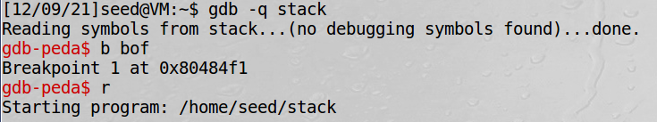
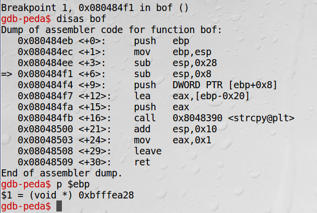
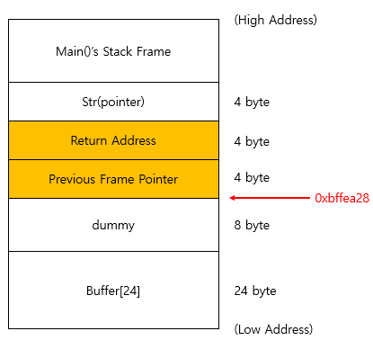
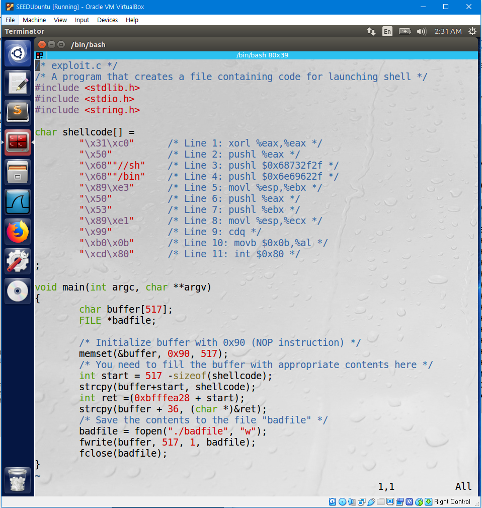
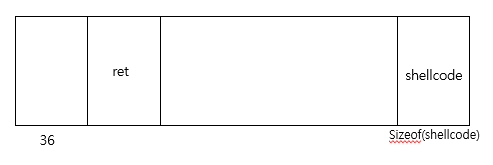
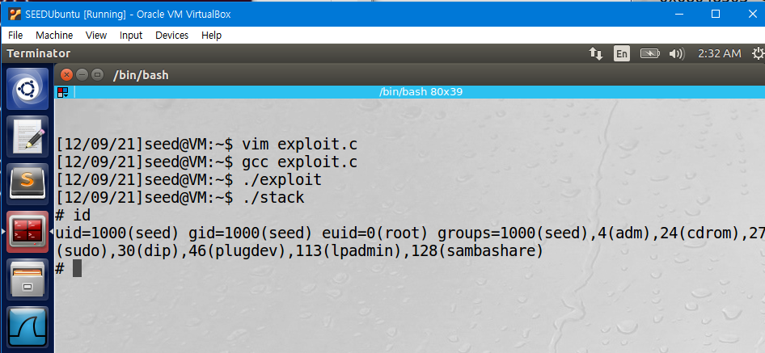
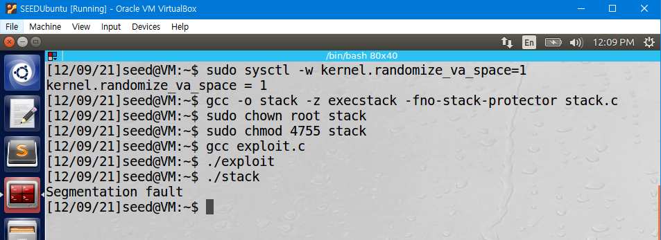
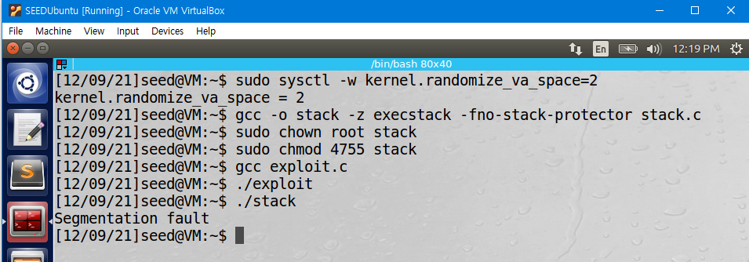
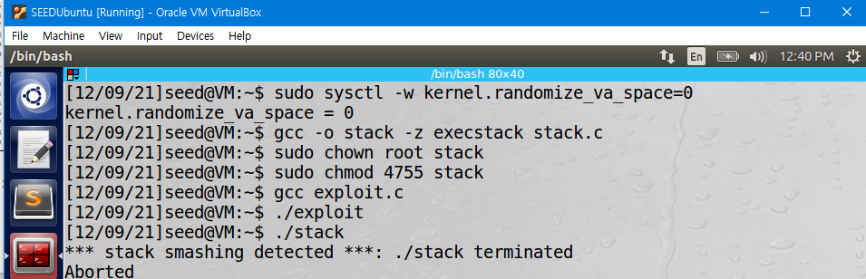
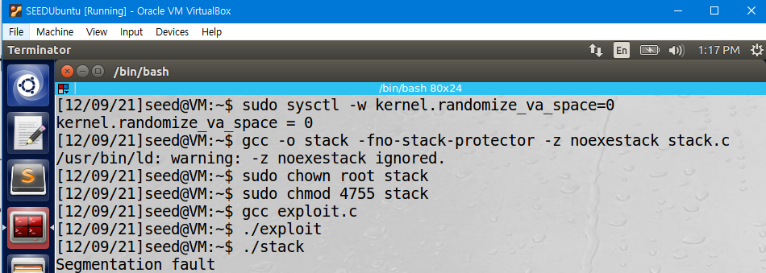

[Lab Instructions](https://seedsecuritylabs.org/Labs_16.04/PDF/Buffer_Overflow.pdf)

## Task 2: Exploiting the Vulnerability

The objective of this task is to write the program `exploit.c`, to construct the content of `badfile` and launch a buffer overflow attack on the vulnerable program `stack.c`.

To fill in `exploit.c`, we need to investigate the stack frame layout of the `bof()` function in `stack.c`. This can be using gdb to debug `stack.c`. Use the following commands.

The debug result shows that the address of the frame pointer is `0xbffea28`. Therefore, this is the Stack frame layout of `bof()` function.

The return address is 24 + 8 + 4 =36 bytes above from Buffer, so write the following code to fill in `badfile`.

When this code is executed, this is how `badfile` will be filled.

Compile and Execute `exploit.c` to create `badfile`, and run `stack`. A buffer overflow attack will be launched, and the root shell will be opened. We can check that the euid is set as root, and the attack has been successfully launched.

This is because when `bof()` is executed in `stack`, the size of `badfile` is bigger than `buffer`, so an buffer overflow occurs. The return address has been overwritten to a new address that points to the shellcode, and therefore the shellcode will be executed when `bof()` ends.

## Additional) Countermeasures (ASLR, StackGuard, Non-executable stack)

The objective of this task is to learn the countermeasures against Buffer Overflow attack.

### 1. ASLR (Address Space Layout Randomization)

Change `kernel.randomize_va_space` to 1, compile `exploit` and `stack` again, and execute them.

Change `kernel.randomize_va_space` to 2, compile `exploit` and `stack` again, and execute them.

In both cases, a segmentation fault occurs. A segmentation fault is an error that occurs when a program attempted to access a restricted area of memory.

When `kernel.randomize_va_space` is set as 1, ASLR is enabled on the stack memory. When `kernel.randomize_va_space` is set as 2, ASLR is enabled on both the heap and stack memory. ASLR randomizes the start location of the stack or heap, which makes the stack and heap address change every time the code is loaded in the memory. Therefore, the `%ebp` address and address of the malicious code changes every time, and this makes the content in `badfile` created by `exploit` point to the wrong address. This causes the segmentation fault.

### 2. StackGuard

Compile `stack.c` without `-fno-stack-protector` and then execute `exploit` and `stack`.

This time, the program is automatically terminated after detecting a stack smashing.

When stack guard is used, a secret value is saved between the buffer and return address.

Before ending the function `bof()`, the secret value is checked. If the value has changed, it is detected that an buffer overflow attack has occured.

### 3. Non-executable stack

Compile `stack.c` with `-z noexestack` and then execute `exploit` and `stack`.

This time, a segmentation fault occurs.

When Non-executable stack is used, certain areas of the memory are marked as non-executable. Therefore, even though a buffer overflow occurs, the non-executable stack protection prevents the program from running the shellcode, and a segmentation fault occurs.
