[Lab Instructions](https://seedsecuritylabs.org/Labs_16.04/PDF/Environment_Variable_and_SetUID.pdf)

## Task 2: Passing Environment Variables from Parent Process to Child Process

The objective of this task is to study how a child process gets its environment variables from its parent. We would like to find out whether the parent's environment variables are inherited by the child process or not.

Write the following program `pass_env.c`.

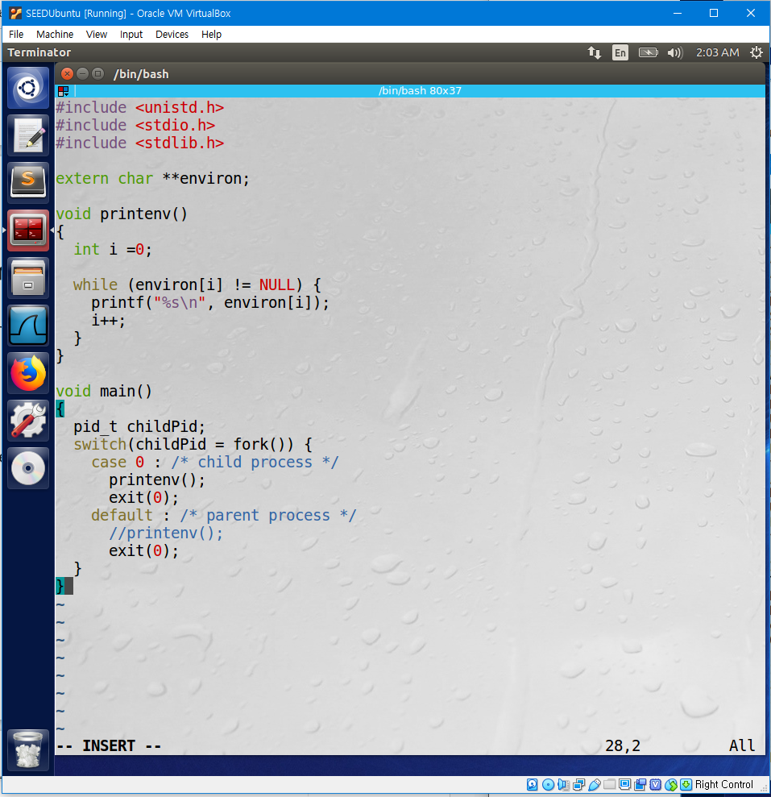

The following program is supposed to print the environment variables of the child process.

Since the output contains many strings, compile the program and save the output into a file, `child`.

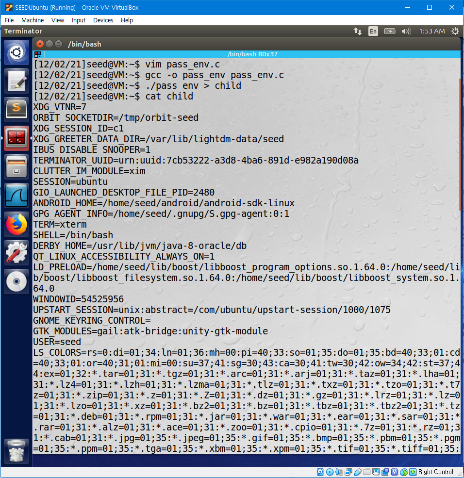

We can see that the environment variables of the child process have been written in the file `child`.

Now change the program `pass_env.c` so that it prints the environment variables of the parent process, compile the program and save the output into a file, `parent`.

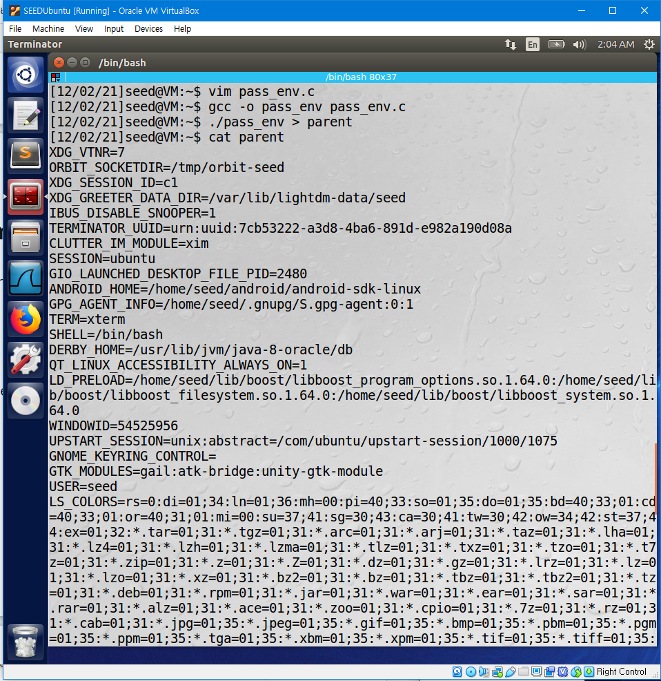

We can see that the environment variables of the child process have been written in the file `parent`.

Compare the difference in environment variables of the child process and parent process by comparing the content of `parent` and `child`.

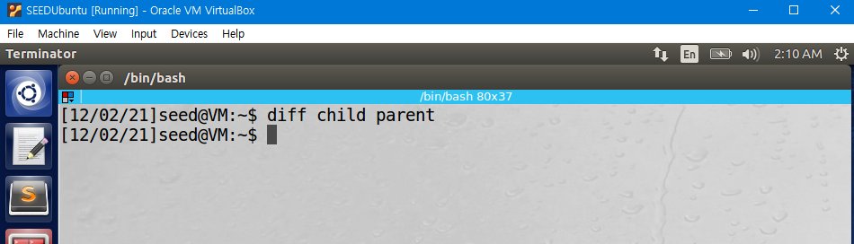

The result shows that the environment variables of the child process and parent process are same. This is because `fork()` creates a new process (child process) by duplicating the calling process (parent process), and all environments of the parent process are inherited to the child process.

## Task 3. Environment Variables and `execve()`

The objective of this task is to study how environment variables are affected when a new program is executed via `execve()`.

Write, compile, and run the following program. The following program executes a program `/usr/bin/env`, which prints out the environment variables of the current process.

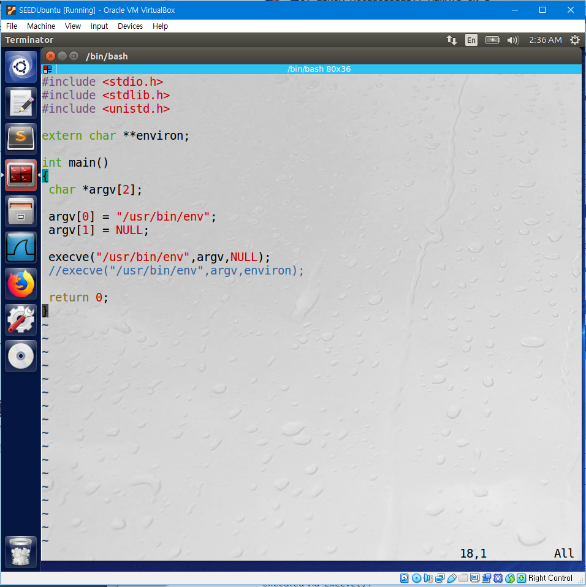

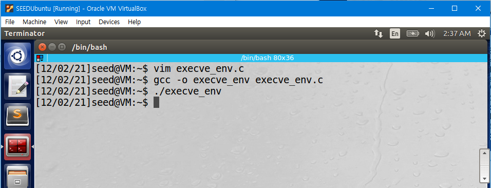

Nothing has been printed.

Now, Change the invocation of `execve()`as following, compile, and run the program.

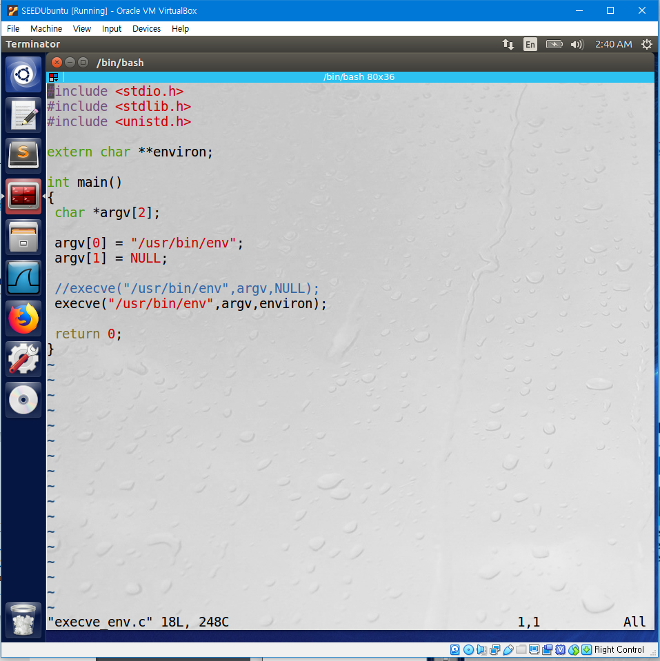

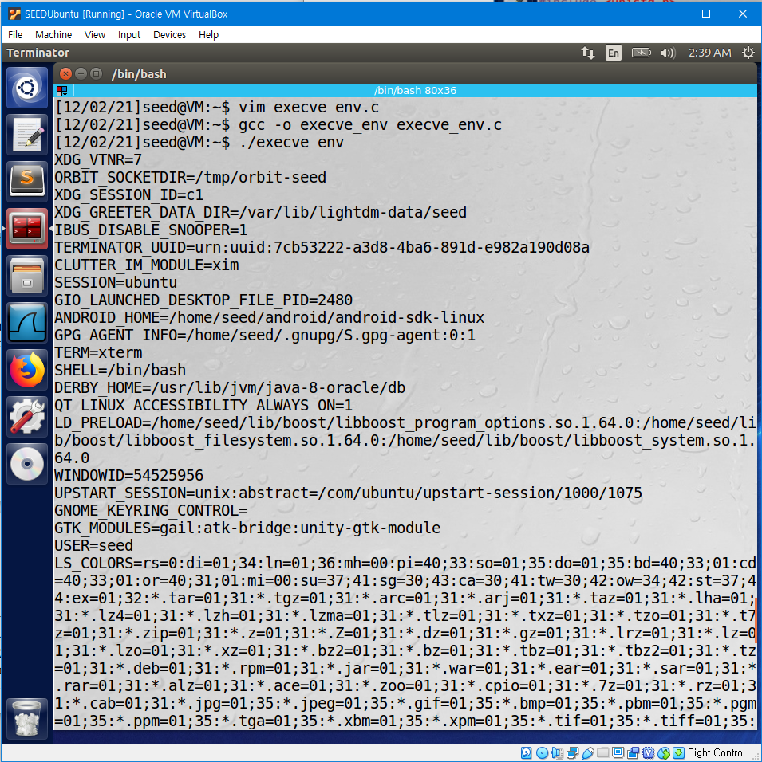

This time, the environment variables of the program has been printed.

The difference is because the third argument of `execve()`, which specifies the environment variable was different. Before changing the program, the third argument of `execve()` was NULL, so no environment variables were passed to the new program executed by `execve()`, and nothing was printed. However after the program has been changed, the environment variables of the current process was passed to the new program executed by `execve()`, and environment variables have been printed. In conclusion, to pass environment variables when a new program is executed by `execve()`, they have to be passed as the third argument.

## Task 7. The LD_PRELOAD Environment Variable and Set-UID Programs

The objective of this task is to study how SET-UID programs deal with some environment variables such as `LD PRELOAD`, `LD LIBRARY PATH`, `LD *`, which are variables that influence the behavior of a dynamic loader/linker.

First, build a dynamic link library by writing the following code `mylib.c` and compile it with the following commands.

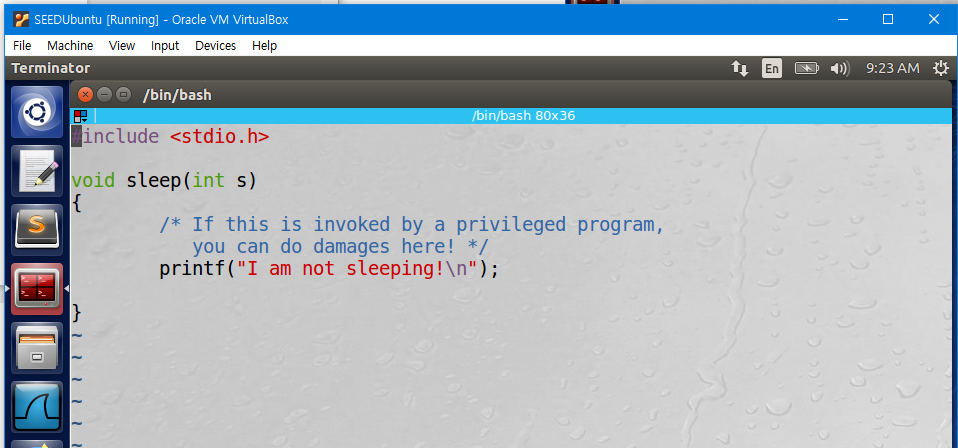

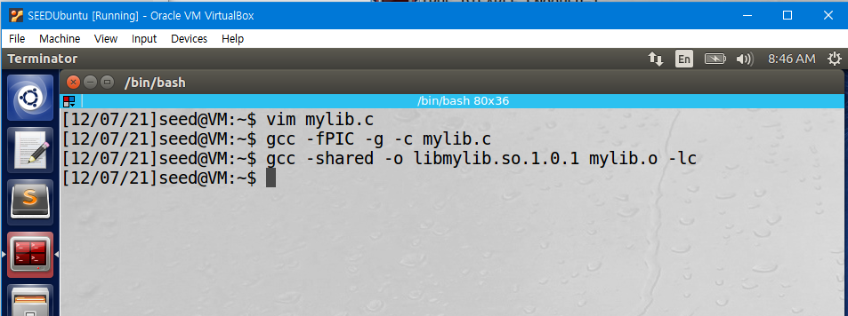

`mylib.c` is a dynamic link library that overrides the `sleep()` function in `libc`.

Then, set the `LD PRELOAD` environment variable with the following command.

If the `LD PRELOAD` variable is set, the library set in `LD PRELOAD` gets loaded before `libc`. Therefore, if there is a function with the same name, the function in the library set in `LD PRELOAD` gets executed because it if loaded first.

Write and compile the following program `myprog.c`.

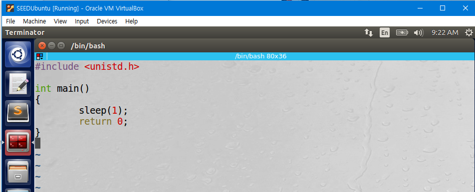

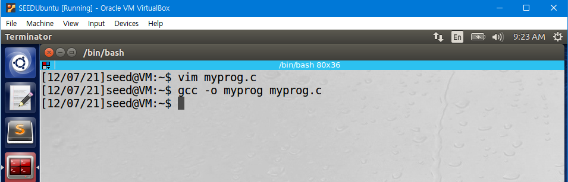

Run `myprog` in the following 4 conditions.

> 1. Make `myprog`a regular program, and run it as a normal user.

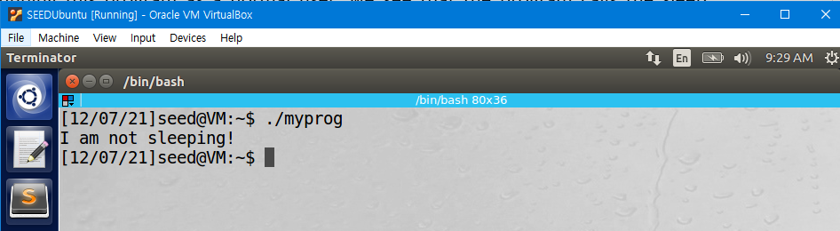

We can see that the `sleep()` function in the dynamic link library `mylib.c` has been executed. This is because the library has been set in the `LD_PRELOAD` environment variable.

> 2. Make `myprog` a Set-UID root program, and run it as a normal user.

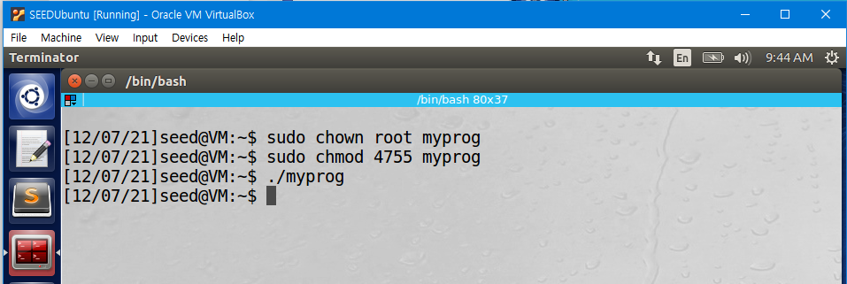

This time, `myprog` has been set as a Set-UID program owned by root, and has been run by a normal user `seed`. The `sleep()` function in the dynamic link library `mylib.c` has not been executed. This is because due to a countermeasure implemented by the dynamic linker, it ignores the `LD_PRELOAD` and `LD_LIBRARY_PATH` environment variables when the EUID and RUID differ.

> 3. Make `myprog` a Set-UID root program, export the `LD_PRELOAD` environment variable again in the root account and run it.

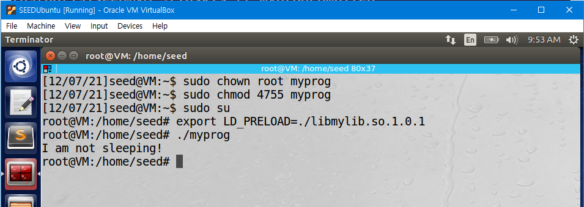

This time, `myprog` has been set as a Set-UID program owned by root, and has been run by `root`. The `sleep()` function in the dynamic link library `mylib.c` has been executed, since the EUID and RUID are equal.

> 4.  Make `myprog` a Set-UID user1 program, export the `LD_PRELOAD` environment variable again in a different user’s account (not-root user) and run it.

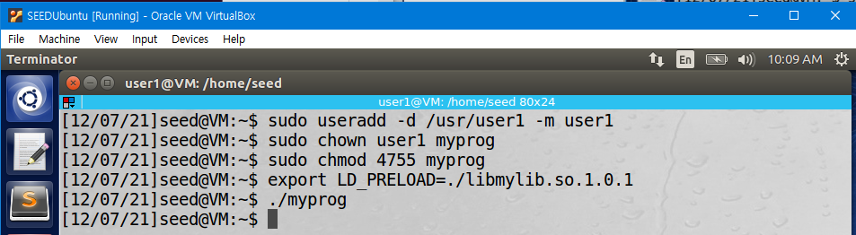

This time, `myprog` has been set as a Set-UID program owned by `user1`, and has been run by another normal user `seed`. The `sleep()` function in the dynamic link library `mylib.c` has not been executed, since the EUID and RUID are different.
