[Lab Instructions](https://seedsecuritylabs.org/Labs_16.04/PDF/Sniffing_Spoofing.pdf)

## Network Setup

For this lab, a network between virtual machines have been made.

Copy and make 2 more Virtual Machines of `SeedUbuntu`. Only `SeedUbuntu3` which will be used as the Attacker has been set as Promiscuous mode.

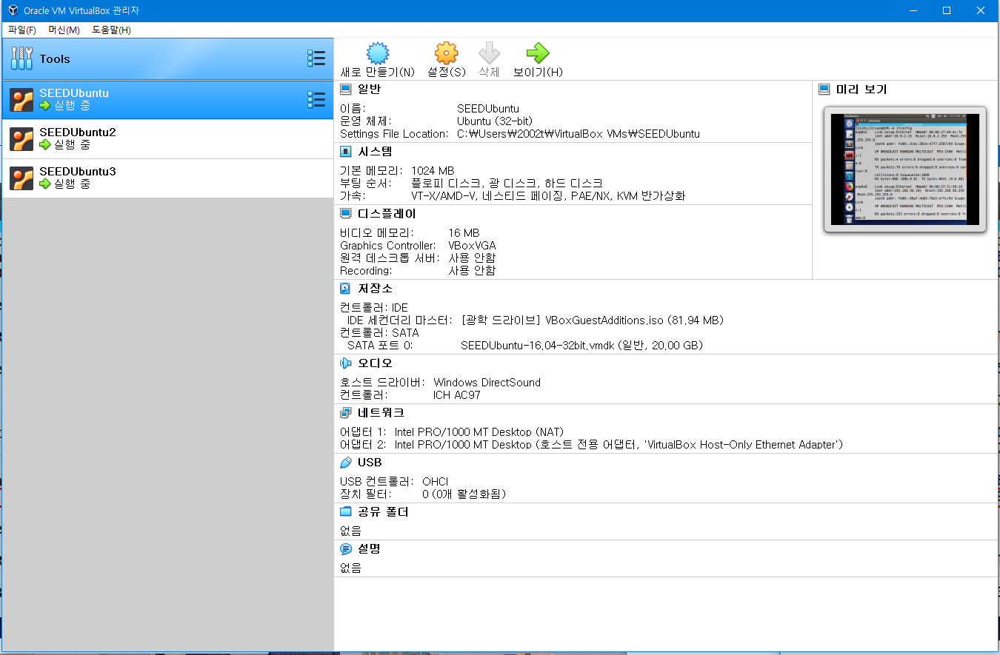

Used the `ifconfig` command and check the `enp0s8 inet addr` to check the IP address of each VM.

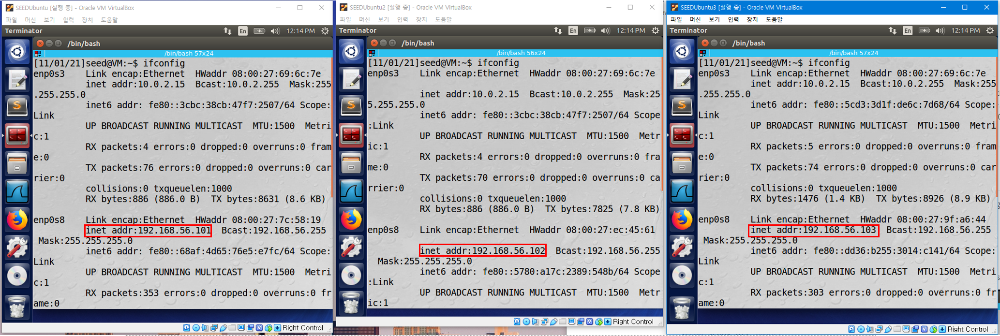

This is how the network is set.

## Task 1.1: Sniffing Packets

The objective of this task is to learn how to use `Scapy` to do packet sniffing in Python Programs.

`Scapy` can be Installed easily by using the following command.

> sudo pip3 install scapy

To use `Scapy`, write a Python Program and execute this using Python.

For example, writing the following program and running it with root privilege will show results.

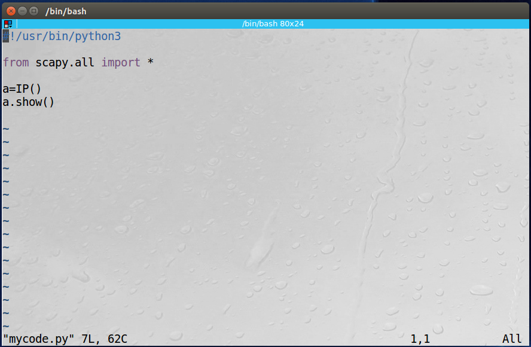

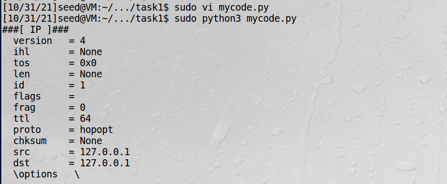

To sniff packets, write the following program and make it executable.

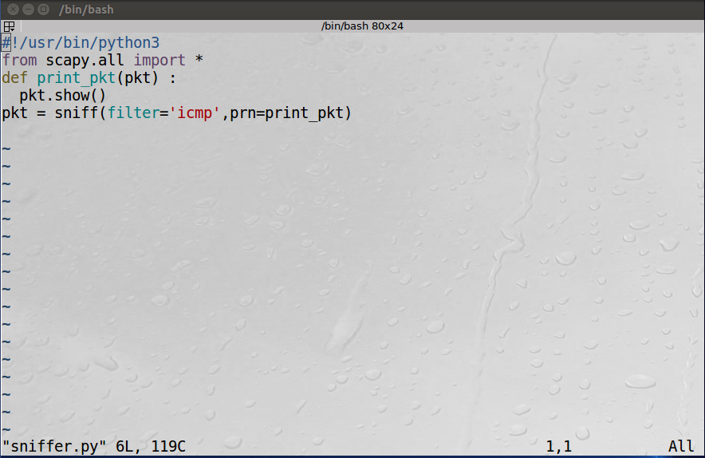

Try running the program with root privileges.

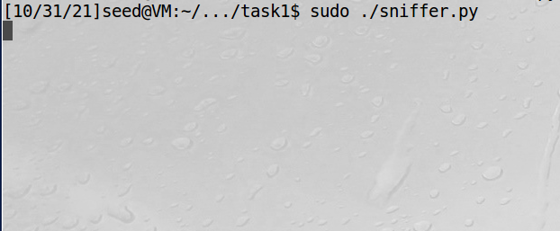

First, nothing happens because no ICMP packets are being sent.

To send ICMP packets, open another terminal and use the `ping (ip)` command.

In this example, find the IP address of `google. com` using `nslookup (website)` and use it.

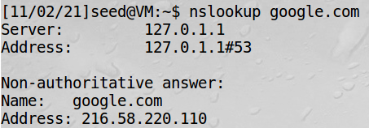

Then, we can see that the program sniffs packets.

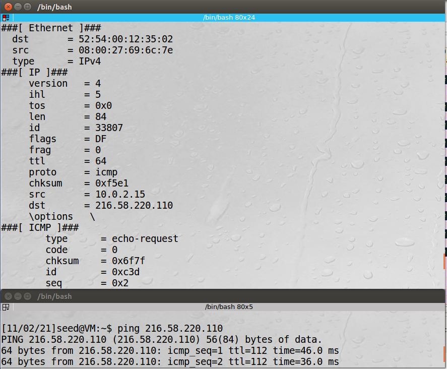

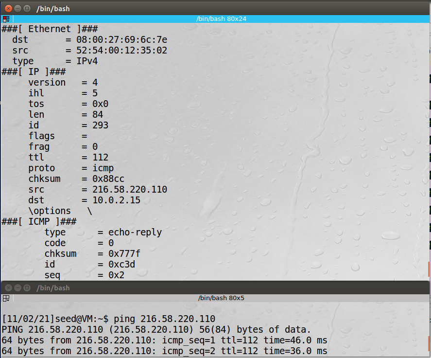

We can see request and reply packets sniffed.

However, If we try running the program without root privileges, the following permission error occurs and ICMP packets cannot be sniffed.

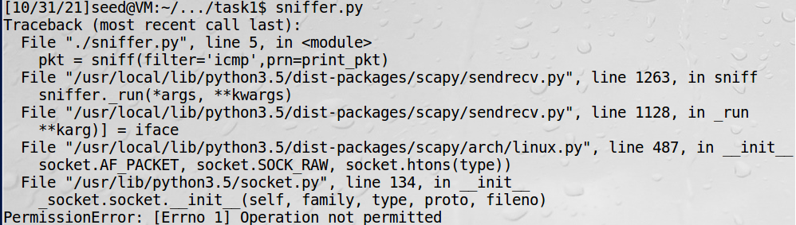

From the results, we can see that the program works when root privilege is given but the program does not work when root privilege is not given.

This is because root privilege is an authority to read and write any files and commands on the system, and root privilege is needed to use the `scapy` commands to access to the packets that lay under the application layer and see the traffic and capture packets for sniffing and spoofing.

## Task 1.2: Spoofing ICMP Packets

The objective of this task is to spoof IP packets with an arbitrary source IP address. To solve the task, The attacker(192.168.15.103) will spoof a packet with Source: 192.168.15.102 and Destination: 192.168.15.101.

To spoof a packet, write the following program.

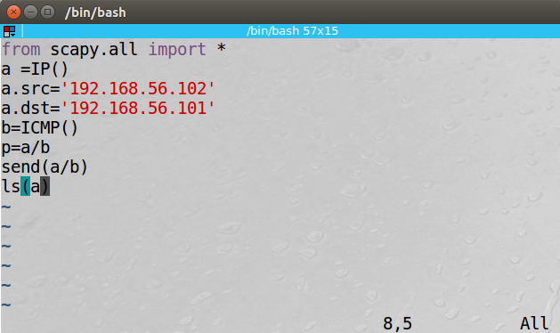

Execute the python program to send the packet.

The `ls(a)` command shows info of the packet sent.

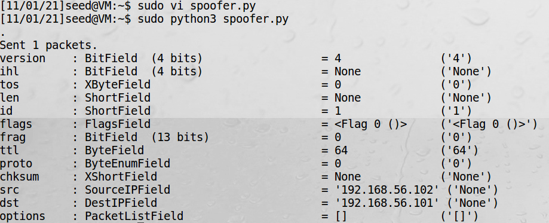

We can see that the Souce Ip and Destination IP has been set as the program.

Using `wireshark`, Packets can be captured.

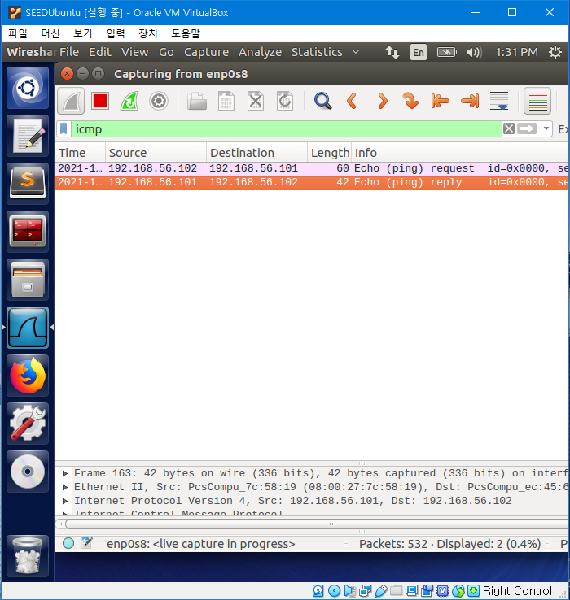

From `SEEDUbuntu(192.168.56.101)`, we can see that the spoofed packet arrived, and the VM sent a echo reply packet to the spoofed IP.

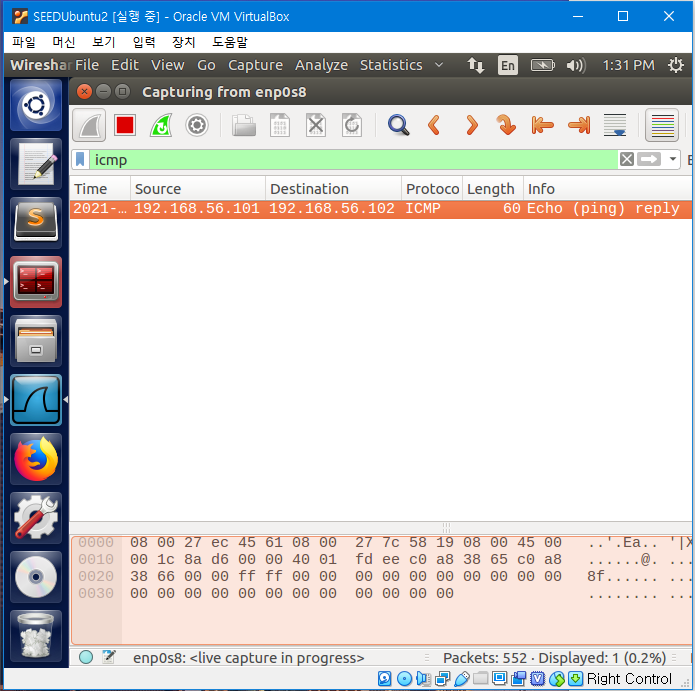

From `SEEDUbuntu2(192.168.56.102)`, we can see that the VM has recieved a Echo reply from 192.168.15.101 while it did not send any packet to it.

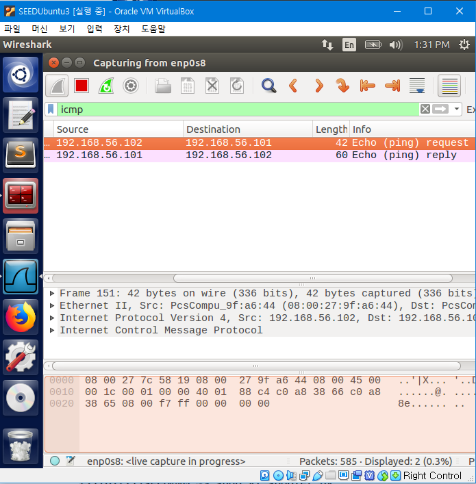

From `SEEDUbuntu3(192.168.56.103)`, we can see that the spoofed packet has been sent by the VM with a spoofed source IP and a reply has been sent to the spoofed IP.

## Task 1.3: Traceroute

The objective of this task is to use Scapy to implement traceroot, which is estimating the distance, in terms of number of routers, between your VM and a selected destination.

For this task, We will traceroute our VM `SEEDUbuntu3 (enp0s3 IP addr 10.0.2.15)` and google.com

The IP address of google.com can be found as the same way in Task 1.1.

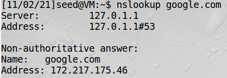

Traceroute can be done by the following python program.

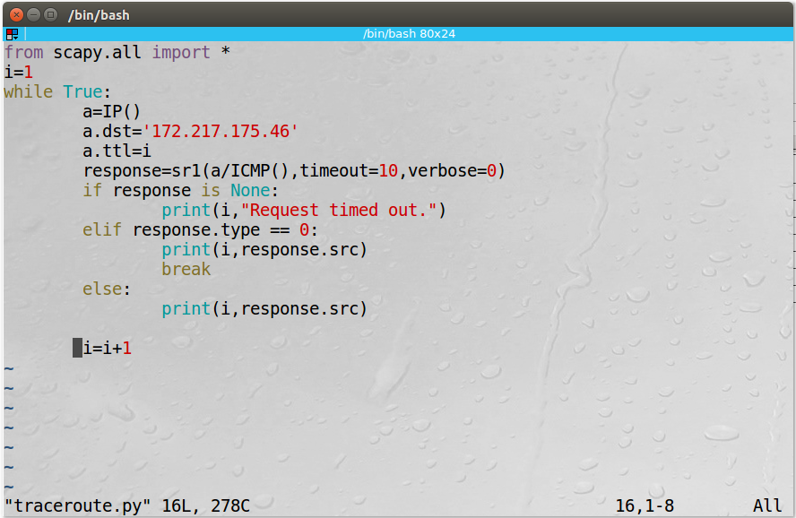

This program sends a packet to the destination `172.217.175.46` and gets its response by the `sr1()` function of `scapy`. Parameters `timeout` and `verbose` are used to set how much time to wait after the last packet has been sent and set verbosity level of the response to remove useless information.

Every time a packet is sent and a response is received, the source of the response packet is printed and another packet with a `TTL(Time-toLive)` increased by 1 is sent. This process is repeated until the source of the response packet from the packet destination `(172.217.175.46)` arrives.

Execute the program.

Each line of the result is a different router. The result shows that it has reached 12 different routers to reach our destination `172.217.175.46`, and one of the routers have timed out.

The process has also been captured by Wireshark.

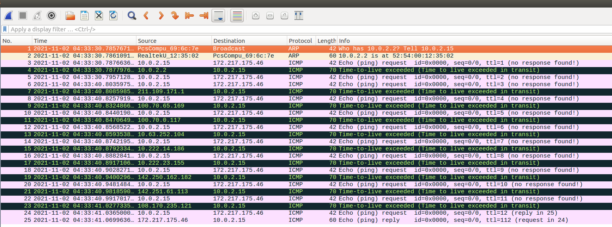
