[Lab Instructions](https://seedsecuritylabs.org/Labs_16.04/PDF/Crypto_Encryption.pdf)

## Task 2: Encryption using Different Ciphers and Mode

The objective of this task is to use the `openssl enc` command for the encryption and decryption of various ciphers and modes.

FIrst, save the plaintext to encrypt in `plain.txt`.

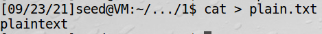

Next, encrypt plain.txt using `des-ofb`, `aes-128-cbc` , `-bf-cfb`

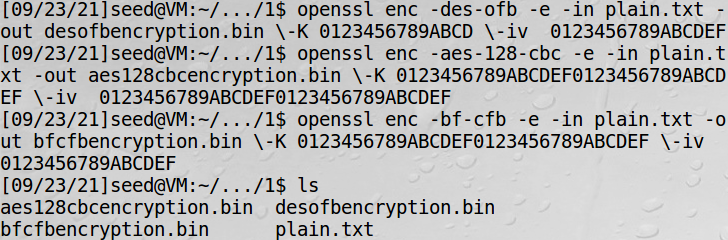

I have changed the key and initial vector based on the key size and block size of each encryption algorithm.

|            | des-ofb | aes-128-cbc | bf-cfb  |
| :--------: | :-----: | :---------: | :-----: |
|  Key Size  |  56bit  |   128 bit   | 128 bit |
| Block Size | 64 bit  |   128 bit   | 64 bit  |

Using the`xxd`command, we can try reading each encrypted bin file in hexadecimal.

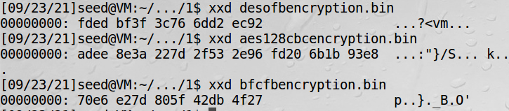

To prove that all encryption algorithms have been correctly done, I decrypted each file again and compared it with `plain.txt`.

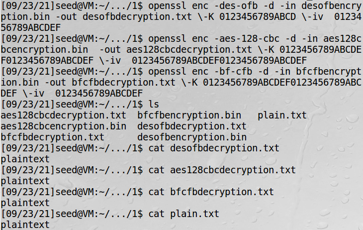

We can see that the decrypted result is same as the original file `plain.txt`

## Task 3: Encryption Mode – ECB vs. CBC

The objective of this task is to check the difference (insecurity) between ECB and CBC encryption mode by encrypting the given image `pic_original.bmp`

This image is the original image `pic_original.bmp`


First, Encrypt `pic_original.bmp` in two ways using `aes-128-ecb` and `aes-128-cbc`.

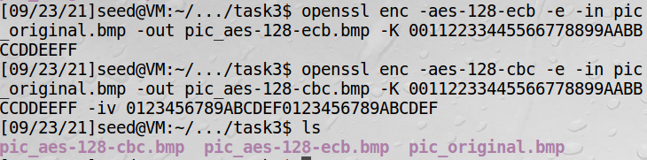

Since the first 54 bytes of a `.bmp` file contains the header information about the picture, the two encrypted files cannot be opened with a picture viewing software. Therefore, replace the first 54 bits with the first 54 bits of the original file using the following command.

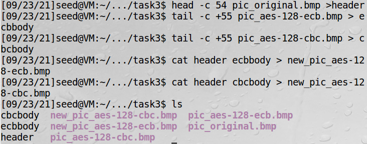

Now, open `new_pic_aes-128-ecb.bmp` and `new_pic_aes-128-cbc.bmp` using the image viewer.

This image is the image encrypted in `aes-128-ecb` mode. `new_pic_aes-128-ecb.bmp`

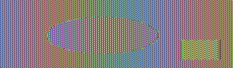

In this image, we can still see the oval shape in the center and the rectangle shape in the bottom right corner.

This image is the image encrypted in `aes-128-cbc` mode. `new_pic_aes-128-cbc.bmp`


However in this image, we cannot see the oval shape and the rectangle shape that was in the original image.

By the result, we can see that CBC encryption mode is more secure than ECB encryption mode. It is because ECB mode encrypts identical plaintext blocks into identical ciphertext blocks and lacks diffusion. While encrypting a bitmap image, large pixels of the same color may be encrypted the same, which leads to the pattern in the original image remain in the encrypted image.

## Task 4: Padding

### 1-Block Cipher Operation Modes with Padding

The objective of this task is to find out which Block Cipher Operation Modes have paddings and which do not.

To find out, I prepared a file that contains 9 bytes.


Then, I encrypted this file using ECB, CBC, CFB, and OFB mode.

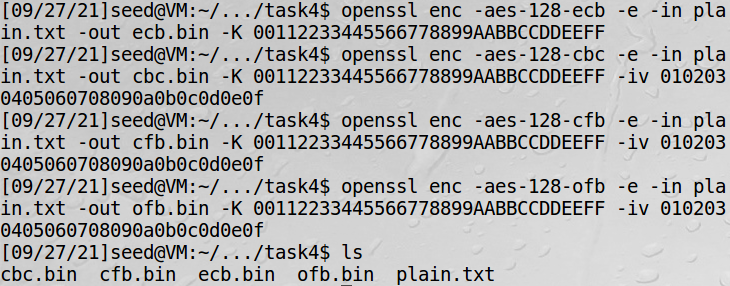

It is possible to check if padding is added or not by checking the size of each file.

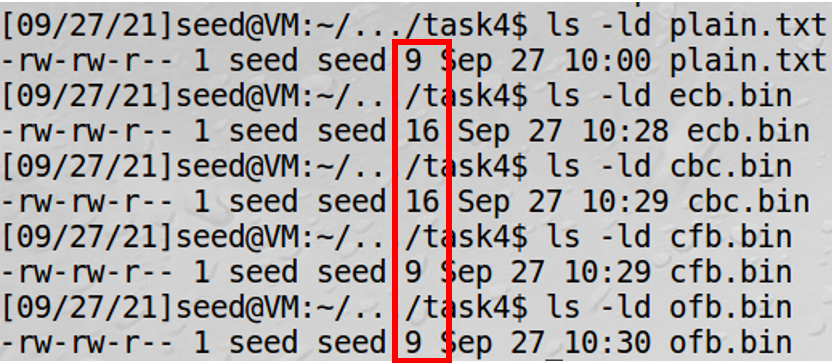

The size of the ciphertext encrypted by ECB and CBC mode is different with the original plaintext file. This result shows that ECB and CBC encryption mode has paddings, while CFB and OFB mode does not. It is because in ECB and CBC mode, the plaintext is XORed with the output of a block cipher to make a ciphertext, which makes the ciphertext match the block size of a cipher. Therefore, no padding is needed to make the ciphertext to match the block size of a cipher.

### 2-Checking the Padding of Files

The objective of this task is to find out how padding is added to files by encrypting and decrypting files.

To find out, I prepared files of length 5, 10, and 16 bytes.

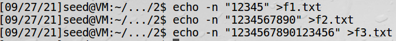

Then, I encrypted these files with 128-bit AES with CBC mode.

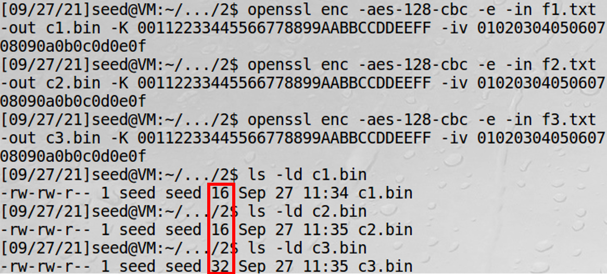

We can see that the size of the encrypted file of a 5 byte and a 10 byte file is 16 bytes. This is because padding is added during encryption, which makes the size a multiple of 16 bytes (128 bits, the block size of AES-128-CBC encryption). We can also see that the size of the encrypted file of a 16 byte file is 32 bytes, which means a padding of full block(16 bytes) was added.

To check each file's padding, I decrypted each file with the `-nopad` option, which does not remove padded data during encryption.

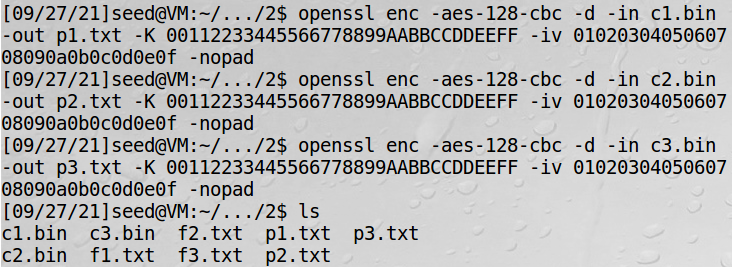

Then, I displayed each file in hex format.

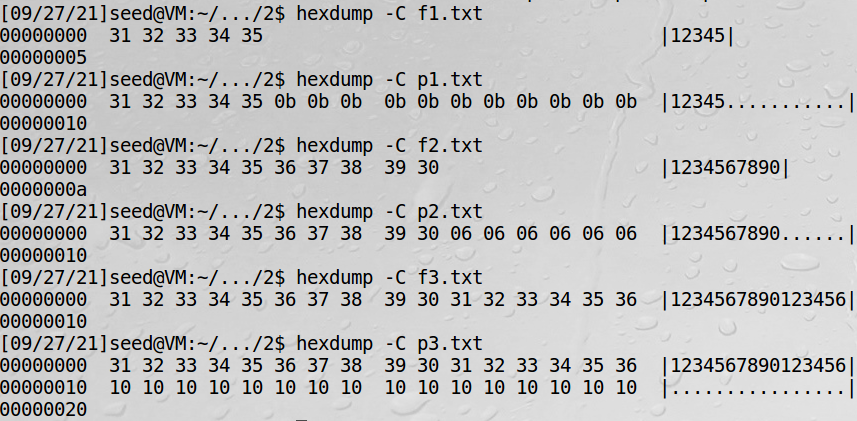

We can see that in `p1.txt` has padded eleven 0x0b to `f1.txt`. `p2.txt` has padded six `0x06` to `f2.txt` .

This is because the padding normaly used in block ciphers is PKCS#5 padding, which adds `B-k` bytes of value `B-K` , where `B` is the block size and `K` is the size of the last block. In the examples , B=16 and K=5 for the first example and K=10 for the second example.

We can also see that `p3.txt` has padded sixteen 0x10 to `f3.txt`.This is because in PKCS#5 padding, when the size is a multiple of the block size, a padding of a full block is added to prevent confusion during decryption. If there is no padding, the decryption software might make a mistake while decrypting a file which the size of the plaintext is a multiple of the block size and its last bytes are all the same value.

## Task 6: Initial Vector (IV) and Common Mistakes

### 1- Uniqueness of IV

The objective of this task is to show that no IV may be reused under the same key.

For this task, I prepared a plaintext file `plain.txt`and encrypted it using aes-128-cbc with Key 0x00112233445566778899AABBCCDDEEFF and IV 0x0102030405060708.

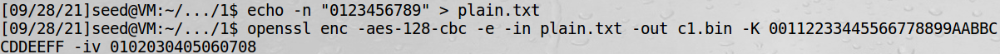

Then, Encrypt `plain.txt` again using the same IV , and using a different IV (0x8070605040302010).


So, `c1` and `c2` are ciphertexts that have encrypted the same file with the same key and same IV. However, `c1` and `c3` are ciphertexts that have encrypted the same file with the same key and different IV.

Use the `diff` command to find out if the files are identical or not.

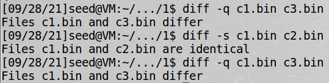

We can also display each file in hex format to verify.

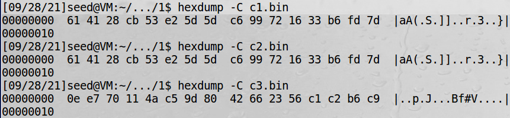

The result shows that `c1` and `c2` are identical, while `c1` and `c3` are not.

This means that when the same plaintext is encrypted with the same key and IV, the output ciphertext is always the same. Therefore, A different IV should be used every time a same plaintext is encrypted to prevent known plaintext attack. If the same IV is used, if an attacker knows the plaintext of a particular ciphertext, the plaintext can be known whenever the ciphertext appears again. To prevent this, a different IV should be used every time so that the ciphertext of the same plaintext changes every time.

### 2- Common Mistake: Use the Same IV.

The objective of this task is to show that even though a plaintext does not repeat, using the same IV is not safe.

This picture is how Output Feedback Mode works.

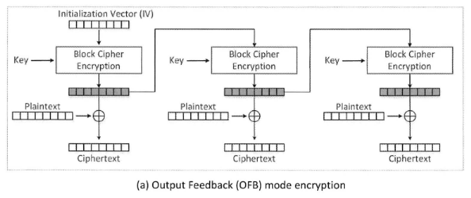

In OFB mode, the plaintext is XORed to the Output Stream to make a Ciphertext.

This can be expressed in the following way.

```
Ciphertext = Plaintext  XOR F(IV,Key)
```

(F is the Encryption Function)

In the task, for the given `C1`, `C2`, `P1` and unknown `P2`, the following is true.

```
C1 = P1 XOR F( IV , key )
C2 = P2 XOR F( IV , key )
```

By the mathematical property of XOR, the following can be derived.

```
C1 XOR C2 = (P1 XOR F( IV , key )) XOR (P2 XOR F( IV , key ))
		  = P1 XOR F( IV , key ) XOR P2 XOR F( IV , key )
		  = P1 XOR P2 XOR F( IV , key ) XOR F( IV , key )
		  = P1 XOR P2
P1 XOR C1 XOR C2 = P1 XOR P1 XOR P2 = P2
```

Therefore, It is able to find `P2` by calculating `P1` XOR `P2` XOR `P3`.

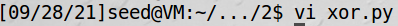

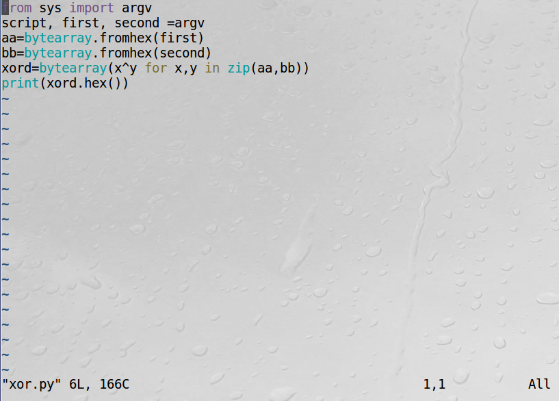

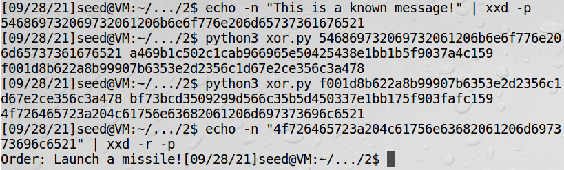

The plaintext `P2`, "Order: Launch a missile!" has been decrypted without knowing the key and IV of encryption.

Therefore, when OFB mode is used, if IV is not changed, any ciphertext can be encrypted by the attacker who knows one pair of plaintext and ciphertext.

In CFB mode, only the first block is revealed by the same way because the plaintext is XORed to the output before it is used for the next input of the block cipher encryption function.

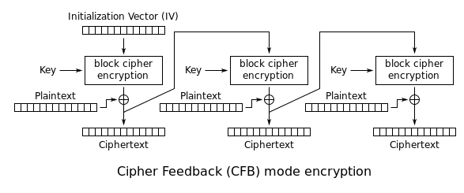

### 3. Common Mistake: Use a Predictable IV

The objective of this task is to show that attackers can break encryption if IVs are predictable.

A chosen plaintext attack against CBC mode will be used.

This picture is how Cipher Block Chaning Mode works.

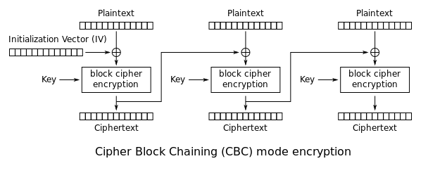

The IV is XORed to the plaintext before it is encrypted.

This can be expressed in the following way.

```
Ciphertext = F(IV XOR Plaintext , Key)
```

(F is the Encryption Function)

In the task, for ciphertext `C1`,`C2` and plaintext `p1`,`p2`, the following is true.

```
C1 = F( IV1 XOR P1 , key )
C2 = F( IV2 XOR P2 , key )
```

Since Eve can choose any message `P2` and knows `IV1` and `IV2`, suppose that Eve chose `IV2 XOR IV1 XOR 'Yes'` as `P2`

Then, the following can be derieved.

```
C2 = F( IV2 XOR P2 , key )
   = F(IV2 XOR IV2 XOR IV1 XOR 'Yes' , key)
   =F( IV1 XOR 'Yes' , key)
```

If `p1` = Yes, then `C1 = F( IV1 XOR 'Yes' , key )` and `C1`=`C2`.

In the same way, If Eve choses `IV2 XOR IV1 XOR 'No'` as `P2`,

```
C2 = F( IV2 XOR P2 , key )
   = F(IV2 XOR IV2 XOR IV1 XOR 'No' , key)
   =F( IV1 XOR 'No' , key)
```

If `p1` = No, then `C1 = F( IV1 XOR 'No' , key )` and `C1`=`C2`.

Therefore, Eve can find out `p1` by asking Bob to encrypt `P2= IV2 XOR IV1 XOR 'Yes'` and `P2= IV2 XOR IV1 XOR 'No'` .

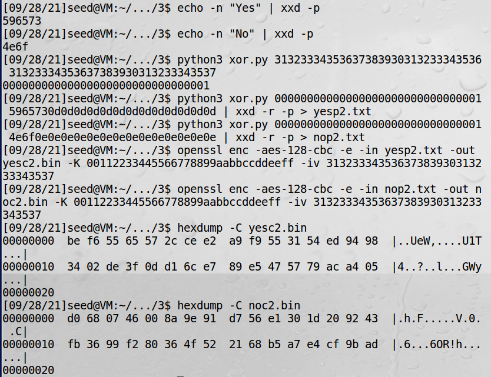

By the following command, `P2= IV2 XOR IV1 XOR 'Yes'` and `P2= IV2 XOR IV1 XOR 'No'`has been encrypted. The result shows that the encryption result of `P2= IV2 XOR IV1 XOR 'Yes'` equals `C1`, which means that Eve can find out `P1`=Yes. Beware of the Padding added throughout the proccess.

The result can be verified by decrypting `C1`.

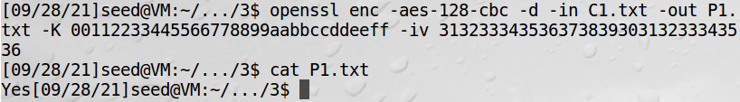

To conclude, IV should be chosen unpredictably to prevent chosen plaintext attacks.
