[Lab Instructions](https://seedsecuritylabs.org/Labs_16.04/PDF/Environment_Variable_and_SetUID.pdf)

## Task 8: Invoking External Programs Using system() versus execve()

The objective of this task is to see the danger of using system() instead if execve() in a privileged program such as Set-UID programs.

Before starting the task, use the following command to link `/bin/sh` to `/bin/zh` and change the shell to successfully perform Set-UID based attack experiments.

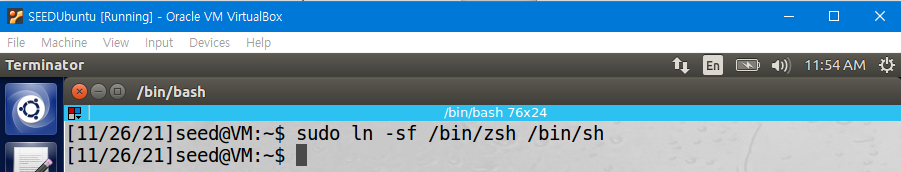

Then, write the following program.

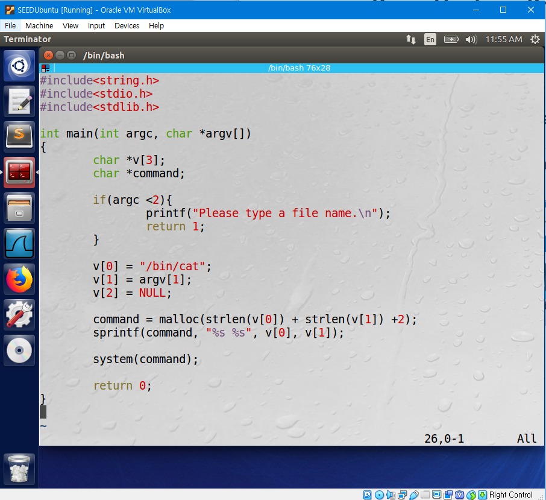

Compile the program and make it a root-owned Set-UID program with the following commands.

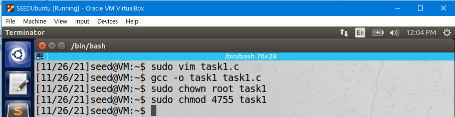

`Sudo chown root` changes the owner of the program to root. `sudo chmod 4755` sets the permissions of the file so that the owner can read,write,execute, while group and others can read, execute but cannot write.

Make a file "example" with content "sample text".

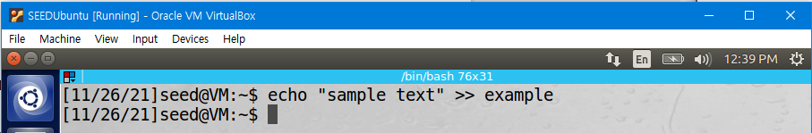

Execute the program giving `"example;/bin/sh"` as the parameter.

First, the program will display the content in "example". Then, it will run "/bin/sh" and open the shell.

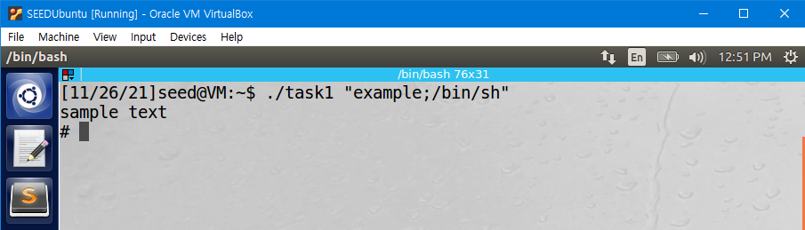

Then, Bob can modify any file. For example, if Bob writes "rm (path of a file)", he can remove a file that is not writable to Bob because the program is a root-owned Set-UID program. Therefore, using the system() function in a Set-UID program leads to compromising the integrity of the system.

Next, follow the same process changing the content of the program as following.

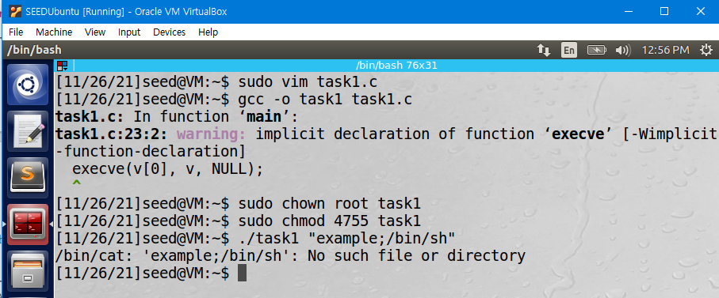

This time, the program tries to display the content in a file "example;/bin/sh" and cannot find the file. Therefore, Bob cannot reach the shell and modify any file. Using the execve() function in a Set-UID program does not lead to compromising the integrity of the system.

The difference of the two programs is because system() executes the command using shell, while execve() executes the program by combining the parameters. Therefore, System() can execute multiple commands by distinguishing them using`;`, while execute() cannot distinguish multiple commands using `;` and recognizes the whole input as one command. Therefore, using execve() instead of system() in Set-UID programs is a better approach in achieving integrity in the program because attackers can abuse privileged programs with inappropriate inputs when system() is used.

## Task 9: Capability Leaking

The objective of this task is to observe the capability leaking mistake in Set-UID programs.

Write the following program.

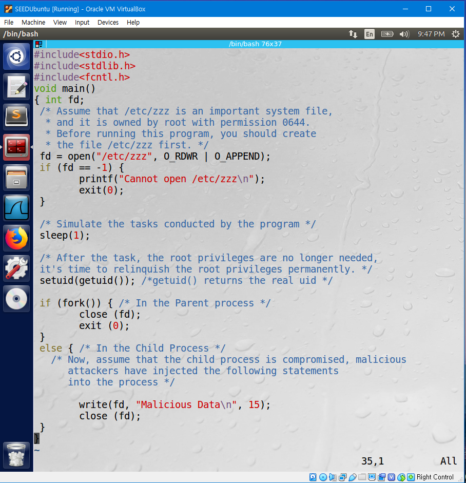

Compile the program and make it a root-owned Set-UID program with the following commands.

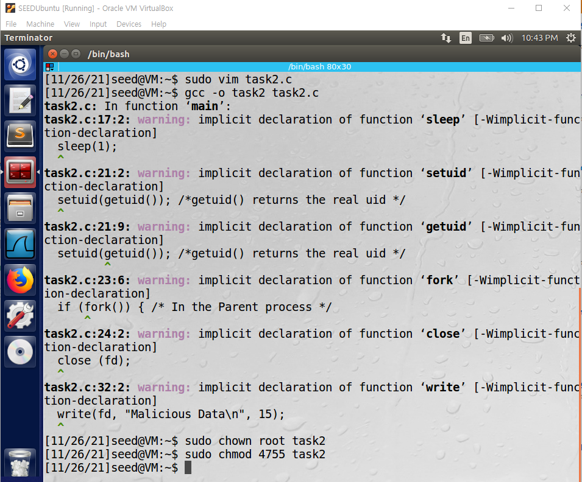

`Sudo chown root` changes the owner of the program to root. `sudo chmod 4755` sets the permissions of the file so that the owner can read,write,execute, while group and others can read, execute but cannot write.

Make a file "/etc/zzz" with content "Original Data". Change the Owner of the file to root and change the permission to 0644. permission 0644 sets the file so that the owner can read, write but can't execute while group and others can read but can't write or execute.

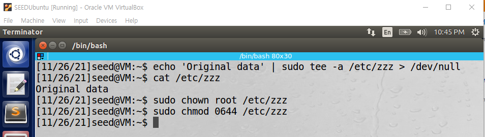

Run the program and check the content in /etc/zzz again.

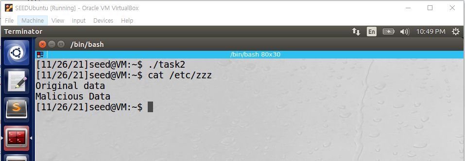

We can observe that the content of ""/etc/zzz" is modified and "Malicious Data" has been added.

This has happened because the file was not closed before dropping privileges so the file was still running with privileged permissions. Therefore, after calling `fork()`; the control is passed to the child process compromised by attackers, so the attackers can modify the content of the file.

To fix the problem, the file should be closed before dropping the privileges.

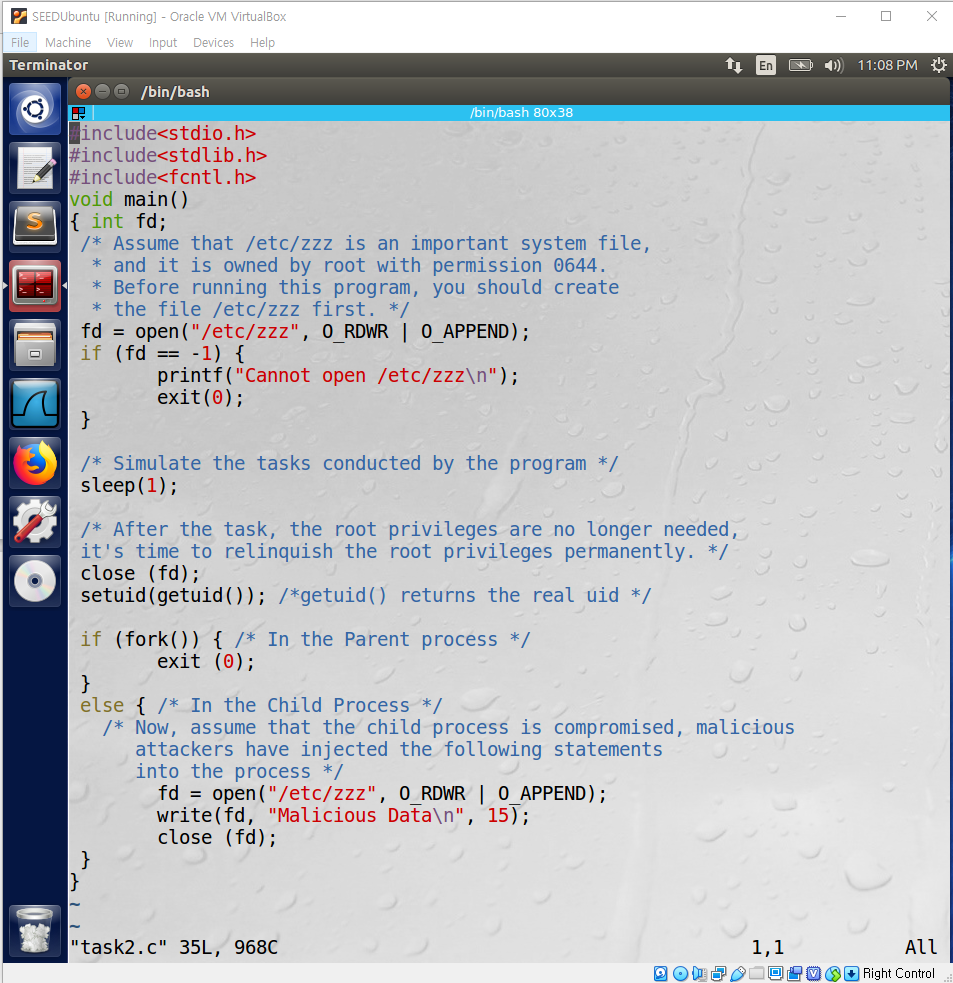

If we modify the code as following and do the same process, we can see that this time the content of /etc/zzz is not modified. This is because the file has been closed before dropping the privileges, and the child process has opened the file again without root privileges, which makes it impossible to modify the content of the file.

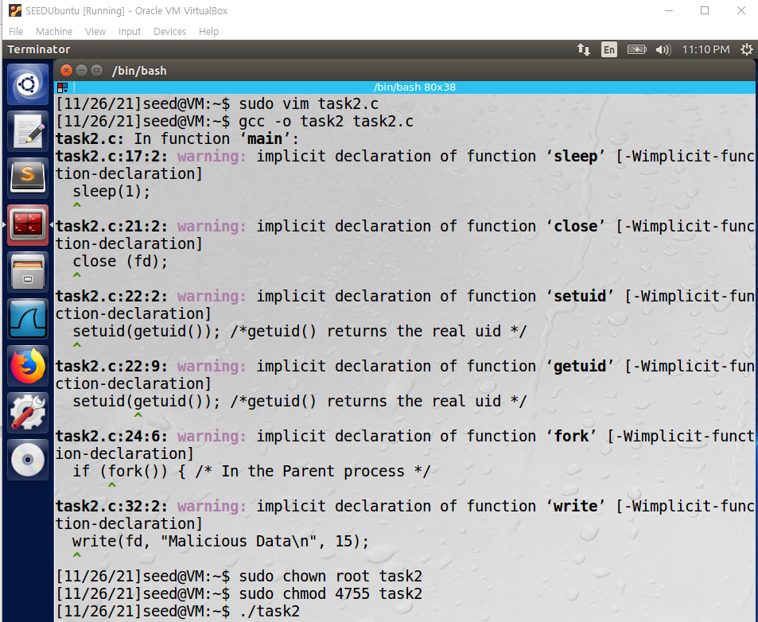

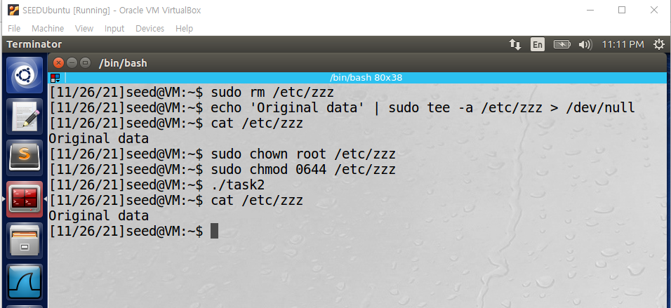
